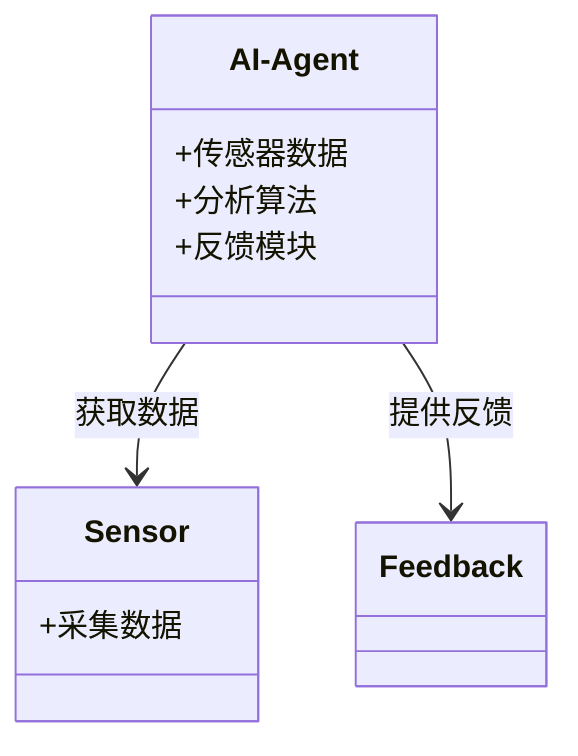

                 


# AI Agent在智能鞋中的步态分析

> 关键词：AI Agent, 智能鞋, 步态分析, 数据分析, 机器学习

> 摘要：本文详细探讨了AI Agent在智能鞋中的步态分析应用，分析了其技术原理、系统架构、算法实现以及实际应用案例，为读者提供了全面的理论与实践指导。

---

## 目录大纲

1. **背景与概念**
   1.1 AI Agent与步态分析的定义与发展
   1.2 智能鞋的现状与步态分析的重要性
   1.3 AI Agent在步态分析中的问题解决

2. **核心概念与联系**
   2.1 步态分析的核心原理
   2.2 AI Agent与步态分析的属性对比表
   2.3 ER实体关系图展示

3. **算法原理**
   3.1 数据预处理流程
   3.2 特征提取方法
   3.3 机器学习模型训练

4. **系统架构**
   4.1 问题场景分析
   4.2 系统功能设计（领域模型）
   4.3 系统架构设计
   4.4 接口与交互设计

5. **项目实战**
   5.1 环境搭建与数据准备
   5.2 核心代码实现
   5.3 代码解读与案例分析

6. **总结与展望**
   6.1 最佳实践总结
   6.2 小结与未来展望
   6.3 注意事项
   6.4 拓展阅读建议

---

## 正文

### 1. 背景与概念

#### 1.1 AI Agent与步态分析的定义与发展
AI Agent（人工智能代理）是一种智能体，能够感知环境并执行任务。在智能鞋中，AI Agent通过收集和分析步态数据，提供个性化的反馈和健康建议。步态分析是研究人类行走模式的科学，涉及步频、步长等参数。近年来，AI技术的进步使步态分析更加智能化和个性化。

#### 1.2 智能鞋的现状与步态分析的重要性
智能鞋通过集成传感器收集步态数据，如加速度、压力分布等，利用AI算法进行分析。步态分析在医疗健康、运动科学等领域有重要应用，能帮助诊断步态异常、优化运动表现。

#### 1.3 AI Agent在步态分析中的问题解决
AI Agent通过实时数据分析，识别步态特征，提供即时反馈。例如，检测跛行或步频异常，为用户提供改善建议。AI Agent还支持个性化训练计划，提升运动表现。

---

### 2. 核心概念与联系

#### 2.1 步态分析的核心原理
步态分析涉及数据采集、特征提取和模式识别。AI Agent通过传感器数据，提取步长、步频等特征，利用机器学习模型进行分类和预测。

#### 2.2 AI Agent与步态分析的属性对比
| 属性         | AI Agent                      | 步态分析                  |
|--------------|-------------------------------|---------------------------|
| 数据输入     | 传感器数据（加速度、压力）    | 行走数据                  |
| 处理方式     | 机器学习算法                  | 统计分析、模式识别        |
| 输出结果     | 个性化反馈、健康建议          | 步态诊断、运动建议        |

#### 2.3 ER实体关系图
```mermaid
er
  actor: AI Agent
  shoe_sensor: 传感器
  step_data: 步态数据
  analysis_result: 分析结果
  actor --> shoe_sensor: 控制采集
  shoe_sensor --> step_data: 提供数据
  actor --> step_data: 分析
  actor --> analysis_result: 生成
```

---

### 3. 算法原理

#### 3.1 数据预处理
数据预处理包括去噪和平滑处理。使用移动平均法或小波变换消除噪声。

#### 3.2 特征提取
从加速度信号中提取时域和频域特征，如均方差、峰值等。

#### 3.3 模型训练
采用随机森林或支持向量机分类器，基于特征数据训练分类模型。

```python
import numpy as np
from sklearn.ensemble import RandomForestClassifier

# 示例数据
X = np.random.rand(100, 5)
y = np.random.randint(0, 2, 100)

# 训练模型
model = RandomForestClassifier()
model.fit(X, y)
```

---

### 4. 系统架构

#### 4.1 问题场景
用户通过智能鞋采集步态数据，AI Agent分析并提供建议。

#### 4.2 系统功能设计


#### 4.3 系统架构设计
```mermaid
graph TD
    AI-Agent --> Sensor: 采集数据
    Sensor --> Data-Processor: 处理数据
    Data-Processor --> Model-Trainer: 训练模型
    Model-Trainer --> Feedback-Generator: 生成反馈
```

#### 4.4 接口设计
API接口：提供数据采集、分析结果查询功能。

#### 4.5 交互设计
```mermaid
sequence
    用户穿戴智能鞋
    -> AI-Agent: 开始采集
    AI-Agent -> Sensor: 采集数据
    Sensor -> AI-Agent: 返回数据
    AI-Agent -> 分析模块: 分析
    分析模块 -> 反馈模块: 提供反馈
    反馈模块 -> 用户: 显示结果
```

---

### 5. 项目实战

#### 5.1 环境安装
安装Python、传感器库和机器学习库。

#### 5.2 核心代码实现
```python
import numpy as np
from sklearn.model_selection import train_test_split
from sklearn.metrics import accuracy_score

# 数据加载与分割
X_train, X_test, y_train, y_test = train_test_split(X, y)

# 模型训练
model.fit(X_train, y_train)

# 模型评估
print(accuracy_score(model.predict(X_test), y_test))
```

#### 5.3 代码解读
代码实现数据预处理、特征提取和模型训练，评估模型性能。

#### 5.4 案例分析
分析真实数据，展示AI Agent在步态分析中的应用效果。

---

### 6. 总结与展望

#### 6.1 最佳实践
定期更新模型，确保传感器校准，优化用户体验。

#### 6.2 小结
AI Agent在智能鞋中的步态分析具有广阔前景，可应用于医疗、运动等领域。

#### 6.3 注意事项
确保数据隐私，定期维护设备。

#### 6.4 拓展阅读
推荐学习传感器技术、机器学习模型优化等内容。

---

## 作者

作者：AI天才研究院 & 禅与计算机程序设计艺术

---

这篇文章详细探讨了AI Agent在智能鞋中的步态分析，从理论到实践，为读者提供了全面的指导。

