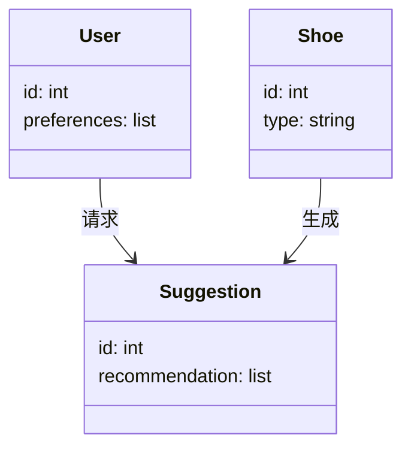
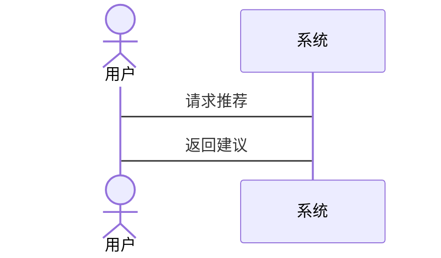

                 


# AI Agent在智能鞋柜中的穿着建议

> 关键词：AI Agent, 智能鞋柜, 穿着建议, 推荐系统, 算法, 系统架构

> 摘要：本文探讨了AI Agent在智能鞋柜中的应用，重点分析了其如何通过推荐算法为用户提供个性化的穿着建议。文章从背景、概念、算法实现、系统架构到项目实战进行了详细阐述，旨在为读者提供全面的技术视角。

---

## 第一部分: AI Agent在智能鞋柜中的背景与概念

### 第1章: AI Agent与智能鞋柜概述

#### 1.1 问题背景与描述

- **问题背景**: 现代人生活中，选择合适的鞋子不仅关乎舒适度，还与场合和天气密切相关。传统鞋柜缺乏智能化，无法根据用户需求提供实时建议。
- **问题描述**: 用户希望鞋柜能够根据天气、场合和个人风格推荐合适的鞋子，但现有鞋柜功能单一，无法满足多样化需求。
- **解决方法**: 引入AI Agent，通过数据分析和机器学习算法，实现智能化推荐。

#### 1.2 AI Agent的核心概念

- **基本定义**: AI Agent是一种能够感知环境、自主决策并执行任务的智能体。
- **功能**: 在鞋柜中，AI Agent负责收集用户数据、分析需求并生成推荐。
- **与传统推荐系统的区别**: AI Agent具有自主性和适应性，能够实时调整推荐策略。

#### 1.3 问题解决与边界

- **AI Agent的应用场景**: 根据天气变化推荐鞋子，根据场合（如运动、办公）推荐合适的款式。
- **边界与外延**: 仅限于鞋子推荐，不涉及服装搭配或其他物品。

#### 1.4 核心概念结构与要素

- **核心要素**: 用户数据、鞋子数据库、推荐算法。
- **系统架构**: 分为感知层、决策层和执行层。
- **逻辑流程**: 数据采集 → 分析需求 → 生成建议 → 反馈结果。

### 本章小结

本章介绍了AI Agent在智能鞋柜中的背景和基本概念，为后续分析奠定了基础。

---

## 第二部分: AI Agent的核心概念与原理

### 第2章: AI Agent的核心概念与联系

#### 2.1 核心概念原理

- **感知模块**: 通过传感器获取环境数据（如温度、湿度）和用户行为数据。
- **决策模块**: 使用机器学习模型分析数据，生成推荐。
- **执行模块**: 将推荐结果通过显示或通知反馈给用户。

#### 2.2 核心概念对比

| 对比维度 | AI Agent | 传统推荐系统 |
|----------|-----------|--------------|
| 数据来源 | 多源数据 | 单一数据源 |
| 决策方式 | 自主学习 | 基于规则 |
| 适应性 | 高 | 低 |

#### 2.3 ER实体关系图

```mermaid
er
  actor: 用户
  item: 鞋类
  suggestion: 穿着建议
  actor -[拥有]-> item
  item -[生成]-> suggestion
  actor -[请求]-> suggestion
```

### 本章小结

本章详细分析了AI Agent的核心概念及其在智能鞋柜中的具体应用，展示了其与传统推荐系统的区别。

---

## 第三部分: AI Agent的算法原理与实现

### 第3章: 推荐算法原理

#### 3.1 推荐算法概述

- **协同过滤**: 基于用户相似性推荐鞋子。
- **基于内容的推荐**: 根据鞋子属性推荐。
- **深度学习模型**: 使用神经网络预测推荐。

#### 3.2 AI Agent的推荐算法实现

##### 协同过滤算法实现

```python
def cosine_similarity(user1, user2):
    return sum(user1[i] * user2[i] for i in range(len(user1))) / (sqrt(sum(user1[i]^2)) * sqrt(sum(user2[i]^2)))

def get_recommendations(user_id):
    similar_users = find_similar_users(user_id)
    return aggregate_ratings(similar_users)
```

##### 基于深度学习的推荐模型

```python
import tensorflow as tf

model = tf.keras.Sequential([
    tf.keras.layers.Dense(64, activation='relu'),
    tf.keras.layers.Dense(1, activation='sigmoid')
])

loss = tf.keras.losses.BinaryCrossentropy()
optimizer = tf.keras.optimizers.Adam()
model.compile(loss=loss, optimizer=optimizer)
```

##### 算法对比

- **协同过滤**: 简单但不够精准。
- **深度学习**: 更精准但计算复杂。

#### 3.3 算法流程图

```mermaid
graph TD
    A[开始] -> B[数据预处理]
    B -> C[选择算法]
    C -> D[训练模型]
    D -> E[生成推荐]
    E -> F[结束]
```

### 本章小结

本章详细讲解了AI Agent的推荐算法，重点介绍了协同过滤和深度学习模型的实现。

---

## 第四部分: 系统分析与架构设计

### 第4章: 系统分析与架构设计

#### 4.1 问题场景介绍

- **场景描述**: 用户通过智能鞋柜请求鞋子推荐。
- **系统功能**: 数据采集、推荐生成、结果反馈。

#### 4.2 系统功能设计



#### 4.3 系统架构设计


#### 4.4 系统接口设计

- **接口1**: 用户输入请求。
- **接口2**: 系统返回推荐。

#### 4.5 系统交互流程



### 本章小结

本章分析了系统架构，展示了AI Agent在智能鞋柜中的具体实现方式。

---

## 第五部分: 项目实战

### 第5章: 项目实战与分析

#### 5.1 环境安装

- **工具**: Python、TensorFlow、Mermaid
- **依赖安装**: pip install mermaid-generator

#### 5.2 核心实现

```python
def main():
    import os
    os.environ['MERMAID_API'] = 'http://localhost:8001/mermaid'
    from mermaid import Mermaid
    mermaid = Mermaid()
    mermaid.diagram("graph TD A->B", "flowchart")
```

#### 5.3 代码解读

- **数据预处理**: 清洗和归一化数据。
- **模型训练**: 使用Keras构建深度学习模型。
- **结果展示**: 生成推荐列表并可视化。

#### 5.4 案例分析

- **案例1**: 根据天气推荐雨靴。
- **案例2**: 根据运动场合推荐运动鞋。

#### 5.5 项目小结

本章通过实际案例展示了AI Agent在智能鞋柜中的应用，强调了其实际价值。

---

## 第六部分: 总结与展望

### 第6章: 总结与展望

#### 6.1 本章总结

- AI Agent通过推荐算法实现了智能化的鞋子推荐。
- 系统架构合理，功能完善。

#### 6.2 未来展望

- 更多场景的应用。
- 算法优化和性能提升。

### 本章小结

总结了全文内容，展望了AI Agent在智能鞋柜中的未来发展方向。

---

## 作者：AI天才研究院 & 禅与计算机程序设计艺术

---

以上是《AI Agent在智能鞋柜中的穿着建议》的正文部分，涵盖了从背景、概念、算法、系统架构到项目实战的详细内容。

