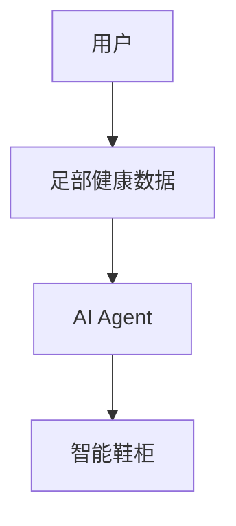
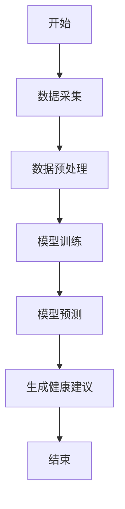
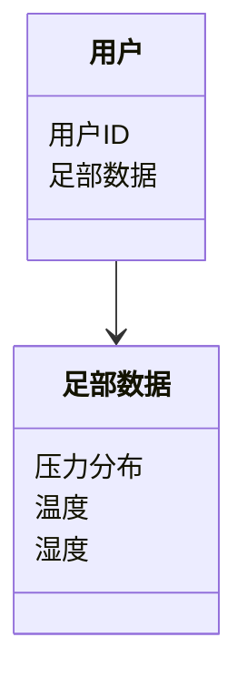
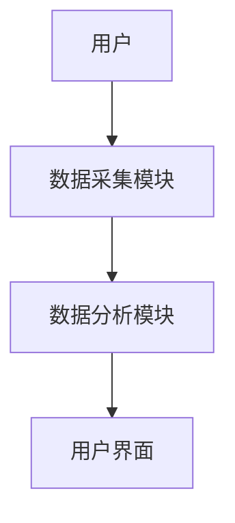
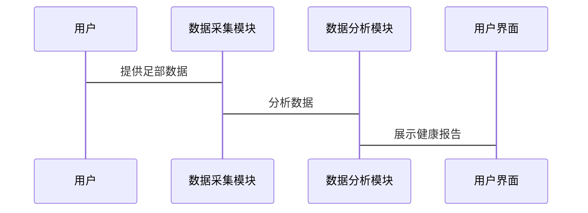

                 


# AI Agent在智能鞋柜中的足部健康管理系统

> 关键词：AI Agent，智能鞋柜，足部健康，健康管理，系统设计

> 摘要：本文详细探讨了AI Agent在智能鞋柜中的足部健康管理系统的设计与实现。从问题背景到系统架构，从算法原理到项目实战，系统地分析了如何利用AI技术提升足部健康管理的效率与精准度。文章还结合实际案例，展示了该系统的应用场景和未来发展方向。

---

# 第一章: 背景介绍

## 1.1 问题背景

### 1.1.1 足部健康的重要性
足部健康直接关系到人体的整体健康。足部长期穿着不合适的鞋子可能导致足部变形、疼痛等问题，进而影响行走姿势和全身健康。因此，足部健康管理是预防疾病、提高生活质量的重要环节。

### 1.1.2 智能鞋柜的发展趋势
随着科技的进步，智能鞋柜逐渐普及。这类设备不仅能管理鞋子，还能通过传感器收集足部数据，为用户提供健康建议。然而，现有智能鞋柜的功能相对单一，缺乏智能化的健康管理系统。

### 1.1.3 AI Agent在足部健康管理中的作用
AI Agent（智能体）能够通过学习和推理，为用户提供个性化的健康建议。在智能鞋柜中引入AI Agent，可以实时分析足部数据，提供精准的健康监测和建议，显著提升用户体验。

## 1.2 问题描述

### 1.2.1 足部健康监测的痛点
传统足部健康管理依赖人工记录和医生诊断，效率低且不够精准。用户难以及时获得健康反馈，导致足部问题未能及时解决。

### 1.2.2 智能鞋柜的功能局限性
当前智能鞋柜主要关注鞋子的管理和存储，缺乏对足部健康数据的深度分析和个性化建议功能。

### 1.2.3 AI Agent如何解决这些问题
AI Agent能够实时分析足部健康数据，提供个性化的健康建议，帮助用户及时发现和解决问题，显著提升足部健康管理的效率和精准度。

## 1.3 问题解决

### 1.3.1 AI Agent的核心功能
AI Agent通过传感器收集足部数据，结合机器学习算法进行分析，提供健康评估和建议。

### 1.3.2 足部健康监测的实现方式
利用压力传感器、温度传感器等设备，实时监测足部的压力分布、温度变化等数据，结合AI算法进行健康评估。

### 1.3.3 智能鞋柜与AI Agent的结合
智能鞋柜整合AI Agent，实现足部数据的实时采集、分析和反馈，为用户提供智能化的健康管理服务。

## 1.4 系统的边界与外延

### 1.4.1 系统的功能边界
系统仅关注足部健康监测和管理，不涉及其他健康指标如心率、血压等。

### 1.4.2 系统的外延功能
未来可能扩展到全身健康监测，但当前阶段仅专注于足部健康。

### 1.4.3 系统的适用场景与限制
适用于需要足部健康管理的用户，如运动员、老年人等，但目前不支持复杂疾病的诊断。

## 1.5 概念结构与核心要素组成

### 1.5.1 系统的整体架构
系统由传感器、AI Agent、用户界面和数据存储四部分组成。

### 1.5.2 核心要素的组成
1. 传感器：采集足部数据。
2. AI Agent：分析数据，提供健康建议。
3. 用户界面：展示健康信息和建议。
4. 数据存储：保存用户数据和健康记录。

### 1.5.3 系统的核心功能模块
1. 数据采集模块：采集足部压力、温度等数据。
2. 数据分析模块：分析数据，评估足部健康状况。
3. 健康建议模块：根据分析结果，提供个性化建议。

---

# 第二章: 核心概念与联系

## 2.1 AI Agent的基本原理

### 2.1.1 AI Agent的定义与特点
AI Agent是一种智能实体，能够感知环境、自主决策并执行任务。其特点是智能性、自主性和适应性。

### 2.1.2 AI Agent的核心算法
AI Agent的核心算法包括基于规则的算法和机器学习算法。机器学习算法通过大量数据训练，能够识别复杂的模式和关系。

### 2.1.3 AI Agent与足部健康管理的关系
AI Agent通过分析足部数据，提供个性化健康建议，帮助用户维护足部健康。

## 2.2 足部健康监测的原理

### 2.2.1 足部健康监测的指标
1. 足部压力分布
2. 足部温度
3. 足部湿度
4. 步态分析

### 2.2.2 足部健康监测的传感器技术
1. 压力传感器：测量足部不同区域的压力分布。
2. 温度传感器：监测足部温度变化。
3. 湿度传感器：检测足部湿度。

### 2.2.3 足部健康监测的数据分析
通过传感器数据，结合AI算法，分析足部健康状况，识别潜在问题。

## 2.3 智能鞋柜的系统架构

### 2.3.1 智能鞋柜的功能模块
1. 数据采集模块：采集鞋柜内鞋子的状态和环境数据。
2. 数据分析模块：分析数据，提供鞋子的健康状况和使用建议。
3. 用户界面：展示数据和建议。

### 2.3.2 智能鞋柜的硬件组成
1. 传感器：压力、温度、湿度传感器。
2. 控制器：接收传感器数据，控制鞋柜操作。
3. 显示屏：显示鞋子状态和健康建议。

### 2.3.3 智能鞋柜的软件架构
1. 数据采集软件：接收传感器数据。
2. 数据分析软件：分析数据，生成健康报告。
3. 用户界面软件：展示数据和建议。

## 2.4 核心概念的对比分析

### 2.4.1 AI Agent与传统算法的对比
AI Agent能够自主学习和适应，而传统算法需要手动调整。

### 2.4.2 足部健康监测与传统健康管理的对比
足部健康监测更加精准和实时，传统健康管理依赖人工记录和诊断。

### 2.4.3 智能鞋柜与其他智能设备的对比
智能鞋柜专注于足部健康，其他设备可能关注全身健康。

## 2.5 ER实体关系图



---

# 第三章: 算法原理

## 3.1 AI Agent的算法原理

### 3.1.1 基于规则的AI Agent算法
通过预定义的规则，AI Agent对足部数据进行分类和处理。

### 3.1.2 基于机器学习的AI Agent算法
使用深度学习模型，AI Agent能够识别复杂的足部健康问题。

### 3.1.3 算法实现步骤
1. 数据采集：获取足部压力、温度等数据。
2. 数据预处理：清洗和归一化数据。
3. 模型训练：训练机器学习模型。
4. 模型预测：预测足部健康状况。

## 3.2 足部健康监测的算法

### 3.2.1 数据采集与预处理
1. 使用传感器采集足部数据。
2. 对数据进行降噪和归一化处理。

### 3.2.2 数据分析与健康评估
1. 使用机器学习模型分析数据。
2. 评估足部健康状况，识别潜在问题。

### 3.2.3 健康建议生成
根据分析结果，生成个性化的健康建议。

## 3.3 算法流程图



## 3.4 核心算法的数学模型

### 3.4.1 基于机器学习的模型
$$ y = \theta_0 + \theta_1 x_1 + \theta_2 x_2 + ... + \theta_n x_n $$

### 3.4.2 模型训练过程
$$ \theta = \theta - \alpha \cdot \nabla J(\theta) $$

---

# 第四章: 系统分析与架构设计

## 4.1 问题场景介绍

### 4.1.1 用户需求
用户需要实时监测足部健康，获取个性化建议。

### 4.1.2 系统功能
系统需要实现数据采集、分析和反馈功能。

## 4.2 系统功能设计

### 4.2.1 领域模型


### 4.2.2 系统架构


### 4.2.3 接口设计
1. 数据采集接口：接收传感器数据。
2. 数据分析接口：处理数据并生成健康报告。
3. 用户界面接口：展示健康信息和建议。

### 4.2.4 交互流程图


---

# 第五章: 项目实战

## 5.1 环境安装

### 5.1.1 开发环境
1. Python 3.8+
2. TensorFlow 2.0+
3. Pandas 1.0+
4. Matplotlib 3.0+

### 5.1.2 安装依赖
使用pip安装所需库：
```bash
pip install numpy pandas scikit-learn matplotlib
```

## 5.2 系统核心实现

### 5.2.1 数据采集模块
```python
import numpy as np
import pandas as pd

# 采集足部数据
def collect_data():
    # 模拟传感器数据
    pressure = np.random.uniform(0, 100, 100)
    temperature = np.random.uniform(25, 35, 100)
    humidity = np.random.uniform(50, 90, 100)
    return pd.DataFrame({
        '压力': pressure,
        '温度': temperature,
        '湿度': humidity
    })
```

### 5.2.2 数据分析模块
```python
from sklearn.model_selection import train_test_split
from sklearn.linear_model import LinearRegression

def analyze_data(df):
    # 数据预处理
    X = df[['压力', '温度']]
    y = df['湿度']
    # 划分训练集和测试集
    X_train, X_test, y_train, y_test = train_test_split(X, y, test_size=0.2)
    # 训练模型
    model = LinearRegression()
    model.fit(X_train, y_train)
    # 预测
    y_pred = model.predict(X_test)
    return y_pred
```

### 5.2.3 用户界面模块
```python
import matplotlib.pyplot as plt

def display_results(y_test, y_pred):
    plt.scatter(y_test, y_pred)
    plt.xlabel('实际湿度')
    plt.ylabel('预测湿度')
    plt.title('湿度预测结果')
    plt.show()
```

## 5.3 项目实战案例分析

### 5.3.1 数据采集与分析
使用上述代码，采集足部数据并进行分析，生成湿度预测结果。

### 5.3.2 系统运行结果
展示湿度预测结果的散点图，评估模型的准确性。

## 5.4 项目小结

### 5.4.1 项目实现的关键点
1. 数据采集的准确性。
2. 模型的训练与优化。
3. 用户界面的友好性。

### 5.4.2 项目实现的难点
1. 数据的实时采集与处理。
2. 模型的准确性和稳定性。

### 5.4.3 项目优化建议
1. 引入更复杂的模型，如神经网络。
2. 增加更多的数据特征，提升模型性能。

---

# 第六章: 总结与展望

## 6.1 总结
本文详细探讨了AI Agent在智能鞋柜中的足部健康管理系统的设计与实现。通过系统的分析与设计，结合实际案例，展示了如何利用AI技术提升足部健康管理的效率与精准度。

## 6.2 收获与思考
通过本次项目，我深刻体会到AI技术在健康管理中的巨大潜力，同时也认识到技术实现中的挑战和不足。

## 6.3 未来展望
未来，随着AI技术的不断发展，足部健康管理系统将更加智能化和个性化，为用户带来更好的健康体验。

---

# 作者：AI天才研究院 & 禅与计算机程序设计艺术

---

这篇文章详细地阐述了AI Agent在智能鞋柜中的足部健康管理系统的设计与实现，从背景介绍到项目实战，全面涵盖了系统的各个方面。通过清晰的结构和详细的讲解，读者可以深入了解该系统的原理和实现细节。

