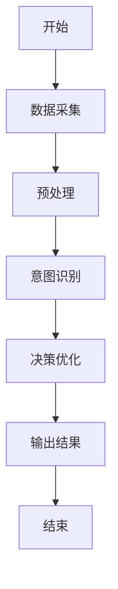
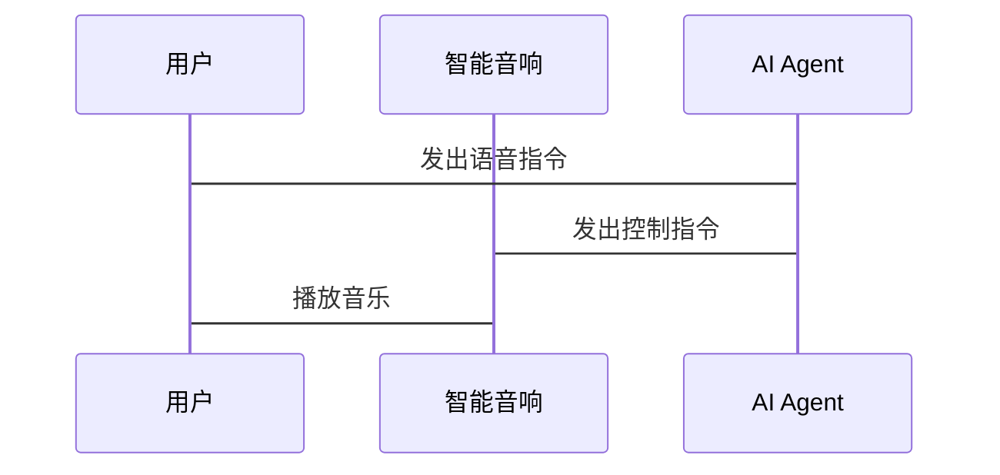

                 


# AI Agent在智能音响中的家庭氛围营造

## 关键词
AI Agent, 智能音响, 家庭氛围, 人机交互, 智能环境, 氛围营造

## 摘要
本文探讨AI Agent在智能音响中的应用，特别是在家庭氛围营造方面的潜力。通过分析AI Agent的核心算法、系统架构和实际案例，展示其如何优化家庭环境，提升用户体验。

---

## 第一章: AI Agent的基本概念

### 1.1 AI Agent的定义与特点

#### 1.1.1 AI Agent的定义
AI Agent（人工智能代理）是能够感知环境并采取行动以实现目标的智能实体。它可以自主决策，适应环境变化。

#### 1.1.2 AI Agent的核心特点
- **自主性**：无需外部干预，自主决策。
- **反应性**：实时感知并响应环境变化。
- **学习能力**：通过数据不断优化行为。
- **协作性**：能与其他系统协同工作。

#### 1.1.3 AI Agent与传统智能系统的主要区别
| 特性       | 传统智能系统                | AI Agent                  |
|------------|-----------------------------|---------------------------|
| 自主性      | 依赖外部控制                | 自主决策                  |
| 学习能力    | 预先编程                    | 可自适应学习              |
| 适应性      | 固定功能                    | 能够适应环境变化          |

### 1.2 家庭氛围营造的背景与需求

#### 1.2.1 家庭氛围营造的重要性
家庭氛围直接影响居住者的舒适感和情绪状态。通过技术手段优化家庭环境，能提升生活质量。

#### 1.2.2 当前家庭氛围营造的主要技术手段
- **智能音箱**：通过语音控制播放音乐，调节氛围。
- **智能家居设备**：如智能灯泡、空调等，协同工作营造舒适环境。

#### 1.2.3 AI Agent在家庭氛围营造中的优势
AI Agent能够根据用户行为和环境数据，主动调整音响设置，提供个性化体验。

---

## 第二章: AI Agent与智能音响的结合

### 2.1 AI Agent与智能音响的协同工作

#### 2.1.1 智能音响的功能与特点
- **语音交互**：支持语音控制，播放音乐。
- **多模态数据采集**：包括声音、光线、温度等数据。

#### 2.1.2 AI Agent在智能音响中的应用场景
- **个性化音乐推荐**：根据用户喜好和情绪推荐音乐。
- **环境适应**：根据环境数据自动调整音量和音效。

### 2.2 当前主要的应用场景

#### 2.2.1 个性化音乐推荐
AI Agent通过分析用户的听歌历史和实时情绪，推荐合适的音乐，营造理想的氛围。

#### 2.2.2 智能场景切换
根据用户的活动和时间，自动切换到预设的音乐场景，如睡前放松、早晨活力等。

#### 2.2.3 多设备协同
与智能家居设备协同工作，营造全方位的家庭氛围，如联动灯光和空调。

### 2.3 当前应用中的问题与挑战

#### 2.3.1 技术层面的主要问题
- **数据隐私**：用户数据的安全性和隐私保护。
- **算法精度**：如何提高用户意图识别的准确性。

#### 2.3.2 用户体验层面的挑战
- **用户接受度**：用户对AI Agent的信任和接受程度。
- **易用性**：系统操作的便捷性和易用性。

#### 2.3.3 市场推广中的障碍
- **成本问题**：技术实现和推广的成本较高。
- **市场竞争**：现有产品同质化严重，如何脱颖而出。

---

## 第三章: AI Agent的核心算法与工作流程

### 3.1 AI Agent的核心算法概述

#### 3.1.1 数据采集与预处理
- **数据源**：用户输入、环境数据、历史行为。
- **预处理步骤**：去噪、标准化、特征提取。

#### 3.1.2 意图识别算法
- **自然语言处理**：使用NLP技术分析用户的语音指令。
- **情感分析**：识别用户的情绪状态，调整音乐推荐。

#### 3.1.3 决策优化算法
- **强化学习**：通过试错优化推荐策略。
- **协同过滤**：基于用户行为推荐音乐。

### 3.2 算法实现的数学模型

#### 3.2.1 情感分析模型
使用LSTM网络分析用户语音的情感倾向，公式如下：
$$
P(\text{positive}|x) = \frac{1}{1 + e^{-x}}
$$

#### 3.2.2 协同过滤推荐
计算用户相似度，公式：
$$
\text{similarity}(u, v) = \frac{\sum_{i=1}^{n} u_i v_i}{\sqrt{\sum_{i=1}^{n} u_i^2} \sqrt{\sum_{i=1}^{n} v_i^2}}
$$

#### 3.2.3 强化学习框架
使用Q-learning算法，状态-动作-奖励模型：
$$
Q(s, a) = Q(s, a) + \alpha (r + \gamma \max Q(s', a') - Q(s, a))
$$

### 3.3 算法流程图



### 3.4 算法实现的Python代码示例

```python
import numpy as np
from sklearn.metrics.pairwise import cosine_similarity

# 示例协同过滤算法
def collaborative_filtering(user_item_matrix):
    user_similarity = cosine_similarity(user_item_matrix)
    # 找到最相似的用户
    top_n_users = np.argsort(user_similarity, axis=0)[:, -3:]
    return user_item_matrix[top_n_users[0]]

# 示例强化学习框架
class QLearning:
    def __init__(self, actions):
        self.actions = actions
        self.q_table = {}

    def update_q_table(self, state, action, reward, next_state):
        self.q_table[(state, action)] = reward + max(
            self.q_table.get((next_state, a), 0) for a in self.actions
        )
```

---

## 第四章: 系统分析与架构设计

### 4.1 系统架构设计

#### 4.1.1 系统功能模块划分
- **数据采集模块**：收集用户输入和环境数据。
- **意图识别模块**：分析用户意图。
- **决策优化模块**：优化音乐推荐。
- **输出执行模块**：控制音响播放。

#### 4.1.2 系统架构图


### 4.2 系统功能设计

#### 4.2.1 数据流设计
- 数据从用户输入开始，经过预处理，进入意图识别，然后是决策优化，最后输出控制指令。

#### 4.2.2 系统交互设计



---

## 第五章: 项目实战

### 5.1 环境安装与配置

#### 5.1.1 安装依赖
```bash
pip install numpy scikit-learn mermaid4j
```

#### 5.1.2 安装Python环境
使用Anaconda或虚拟环境，确保所有依赖正确安装。

### 5.2 核心系统实现

#### 5.2.1 数据预处理
```python
import pandas as pd

def preprocess_data(dataframe):
    # 去除缺失值
    dataframe = dataframe.dropna()
    # 标准化处理
    from sklearn.preprocessing import StandardScaler
    scaler = StandardScaler()
    dataframe[['age', 'income']] = scaler.fit_transform(dataframe[['age', 'income']])
    return dataframe
```

#### 5.2.2 意图识别与推荐
```python
from sklearn.naive_bayes import GaussianNB

def intent_prediction(X_train, y_train, X_test):
    clf = GaussianNB()
    clf.fit(X_train, y_train)
    return clf.predict(X_test)
```

### 5.3 实际案例分析

#### 5.3.1 案例背景
用户在晚上使用智能音响放松，系统根据用户的历史数据和当前情绪推荐放松音乐。

#### 5.3.2 实施过程
1. 数据采集：获取用户的听歌历史和当前情绪。
2. 数据预处理：清洗和标准化数据。
3. 意图识别：分析用户情绪，识别出放松需求。
4. 决策优化：推荐符合放松的音乐列表。
5. 输出执行：控制音响播放推荐的音乐。

### 5.4 项目总结

#### 5.4.1 成功经验
- 系统能够准确识别用户意图，推荐合适的音乐，提升家庭氛围。

#### 5.4.2 需要注意的问题
- 数据隐私问题，需确保用户数据的安全。
- 算法优化空间，进一步提升推荐准确率。

---

## 第六章: 最佳实践与小结

### 6.1 最佳实践 tips

#### 6.1.1 数据隐私保护
采用加密技术和匿名化处理，确保用户数据安全。

#### 6.1.2 算法优化建议
持续收集用户反馈，优化模型，提升推荐精度。

### 6.2 项目总结与展望

#### 6.2.1 项目总结
通过AI Agent与智能音响的结合，成功实现了家庭氛围的智能化营造，提升了用户体验。

#### 6.2.2 未来展望
随着技术进步，AI Agent将在家庭环境中发挥更大作用，推动智能家居的发展。

### 6.3 注意事项

#### 6.3.1 用户教育
需引导用户正确使用系统，提升用户接受度。

#### 6.3.2 系统维护
定期更新模型，确保系统稳定性和用户体验。

### 6.4 拓展阅读

#### 6.4.1 推荐书籍
- 《智能系统设计》
- 《人工智能: 一种现代的方法》

---

## 作者

作者：AI天才研究院/AI Genius Institute & 禅与计算机程序设计艺术 /Zen And The Art of Computer Programming

---

感谢您的阅读，希望本文能为您提供有价值的信息和启发。

