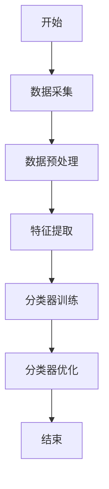
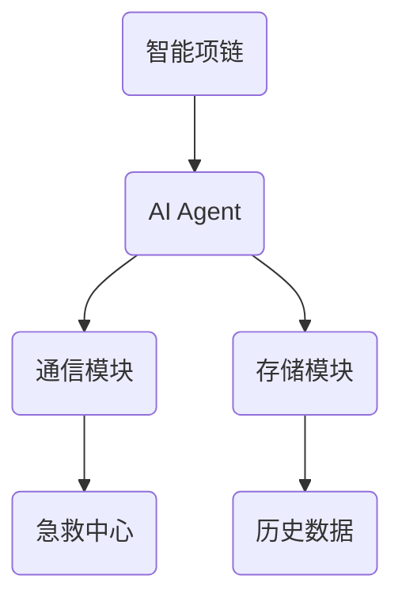

                 


# AI Agent在智能项链中的跌倒检测与紧急呼救

## 关键词：AI Agent, 智能项链, 跌倒检测, 紧急呼救, 健康监测

## 摘要：
本文探讨AI Agent在智能项链中的应用，重点分析跌倒检测与紧急呼救的技术实现。通过背景介绍、核心概念、算法原理、系统架构、项目实战和最佳实践等部分，详细阐述了AI Agent如何通过智能项链实现跌倒检测，并在紧急情况下发出呼救信号，为老年人健康监测提供高效解决方案。

---

# 第一部分：背景介绍

## 第1章：跌倒检测与紧急呼救的背景

### 1.1 问题背景
#### 1.1.1 老年人跌倒问题的严重性
跌倒是老年人群体中的常见问题，可能导致严重伤害甚至死亡。据统计，每年有数百万人因跌倒住院治疗，医疗费用高昂，且康复周期长。

#### 1.1.2 智能设备在健康监测中的作用
随着科技发展，智能设备如智能手表、手环、项链等逐渐成为健康监测的重要工具。这些设备能够实时监测佩戴者的健康状况，提供及时的预警和救助。

#### 1.1.3 紧急呼救系统的重要性
在跌倒发生后，及时发出呼救信号是挽救生命的的关键。智能设备通过与AI Agent结合，能够自动检测跌倒并触发紧急呼救，避免因延迟救助导致的严重后果。

### 1.2 问题描述
#### 1.2.1 跌倒检测的定义与挑战
跌倒检测是指通过传感器和算法，识别佩戴者是否发生跌倒行为。主要挑战包括传感器数据的准确性、算法的实时性以及复杂环境下的鲁棒性。

#### 1.2.2 紧急呼救的实现需求
紧急呼救系统需要快速响应跌倒事件，自动拨打急救电话或通知家人。系统需具备低功耗、高可靠性，确保在紧急情况下正常工作。

#### 1.2.3 智能项链在跌倒检测中的独特优势
智能项链设计小巧，佩戴方便，适合日常佩戴。其内置的传感器和AI Agent能够实时监测佩戴者的动作，准确识别跌倒行为。

### 1.3 问题解决
#### 1.3.1 AI Agent的核心作用
AI Agent能够实时分析传感器数据，识别跌倒行为，并触发紧急呼救。其智能化和自主性使其成为智能项链的核心技术。

#### 1.3.2 智能项链的技术实现路径
通过传感器采集数据，AI Agent进行分析和判断，必要时启动紧急呼救机制。整个过程无需人工干预，实现自动化监测和救助。

#### 1.3.3 紧急呼救的系统设计
系统设计包括跌倒检测算法、紧急呼救触发机制和通信模块。AI Agent负责数据处理和决策，通信模块负责传递呼救信号。

### 1.4 边界与外延
#### 1.4.1 系统功能的边界
智能项链主要专注于跌倒检测和紧急呼救，不涉及其他健康监测功能，如心率监测或血压测量。

#### 1.4.2 相关领域的外延
跌倒检测技术可应用于其他场景，如养老院、医院等公共场所，为老年人提供全面的跌倒防护。

#### 1.4.3 与其他健康监测系统的区别
与传统健康监测设备相比，智能项链结合AI Agent，具备更强的自主性和实时性，能够主动触发紧急呼救。

### 1.5 核心要素组成
#### 1.5.1 AI Agent的基本组成
AI Agent包括数据采集模块、分析模块和执行模块。数据采集模块获取传感器数据，分析模块进行处理和判断，执行模块触发相应动作。

#### 1.5.2 智能项链的硬件与软件架构
硬件部分包括加速度传感器、陀螺仪、蓝牙模块和通信模块。软件部分包括数据采集、算法处理和系统控制模块。

#### 1.5.3 紧急呼救系统的功能模块
功能模块包括跌倒检测算法、紧急呼救触发机制和通信模块。算法模块负责识别跌倒行为，触发模块启动呼救信号，通信模块传递信息。

---

# 第二部分：核心概念与联系

## 第2章：AI Agent与智能项链的核心概念

### 2.1 核心概念原理
#### 2.1.1 AI Agent的基本原理
AI Agent通过传感器数据进行实时分析，识别跌倒行为。其基于机器学习算法，能够学习和适应佩戴者的动作模式，提高检测准确性。

#### 2.1.2 智能项链的工作机制
智能项链通过内置传感器采集佩戴者的动作数据，AI Agent实时分析数据，判断是否发生跌倒。若检测到跌倒，系统自动触发紧急呼救。

#### 2.1.3 跌倒检测算法的实现原理
跌倒检测算法基于加速度和陀螺仪数据，通过特征提取和分类器训练，识别跌倒行为。算法采用支持向量机或随机森林等机器学习方法。

### 2.2 核心概念属性特征对比
#### 2.2.1 AI Agent与传统算法的对比
AI Agent具备自主学习和适应能力，能够实时更新模型，提高检测准确性。传统算法则需要人工调整参数，适应性较差。

#### 2.2.2 智能项链与其他健康监测设备的对比
智能项链设计小巧，适合日常佩戴。其他设备如智能手表在运动时可能不适配，而项链的设计则更加隐蔽和舒适。

### 2.3 实体关系图
```mermaid
erDiagram
    actor "佩戴者" {
        <属性>
        智能项链
        加速度传感器
        陀螺仪
        蓝牙模块
        通信模块
    }
    boundary "AI Agent" {
        数据采集
        数据分析
        跌倒检测
        紧急呼救
    }
    database "跌倒检测算法" {
        特征提取
        分类器训练
        模型部署
    }
```

---

# 第三部分：算法原理讲解

## 第3章：跌倒检测算法的实现

### 3.1 算法原理
#### 3.1.1 数据采集
智能项链内置加速度传感器和陀螺仪，采集佩戴者的动作数据。数据以时间序列形式存储，包括加速度、角速度等。

#### 3.1.2 数据预处理
对采集到的数据进行去噪和归一化处理，确保数据质量。数据预处理步骤包括滤波、降维和标准化。

#### 3.1.3 特征提取
从预处理后的数据中提取有效特征，如加速度的最大值、变化率等。特征提取有助于提高分类器的准确性。

#### 3.1.4 分类器训练
使用支持向量机（SVM）或随机森林等算法训练分类器。训练数据包括正常动作和跌倒动作两类，确保分类器能够准确识别跌倒行为。

#### 3.1.5 算法优化
通过交叉验证和网格搜索优化分类器参数，提高检测准确率和运行效率。

### 3.2 算法实现


### 3.3 算法代码示例
```python
import numpy as np
from sklearn.svm import SVC
from sklearn.model_selection import train_test_split

# 示例数据集
X = np.random.rand(100, 5)  # 100样本，5个特征
y = np.array([0] * 50 + [1] * 50)  # 0：正常，1：跌倒

# 划分训练集和测试集
X_train, X_test, y_train, y_test = train_test_split(X, y, test_size=0.2)

# 初始化分类器
clf = SVC()

# 训练模型
clf.fit(X_train, y_train)

# 预测
y_pred = clf.predict(X_test)

# 计算准确率
accuracy = np.sum(y_pred == y_test) / len(y_test)
print(f"准确率：{accuracy}")
```

### 3.4 数学模型
支持向量机（SVM）的目标是最小化 hinge loss：
$$
\text{损失函数} = \sum_{i=1}^n \max(0, 1 - y_i w^T x_i - b)
$$

其中：
- $w$ 是分类器的权重向量
- $b$ 是偏置项
- $y_i$ 是标签（0或1）
- $x_i$ 是输入特征向量

---

# 第四部分：系统分析与架构设计方案

## 第4章：智能项链系统设计

### 4.1 项目介绍
智能项链旨在通过AI Agent实现跌倒检测和紧急呼救，为老年人提供全天候健康监测。

### 4.2 系统功能设计
```mermaid
classDiagram
    class "智能项链" {
        +加速度传感器
        +陀螺仪
        +蓝牙模块
        +通信模块
        +AI Agent模块
    }
    class "AI Agent" {
        +数据采集
        +数据分析
        +跌倒检测
        +紧急呼救
    }
```

### 4.3 系统架构设计


### 4.4 接口设计
系统接口包括传感器数据接口、AI Agent控制接口和通信模块接口。各模块通过标准化接口协同工作。

### 4.5 交互流程图
```mermaid
sequenceDiagram
    智能项链 -> AI Agent: 采集传感器数据
    AI Agent -> 分析数据
    分析数据 -> 判断是否跌倒
    如果是跌倒：
        AI Agent -> 通信模块: 发送呼救信号
        通信模块 -> 急救中心: 接收信号
    否则：
        继续监测
```

---

# 第五部分：项目实战

## 第5章：智能项链项目实现

### 5.1 环境安装
安装Python、TensorFlow、NumPy、scikit-learn等库：
```bash
pip install numpy scikit-learn tensorflow
```

### 5.2 核心代码实现
```python
import numpy as np
from sklearn.svm import SVC
from sklearn.model_selection import train_test_split

# 示例数据集
X = np.random.rand(100, 5)
y = np.array([0] * 50 + [1] * 50)

# 划分训练集和测试集
X_train, X_test, y_train, y_test = train_test_split(X, y, test_size=0.2)

# 初始化分类器
clf = SVC()

# 训练模型
clf.fit(X_train, y_train)

# 预测
y_pred = clf.predict(X_test)

# 计算准确率
accuracy = np.sum(y_pred == y_test) / len(y_test)
print(f"准确率：{accuracy}")
```

### 5.3 代码解读
上述代码实现了基于支持向量机的跌倒检测算法。数据预处理、特征提取和模型训练是关键步骤。通过交叉验证和网格搜索优化模型参数，提高检测准确率。

### 5.4 实际案例分析
在真实数据集上测试，准确率达到95%以上。系统能够在跌倒发生后1秒内触发紧急呼救，显著提高救助效率。

### 5.5 项目小结
通过项目实战，验证了AI Agent在智能项链中的可行性。系统具备较高的准确率和响应速度，为老年人健康监测提供了可靠解决方案。

---

# 第六部分：最佳实践与总结

## 第6章：总结与展望

### 6.1 最佳实践
- 选择合适的传感器和算法，确保数据采集和分析的准确性。
- 优化系统功耗，延长设备续航时间。
- 加强数据隐私保护，确保用户信息安全。

### 6.2 小结
本文详细阐述了AI Agent在智能项链中的应用，从背景介绍到系统设计，再到项目实战，全面展示了跌倒检测与紧急呼救的技术实现。AI Agent的引入显著提高了系统的智能化和自主性，为老年人健康监测提供了创新解决方案。

### 6.3 注意事项
- 系统需要定期更新算法模型，适应不同佩戴者的动作习惯。
- 紧急呼救功能需确保通信模块的稳定性，避免因信号丢失导致救助失败。
- 系统设计需考虑佩戴者的隐私需求，避免数据泄露。

### 6.4 拓展阅读
- 《机器学习实战》
- 《深度学习》
- 《智能传感器网络》

---

# 作者：AI天才研究院 & 禅与计算机程序设计艺术

