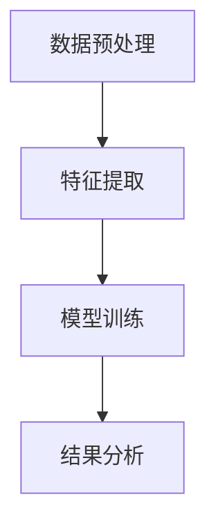
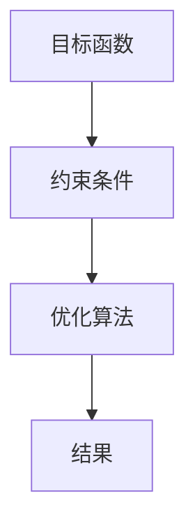
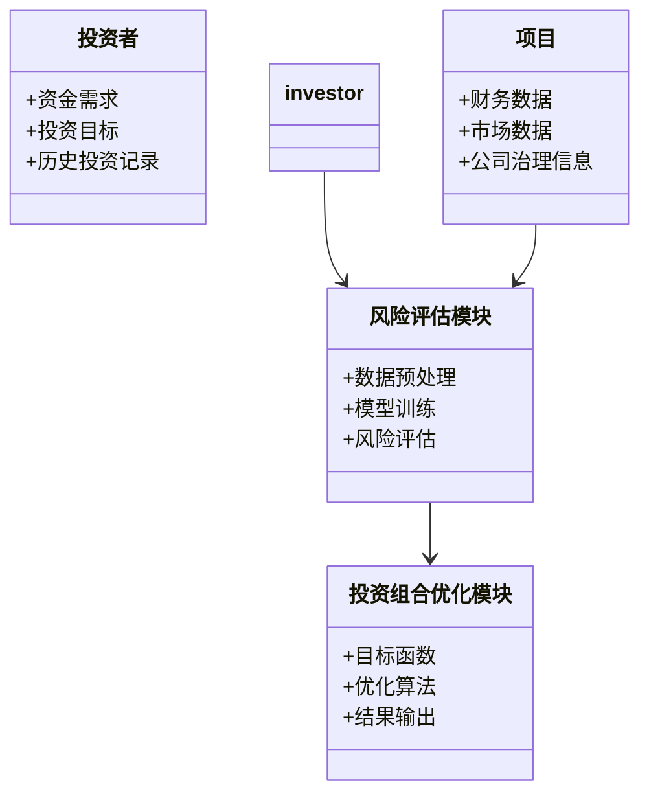
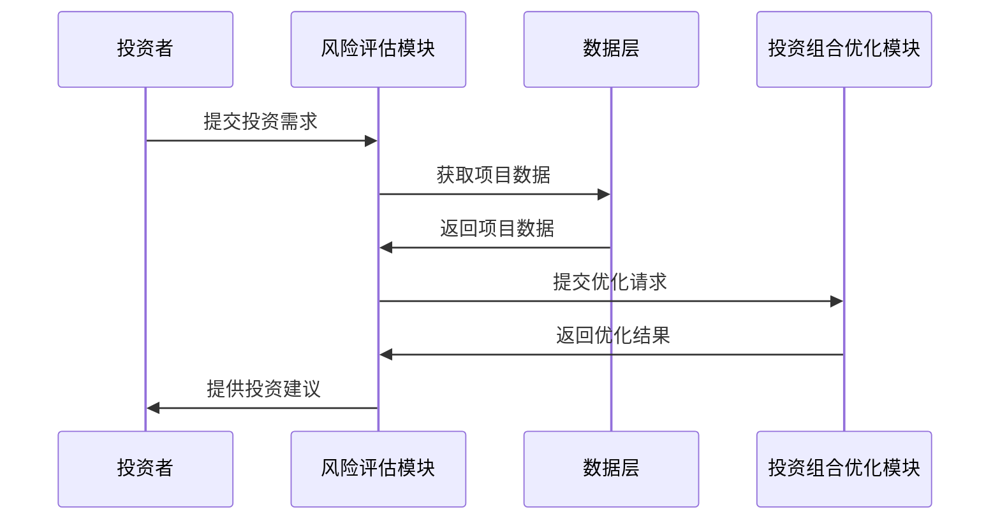

                 


# AI Agent在智能风险投资分析中的应用

> 关键词：AI Agent，智能风险投资，金融数据分析，机器学习，投资组合优化

> 摘要：本文深入探讨了AI Agent在智能风险投资分析中的应用，结合背景介绍、核心概念、算法原理、系统架构、项目实战和最佳实践，全面分析了AI Agent如何通过感知、决策和执行机制优化风险投资流程，为投资者提供高效、精准的决策支持。

---

# 第一部分: AI Agent与智能风险投资分析的背景与概念

## 第1章: AI Agent与风险投资分析的背景介绍

### 1.1 AI Agent的基本概念
- **AI Agent的定义**: AI Agent是一种智能代理系统，能够感知环境、处理信息并执行任务以实现特定目标。
- **AI Agent的核心特征**: 
  - 感知能力：通过传感器或数据源获取信息。
  - 决策能力：基于感知信息做出最优决策。
  - 执行能力：通过执行器或输出模块完成任务。
- **AI Agent与传统数据分析工具的对比**:
  | 特性          | AI Agent                     | 传统数据分析工具               |
  |---------------|------------------------------|-------------------------------|
  | 数据处理能力  | 强大，支持实时分析和学习     | 有限，依赖人工编程和规则       |
  | 自适应能力    | 能够自适应环境变化           | 需要人工干预调整                |
  | 决策能力      | 具备自主决策能力             | 需要人工参与决策                |

### 1.2 风险投资分析的现状
- **风险投资的基本流程**: 
  1. 数据收集：获取目标公司的财务数据、市场数据等。
  2. 数据分析：通过财务指标、市场趋势等评估投资风险。
  3. 投资决策：基于分析结果制定投资策略。
- **传统风险投资分析的局限性**:
  - 数据处理能力有限，难以应对海量数据。
  - 分析效率低，人工决策耗时长。
  - 风险预测不够精准，难以捕捉市场波动。
- **AI技术在金融领域的应用趋势**:
  - AI技术广泛应用于金融数据分析、风险评估、投资组合优化等领域。
  - 通过机器学习模型提升数据分析效率和准确性。

### 1.3 AI Agent在风险投资中的应用前景
- **AI Agent在风险投资中的潜在价值**:
  - 提高数据分析效率，快速处理海量数据。
  - 优化风险评估模型，提升预测准确性。
  - 实现实时监控，及时发现潜在风险。
- **当前市场对AI Agent的需求分析**:
  - 金融机构对高效、智能的分析工具需求旺盛。
  - 投资者对个性化、精准的投资建议需求增加。
- **AI Agent在风险投资中的未来发展趋势**:
  - 更智能化：AI Agent将具备更强的自主学习和决策能力。
  - 更个性化：根据投资者需求定制化分析方案。
  - 更协同化：AI Agent与人类专家协同工作，形成人机结合的分析模式。

### 1.4 本章小结
本章介绍了AI Agent的基本概念、风险投资分析的现状及其在风险投资中的应用前景，为后续章节的深入分析奠定了基础。

---

## 第2章: AI Agent的核心概念与联系

### 2.1 AI Agent的核心原理
- **AI Agent的感知机制**:
  - 数据收集：通过多种数据源获取相关信息。
  - 数据处理：对数据进行清洗、转换和特征提取。
- **AI Agent的决策机制**:
  - 数据分析：基于机器学习模型进行风险评估和投资建议。
  - 策略优化：通过算法优化投资组合。
- **AI Agent的执行机制**:
  - 系统输出：生成风险评估报告和投资建议。
  - 实时监控：跟踪投资表现并动态调整策略。

### 2.2 AI Agent与风险投资分析的关系
- **AI Agent在风险评估中的应用**:
  - 通过机器学习模型预测投资项目的风险等级。
  - 结合历史数据和市场趋势进行风险分析。
- **AI Agent在投资组合优化中的作用**:
  - 利用优化算法构建高效的投资组合。
  - 动态调整投资组合以应对市场变化。
- **AI Agent在市场预测中的价值**:
  - 利用自然语言处理技术分析市场新闻和社交媒体情绪。
  - 结合时间序列模型预测市场趋势。

### 2.3 AI Agent的核心概念对比表
| 特性          | 风险评估             | 投资组合优化         | 市场预测               |
|---------------|----------------------|--------------------|-----------------------|
| 核心任务      | 评估投资项目风险     | 构建高效投资组合     | 预测市场趋势           |
| 使用技术      | 机器学习、回归分析   | 最优化算法、动态规划 | 时间序列分析、NLP     |
| 输入数据      | 财务数据、市场数据   | 资产回报率、风险参数 | 市场数据、新闻数据     |
| 输出结果      | 风险等级、建议       | 投资组合配置、风险调整 | 预测结果、市场信号     |

### 2.4 AI Agent的ER实体关系图
```mermaid
er
actor 投资者
 entity 项目
    --> 项目风险评估结果
 entity 市场数据
    --> 项目风险评估结果
```

---

## 第3章: AI Agent在风险投资分析中的算法原理

### 3.1 风险评估算法
- **风险评估的数学模型**:
  $$风险等级 = f(财务指标, 市场趋势, 公司治理)$$
  其中，$f$ 是基于机器学习的模型，如逻辑回归、支持向量机等。
- **风险评估的流程图**:


### 3.2 投资组合优化算法
- **投资组合优化的数学模型**:
  $$\text{目标函数：最大化收益}$$
  $$\text{约束条件：最小化风险，满足资金约束}$$
- **投资组合优化的流程图**:


---

## 第4章: AI Agent的系统分析与架构设计

### 4.1 项目场景介绍
- **目标**: 构建一个基于AI Agent的风险投资分析系统，帮助投资者进行风险评估和投资决策。

### 4.2 系统功能设计


### 4.3 系统架构设计
- **分层架构**:
  - 数据层：负责数据的存储和管理。
  - 业务逻辑层：负责风险评估和投资组合优化的逻辑实现。
  - 表现层：负责用户交互和结果展示。

### 4.4 系统接口设计
- **输入接口**: 接收投资者的需求和项目数据。
- **输出接口**: 提供风险评估结果和投资组合建议。

### 4.5 系统交互流程图


---

## 第5章: 项目实战

### 5.1 环境安装
- **安装Python**: `python --version`
- **安装相关库**: `pip install numpy pandas scikit-learn`

### 5.2 核心代码实现
```python
import numpy as np
from sklearn.linear_model import LogisticRegression

# 数据预处理
def preprocess_data(data):
    # 数据清洗和特征提取
    return processed_data

# 风险评估模型
def risk_assessment_model(train_data, train_labels):
    model = LogisticRegression()
    model.fit(train_data, train_labels)
    return model

# 投资组合优化
def optimize_portfolio(returns, risk_constraint):
    # 使用优化算法求解最优投资组合
    pass
```

### 5.3 代码解读与分析
- **数据预处理**: 对原始数据进行清洗、转换和特征提取。
- **模型训练**: 使用机器学习算法训练风险评估模型。
- **结果分析**: 解释模型输出的风险评估结果和投资建议。

### 5.4 实际案例分析
- **案例背景**: 某科技公司投资分析。
- **分析过程**: 数据收集、模型训练、结果解读。
- **结果总结**: 提供风险评估和投资建议。

### 5.5 项目小结
本章通过实际项目展示了AI Agent在风险投资分析中的应用，验证了其在提高分析效率和准确性方面的优势。

---

## 第6章: 最佳实践与小结

### 6.1 最佳实践
- **数据质量**: 确保数据的完整性和准确性。
- **模型调优**: 定期更新和优化机器学习模型。
- **持续学习**: 通过反馈机制不断改进AI Agent的性能。

### 6.2 小结
本文系统地探讨了AI Agent在智能风险投资分析中的应用，从理论到实践，详细介绍了其核心概念、算法原理和系统架构设计。通过实际项目展示了其在风险评估和投资组合优化中的价值。

### 6.3 注意事项
- **数据隐私**: 注意保护投资者和项目的隐私数据。
- **模型解释性**: 确保模型的可解释性，便于投资者理解和信任。

### 6.4 拓展阅读
- 推荐阅读《机器学习实战》和《金融数据分析实战》。

---

作者：AI天才研究院/AI Genius Institute & 禅与计算机程序设计艺术 /Zen And The Art of Computer Programming

