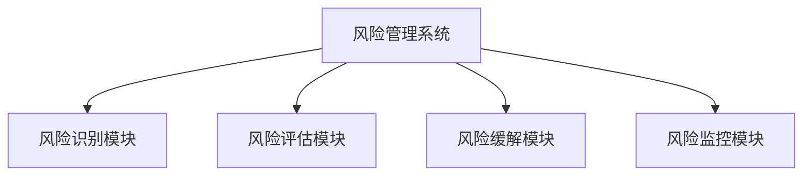

                 


# AI Agent在智能风险管理中的应用

> 关键词：AI Agent, 智能风险管理, 多智能体系统, 强化学习, 计算机视觉, 自然语言处理

> 摘要：  
本文深入探讨了AI Agent在智能风险管理中的应用，从AI Agent的基本概念到其在风险管理中的实际应用进行了系统性分析。通过结合多智能体系统、强化学习、计算机视觉和自然语言处理等技术，本文提出了基于AI Agent的风险管理系统架构，并通过实际案例展示了其在金融、医疗和工业等领域的广泛应用。文章还详细分析了算法实现、系统设计和项目实战，为读者提供了一套完整的解决方案。

---

## 第一部分: AI Agent与风险管理概述

### 第1章: AI Agent与风险管理概述

#### 1.1 AI Agent的基本概念
- **1.1.1 AI Agent的定义与特点**
  AI Agent（智能体）是指能够感知环境并采取行动以实现目标的实体。其特点包括自主性、反应性、目标导向性和社会性。

- **1.1.2 AI Agent的核心要素与分类**
  AI Agent的核心要素包括感知、决策和行动能力。根据智能水平，AI Agent可以分为反应式、基于模型和混合智能体。

- **1.1.3 AI Agent与传统风险管理的区别**
  传统风险管理依赖人工分析，而AI Agent能够实时感知、自主决策并采取行动，显著提高了效率和准确性。

#### 1.2 风险管理的背景与挑战
- **1.2.1 风险管理的基本概念**
  风险管理是识别、评估和应对潜在风险的过程，旨在最小化损失和不确定性。

- **1.2.2 当前风险管理的主要挑战**
  当前风险管理面临数据量大、实时性要求高、复杂性增加等挑战，传统方法难以满足需求。

- **1.2.3 AI技术在风险管理中的潜在价值**
  AI技术能够通过大数据分析、模式识别和自主决策，显著提升风险管理的效率和准确性。

#### 1.3 AI Agent在风险管理中的应用前景
- **1.3.1 AI Agent在风险管理中的优势**
  AI Agent能够实时监控、快速响应和自适应优化，显著降低风险发生概率。

- **1.3.2 AI Agent在不同领域的应用案例**
  在金融领域，AI Agent用于实时市场监控和欺诈检测；在医疗领域，用于患者风险评估和疾病预测。

- **1.3.3 未来发展趋势与研究方向**
  未来AI Agent将更加智能化、协同化和个性化，研究方向包括强化学习、多智能体协作和人机交互。

#### 1.4 本章小结
本章介绍了AI Agent的基本概念、风险管理的背景与挑战，以及AI Agent在风险管理中的应用前景。

---

## 第二部分: AI Agent的核心原理与技术

### 第2章: AI Agent的核心原理

#### 2.1 多智能体系统概述
- **2.1.1 多智能体系统的定义与特点**
  多智能体系统是指由多个相互作用的智能体组成的系统，具有分布式、协作性和自适应性。

- **2.1.2 多智能体系统中的通信与协作**
  智能体之间通过消息传递、状态共享等方式进行协作，实现共同目标。

- **2.1.3 多智能体系统分类与应用**
  多智能体系统可以分为任务协作型和环境适应型，广泛应用于机器人、交通管理和游戏AI等领域。

#### 2.2 知识表示与推理
- **2.2.1 知识表示的基本方法**
  知识表示包括概念图、语义网络和知识图谱等形式。

- **2.2.2 逻辑推理与非逻辑推理**
  逻辑推理基于形式逻辑进行，非逻辑推理则采用概率推理和模糊推理。

- **2.2.3 知识图谱与语义网络**
  知识图谱通过实体和关系表示知识，语义网络通过节点和边表示语义关系。

#### 2.3 计算机视觉与自然语言处理
- **2.3.1 计算机视觉在风险管理中的应用**
  计算机视觉用于图像识别、视频分析，帮助识别潜在风险。

- **2.3.2 自然语言处理在风险管理中的应用**
  自然语言处理用于文本分析、情感分析，帮助评估风险相关文本信息。

- **2.3.3 多模态数据处理与融合**
  多模态数据包括文本、图像和语音，通过融合技术提升风险识别能力。

#### 2.4 强化学习与决策优化
- **2.4.1 强化学习的基本原理**
  强化学习通过试错机制，基于奖励机制优化决策策略。

- **2.4.2 基于强化学习的决策优化**
  强化学习用于动态环境中的决策优化，如金融投资组合管理和路径规划。

- **2.4.3 在风险管理中的应用案例**
  强化学习用于实时市场监控和风险规避策略优化。

#### 2.5 本章小结
本章详细介绍了AI Agent的核心原理，包括多智能体系统、知识表示与推理、计算机视觉和自然语言处理、强化学习与决策优化。

---

## 第三部分: 风险管理的AI Agent系统架构

### 第3章: 风险管理的系统架构

#### 3.1 风险管理系统的组成与功能
- **3.1.1 风险识别模块**
  通过数据采集和特征提取，识别潜在风险。

- **3.1.2 风险评估模块**
  基于概率模型和评分系统，评估风险的影响和概率。

- **3.1.3 风险缓解模块**
  制定风险应对策略，如转移、减轻和接受。

- **3.1.4 风险监控模块**
  实时监控风险状态，动态调整应对策略。

#### 3.2 AI Agent在风险管理中的系统架构
- **3.2.1 系统整体架构设计**
  系统架构包括感知层、决策层和执行层。

- **3.2.2 各模块之间的交互关系**
  模块之间通过消息传递和数据共享进行协作。

- **3.2.3 系统的可扩展性与灵活性**
  系统设计注重模块化，便于功能扩展和性能优化。

#### 3.3 系统接口与数据流设计
- **3.3.1 系统接口设计**
  系统接口包括数据输入、模型调用和结果输出。

- **3.3.2 数据流的处理流程**
  数据从采集到处理，再到输出，形成完整的数据流。

- **3.3.3 接口的安全性与可靠性**
  系统接口需确保数据安全和通信可靠。

#### 3.4 本章小结
本章详细讨论了风险管理系统的组成与功能，以及AI Agent在系统架构中的应用。

---

## 第四部分: AI Agent在风险管理中的算法实现

### 第4章: 风险管理中的概率推理算法

#### 4.1 概率推理的基本原理
- **4.1.1 概率推理的定义**
  概率推理是基于概率论的推理方法，用于处理不确定性。

- **4.1.2 贝叶斯网络与马尔可夫链**
  贝叶斯网络用于表示变量之间的概率关系，马尔可夫链用于处理序列数据。

- **4.1.3 概率推理的应用场景**
  概率推理广泛应用于风险评估和决策优化。

#### 4.2 强化学习算法
- **4.2.1 强化学习的基本原理**
  强化学习通过试错机制，基于奖励机制优化决策策略。

- **4.2.2 基于Q-learning的算法实现**
  Q-learning是一种经典的强化学习算法，适用于离散状态和动作空间。

- **4.2.3 强化学习在风险管理中的应用**
  强化学习用于动态环境中的风险规避策略优化。

#### 4.3 异常检测算法
- **4.3.1 异常检测的定义与方法**
  异常检测用于识别数据中的异常模式。

- **4.3.2 基于深度学习的异常检测**
  深度学习模型如LSTM和CNN在异常检测中表现出色。

- **4.3.3 异常检测在风险管理中的应用**
  异常检测用于欺诈检测和系统故障预警。

#### 4.4 贝叶斯网络算法
- **4.4.1 贝叶斯网络的基本原理**
  贝叶斯网络通过概率分布描述变量之间的关系。

- **4.4.2 贝叶斯网络的构建与训练**
  包括结构学习和参数学习两部分。

- **4.4.3 贝叶斯网络在风险管理中的应用**
  贝叶斯网络用于风险评估和决策优化。

#### 4.5 本章小结
本章详细介绍了风险管理中的概率推理算法、强化学习算法、异常检测算法和贝叶斯网络算法。

---

## 第五部分: 风险管理系统的AI Agent设计

### 第5章: 风险管理系统的项目实战

#### 5.1 项目背景与目标
- **5.1.1 项目背景**
  本项目旨在开发一个基于AI Agent的智能风险管理系统。

- **5.1.2 项目目标**
  实现风险识别、评估、监控和应对功能。

#### 5.2 系统功能设计
- **5.2.1 风险识别模块**
  通过数据采集和特征提取，识别潜在风险。

- **5.2.2 风险评估模块**
  基于概率模型和评分系统，评估风险的影响和概率。

- **5.2.3 风险监控模块**
  实时监控风险状态，动态调整应对策略。

#### 5.3 系统架构设计
- **5.3.1 系统架构图**
  使用Mermaid绘制系统架构图，展示各模块之间的关系。

- **5.3.2 系统接口设计**
  包括数据输入接口、模型调用接口和结果输出接口。

- **5.3.3 系统交互设计**
  使用Mermaid绘制交互序列图，展示模块之间的协作流程。

#### 5.4 本章小结
本章通过实际案例展示了AI Agent在风险管理中的应用，详细分析了系统设计和实现过程。

---

## 第六部分: 总结与展望

### 第6章: 总结与展望

#### 6.1 本章总结
- 本文系统性地分析了AI Agent在智能风险管理中的应用，从核心原理到系统设计进行了全面探讨。

#### 6.2 未来研究方向
- 加强多智能体协作研究，提升系统的智能化和协同能力。
- 深化强化学习和概率推理算法的研究，优化风险应对策略。
- 推动AI Agent在更多领域的应用，如智能城市和自动驾驶。

#### 6.3 致谢
- 感谢读者的支持和关注，期待未来更多交流与合作。

---

## 附录

### 附录A: 算法代码示例
- **概率推理算法代码**
  ```python
  import numpy as np
  from sklearn.naive_bayes import GaussianNB

  # 示例数据
  X = np.array([[1, 2], [2, 3], [3, 4], [4, 5]])
  y = np.array([0, 1, 0, 1])

  # 训练模型
  model = GaussianNB()
  model.fit(X, y)

  # 预测
  print(model.predict([[5, 6]]))
  ```

### 附录B: 系统架构图


---

## 作者：AI天才研究院/AI Genius Institute & 禅与计算机程序设计艺术 /Zen And The Art of Computer Programming

---

通过以上内容，您可以看到《AI Agent在智能风险管理中的应用》一书详细涵盖了AI Agent在风险管理中的各个方面，从基础概念到实际应用，从算法实现到系统设计，为读者提供了一套完整的解决方案。

