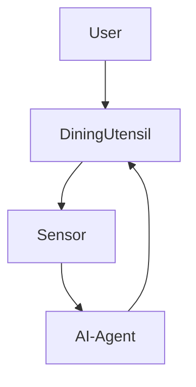
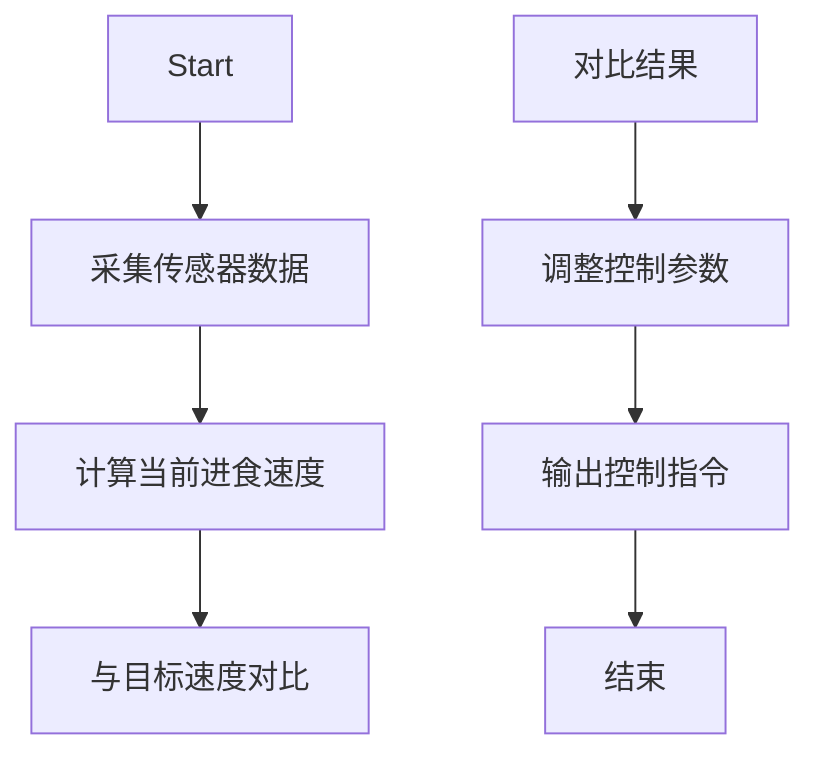
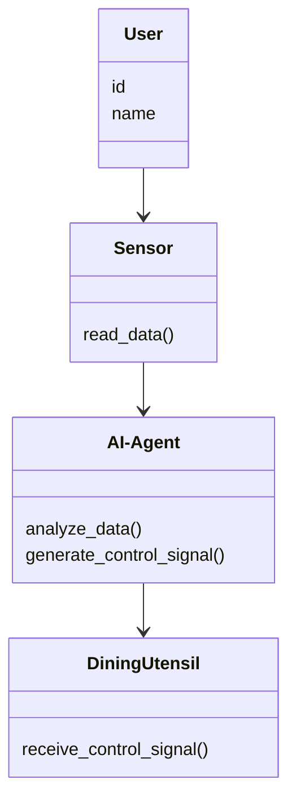
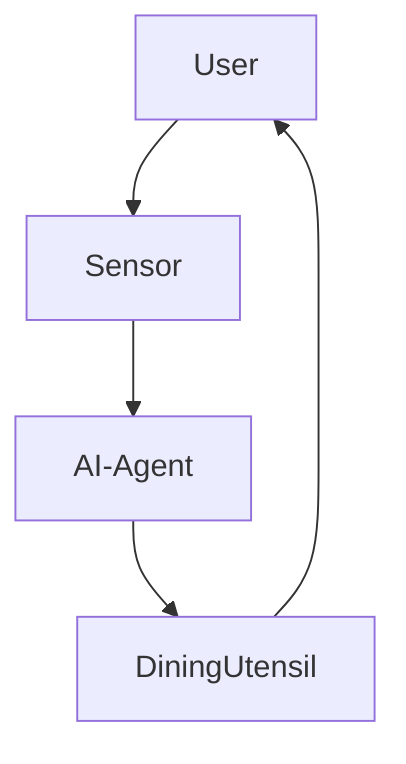
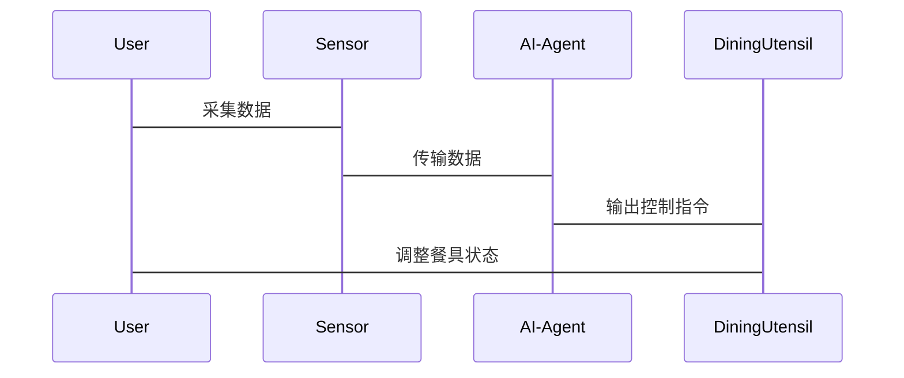

                 


# AI Agent在智能餐具中的进食速度控制

> 关键词：AI Agent、智能餐具、进食速度控制、传感器技术、机器学习、实时反馈控制

> 摘要：本文探讨AI Agent在智能餐具中的进食速度控制技术，分析其核心原理、系统架构、算法实现及实际应用，通过详细的技术分析和案例解读，揭示AI Agent如何通过传感器数据采集、实时分析和智能控制实现精准的进食速度管理，为健康管理与智能餐饮提供新的技术解决方案。

---

## 第一章: AI Agent与智能餐具的背景介绍

### 1.1 问题背景与描述
随着人们对健康管理的重视，进食速度与健康的关系逐渐成为关注焦点。进食过快可能导致消化不良、肥胖等问题，而进食过慢可能影响用餐效率。如何实现智能化的进食速度控制，成为一项具有现实意义的技术挑战。

#### 1.1.1 进食速度控制的重要性
进食速度直接影响人体健康，例如：
- **消化系统**：过快进食可能导致胃部不适，增加胃负担。
- **代谢率**：进食速度与能量代谢密切相关，过快可能导致血糖波动。
- **用餐体验**：适当的进食速度有助于提升用餐体验，避免狼吞虎咽。

#### 1.1.2 当前进食速度控制的技术局限
传统进食速度控制方法存在以下问题：
- **人工干预**：依赖用户自我控制，效果不稳定。
- **缺乏实时反馈**：无法实时监测和调整进食速度。
- **技术单一**：传统方法难以结合现代传感器和AI技术。

#### 1.1.3 AI Agent在智能餐具中的应用潜力
AI Agent（人工智能代理）具有以下优势：
- **实时感知**：通过传感器实时采集数据，分析用户行为。
- **智能决策**：基于数据反馈，动态调整控制策略。
- **个性化服务**：根据用户特点提供定制化服务。

### 1.2 问题解决与边界
AI Agent通过智能餐具实现进食速度控制，主要解决以下问题：
- **实时监测**：采集用户的进食数据，包括速度、节奏等。
- **智能调整**：根据数据反馈，自动调整餐具的运动状态。
- **个性化优化**：基于用户数据，提供个性化的控制策略。

#### 1.2.1 AI Agent如何实现进食速度控制
AI Agent通过以下步骤实现进食速度控制：
1. **数据采集**：传感器实时采集用户的进食数据。
2. **数据分析**：AI算法分析数据，判断当前进食速度是否合理。
3. **反馈控制**：根据分析结果，调整餐具的运动状态。

#### 1.2.2 技术边界与适用场景
AI Agent在智能餐具中的应用边界包括：
- **适用场景**：家庭用餐、餐厅用餐、健康管理中心等。
- **技术限制**：依赖传感器精度和AI算法的准确性。

#### 1.2.3 系统的外延与扩展性
系统可以通过以下方式扩展：
- **多场景应用**：从家庭延伸到公共场所。
- **多设备联动**：与其他智能家居设备联动，实现更复杂的控制逻辑。

### 1.3 概念结构与核心要素
AI Agent在智能餐具中的概念结构包括以下核心要素：
- **用户**：用户是系统的服务对象。
- **传感器**：传感器负责采集用户数据。
- **AI Agent**：AI Agent负责数据分析和决策。
- **餐具**：餐具是执行机构，根据AI Agent的指令调整。

---

## 第二章: AI Agent与智能餐具的核心概念与联系

### 2.1 核心概念原理
AI Agent的核心原理包括：
- **感知**：通过传感器获取数据。
- **决策**：基于数据进行分析和判断。
- **执行**：根据决策结果调整餐具的运动状态。

#### 2.1.1 AI Agent的基本原理
AI Agent通过以下步骤实现控制：
1. **数据采集**：传感器实时采集数据。
2. **数据分析**：AI算法分析数据。
3. **决策制定**：根据分析结果制定控制策略。
4. **执行控制**：调整餐具的运动状态。

#### 2.1.2 智能餐具的感知与反馈机制
智能餐具的感知机制包括：
- **传感器类型**：如加速度传感器、压力传感器等。
- **数据采集**：实时采集用户的进食数据。
- **数据反馈**：将数据反馈给AI Agent。

#### 2.1.3 进食速度控制的实现逻辑
实现逻辑包括：
1. **数据采集**：传感器采集用户进食数据。
2. **数据分析**：AI Agent分析数据，判断当前进食速度。
3. **反馈控制**：根据分析结果，调整餐具的运动状态。

### 2.2 核心概念对比分析
通过对比分析，突出AI Agent的优势：
- **基于规则的控制**：依赖预设规则，灵活性差。
- **基于学习的控制**：通过机器学习模型，具有自适应能力。
- **基于预测的控制**：通过预测模型，提前调整控制策略。

#### 2.2.1 基于规则的控制与基于学习的控制对比
| 对比维度 | 基于规则的控制 | 基于学习的控制 |
|----------|----------------|----------------|
| 灵活性   | 低             | 高             |
| 可扩展性 | 低             | 高             |
| 精度     | 低             | 高             |

#### 2.2.2 不同传感器技术的优劣势对比
| 传感器类型 | 优点             | 缺点             |
|------------|------------------|------------------|
| 加速度传感器 | 响应速度快       | �易受环境干扰     |
| 压力传感器  | 精度高           | 成本较高         |

#### 2.2.3 AI Agent与其他控制方式的差异
AI Agent的核心优势在于其智能化和自适应能力，能够根据实时数据动态调整控制策略。

### 2.3 ER实体关系图


---

## 第三章: AI Agent在进食速度控制中的算法原理

### 3.1 算法原理概述
AI Agent的核心算法包括：
- **反馈控制算法**：PID控制算法。
- **预测控制算法**：基于时间序列的预测模型。
- **混合型控制算法**：结合反馈和预测的算法。

#### 3.1.1 基于反馈的控制算法
PID控制算法公式：
$$ u(t) = K_p e(t) + K_i \int_{0}^{t} e(t) dt + K_d \frac{de(t)}{dt} $$
其中，\( e(t) \) 是误差，\( K_p \)、\( K_i \)、\( K_d \) 是比例、积分、微分系数。

#### 3.1.2 基于预测的控制算法
时间序列预测模型公式：
$$ \hat{y}(t+n) = a_1 y(t) + a_2 y(t-1) + \dots + a_k y(t-k+1) $$

#### 3.1.3 混合型控制算法
结合反馈和预测的算法，例如：
$$ u(t) = \alpha \cdot u_{\text{feedback}}(t) + (1-\alpha) \cdot u_{\text{predict}}(t) $$

### 3.2 算法流程图


### 3.3 算法实现代码
```python
import numpy as np

def pid_control(current_speed, target_speed, dt):
    error = target_speed - current_speed
    Kp = 1.0
    Ki = 0.5
    Kd = 0.2
    integral = integral + error * dt
    derivative = (error - previous_error) / dt
    output = Kp * error + Ki * integral + Kd * derivative
    return output

# 示例调用
current_speed = 10
target_speed = 15
dt = 0.1
output = pid_control(current_speed, target_speed, dt)
print(output)
```

---

## 第四章: 系统分析与架构设计

### 4.1 问题场景介绍
用户在用餐时，智能餐具通过传感器采集数据，AI Agent分析数据并调整餐具的运动状态，实现进食速度的控制。

### 4.2 项目介绍
本项目旨在开发一款智能餐具，通过AI Agent实现进食速度的智能控制。

### 4.3 系统功能设计
系统功能包括：
- **数据采集模块**：采集用户的进食数据。
- **数据分析模块**：分析数据，判断当前进食速度。
- **控制模块**：根据分析结果，调整餐具的运动状态。

#### 4.3.1 领域模型Mermaid类图


#### 4.3.2 系统架构设计Mermaid架构图


#### 4.3.3 系统交互Mermaid序列图


### 4.4 系统接口设计
系统接口包括：
- **传感器接口**：与传感器通信，获取数据。
- **AI Agent接口**：与AI Agent通信，传输数据和指令。
- **餐具接口**：与餐具通信，接收控制指令。

### 4.5 本章小结

---

## 第五章: 项目实战

### 5.1 环境搭建
- **传感器安装**：安装加速度传感器和压力传感器。
- **AI Agent开发**：使用Python和深度学习框架（如TensorFlow）开发AI Agent。
- **餐具控制模块**：开发餐具的控制模块，接收AI Agent的指令。

### 5.2 核心代码实现
```python
import numpy as np
import tensorflow as tf

# 定义神经网络模型
model = tf.keras.Sequential([
    tf.keras.layers.Dense(64, activation='relu'),
    tf.keras.layers.Dense(1)
])

# 编译模型
model.compile(optimizer='adam', loss='mean_squared_error')

# 训练模型
model.fit(X_train, y_train, epochs=100, batch_size=32)
```

### 5.3 代码应用解读
- **数据预处理**：将传感器数据进行归一化处理。
- **模型训练**：使用训练数据训练神经网络模型。
- **模型推理**：使用训练好的模型进行预测，生成控制指令。

### 5.4 实际案例分析
通过实际案例分析，展示AI Agent如何实现进食速度的智能控制。

### 5.5 本章小结

---

## 第六章: 最佳实践

### 6.1 小结
总结本文的核心内容，包括AI Agent的基本原理、系统架构、算法实现和项目实战。

### 6.2 注意事项
- **数据隐私**：注意用户数据的隐私保护。
- **系统稳定性**：确保系统的稳定性和可靠性。
- **用户体验**：注重用户体验，避免过度干预。

### 6.3 拓展阅读
建议读者进一步阅读相关领域的文献，深入了解AI Agent在其他领域的应用。

---

## 作者：AI天才研究院/AI Genius Institute & 禅与计算机程序设计艺术 /Zen And The Art of Computer Programming

