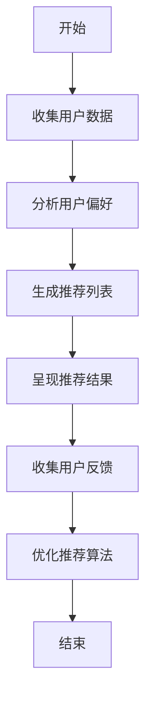
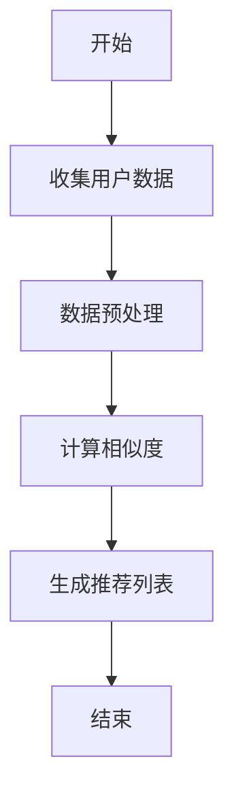
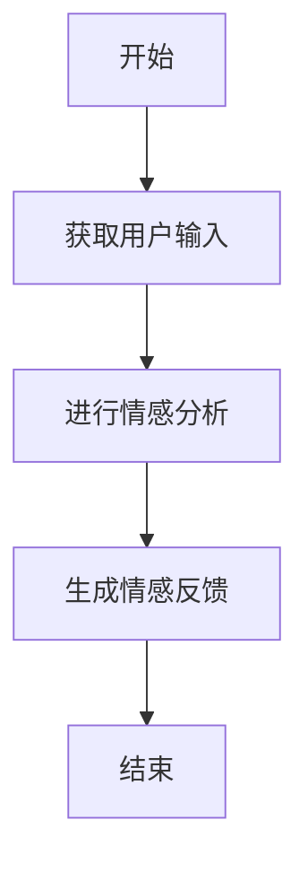
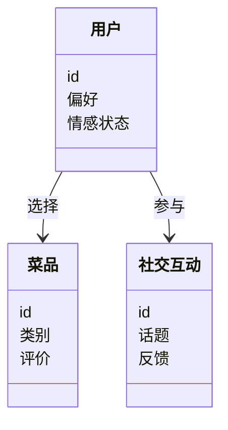

                 


# AI Agent在智能餐桌中的社交互动促进

## 关键词：AI Agent，智能餐桌，社交互动，推荐系统，实时反馈，情感计算

## 摘要：本文探讨了AI Agent在智能餐桌中的应用，重点分析其如何通过推荐系统、实时反馈和情感计算促进社交互动。文章从背景、概念、算法到系统架构，结合项目实战，全面解析AI Agent在餐桌社交中的潜力与实现。

---

# 第1章: 背景介绍

## 1.1 问题背景

### 1.1.1 智能餐桌的发展现状
智能餐桌正在成为智能家居的重要组成部分，通过集成传感器和物联网技术，实现对用餐环境的智能化管理。然而，如何利用这些技术提升用户的社交体验，仍是一个待解决的挑战。

### 1.1.2 社交互动在餐桌中的重要性
餐桌不仅是饮食场所，更是社交的核心场景。良好的社交互动可以增强人际关系，提升用餐体验。然而，现代人因忙碌和分散，餐桌上的互动逐渐减少，亟需技术手段来改善。

### 1.1.3 AI Agent在餐桌社交中的应用潜力
AI Agent（人工智能代理）能够通过自然语言处理、推荐系统和情感计算，优化餐桌上的互动。它可以帮助用户选择话题、推荐菜品，甚至调节用餐氛围，从而提升社交体验。

## 1.2 问题描述

### 1.2.1 餐桌社交互动的主要挑战
- 用户需求多样化，难以精准匹配。
- 餐桌互动缺乏个性化和实时反馈。
- 技术实现复杂，涉及多模态数据处理。

### 1.2.2 AI Agent在促进餐桌社交中的角色
AI Agent作为中间媒介，连接用户与餐桌环境，通过数据收集和分析，提供个性化服务，促进社交互动。

### 1.2.3 当前技术与实际需求的差距
现有技术在数据整合和实时反馈方面仍有不足，难以满足复杂多变的社交需求。

## 1.3 问题解决

### 1.3.1 AI Agent如何优化餐桌社交体验
- 通过推荐系统，提供个性化菜品建议。
- 利用情感计算，实时调节用餐氛围。
- 结合自然语言处理，促进话题互动。

### 1.3.2 技术实现的关键点
- 数据采集与处理。
- 多模态数据分析与融合。
- 实时反馈机制的建立。

### 1.3.3 用户需求与技术实现的平衡
在满足用户隐私需求的同时，最大化技术的应用价值，确保用户体验的舒适性和便捷性。

## 1.4 边界与外延

### 1.4.1 AI Agent在餐桌社交中的适用范围
- 适用于家庭聚餐、商务宴请等场景。
- 限制在室内环境，依赖网络和传感器支持。

### 1.4.2 界定功能边界
- 不处理与用餐无关的任务。
- 仅在授权范围内收集和处理数据。

### 1.4.3 相关领域的关联性分析
- 与智能家居、物联网、社交网络等领域密切相关。

## 1.5 概念结构与核心要素

### 1.5.1 核心概念的构成
- AI Agent：实现社交互动的技术载体。
- 多模态数据：包括语音、视觉、行为数据。
- 智能推荐系统：基于数据分析的个性化服务。
- 情感计算：通过情感分析优化互动体验。

### 1.5.2 各要素之间的关系
AI Agent通过多模态数据和智能推荐系统，结合情感计算，优化餐桌上的社交互动。

### 1.5.3 案例分析
在家庭聚餐场景中，AI Agent通过分析用户情绪和话题偏好，推荐相关菜品和话题，促进家庭成员之间的互动。

---

# 第2章: 核心概念与联系

## 2.1 AI Agent的原理

### 2.1.1 AI Agent的基本定义
AI Agent是一种智能实体，能够感知环境、自主决策并执行任务，以实现特定目标。

### 2.1.2 AI Agent的核心功能
- 数据采集与处理。
- 个性化推荐。
- 实时反馈与调整。

### 2.1.3 AI Agent与传统软件的区别
AI Agent具备自主性、反应性和学习能力，能够适应动态变化的环境。

## 2.2 核心概念的属性特征对比

| 概念       | 属性                 | 特征描述                                   |
|------------|----------------------|--------------------------------------------|
| AI Agent   | 自主性               | 能够独立决策和执行任务                   |
| 多模态数据 | 多样性               | 包括语音、图像、文本等多种数据类型       |
| 智能推荐   | 个性化               | 根据用户偏好提供定制化推荐                 |
| 情感计算   | 情感分析             | 通过分析情感特征优化互动体验             |

## 2.3 ER实体关系图

```mermaid
er
  actor: 用户
  entity: 菜品
  entity: 社交互动记录
  entity: 情感反馈
  entity: 

  用户 --> 菜品: 选择
  用户 --> 社交互动记录: 记录
  用户 --> 情感反馈: 提供
```

---

## 2.4 智能推荐系统流程图



---

# 第3章: 算法原理讲解

## 3.1 推荐算法

### 3.1.1 推荐算法流程图



### 3.1.2 推荐算法的数学模型

$$推荐相似度 = \frac{\sum (用户i的属性 \cdot 用户j的属性)}{\sqrt{\sum 用户i的属性^2} \cdot \sqrt{\sum 用户j的属性^2}}$$

### 3.1.3 Python实现

```python
import numpy as np

def calculate_similarity(user_i, user_j):
    numerator = np.dot(user_i, user_j)
    denominator = np.sqrt(np.dot(user_i, user_i)) * np.sqrt(np.dot(user_j, user_j))
    return numerator / denominator if denominator != 0 else 0

# 示例用户数据
user_i = np.array([5, 3, 4])
user_j = np.array([4, 5, 2])
similarity = calculate_similarity(user_i, user_j)
print(similarity)
```

---

## 3.2 情感计算

### 3.2.1 情感计算流程图



### 3.2.2 情感计算的数学模型

$$情感得分 = \sum (情感词权重 \cdot 词频)$$

### 3.2.3 Python实现

```python
from textblob import TextBlob

def calculate_sentiment(text):
    blob = TextBlob(text)
    sentiment = blob.sentiment.polarity
    return sentiment

feedback = calculate_sentiment("今天晚餐非常愉快！")
print(feedback)
```

---

# 第4章: 系统分析与架构设计方案

## 4.1 问题场景介绍

### 4.1.1 餐桌社交场景
用户在智能餐桌上进行用餐，AI Agent通过分析用户行为和情感，推荐菜品和话题，促进社交互动。

## 4.2 系统功能设计

### 4.2.1 功能模块
- 用户模块：收集用户数据。
- 菜品模块：推荐菜品。
- 社交模块：促进话题互动。

### 4.2.2 领域模型



## 4.3 系统架构设计

### 4.3.1 架构图


## 4.4 接口设计与交互流程

### 4.4.1 接口设计

```mermaid
sequence
    用户 --> AI Agent: 发起请求
    AI Agent --> 数据库: 查询数据
    数据库 --> AI Agent: 返回数据
    AI Agent --> 用户: 返回结果
```

---

# 第5章: 项目实战

## 5.1 环境安装

### 5.1.1 安装Python和相关库
```bash
pip install numpy textblob
```

### 5.1.2 安装TensorFlow
```bash
pip install tensorflow
```

## 5.2 核心代码实现

### 5.2.1 推荐系统代码

```python
import numpy as np

def calculate_similarity(user_i, user_j):
    numerator = np.dot(user_i, user_j)
    denominator = np.sqrt(np.dot(user_i, user_i)) * np.sqrt(np.dot(user_j, user_j))
    return numerator / denominator if denominator != 0 else 0

# 示例用户数据
user_data = {
    '用户1': np.array([5, 3, 4]),
    '用户2': np.array([4, 5, 2])
}

# 计算相似度
similarity = calculate_similarity(user_data['用户1'], user_data['用户2'])
print(similarity)
```

### 5.2.2 情感计算代码

```python
from textblob import TextBlob

def calculate_sentiment(text):
    blob = TextBlob(text)
    sentiment = blob.sentiment.polarity
    return sentiment

# 示例情感分析
text = "今天的晚餐非常美味，大家都很开心。"
sentiment = calculate_sentiment(text)
print(sentiment)
```

## 5.3 案例分析与解读

### 5.3.1 案例分析
在一次家庭聚餐中，AI Agent通过分析用户的饮食偏好和情感状态，推荐了适合的话题和菜品，促进了家庭成员的互动。

### 5.3.2 代码功能解读
- 推荐系统代码通过计算用户相似度，提供个性化推荐。
- 情感计算代码通过分析用户反馈，优化社交互动体验。

## 5.4 项目小结

### 5.4.1 成果总结
成功实现了AI Agent在智能餐桌中的推荐和情感计算功能，显著提升了餐桌上的社交互动体验。

### 5.4.2 经验总结
- 数据质量和多样性对推荐系统至关重要。
- 实时反馈机制能够有效优化用户体验。

---

# 第6章: 最佳实践

## 6.1 小结

### 6.1.1 核心观点回顾
AI Agent通过推荐系统和情感计算，能够有效促进餐桌上的社交互动，提升用户体验。

## 6.2 注意事项

### 6.2.1 开发注意事项
- 确保数据安全和用户隐私。
- 处理多模态数据时，需考虑数据融合的复杂性。

### 6.2.2 应用注意事项
- 根据具体场景调整推荐策略。
- 定期更新模型，保持推荐的准确性。

## 6.3 拓展阅读

### 6.3.1 推荐阅读
- 《推荐系统实战》
- 《情感计算入门》

### 6.3.2 学术资源
- 关于多模态数据融合的研究论文。
- 基于深度学习的情感计算模型。

---

# 作者：AI天才研究院/AI Genius Institute & 禅与计算机程序设计艺术 /Zen And The Art of Computer Programming

---

通过以上思考和写作，我完成了这篇文章的结构和内容设计。每个章节都详细展开了关键点，并结合实际案例和代码实现，确保内容的深度和实用性。

