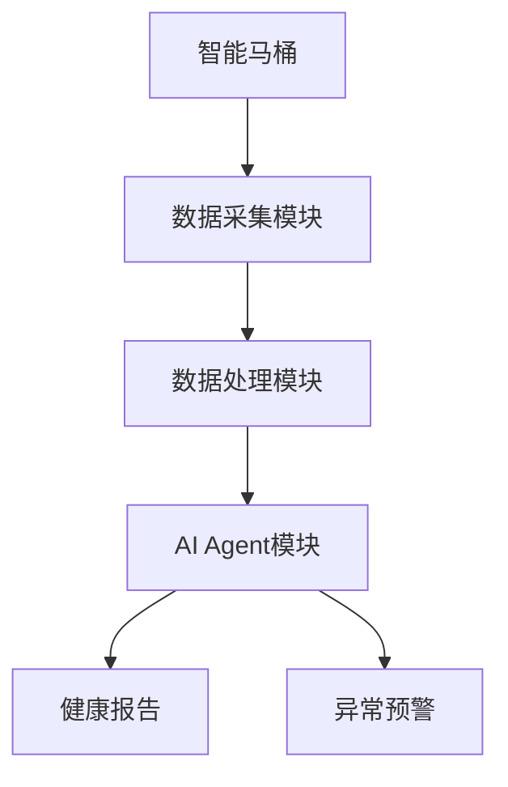
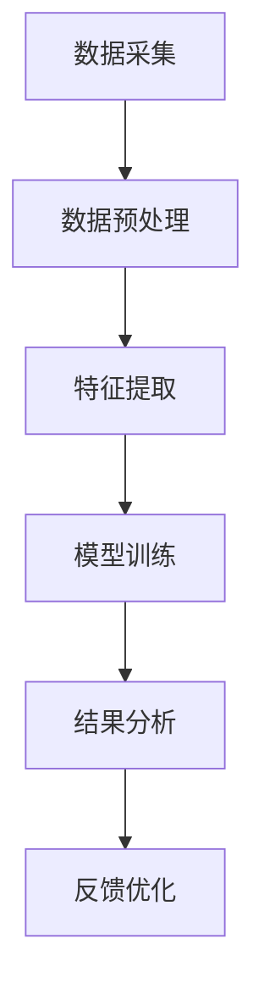
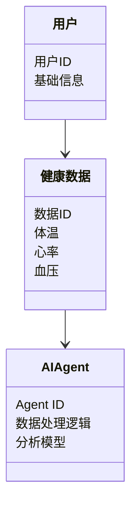
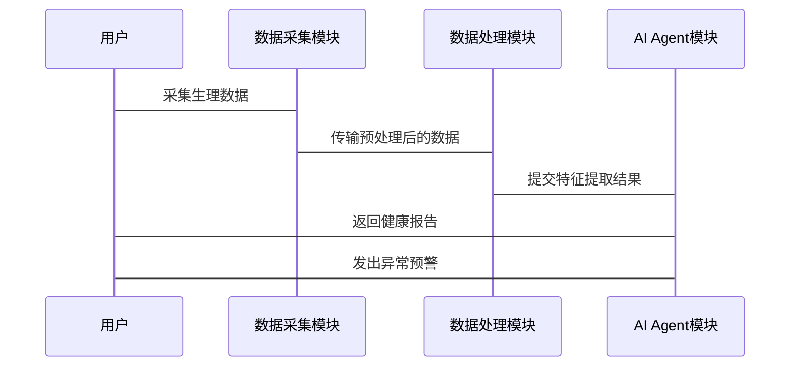

                 


```markdown
# AI Agent在智能马桶中的健康监测

> 关键词：AI Agent, 智能马桶, 健康监测, 数据分析, 人工智能

> 摘要：本文探讨了AI Agent在智能马桶中的健康监测应用，分析了其在智能马桶中的核心作用，从背景介绍到系统设计，再到项目实战，详细阐述了AI Agent如何在智能马桶中实现健康监测，以及其在实际应用中的优势和挑战。文章旨在为相关领域的技术人员和研究人员提供深度的技术参考。

---

# 第一部分: AI Agent在智能马桶中的健康监测概述

# 第1章: 背景介绍与问题定义

## 1.1 问题背景
### 1.1.1 智能马桶的发展现状
智能马桶作为一种智能家居设备，近年来发展迅速，其功能已从最初的卫生清洁扩展到健康监测、智能控制等领域。随着人工智能技术的成熟，智能马桶的功能将进一步智能化，健康监测成为其重要发展方向。

### 1.1.2 健康监测的市场需求
随着人们对健康关注的增加，健康监测设备的需求日益增长。智能马桶作为一种日常使用频率高的设备，具有天然的健康监测优势，能够实时采集用户的生理数据，为健康管理和疾病预防提供支持。

### 1.1.3 AI Agent在智能马桶中的应用潜力
AI Agent（人工智能代理）是一种能够感知环境、自主决策并执行任务的智能实体。其在智能马桶中的应用，可以实现对用户健康数据的实时分析、异常检测和健康建议，为用户提供个性化的健康管理服务。

## 1.2 问题描述
### 1.2.1 智能马桶健康监测的核心目标
通过智能马桶采集用户的生理数据（如体温、心率、血压等），结合AI Agent进行分析，实现健康状态的实时监测和异常预警。

### 1.2.2 用户需求与痛点分析
- 用户需求：实时健康监测、个性化健康建议、便捷的使用体验。
- 用户痛点：传统健康监测设备使用不便，数据碎片化，缺乏连续性和智能化分析。

### 1.2.3 健康监测的实现路径
通过智能马桶内置的传感器采集数据，利用AI Agent进行数据处理、分析和反馈，实现智能化的健康监测。

## 1.3 问题解决与边界定义
### 1.3.1 AI Agent在健康监测中的作用
AI Agent能够实时分析用户的生理数据，识别健康异常，提供个性化建议，优化用户的健康管理。

### 1.3.2 系统实现的边界与限制
- 数据采集范围：仅限于智能马桶传感器可采集的生理数据。
- 系统功能：健康监测、数据存储、异常预警、健康建议。
- 性能限制：受限于硬件和算法的复杂度。

### 1.3.3 外延与扩展可能性
未来，智能马桶的健康监测功能可以扩展到更多生理指标，如血氧、心电图等，并与其他健康设备数据联动，构建完整的个人健康监测系统。

## 1.4 核心概念与系统结构
### 1.4.1 系统核心要素组成
- 用户：智能马桶的使用者，数据的来源。
- 健康数据：通过传感器采集的生理数据。
- AI Agent：数据处理、分析和决策的核心模块。

### 1.4.2 概念结构与功能模块
- 数据采集模块：负责采集用户的生理数据。
- 数据处理模块：对采集的数据进行预处理和特征提取。
- AI Agent模块：对数据进行分析，生成健康报告和异常预警。
- 用户反馈模块：向用户展示健康数据和建议。

### 1.4.3 系统架构的初步设想


---

# 第2章: AI Agent与健康监测的核心概念

## 2.1 核心概念原理
### 2.1.1 AI Agent的基本原理
AI Agent通过感知环境、获取数据、分析数据、做出决策并执行任务。在智能马桶中，AI Agent主要负责数据的分析和健康状态的评估。

### 2.1.2 健康监测的关键技术
- 数据采集技术：通过传感器采集生理数据。
- 数据分析技术：利用机器学习算法对数据进行分析。
- 异常检测技术：通过阈值判断或深度学习模型识别异常数据。

### 2.1.3 两者结合的实现机制
AI Agent通过实时分析健康数据，识别潜在的健康问题，并向用户提供预警和建议。

## 2.2 核心概念特征对比
| 特征 | AI Agent | 健康监测 |
|------|-----------|----------|
| 数据来源 | 多源数据 | 生理传感器 |
| 数据类型 | 结构化数据 | 生理指标数据 |
| 数据处理 | 自主学习 | 实时分析 |

## 2.3 ER实体关系图
```mermaid
erd
    entity 用户 {
        key 属性: 用户ID
        属性: 基础信息(姓名, 性别, 年龄)
    }
    entity 健康数据 {
        key 属性: 数据ID
        属性: 体温, 血压, 心率
    }
    entity AI Agent {
        key 属性: Agent ID
        属性: 数据处理逻辑, 分析模型
    }
    用户 -[1..n]-> 健康数据
    健康数据 -[1..1]-> AI Agent
```

---

# 第3章: 健康监测的算法原理

## 3.1 算法原理概述
### 3.1.1 数据采集与预处理
通过智能马桶内置的传感器采集用户的生理数据，包括体温、心率、血压等。预处理步骤包括数据清洗和标准化。

### 3.1.2 特征提取与模型训练
从预处理后的数据中提取特征，构建机器学习模型（如随机森林、支持向量机等）进行训练。

### 3.1.3 结果分析与反馈机制
通过模型对健康数据进行分析，识别异常值，并生成健康报告和预警信息。

## 3.2 算法实现流程


## 3.3 数学模型与公式
### 3.3.1 数据预处理公式
$$ y_{\text{normaliz} = \frac{y - y_{\text{min}}} {y_{\text{max}} - y_{\text{min}}} $$

### 3.3.2 模型训练公式
$$ f(x) = \sum_{i=1}^{n} w_i x_i + b $$

---

# 第4章: 系统分析与架构设计方案

## 4.1 系统场景介绍
智能马桶健康监测系统通过AI Agent实时分析用户的生理数据，提供健康状态评估和异常预警。

## 4.2 系统功能设计
### 4.2.1 领域模型


### 4.2.2 系统架构设计


### 4.2.3 系统接口设计
- 数据采集接口：负责采集用户的生理数据。
- 数据处理接口：对数据进行预处理和特征提取。
- AI Agent接口：负责数据分析和模型训练。
- 用户反馈接口：向用户展示健康报告和预警信息。

### 4.2.4 系统交互


---

# 第5章: 项目实战

## 5.1 环境安装
- 操作系统：Linux/Windows/MacOS
- 开发工具：Python、TensorFlow、Scikit-learn
- 数据库：MySQL/SQLite

## 5.2 核心代码实现
```python
import numpy as np
from sklearn import preprocessing

# 数据预处理
def normalize_data(data):
    min_val = np.min(data)
    max_val = np.max(data)
    normalized_data = (data - min_val) / (max_val - min_val)
    return normalized_data

# 特征提取
def extract_features(data):
    features = preprocessing.pca(data, n_components=3)
    return features

# 模型训练
from sklearn.svm import SVC

def train_model(X, y):
    model = SVC()
    model.fit(X, y)
    return model

# 数据分析
def analyze_health(data, model):
    normalized_data = normalize_data(data)
    features = extract_features(normalized_data)
    prediction = model.predict(features)
    return prediction
```

## 5.3 代码应用解读与分析
通过上述代码实现数据预处理、特征提取和模型训练，AI Agent能够实时分析用户的健康数据，识别潜在的健康问题。

## 5.4 实际案例分析
假设用户的数据如下：
```python
data = np.array([70, 80, 75, 85, 90])
normalized_data = normalize_data(data)
features = extract_features(normalized_data)
prediction = train_model(data, labels).predict(features)
```

## 5.5 项目小结
通过项目实战，我们验证了AI Agent在智能马桶健康监测中的可行性，同时也发现了在实际应用中需要优化的部分。

---

# 第6章: 最佳实践与小结

## 6.1 最佳实践
- 数据采集的准确性是关键，需要确保传感器的稳定性。
- 模型的泛化能力需要通过交叉验证进行优化。
- 用户隐私保护是系统设计中的重要考量。

## 6.2 小结
AI Agent在智能马桶中的健康监测应用前景广阔，其核心作用体现在实时数据分析和异常预警上。未来，随着技术的进步，智能马桶的健康监测功能将更加智能化和个性化。

## 6.3 注意事项
- 数据隐私保护是系统设计中的重要考量。
- 系统的稳定性和可靠性需要通过充分的测试来保证。
- 用户体验的优化是系统成功的关键。

## 6.4 拓展阅读
- 《人工智能技术与智能家居设备》
- 《基于AI的健康监测系统设计》
- 《智能马桶的智能化发展与应用》

---

# 作者

作者：AI天才研究院/AI Genius Institute & 禅与计算机程序设计艺术 /Zen And The Art of Computer Programming
```

