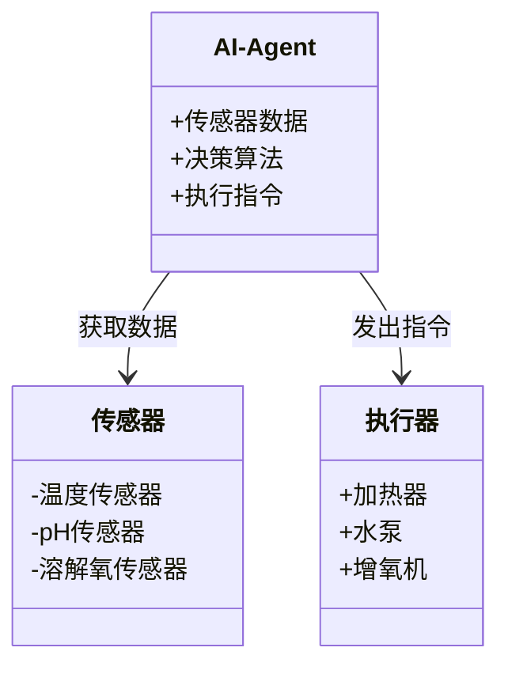
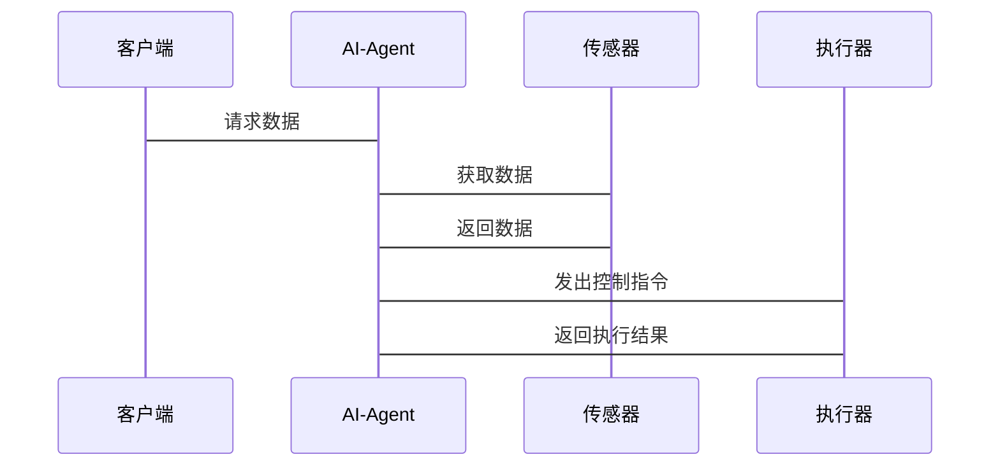

                 


# AI Agent在智能鱼缸中的生态平衡维护

> 关键词：AI Agent，智能鱼缸，生态平衡，算法原理，系统架构，项目实战

> 摘要：本文探讨AI Agent在智能鱼缸中的应用，通过详细分析其核心概念、算法原理、系统架构及项目实战，展示AI技术如何帮助维护鱼缸的生态平衡。

---

# 第一部分: AI Agent与智能鱼缸的背景介绍

## 第1章: AI Agent与智能鱼缸概述

### 1.1 AI Agent的基本概念
#### 1.1.1 AI Agent的定义
AI Agent（人工智能代理）是能够感知环境并采取行动以实现目标的智能实体。它通过传感器获取信息，利用算法做出决策，并通过执行器与环境互动。

#### 1.1.2 AI Agent的核心特点
- **自主性**：无需外部干预，自主决策。
- **反应性**：实时感知并响应环境变化。
- **学习能力**：通过数据优化决策模型。

#### 1.1.3 AI Agent与传统自动控制系统的区别
AI Agent结合了智能决策，能够处理复杂和动态变化的环境，而传统控制系统通常基于固定规则。

### 1.2 智能鱼缸的基本概念
#### 1.2.1 智能鱼缸的定义
智能鱼缸是一个集成传感器、执行器和AI技术的系统，用于自动监测和调节鱼缸环境参数，维持生态平衡。

#### 1.2.2 智能鱼缸的组成部分
- **传感器**：监测水温、pH值、溶解氧等参数。
- **执行器**：调节水泵、加热器等设备。
- **AI Agent**：分析数据，发出控制指令。

#### 1.2.3 智能鱼缸的功能与应用场景
- **自动调节**：实时调整环境参数，确保鱼类健康。
- **异常检测**：及时发现水质异常，预防鱼类死亡。
- **优化维护**：降低维护成本，提高管理效率。

### 1.3 AI Agent在智能鱼缸中的应用
#### 1.3.1 AI Agent在鱼缸生态平衡中的作用
AI Agent通过实时监测和智能决策，维持鱼缸内水温、pH值、溶解氧等参数的稳定。

#### 1.3.2 AI Agent与智能鱼缸的结合方式
AI Agent作为控制中心，接收传感器数据，分析后驱动执行器调整环境。

#### 1.3.3 AI Agent在鱼缸中的具体应用场景
- **水质异常检测**：当检测到pH值异常时，AI Agent启动调节机制。
- **自动喂食**：根据鱼类活动规律，智能控制喂食时间。

---

## 第二部分: AI Agent的核心概念与原理

## 第2章: AI Agent的核心概念与原理

### 2.1 AI Agent的核心概念
#### 2.1.1 AI Agent的感知与决策机制
AI Agent通过传感器获取环境数据，利用算法进行分析，做出决策。

#### 2.1.2 AI Agent的行为执行方式
根据决策结果，驱动执行器调整环境参数，如温度、水流等。

#### 2.1.3 AI Agent的自适应能力
通过机器学习不断优化决策模型，适应环境变化。

### 2.2 AI Agent的算法原理
#### 2.2.1 常见的AI Agent算法介绍
- **基于规则的AI Agent**：使用预定义规则进行决策，适用于规则明确的场景。
- **基于机器学习的AI Agent**：利用数据训练模型，适用于复杂环境。
- **基于强化学习的AI Agent**：通过奖励机制优化决策策略。

#### 2.2.2 基于规则的AI Agent
规则简单直接，适用于静态环境，但缺乏灵活性。

#### 2.2.3 基于机器学习的AI Agent
通过训练数据生成决策模型，能够处理复杂和动态变化的情况。

### 2.3 AI Agent与鱼缸生态系统的联系
#### 2.3.1 鱼缸生态系统的组成与特征
- **生物成分**：鱼类、微生物等。
- **物理化学成分**：水温、pH值、溶解氧等。

#### 2.3.2 AI Agent在鱼缸生态系统中的角色
作为智能控制系统，AI Agent协调各部分工作，维持生态平衡。

#### 2.3.3 AI Agent如何实现生态平衡维护
通过实时监测和智能调节，确保各参数在适宜范围内，促进鱼类健康。

---

## 第三部分: AI Agent的算法实现

## 第3章: AI Agent的算法原理

### 3.1 AI Agent的感知算法
#### 3.1.1 数据采集与处理
传感器收集数据，AI Agent进行预处理和特征提取。

#### 3.1.2 数据分析与特征提取
使用统计方法或机器学习模型识别关键特征。

#### 3.1.3 数据驱动的决策机制
基于分析结果，生成相应的控制指令。

### 3.2 AI Agent的决策算法
#### 3.2.1 基于规则的决策算法
使用预定义规则进行判断，如pH值低于7时启动酸性调节装置。

#### 3.2.2 基于机器学习的决策算法
利用训练好的模型预测最佳控制策略。

#### 3.2.3 基于强化学习的决策算法
通过奖励机制不断优化决策策略。

### 3.3 AI Agent的行为执行
#### 3.3.1 执行器控制
驱动执行器如加热器、水泵等进行调整。

#### 3.3.2 执行效果反馈
系统反馈执行结果，供后续优化使用。

---

## 第四部分: 系统分析与架构设计

## 第4章: 系统分析与架构设计

### 4.1 系统功能设计
#### 4.1.1 系统模块划分
- **感知模块**：负责数据采集。
- **决策模块**：进行数据处理和决策。
- **执行模块**：驱动执行器。

#### 4.1.2 领域模型设计
使用Mermaid类图展示各模块之间的关系。



### 4.2 系统架构设计
使用Mermaid架构图展示系统架构。


### 4.3 系统接口设计
#### 4.3.1 API接口设计
- `/get_sensor_data`：获取传感器数据。
- `/control_actuator`：控制执行器。

#### 4.3.2 接口交互流程图
展示数据获取、处理和执行的流程。



---

## 第五部分: 项目实战

## 第5章: 项目实战

### 5.1 环境安装
#### 5.1.1 硬件安装
- 安装温度传感器、pH传感器、溶解氧传感器。
- 连接加热器、水泵、增氧机。

#### 5.1.2 软件安装
- 安装Python环境。
- 安装必要的库，如`paho-mqtt`用于MQTT协议通信。

### 5.2 系统核心实现
#### 5.2.1 AI Agent主程序
```python
import paho.mqtt.client as mqtt

class AIAgent:
    def __init__(self, broker, port):
        self.broker = broker
        self.port = port
        self.client = mqtt.Client()
        self.client.connect(self.broker, self.port)

    def on_message(self, client, userdata, message):
        data = message.payload.decode()
        # 数据处理
        if data['pH'] < 7:
            self.client.publish('actuator/acid_regulator', 'start')
        elif data['温度'] > 25:
            self.client.publish('actuator/heat_regulator', 'stop')

    def subscribe(self, topic):
        self.client.subscribe(topic)
        self.client.on_message = self.on_message

agent = AIAgent('localhost', 1883)
agent.subscribe('sensor/#')
agent.client.loop_start()
```

#### 5.2.2 传感器数据处理
```python
import pandas as pd

def process_sensor_data(data):
    df = pd.DataFrame(data)
    # 数据分析
    df['异常检测'] = df['pH'].apply(lambda x: x < 7)
    return df
```

### 5.3 项目小结
通过实际案例展示AI Agent在智能鱼缸中的应用，验证系统的有效性和实用性。

---

## 第六部分: 最佳实践与拓展阅读

## 第6章: 最佳实践

### 6.1 小结
总结AI Agent在智能鱼缸中的应用，强调其在生态平衡维护中的重要性。

### 6.2 注意事项
- 定期维护传感器和执行器，确保系统正常运行。
- 更新AI模型，提升决策准确性。

### 6.3 拓展阅读
推荐进一步学习AI Agent在其他领域的应用，如智能家居、自动驾驶等。

---

作者：AI天才研究院 & 禅与计算机程序设计艺术

