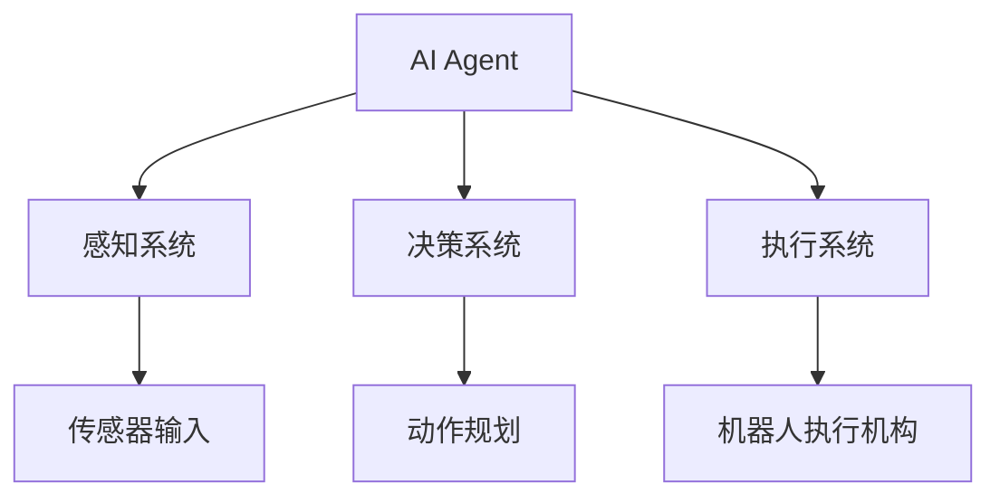
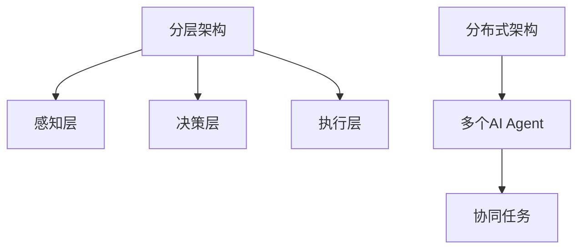
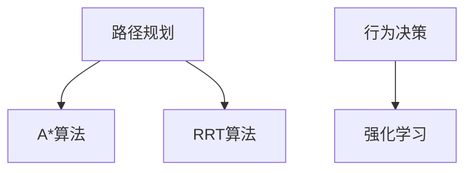
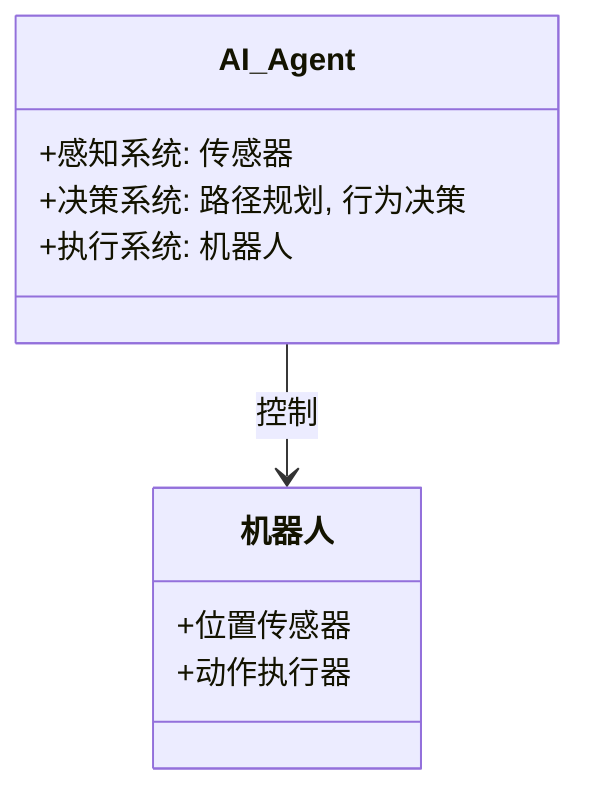
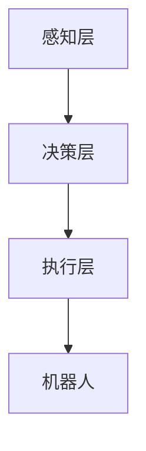

                 


# AI Agent在机器人控制中的应用：自主导航与任务执行

> 关键词：AI Agent, 机器人控制, 自主导航, 任务执行, 路径规划, 强化学习

> 摘要：本文深入探讨了AI Agent在机器人控制中的应用，重点分析了自主导航与任务执行的核心算法和系统架构。通过详细讲解路径规划算法、行为决策算法以及多目标优化算法，结合实际案例分析，展示了AI Agent在智能仓储中的应用。同时，本文还总结了最佳实践和未来发展方向，为读者提供了全面的技术视角。

---

## 第1章: AI Agent与机器人控制概述

### 1.1 AI Agent的基本概念

AI Agent（人工智能代理）是指在计算机系统中，能够感知环境、做出决策并采取行动以实现特定目标的实体。AI Agent的核心属性包括自主性、反应性、目标导向性和社交能力。与传统控制算法相比，AI Agent能够根据环境动态调整行为，具有更强的适应性和灵活性。

| **属性** | **传统控制算法** | **AI Agent** |
|----------|------------------|--------------|
| 自主性   | 无               | 高           |
| 反应性   | 低               | 高           |
| 目标导向性 | 无               | 高           |
| 社交能力 | 无               | 中           |



### 1.2 机器人控制中的问题背景

传统机器人控制方法依赖于预设的规则和路径，难以应对动态环境和复杂任务。引入AI Agent可以提高机器人的自主性和适应性，使其能够处理不确定性问题。当前，AI Agent在机器人控制中的应用主要集中在路径规划、行为决策和任务分配等领域，但仍面临算法复杂性和计算资源的挑战。

### 1.3 AI Agent在自主导航中的问题描述

自主导航的核心问题包括路径规划、障碍物避让和目标定位。任务执行中的挑战涉及多目标优化、任务分配和协作控制。AI Agent的边界在于其感知和决策能力的限制，外延则涉及与外部系统和人类的交互。

### 1.4 本章小结

本章介绍了AI Agent的基本概念和核心属性，分析了传统控制算法的局限性，并详细描述了AI Agent在自主导航中的问题和挑战。

---

## 第2章: AI Agent的核心概念与原理

### 2.1 AI Agent的体系结构

AI Agent的体系结构包括分层架构、分布式架构和基于强化学习的架构。分层架构将系统分为感知层、决策层和执行层，分布式架构通过多AI Agent协同完成任务，强化学习架构通过试错学习优化决策策略。



### 2.2 AI Agent的核心算法

路径规划算法如A*和RRT用于规划最优路径，行为决策算法如强化学习用于制定决策策略，多目标优化算法用于平衡多个目标。



### 2.3 AI Agent与机器人控制的实体关系图


### 2.4 本章小结

本章介绍了AI Agent的体系结构和核心算法，展示了其在机器人控制中的应用潜力。

---

## 第3章: AI Agent的算法原理与实现

### 3.1 路径规划算法

**A*算法**是一种常见的路径规划算法，基于启发式搜索找到最短路径。其数学模型如下：

$$\text{cost}(n) = g(n) + h(n)$$

其中，\( g(n) \)是当前节点到起点的路径成本，\( h(n) \)是当前节点到目标的估计成本。

```python
import heapq

def a_star(start, goal, grid):
    open_set = {start}
    came_from = {}
    g_score = {start: 0}
    f_score = {start: heuristic(start, goal)}
    
    while open_set:
        current = heapq.heappop(open_set)
        if current == goal:
            return reconstruct_path(came_from, current)
        for neighbor in neighbors(current, grid):
            tentative_g_score = g_score[current] + cost(current, neighbor)
            if neighbor not in g_score or tentative_g_score < g_score[neighbor]:
                came_from[neighbor] = current
                g_score[neighbor] = tentative_g_score
                f_score[neighbor] = g_score[neighbor] + heuristic(neighbor, goal)
                heapq.heappush(open_set, neighbor)
    return None
```

### 3.2 行为决策算法

**强化学习**通过试错学习优化决策策略。其数学模型如下：

$$ Q(s, a) = r + \gamma \max_{a'} Q(s', a') $$

其中，\( Q(s, a) \)是状态-动作值函数，\( r \)是奖励，\( \gamma \)是折扣因子。

```python
import numpy as np

class QLearning:
    def __init__(self, state_space, action_space, alpha=0.1, gamma=0.9):
        self.state_space = state_space
        self.action_space = action_space
        self.alpha = alpha
        self.gamma = gamma
        self.q_table = np.zeros((state_space, action_space))
    
    def choose_action(self, state, epsilon=0.1):
        if np.random.random() < epsilon:
            return np.random.randint(self.action_space)
        q_values = self.q_table[state, :]
        return np.argmax(q_values)
    
    def update_q_table(self, state, action, reward, next_state):
        self.q_table[state, action] = self.q_table[state, action] * (1 - self.alpha) + \
                                        reward + self.gamma * np.max(self.q_table[next_state, :])
```

### 3.3 多目标优化算法

**多目标优化**通过优化多个目标的组合，找到最优解。

$$ \min f_1(x) + f_2(x) + \dots + f_n(x) $$

### 3.4 本章小结

本章详细讲解了路径规划、行为决策和多目标优化算法的原理和实现，展示了其在机器人控制中的应用。

---

## 第4章: 系统架构设计与实现

### 4.1 问题场景介绍

以智能仓储中的导航与任务分配为例，设计一个AI Agent系统，实现货物的自动搬运和任务分配。

### 4.2 系统功能设计

使用Mermaid类图展示系统模块及其交互。



### 4.3 系统架构设计

采用分层架构，感知层负责数据采集，决策层负责路径规划和行为决策，执行层负责动作执行。



### 4.4 本章小结

本章设计了一个智能仓储系统，展示了AI Agent在实际应用中的系统架构。

---

## 第5章: 项目实战——智能仓储中的导航与任务分配

### 5.1 环境搭建

安装Python、ROS（机器人操作系统）和相关库，配置传感器和机器人硬件。

### 5.2 项目核心实现

实现A*算法的路径规划和强化学习的行为决策，完成货物的自动搬运和任务分配。

### 5.3 项目案例分析

分析一个具体案例，展示AI Agent在智能仓储中的应用效果。

### 5.4 项目小结

总结项目的实现过程和成果，强调AI Agent的应用价值。

---

## 第6章: 最佳实践与注意事项

### 6.1 算法选择与优化

根据具体场景选择合适的算法，并通过参数调整和优化提升性能。

### 6.2 传感器配置与数据处理

合理配置传感器，确保数据的准确性和实时性，优化数据处理流程。

### 6.3 系统安全性和可扩展性

设计安全机制，确保系统稳定运行，预留扩展接口，支持未来功能的扩展。

### 6.4 本章小结

本章总结了最佳实践和注意事项，为读者提供了实用的指导。

---

## 第7章: 总结与展望

### 7.1 本章总结

回顾全文，总结AI Agent在机器人控制中的应用及其重要性。

### 7.2 对未来的展望

探讨多模态感知和人机协作等发展方向，展望AI Agent在更多领域的应用前景。

### 7.3 本章小结

本章总结了全文内容，并展望了AI Agent技术的未来发展。

---

**作者：AI天才研究院/AI Genius Institute & 禅与计算机程序设计艺术 /Zen And The Art of Computer Programming**

---

以上是文章的完整结构和内容安排。接下来，我将根据这个框架逐步撰写每章的具体内容，确保每一部分都详细具体，同时保持逻辑清晰和语言专业。

