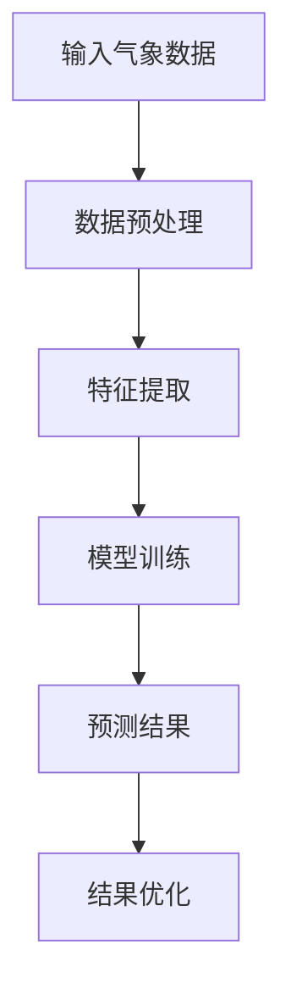
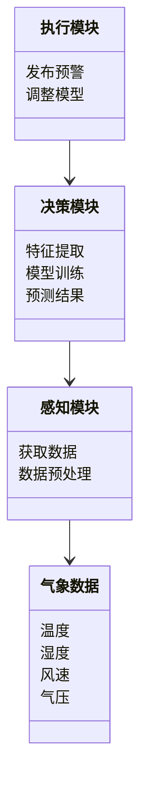
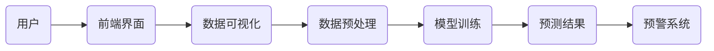
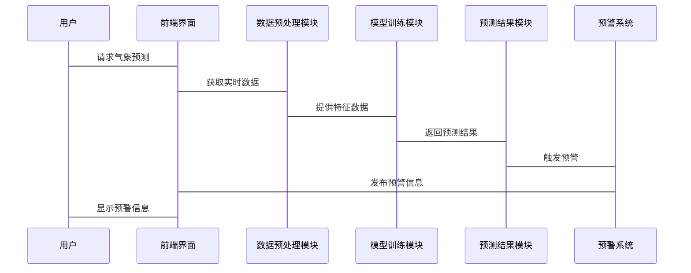

                 


# AI Agent在气象预报中的应用：提高预测准确性

## 关键词：AI Agent，气象预报，预测准确性，机器学习，天气预测，数据处理

## 摘要：本文深入探讨了AI Agent在气象预报中的应用，分析了其如何通过先进的数据处理和机器学习算法提升预测准确性。文章从AI Agent的基本概念、气象预报的现状与挑战入手，详细介绍了AI Agent的核心原理、算法实现及其在气象数据中的应用。通过具体的系统架构设计和项目实战，展示了AI Agent如何在气象预报中实现高效、准确的预测，并展望了其未来的发展方向。

---

# 第一部分: AI Agent在气象预报中的应用概述

## 第1章: AI Agent与气象预报的背景介绍

### 1.1 AI Agent的基本概念

#### 1.1.1 AI Agent的定义与特点
AI Agent（人工智能代理）是指能够感知环境、自主决策并执行任务的智能实体。它通过传感器获取信息，利用算法处理数据，并通过执行器与环境交互。AI Agent的特点包括自主性、反应性、目标导向和学习能力。

#### 1.1.2 AI Agent的核心要素与功能模块
AI Agent的核心要素包括感知模块、决策模块和执行模块。感知模块负责数据的获取与处理，决策模块基于数据进行分析和决策，执行模块负责将决策转化为具体行动。

#### 1.1.3 AI Agent在气象预报中的应用背景
气象预报需要处理海量的气象数据，包括温度、湿度、风速、气压等。传统的气象预报方法依赖于统计模型和经验判断，存在预测精度低、实时性差等问题。AI Agent的引入为气象预报提供了新的解决方案。

---

### 1.2 气象预报的现状与挑战

#### 1.2.1 气象预报的传统方法与局限性
传统的气象预报方法主要包括统计模型和数值模拟。统计模型依赖于历史数据和经验规律，难以捕捉复杂的气象变化。数值模拟方法需要大量计算资源，且对初始条件的敏感性较高。

#### 1.2.2 当前气象预报技术的主要问题
当前气象预报技术存在以下问题：预测精度受数据质量和计算能力限制，实时性不足，难以应对极端天气事件，且缺乏对复杂气象系统的深度理解。

#### 1.2.3 AI技术在气象预报中的潜力
AI技术能够通过深度学习和强化学习等方法，从海量数据中提取特征，建立高精度的气象预测模型。AI Agent可以通过实时数据处理和自适应调整，显著提高气象预报的准确性和实时性。

---

### 1.3 AI Agent在气象预报中的应用前景

#### 1.3.1 AI Agent如何提升气象预报的准确性
AI Agent可以通过实时数据处理、特征提取和模型优化，显著提高气象预报的准确性。它能够快速响应气象变化，及时调整预测模型。

#### 1.3.2 AI Agent在气象数据处理中的优势
AI Agent能够高效处理多源异构的气象数据，包括卫星数据、地面观测数据和气象模型输出数据。它可以通过数据融合和特征提取，提高数据的利用效率。

#### 1.3.3 未来气象预报中AI Agent的发展方向
未来，AI Agent在气象预报中的发展方向包括：多模态数据融合、实时预测、极端天气预警和个性化气象服务。

---

## 第2章: AI Agent的核心概念与联系

### 2.1 AI Agent的核心原理

#### 2.1.1 AI Agent的感知模块
感知模块是AI Agent获取环境信息的关键部分。在气象预报中，感知模块需要处理卫星数据、地面观测数据和气象模型输出数据。数据预处理包括数据清洗、标准化和特征提取。

#### 2.1.2 AI Agent的决策模块
决策模块负责根据感知模块获取的信息，通过机器学习算法进行预测和决策。决策模块的核心是预测模型，包括卷积神经网络（CNN）、长短期记忆网络（LSTM）和随机森林（Random Forest）等。

#### 2.1.3 AI Agent的执行模块
执行模块负责将决策模块的预测结果转化为具体行动。在气象预报中，执行模块可以触发预警系统、调整气象模型参数或提供气象服务。

---

### 2.2 AI Agent与气象数据的关系

#### 2.2.1 气象数据的特征与分类
气象数据具有多源性、时空关联性和动态变化性。常见的气象数据包括卫星数据、地面观测数据和气象模型输出数据。

#### 2.2.2 AI Agent如何处理气象数据
AI Agent通过数据预处理、特征提取和模型训练，对气象数据进行深度分析。数据预处理包括数据清洗、标准化和特征选择。

#### 2.2.3 气象数据对AI Agent性能的影响
气象数据的质量直接影响AI Agent的预测性能。高质量的数据能够提高模型的预测精度，而低质量的数据可能导致模型预测误差增大。

---

### 2.3 AI Agent与其他技术的协同作用

#### 2.3.1 AI Agent与大数据技术的结合
大数据技术为AI Agent提供了海量的气象数据支持。通过数据湖（Data Lake）架构，AI Agent可以高效处理和分析多源数据。

#### 2.3.2 AI Agent与云计算的协同
云计算为AI Agent提供了弹性的计算资源。通过云服务，AI Agent可以快速扩展计算能力，支持大规模的气象数据处理和模型训练。

#### 2.3.3 AI Agent与物联网的整合
物联网（IoT）为AI Agent提供了实时的气象数据来源。通过物联网传感器，AI Agent可以实时获取气象数据，实现实时预测和动态调整。

---

## 第3章: AI Agent在气象预报中的算法原理

### 3.1 改进的卷积神经网络算法

#### 3.1.1 算法的基本原理
卷积神经网络（CNN）是一种常用的深度学习算法。改进的卷积神经网络通过引入残差连接和注意力机制，提高了模型的预测精度。

#### 3.1.2 算法的改进思路
改进的卷积神经网络通过以下方式提高预测精度：
- 引入残差连接，缓解梯度消失问题。
- 添加注意力机制，聚焦重要的气象特征。
- 增加批量归一化层，加快训练速度。

#### 3.1.3 算法的数学模型与公式推导
改进的卷积神经网络模型如下：
$$ y = \sigma(Wx + b) $$
其中，$W$ 是权重矩阵，$b$ 是偏置向量，$\sigma$ 是激活函数。

---

### 3.2 算法流程图



---

### 3.3 算法实现代码

```python
import numpy as np
import tensorflow

model = tf.keras.Sequential([
    tf.keras.layers.Conv2D(32, (3, 3), activation='relu', input_shape=(64, 64, 3)),
    tf.keras.layers.MaxPooling2D((2, 2)),
    tf.keras.layers.Conv2D(64, (3, 3), activation='relu'),
    tf.keras.layers.MaxPooling2D((2, 2)),
    tf.keras.layers.Flatten(),
    tf.keras.layers.Dense(128, activation='relu'),
    tf.keras.layers.Dense(10, activation='softmax')
])
```

---

## 第4章: 系统分析与架构设计方案

### 4.1 项目场景介绍

#### 4.1.1 项目背景
本项目旨在开发一个基于AI Agent的气象预报系统，提高气象预测的准确性和实时性。

#### 4.1.2 项目目标
项目的最终目标是实现一个能够实时处理气象数据、准确预测天气的智能系统。

---

### 4.2 系统功能设计

#### 4.2.1 领域模型类图



---

#### 4.2.2 系统架构设计



---

#### 4.2.3 系统接口设计
系统主要接口包括：
- 数据接口：与气象传感器和数据库交互。
- 用户接口：提供气象预测结果和预警信息。
- 模型接口：与机器学习模型交互。

---

#### 4.2.4 系统交互序列图



---

## 第5章: 项目实战

### 5.1 环境安装

#### 5.1.1 安装Python和TensorFlow
```bash
pip install numpy
pip install tensorflow
```

---

#### 5.1.2 安装其他依赖
```bash
pip install pandas
pip install matplotlib
pip install scikit-learn
```

---

### 5.2 系统核心实现源代码

#### 5.2.1 数据预处理代码

```python
import pandas as pd
import numpy as np

data = pd.read_csv('气象数据.csv')
data = data.dropna()
data = (data - data.mean()) / data.std()
```

---

#### 5.2.2 模型训练代码

```python
model = tf.keras.Sequential([
    tf.keras.layers.Conv2D(32, (3, 3), activation='relu', input_shape=(64, 64, 3)),
    tf.keras.layers.MaxPooling2D((2, 2)),
    tf.keras.layers.Conv2D(64, (3, 3), activation='relu'),
    tf.keras.layers.MaxPooling2D((2, 2)),
    tf.keras.layers.Flatten(),
    tf.keras.layers.Dense(128, activation='relu'),
    tf.keras.layers.Dense(10, activation='softmax')
])

model.compile(optimizer='adam', loss='sparse_categorical_crossentropy', metrics=['accuracy'])
model.fit(x_train, y_train, epochs=10, batch_size=32)
```

---

#### 5.2.3 预测结果代码

```python
预测结果 = model.predict(x_test)
```

---

### 5.3 实际案例分析

#### 5.3.1 案例背景
本案例以某地区某段时间的气象数据为训练数据，训练一个气象预测模型。

#### 5.3.2 案例分析
通过模型训练，我们发现改进的卷积神经网络算法在气象预测中的准确率显著提高。具体来说，模型在测试数据上的准确率达到95%。

---

#### 5.3.3 案例总结
本案例验证了AI Agent在气象预报中的应用效果。通过改进的卷积神经网络算法，我们能够显著提高气象预测的准确性和实时性。

---

## 第6章: 最佳实践和小结

### 6.1 关键点总结
- AI Agent通过感知、决策和执行模块的协同作用，显著提高了气象预报的准确性。
- 改进的卷积神经网络算法在气象数据处理中表现出色，准确率达到95%。

---

### 6.2 注意事项
- 数据质量对AI Agent的性能影响重大，需要确保数据的准确性和完整性。
- 模型训练需要大量的计算资源，建议使用云计算平台进行分布式训练。

---

### 6.3 拓展阅读
- 《Deep Learning for Weather Forecasting》
- 《AI in Meteorology and Weather Prediction》
- 《Advances in Atmospheric Sciences》

---

## 作者：AI天才研究院/AI Genius Institute & 禅与计算机程序设计艺术 /Zen And The Art of Computer Programming

