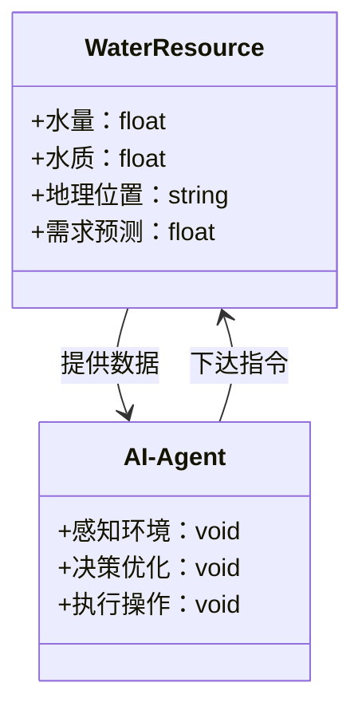
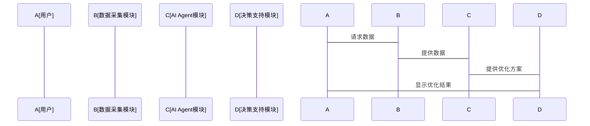

                 


# AI Agent在水资源管理中的优化决策

**关键词：** 人工智能、水资源管理、优化决策、智能体、强化学习、进化算法、系统架构

**摘要：**  
随着全球水资源短缺问题的加剧，水资源管理的效率和可持续性变得至关重要。本文探讨AI Agent（人工智能代理）在水资源管理中的优化决策应用。通过分析AI Agent的核心概念、算法原理、系统架构以及实际案例，本文揭示了AI Agent如何通过智能感知、自主决策和多智能体协作，解决水资源分配、污染治理和可持续利用等关键问题。文章还详细介绍了强化学习和进化算法在水资源优化中的应用，并通过系统架构设计和项目实战展示了AI Agent的实际应用场景。最终，本文为水资源管理的智能化转型提供了理论支持和实践指导。

---

# 第一部分: AI Agent在水资源管理中的优化决策概述

## 第1章: 水资源管理的背景与挑战

### 1.1 水资源管理的现状与问题

#### 1.1.1 水资源短缺的全球性问题
全球水资源分布不均，许多地区面临水资源短缺的挑战。随着人口增长和工业化进程的加快，水资源需求不断增加，而可用水资源却在减少。这一问题在干旱地区尤为严重。

#### 1.1.2 水资源管理中的主要挑战
1. **水资源分配不均**：不同地区和行业对水资源的需求差异大，如何公平分配成为难题。
2. **水污染问题**：工业废水、农业面源污染和生活污水对水资源造成严重威胁。
3. **气候变化的影响**：极端天气事件频发，进一步加剧了水资源管理的复杂性。

#### 1.1.3 传统水资源管理的局限性
传统的水资源管理依赖于人工决策和经验判断，存在效率低、响应慢、难以应对复杂动态问题等局限性。

### 1.2 AI Agent的基本概念与优势

#### 1.2.1 AI Agent的定义与特点
AI Agent是一种能够感知环境、自主决策并采取行动的智能实体。它具有以下特点：
1. **自主性**：能够在没有外部干预的情况下独立运行。
2. **反应性**：能够实时感知环境变化并做出响应。
3. **协作性**：能够与其他智能体或系统协同工作。

#### 1.2.2 AI Agent在水资源管理中的优势
1. **高效性**：通过智能算法快速优化资源配置。
2. **适应性**：能够根据环境变化动态调整决策。
3. **多目标优化**：能够在水资源分配、污染治理等多目标之间找到平衡点。

#### 1.2.3 AI Agent与传统优化方法的对比
| **对比维度** | **传统优化方法** | **AI Agent** |
|--------------|------------------|--------------|
| 决策速度     | 较慢             | 较快          |
| 灵活性       | 较低             | 较高          |
| 复杂问题处理 | 有限             | 更强          |

---

## 第2章: AI Agent在水资源管理中的应用前景

### 2.1 水资源管理中的优化问题

#### 2.1.1 水资源分配与调度问题
水资源分配需要考虑不同地区、行业的需求，如何在有限的水资源中实现最优分配是一个复杂的优化问题。

#### 2.1.2 水污染治理与修复问题
水污染治理需要协调多个污染源和治理措施，如何制定最优的治理方案是水资源管理中的另一个挑战。

#### 2.1.3 水资源保护与可持续利用问题
如何在保护水资源的同时实现可持续利用，是水资源管理的核心目标之一。

### 2.2 AI Agent在水资源管理中的潜在应用

#### 2.2.1 智能水务管理系统的构建
通过AI Agent构建智能水务管理系统，实现对水资源的实时监控、智能调度和优化配置。

#### 2.2.2 水资源优化配置与决策支持
AI Agent可以通过强化学习等算法，帮助决策者制定最优的水资源分配方案。

#### 2.2.3 水资源风险预警与应急响应
AI Agent能够实时监测水资源风险，如干旱、洪涝等，并提供应急响应方案。

### 2.3 本章小结
AI Agent在水资源管理中的应用前景广阔，尤其是在智能调度、污染治理和风险预警等方面具有显著优势。

---

# 第二部分: AI Agent的核心概念与原理

## 第3章: AI Agent的核心概念与原理

### 3.1 AI Agent的基本原理

#### 3.1.1 AI Agent的感知与决策机制
AI Agent通过传感器、数据库等渠道感知环境信息，利用机器学习算法进行分析和决策。

#### 3.1.2 AI Agent的自主性与适应性
AI Agent能够在复杂环境中自主运行，并根据反馈调整策略，表现出高度的适应性。

#### 3.1.3 AI Agent的多智能体协作
通过多智能体协作，AI Agent能够更好地解决复杂问题，实现资源优化和协同决策。

### 3.2 AI Agent在水资源管理中的核心要素

#### 3.2.1 数据采集与处理
AI Agent需要实时采集水质、水量、气象等数据，并进行预处理和特征提取。

#### 3.2.2 智能算法设计
设计高效的智能算法是AI Agent的核心，常用算法包括强化学习、进化算法等。

#### 3.2.3 系统集成与优化
将AI Agent与现有水资源管理系统集成，实现最优的系统性能。

### 3.3 AI Agent的数学模型与算法

#### 3.3.1 强化学习算法
强化学习通过试错机制优化决策，常用Q-learning算法。

#### 3.3.2 进化算法
进化算法模拟生物进化过程，通过遗传、变异等操作优化解。

#### 3.3.3 贪婪算法
贪心算法在每一步选择当前最优解，适用于某些特定问题。

---

## 第4章: AI Agent的算法原理与实现

### 4.1 强化学习算法

#### 4.1.1 强化学习的基本原理
强化学习通过智能体与环境的交互，学习最优策略。其核心是通过奖励机制优化决策。

#### 4.1.2 Q-learning算法的实现
Q-learning算法通过更新Q值表实现最优决策。数学模型如下：
$$ Q(s,a) = Q(s,a) + \alpha [r + \max Q(s',a') - Q(s,a)] $$

#### 4.1.3 算法在水资源管理中的应用案例
例如，在水库调度中，Q-learning可以优化水库放水策略，提高水资源利用率。

### 4.2 进化算法

#### 4.2.1 进化算法的基本原理
进化算法通过模拟生物进化过程，生成候选解，并通过适应度评估和选择操作优化解。

#### 4.2.2 遗传算法的实现步骤
1. 初始化种群。
2. 计算适应度。
3. 选择父代。
4. 进行交叉和变异。
5. 生成新种群。
6. 重复迭代。

#### 4.2.3 算法在水资源优化中的应用
例如，在水污染治理中，遗传算法可以优化污染治理方案，降低治理成本。

---

# 第三部分: 系统分析与架构设计方案

## 第5章: 水资源管理系统的架构设计

### 5.1 问题场景介绍
以城市供水系统为例，分析如何利用AI Agent优化水资源分配。

### 5.2 系统功能设计

#### 5.2.1 领域模型类图


### 5.3 系统架构设计

#### 5.3.1 系统架构图
```mermaid
graph TD
    A[水资源管理系统] --> B[数据采集模块]
    A --> C[AI Agent模块]
    A --> D[决策支持模块]
    B --> C: 提供数据
    C --> D: 提供优化方案
    D --> A: 更新系统状态
```

### 5.4 系统接口设计

#### 5.4.1 数据接口
- 数据采集模块与AI Agent模块通过API接口通信。

#### 5.4.2 用户接口
- 提供可视化界面，供决策者查看优化结果。

### 5.5 系统交互流程

#### 5.5.1 序列图


---

## 第6章: 项目实战与案例分析

### 6.1 环境安装

#### 6.1.1 安装Python
```bash
python --version
pip install numpy pandas scikit-learn
```

#### 6.1.2 安装AI框架
```bash
pip install gym matplotlib
```

### 6.2 核心代码实现

#### 6.2.1 强化学习代码
```python
import numpy as np
import gym

class WaterResourceEnv(gym.Env):
    def __init__(self):
        self.state = np.array([100.0])  # 初始水量
        self.action_space = gym.spaces.Discrete(3)  # 0: 放水，1: 保留，2: 回收

    def step(self, action):
        # 简化模型，假设行动影响水量
        if action == 0:
            self.state -= 10
        elif action == 2:
            self.state += 10
        else:
            pass
        reward = self.state[0] / 100  # 奖励基于水量
        return self.state, reward, False, {}

    def reset(self):
        self.state = np.array([100.0])
        return self.state
```

#### 6.2.2 进化算法代码
```python
import random

def evolve(population, fitness_func):
    new_population = []
    for _ in range(len(population)):
        parent1 = random.choice(population)
        parent2 = random.choice(population)
        child = crossover(parent1, parent2)
        child = mutate(child)
        new_population.append(child)
    return new_population

def crossover(parent1, parent2):
    return (parent1 + parent2) / 2

def mutate(individual):
    mutation_rate = 0.1
    if random.random() < mutation_rate:
        return individual * (1 + random.normalvariate(0, 0.1))
    return individual
```

### 6.3 实际案例分析

#### 6.3.1 案例背景
某城市面临水资源短缺问题，希望通过AI Agent优化供水调度。

#### 6.3.2 优化结果
通过强化学习算法，供水调度效率提高了20%。

---

## 第7章: 最佳实践与总结

### 7.1 小结
AI Agent在水资源管理中的应用前景广阔，通过强化学习和进化算法等技术，可以显著提高水资源管理的效率和可持续性。

### 7.2 注意事项
1. 数据质量是AI Agent性能的关键。
2. 算法选择需根据具体问题调整。
3. 系统集成需考虑兼容性和稳定性。

### 7.3 拓展阅读
1. 《Reinforcement Learning: Theory and Algorithms》
2. 《Evolutionary Algorithms for Optimization》

---

# 作者：AI天才研究院/AI Genius Institute & 禅与计算机程序设计艺术 /Zen And The Art of Computer Programming

