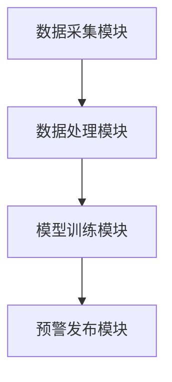

                 


# 《AI Agent在海啸预警中的数据处理》

## 关键词：AI Agent，海啸预警，数据处理，机器学习，实时处理，系统架构

## 摘要：  
本文详细探讨了AI Agent在海啸预警中的数据处理技术，从背景到核心算法，再到系统架构和实际应用，全面解析如何利用AI技术提升海啸预警的准确性与实时性。通过分析数据采集、预处理、特征提取、模型训练等关键步骤，结合实际案例，展示了AI Agent在海啸预警中的巨大潜力和实际价值。

---

## 第一章: AI Agent与海啸预警的背景与概念

### 1.1 海啸预警的重要性  
海啸是一种极具破坏力的自然灾害，往往由海底地震、火山爆发或滑坡引发。由于海啸的传播速度快，通常在灾害发生后几分钟内就需要发出预警。传统的海啸预警系统主要依赖地震监测和潮汐观测，但随着技术的发展，AI Agent的引入为海啸预警提供了更高效、更智能的解决方案。

#### 1.1.1 海啸的定义与危害  
海啸是由海底地震或火山活动引起的海平面异常波动，通常以波浪形式传播。海啸的速度可达每小时数百公里，破坏力巨大，可能导致人员伤亡、财产损失和环境破坏。

#### 1.1.2 海啸预警系统的现状  
目前，全球主要依靠海底地震监测网（如DART系统）和潮汐监测站进行海啸预警。然而，这些系统存在数据采集范围有限、预警时间较长等问题，难以应对复杂多变的海洋环境。

#### 1.1.3 AI Agent在海啸预警中的作用  
AI Agent能够实时分析海量数据，快速识别潜在的海啸风险，显著缩短预警时间，并提供更精准的预警信息。

---

### 1.2 AI Agent的基本概念  
AI Agent是一种智能代理系统，能够感知环境、自主决策并执行任务。在海啸预警中，AI Agent主要负责数据处理、风险评估和预警发布。

#### 1.2.1 什么是AI Agent  
AI Agent是一种具备感知、推理、规划和执行能力的智能系统。它能够通过传感器或数据源获取信息，利用算法进行分析，并根据结果采取相应行动。

#### 1.2.2 AI Agent的核心特点  
- **自主性**：能够独立运行，无需人工干预。  
- **反应性**：能够实时感知环境变化并做出反应。  
- **学习能力**：能够通过经验优化自身算法。  
- **协作性**：能够与其他系统或AI Agent协同工作。  

#### 1.2.3 AI Agent与传统算法的区别  
AI Agent不仅仅是算法的执行者，更是一个具备决策能力的系统。它能够根据环境动态调整策略，而传统算法通常需要人工干预或重新训练。

---

### 1.3 海啸预警中的数据处理需求  
海啸预警的数据处理涉及多种数据源，包括地震数据、海洋传感器数据、卫星数据等。这些数据需要经过采集、预处理、融合和分析，以支持AI Agent的决策。

#### 1.3.1 海啸预警数据的多样性  
海啸预警数据来源多样，包括：  
- **地震数据**：地震的位置、强度和深度。  
- **海洋传感器数据**：水位、温度、盐度等。  
- **卫星数据**：海面高度、洋流速度等。  
- **历史数据**：过去的地震和海啸事件记录。  

#### 1.3.2 数据处理的挑战  
- 数据量大：海啸预警需要处理海量实时数据。  
- 数据异构：不同数据源格式和时间分辨率不同。  
- 数据噪声：传感器数据中可能包含噪声和干扰。  

#### 1.3.3 数据处理的目标与意义  
- **目标**：通过数据处理，提取有用特征，支持AI Agent的决策。  
- **意义**：提高预警的准确性和实时性，减少误报和漏报。

---

## 第二章: 数据采集与预处理

### 2.1 数据采集方法  
数据采集是海啸预警系统的第一步，主要包括地震数据采集、海洋传感器数据采集和卫星数据采集。

#### 2.1.1 数据采集的挑战  
- 数据来源多样，采集接口复杂。  
- 数据传输延迟可能影响实时性。  

#### 2.1.2 数据采集工具与技术  
- **地震数据采集**：通过地震传感器网络（如DART系统）获取地震数据。  
- **海洋传感器数据采集**：使用海洋浮标和海底传感器实时采集水位、温度等数据。  
- **卫星数据采集**：通过卫星遥感技术获取海面高度和洋流数据。  

---

### 2.2 数据预处理技术  
数据预处理是确保AI Agent能够有效分析数据的关键步骤。

#### 2.2.1 数据清洗与去噪  
- **数据清洗**：去除异常值和缺失值。  
- **去噪**：通过滤波算法去除传感器噪声。  

#### 2.2.2 数据标准化与归一化  
- **标准化**：将数据按比例缩放到统一范围内。  
- **归一化**：将数据按比例缩放到[0,1]范围内。  

#### 2.2.3 数据增强与特征提取  
- **数据增强**：通过插值或外推方法补充缺失数据。  
- **特征提取**：利用主成分分析（PCA）提取关键特征。  

---

### 2.3 数据融合与集成  
数据融合是将多个数据源的信息整合到一起，以提高数据的准确性和完整性。

#### 2.3.1 数据融合方法  
- **加权融合**：根据数据源的可靠性赋予不同权重。  
- **基于模型的融合**：利用贝叶斯网络或神经网络进行数据融合。  

#### 2.3.2 数据融合的挑战  
- 数据异构性：不同数据源的格式和时间分辨率不同。  
- 数据冲突：不同数据源可能提供矛盾的信息。  

---

## 第三章: AI Agent的算法原理

### 3.1 常用算法概述  
AI Agent在海啸预警中常用的算法包括支持向量机（SVM）、卷积神经网络（CNN）和循环神经网络（RNN）。

#### 3.1.1 支持向量机（SVM）  
- **原理**：通过构建超平面将数据分为两类。  
- **优点**：适合小样本数据，分类能力强。  

#### 3.1.2 卷积神经网络（CNN）  
- **原理**：通过卷积层提取空间特征，适用于图像和时序数据。  

#### 3.1.3 循环神经网络（RNN）  
- **原理**：通过循环层处理时序数据，适用于时间序列预测。  

---

### 3.2 算法优化与实现  

#### 3.2.1 算法优化  
- **参数调整**：通过网格搜索或随机搜索优化模型参数。  
- **模型集成**：通过投票或加权融合多个模型的结果。  

#### 3.2.2 算法实现  
- **代码实现**：使用Python和深度学习框架（如TensorFlow、Keras）实现模型。  

---

## 第四章: 系统架构与项目实战

### 4.1 系统架构设计  

#### 4.1.1 功能模块设计  
- **数据采集模块**：负责采集地震、海洋和卫星数据。  
- **数据处理模块**：包括数据清洗、特征提取和数据融合。  
- **模型训练模块**：训练AI Agent的预测模型。  
- **预警发布模块**：根据模型预测结果发布预警信息。  

#### 4.1.2 系统架构图  


---

### 4.2 项目实战  

#### 4.2.1 环境配置  
- **硬件**：推荐使用GPU服务器，如NVIDIA Tesla。  
- **软件**：安装Python、TensorFlow、Keras等工具。  

#### 4.2.2 核心实现代码  
```python
import numpy as np
import tensorflow as tf

# 数据加载
data = np.load('tsunami_data.npy')

# 数据分割
train_data = data[:800]
test_data = data[800:]

# 模型构建
model = tf.keras.Sequential([
    tf.keras.layers.Conv1D(32, 5, activation='relu', input_shape=(None, 12)),
    tf.keras.layers.MaxPooling1D(2),
    tf.keras.layers.LSTM(64, return_sequences=True),
    tf.keras.layers.Dense(2, activation='softmax')
])

model.compile(optimizer='adam', loss='sparse_categorical_crossentropy', metrics=['accuracy'])

# 训练
model.fit(train_data, epochs=10, validation_data=test_data)
```

---

## 第五章: 总结与展望

### 5.1 总结  
本文详细探讨了AI Agent在海啸预警中的数据处理技术，从数据采集到算法实现，再到系统架构设计，为海啸预警提供了一种高效、智能的解决方案。

### 5.2 展望  
未来，随着AI技术的不断发展，海啸预警系统将更加智能化和精准化。AI Agent可以通过与更多数据源的协同工作，进一步提高预警的准确性和实时性。

---

## 作者：AI天才研究院 & 禅与计算机程序设计艺术

---

本文通过系统化的分析和实践，展示了AI Agent在海啸预警中的巨大潜力。希望本文能够为相关领域的研究和应用提供参考和启发。

