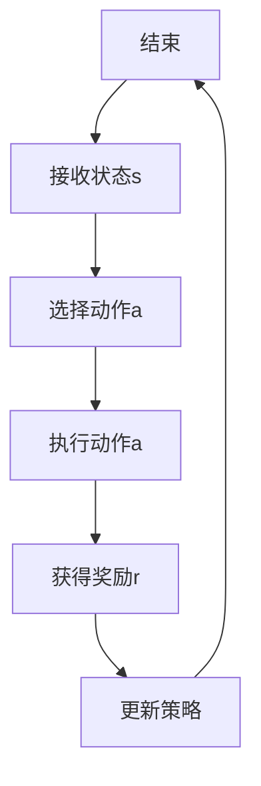
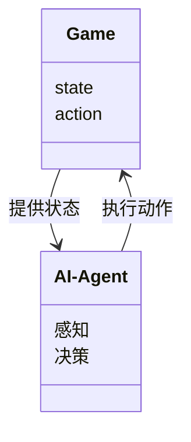
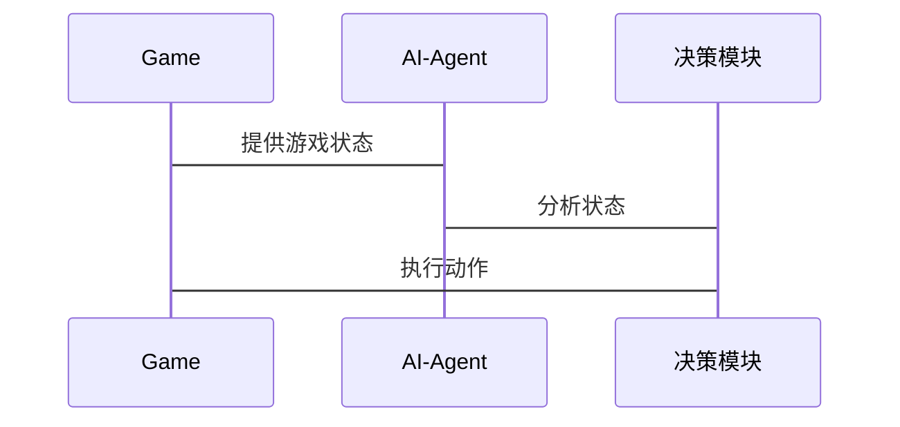

                 


# AI Agent在游戏开发中的创新应用

> 关键词：AI Agent、游戏开发、创新应用、算法原理、系统架构

> 摘要：本文探讨了AI Agent在游戏开发中的创新应用，涵盖其核心概念、算法原理、系统架构以及实战案例，详细分析了AI Agent如何提升游戏体验和开发效率。

---

## 第一部分：AI Agent的背景与概念

### 第1章：AI Agent的基本概念

#### 1.1 AI Agent的定义与特点
AI Agent（人工智能代理）是指能够感知环境、自主决策并执行任务的智能实体。与传统AI不同，AI Agent具备主动性，能够在动态环境中独立完成目标。其特点包括自主性、反应性、目标导向和社会性。

#### 1.2 游戏开发中的AI Agent应用背景
在游戏开发中，AI Agent的应用主要集中在NPC行为控制、动态难度调整和智能关卡设计等方面。传统基于规则的AI在复杂场景下表现受限，而AI Agent通过学习和适应，能够显著提升游戏体验和开发效率。

---

### 第2章：AI Agent的核心原理

#### 2.1 AI Agent的感知与决策模块
AI Agent通过感知模块获取环境信息，如玩家行为和游戏状态，利用决策模块进行分析并制定策略。感知和决策模块的结合使得AI Agent能够做出更智能的反应。

#### 2.2 AI Agent的属性对比表格
| 属性     | 描述                                                                 |
|----------|----------------------------------------------------------------------|
| 自主性    | 能够独立决策和行动                                                 |
| 反应性    | 对环境变化做出实时反应                                             |
| 目标导向  | 以实现特定目标为导向                                             |
| 学习能力  | 能够通过经验优化性能                                             |

#### 2.3 ER实体关系图
```mermaid
er
actor AI-Agent {
    role 实体
}
```

---

## 第二部分：AI Agent的核心概念与联系

### 第2章：AI Agent的核心原理

#### 2.1 AI Agent的感知与决策模块
AI Agent通过感知模块获取环境信息，如玩家行为和游戏状态，利用决策模块进行分析并制定策略。感知和决策模块的结合使得AI Agent能够做出更智能的反应。

---

## 第三部分：AI Agent的算法原理

### 第3章：AI Agent的算法实现

#### 3.1 强化学习算法


#### 3.2 强化学习代码示例
```python
import numpy as np

class AIAgent:
    def __init__(self, state_space_size, action_space_size):
        self.q_table = np.zeros((state_space_size, action_space_size))
    
    def choose_action(self, state, epsilon=0.1):
        if np.random.random() < epsilon:
            return np.random.randint(0, action_space_size)
        return np.argmax(self.q_table[state])
    
    def learn(self, state, action, reward, next_state):
        self.q_table[state, action] += 0.1 * (reward + 0.95 * np.max(self.q_table[next_state]) - self.q_table[state, action])
```

#### 3.3 数学公式
$$Q(s,a) = Q(s,a) + \alpha (r + \gamma \max Q(s',a') - Q(s,a))$$

---

## 第四部分：系统分析与架构设计

### 第4章：AI Agent的系统架构

#### 4.1 系统功能设计


#### 4.2 系统架构设计


---

## 第五部分：项目实战

### 第5章：AI Agent的项目实战

#### 5.1 环境安装
- 安装Python和必要的库：`pip install numpy`

#### 5.2 核心代码实现
```python
class Game:
    def __init__(self):
        self.state = 0
        self.actions = ['left', 'right']
    
    def get_state(self):
        return self.state
    
    def execute_action(self, action):
        if action == 'right':
            self.state += 1
        else:
            self.state -= 1
```

#### 5.3 案例分析
通过在游戏环境中测试AI Agent的行为，验证其学习能力和适应性，优化算法参数以提升性能。

---

## 第六部分：最佳实践

### 第6章：总结与注意事项

#### 6.1 总结
AI Agent通过感知、决策和学习，显著提升了游戏开发的智能化水平，为玩家带来更丰富的体验。

#### 6.2 注意事项
- 确保算法的高效性，避免性能瓶颈。
- 处理动态环境中的不确定性，优化学习策略。

---

作者：AI天才研究院/AI Genius Institute & 禅与计算机程序设计艺术 /Zen And The Art of Computer Programming

