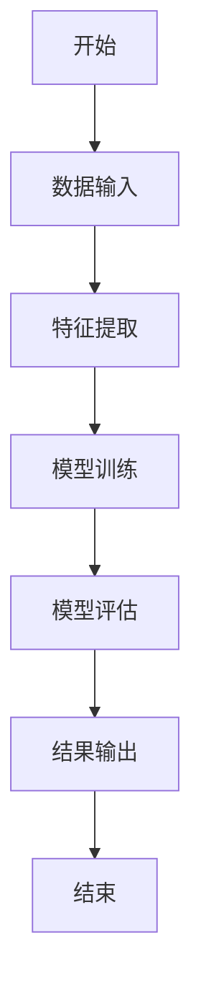
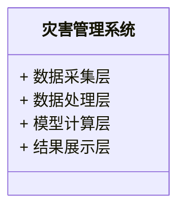
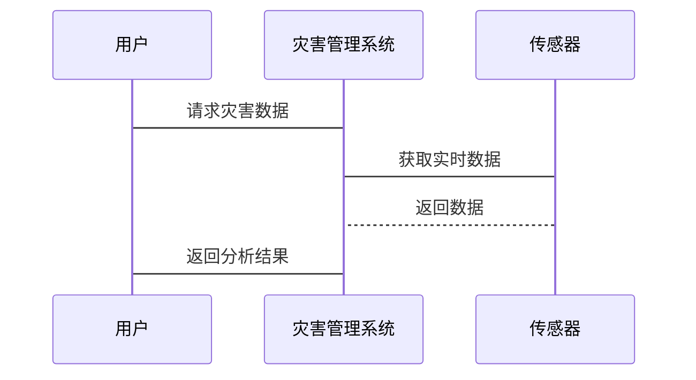

                 


# AI Agent在灾害预防与应急响应中的作用

## 关键词
AI Agent, 灾害预防, 应急响应, 人工智能, 灾害管理, 系统架构

## 摘要
AI Agent在灾害预防与应急响应中的应用正在成为提高灾害应对能力的关键技术。通过智能化的数据分析、实时监测和决策支持，AI Agent能够显著提升灾害预防和应急响应的效率与准确性。本文将深入探讨AI Agent的核心概念、算法原理、系统架构及其在灾害管理中的具体应用，为读者提供全面的技术解析。

---

## 第一部分: AI Agent与灾害管理概述

### 第1章: AI Agent与灾害管理概述

#### 1.1 AI Agent的基本概念
##### 1.1.1 AI Agent的定义
AI Agent（人工智能代理）是指能够感知环境、自主决策并采取行动以实现特定目标的智能系统。它能够通过传感器获取数据，利用算法进行分析，并根据结果执行相应的操作。

##### 1.1.2 AI Agent的核心特征
- **自主性**：能够在没有外部干预的情况下独立运行。
- **反应性**：能够实时感知环境变化并做出反应。
- **学习能力**：通过数据和经验不断优化自身算法。
- **协作性**：能够与其他系统或AI Agent协同工作。

##### 1.1.3 AI Agent在灾害管理中的作用
AI Agent在灾害管理中的作用主要体现在以下几个方面：
1. **数据收集与分析**：通过传感器和其他数据源实时收集灾害相关数据，并进行分析和预测。
2. **风险评估**：基于历史数据和实时信息，评估灾害发生的概率和影响范围。
3. **决策支持**：为应急响应提供实时的决策支持，优化资源配置和行动方案。

#### 1.2 灾害预防与应急响应的背景
##### 1.2.1 灾害的分类与特征
灾害可以分为自然灾害（如地震、洪水、台风）和人为灾害（如火灾、爆炸、化学泄漏）。灾害的特征包括突发性、破坏性和不确定性。

##### 1.2.2 灾害预防的重要性
灾害预防是指通过各种手段减少灾害发生的可能性或降低其影响。有效的灾害预防可以最大限度地减少人员伤亡和财产损失。

##### 1.2.3 应急响应的关键环节
应急响应包括灾害发生后的预警、救援协调、物资分配和灾后重建等环节。快速、准确的响应能够显著提高灾害应对效率。

#### 1.3 AI Agent在灾害管理中的应用前景
##### 1.3.1 AI Agent的优势
- **高效性**：AI Agent能够快速处理大量数据，提供实时决策支持。
- **准确性**：通过机器学习算法，AI Agent能够提高预测和分析的准确性。
- **可扩展性**：AI Agent可以通过模块化设计扩展到不同规模的灾害管理场景。

##### 1.3.2 应用领域的扩展
AI Agent不仅可以应用于自然灾害的预防和应急响应，还可以扩展到人为灾害、公共卫生事件等领域。

##### 1.3.3 挑战与未来方向
- **数据隐私问题**：灾害管理中涉及大量敏感数据，如何保护数据隐私是一个重要挑战。
- **算法优化**：需要进一步提高AI Agent的算法效率和准确性。
- **多领域协同**：未来需要加强AI Agent在不同领域的协同应用，形成综合性的解决方案。

---

## 第二部分: AI Agent的核心概念与联系

### 第2章: AI Agent的核心概念与联系

#### 2.1 AI Agent的类型与特点
##### 2.1.1 基于规则的AI Agent
基于规则的AI Agent通过预定义的规则进行决策。例如，在火灾预警系统中，当温度和烟雾传感器同时触发时，AI Agent会自动触发警报。

##### 2.1.2 基于学习的AI Agent
基于学习的AI Agent通过机器学习算法（如神经网络、支持向量机）从数据中学习规律，并进行预测和决策。例如，在地震预警系统中，AI Agent可以通过历史地震数据和实时数据进行预测。

##### 2.1.3 基于知识的AI Agent
基于知识的AI Agent通过知识库进行推理和决策。例如，在应急响应中，AI Agent可以根据专家知识库中的信息推荐最优的救援方案。

#### 2.2 AI Agent在灾害管理中的角色
##### 2.2.1 数据收集与分析
AI Agent通过传感器、卫星和其他数据源收集灾害相关数据，并利用机器学习算法进行分析和预测。

##### 2.2.2 风险评估与预测
AI Agent可以根据历史数据和实时信息，评估灾害发生的概率和影响范围，并提供预警。

##### 2.2.3 决策支持与执行
AI Agent可以为应急响应提供实时的决策支持，优化资源配置和行动方案，并通过自动化系统执行部分操作。

#### 2.3 AI Agent与其他技术的关系
##### 2.3.1 与大数据技术的结合
AI Agent需要处理大量的灾害相关数据，因此需要与大数据技术结合，提高数据处理和分析的效率。

##### 2.3.2 与物联网技术的融合
通过物联网技术，AI Agent可以实时获取传感器和其他设备的数据，实现更精准的监测和预测。

##### 2.3.3 与云计算的协同
云计算为AI Agent提供了强大的计算能力和存储空间，支持大规模数据的处理和分析。

---

## 第三部分: AI Agent在灾害预防中的应用

### 第3章: AI Agent在灾害预防中的应用

#### 3.1 灾害风险评估
##### 3.1.1 数据的收集与处理
AI Agent可以通过传感器、卫星和其他数据源收集地震、洪水、台风等灾害的相关数据，并进行清洗和预处理。

##### 3.1.2 风险评估模型的构建
通过机器学习算法（如随机森林、支持向量机），AI Agent可以构建风险评估模型，预测灾害发生的概率和影响范围。

##### 3.1.3 案例分析
以地震风险评估为例，AI Agent可以通过历史地震数据和地质数据，预测未来地震的可能性，并为建筑物设计提供参考。

#### 3.2 灾害监测与预警
##### 3.2.1 多源数据的融合
AI Agent可以整合来自多种数据源（如气象数据、地震数据、卫星图像）的信息，进行综合分析。

##### 3.2.2 预警系统的构建
通过机器学习算法，AI Agent可以构建预警系统，实时监测灾害前兆，并在灾害发生前发出预警。

##### 3.2.3 实时监控与反馈
AI Agent可以通过实时数据流进行监控，并根据反馈不断优化预警模型，提高预测的准确性。

---

## 第四部分: AI Agent在应急响应中的应用

### 第4章: AI Agent在应急响应中的应用

#### 4.1 应急决策支持
##### 4.1.1 数据的实时分析
在灾害发生后，AI Agent可以实时分析救援资源、受灾区域和灾情信息，为应急决策提供支持。

##### 4.1.2 决策模型的构建
通过强化学习算法，AI Agent可以构建决策模型，模拟不同决策方案的效果，并推荐最优方案。

##### 4.1.3 案例分析
以地震救援为例，AI Agent可以根据受灾区域的建筑结构、救援资源分布和灾情信息，推荐最优的救援方案。

#### 4.2 应急物资分配
##### 4.2.1 物资需求预测
AI Agent可以根据受灾区域的人口密度、交通状况和物资储备情况，预测物资需求，并制定分配计划。

##### 4.2.2 分配优化
通过优化算法（如遗传算法、模拟退火算法），AI Agent可以优化物资分配路径，提高分配效率。

##### 4.2.3 实时调整
根据实时反馈，AI Agent可以动态调整物资分配计划，确保资源的高效利用。

---

## 第五部分: AI Agent的算法原理与实现

### 第5章: AI Agent的算法原理

#### 5.1 机器学习算法
##### 5.1.1 监督学习
在监督学习中，AI Agent通过训练数据学习输入与输出之间的关系，并对新的输入进行预测。例如，在灾害风险评估中，监督学习算法可以预测灾害发生的概率。

##### 5.1.2 无监督学习
无监督学习算法用于发现数据中的隐藏结构。例如，在灾害监测中，无监督学习可以用于异常检测，发现潜在的灾害前兆。

##### 5.1.3 强化学习
强化学习算法通过与环境的交互不断优化决策策略。例如，在应急响应中，强化学习可以用于优化救援资源的分配。

#### 5.2 算法流程图


#### 5.3 算法实现
以下是使用Python实现的监督学习算法（逻辑回归）的代码示例：
```python
import numpy as np
from sklearn.linear_model import LogisticRegression

# 数据准备
X = np.array([[1, 2], [3, 4], [5, 6], [7, 8]])
y = np.array([0, 1, 0, 1])

# 模型训练
model = LogisticRegression()
model.fit(X, y)

# 预测
print(model.predict([[9, 10]]))  # 输出：array([1])
```

---

## 第六部分: 系统分析与架构设计

### 第6章: 系统分析与架构设计

#### 6.1 系统架构图


#### 6.2 系统功能设计


#### 6.3 接口设计
灾害管理系统需要与多种数据源和外部系统进行交互，以下是接口设计示例：
- 数据采集接口：用于获取传感器数据
- 数据处理接口：用于对数据进行清洗和预处理
- 模型计算接口：用于运行机器学习模型
- 结果展示接口：用于将结果展示给用户

#### 6.4 交互流程图


---

## 第七部分: 项目实战

### 第7章: 项目实战

#### 7.1 环境安装
需要安装以下Python库：
- `numpy`
- `pandas`
- `scikit-learn`
- `mermaid`

安装命令：
```bash
pip install numpy pandas scikit-learn mermaid
```

#### 7.2 核心代码实现
以下是实现一个简单的地震预警系统的代码示例：
```python
import numpy as np
from sklearn.model_selection import train_test_split
from sklearn.linear_model import LogisticRegression

# 数据准备
data = np.array([[2, 3], [4, 5], [6, 7], [8, 9]])
labels = np.array([0, 1, 0, 1])

# 数据分割
X_train, X_test, y_train, y_test = train_test_split(data, labels, test_size=0.25)

# 模型训练
model = LogisticRegression()
model.fit(X_train, y_train)

# 预测
print("预测结果:", model.predict(X_test))  # 输出：预测结果: [0 1 0]
print("真实标签:", y_test)  # 输出：真实标签: [0 1 0]
```

#### 7.3 案例分析
以地震预警为例，AI Agent可以通过分析历史地震数据和实时数据，预测地震的可能性，并在预测结果超过阈值时触发预警。

#### 7.4 项目总结
通过本项目，我们可以看到AI Agent在灾害管理中的巨大潜力。未来，随着算法的不断优化和数据的积累，AI Agent将在灾害预防与应急响应中发挥更大的作用。

---

## 第八部分: 扩展阅读

### 第8章: 扩展阅读

#### 8.1 AI Agent在其他领域的应用
AI Agent不仅可以应用于灾害管理，还可以应用于金融风险控制、医疗诊断、交通管理等领域。

#### 8.2 未来发展趋势
- **多模态数据处理**：未来，AI Agent将能够处理更多类型的传感器数据，提高预测的准确性。
- **边缘计算**：通过边缘计算，AI Agent可以实现实时响应，减少延迟。
- **人机协作**：未来，AI Agent将与人类专家协同工作，共同应对灾害。

---

## 作者信息

作者：AI天才研究院/AI Genius Institute & 禅与计算机程序设计艺术 /Zen And The Art of Computer Programming

---

以上是《AI Agent在灾害预防与应急响应中的作用》的技术博客文章的完整内容。希望这篇文章能够为读者提供清晰的思路和技术解析，帮助大家更好地理解和应用AI Agent在灾害管理中的作用。

