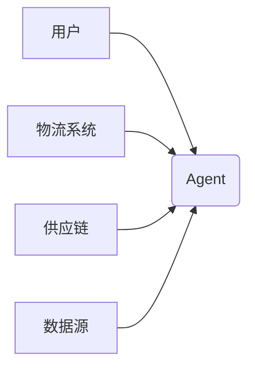
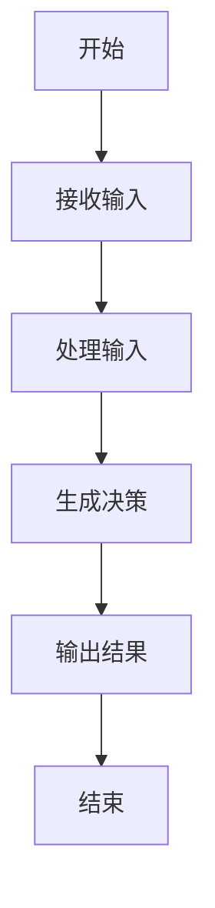
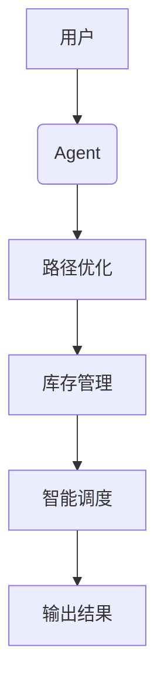

                 


# AI Agent在物流供应链中的应用

## 关键词：AI Agent，物流供应链，人工智能，物流优化，智能系统

## 摘要：本文深入探讨AI Agent在物流供应链中的应用，从基本概念到算法原理，再到实际案例分析，全面解析AI Agent如何优化物流供应链的各个环节，提升整体效率和降低成本。

---

# 第一部分：AI Agent在物流供应链中的应用概述

## 第1章：AI Agent与物流供应链的背景介绍

### 1.1 AI Agent的基本概念

#### 1.1.1 什么是AI Agent
AI Agent（人工智能代理）是一种能够感知环境、自主决策并执行任务的智能实体。它可以是一个软件程序，也可以是一个物理设备，通过传感器和执行器与环境交互。

- **感知环境**：AI Agent通过传感器收集数据，如温度、位置、货物状态等。
- **自主决策**：基于收集的数据，AI Agent利用算法做出决策，如选择最优路径、分配资源等。
- **执行任务**：根据决策结果，AI Agent通过执行器（如机器人、无人机）完成任务。

#### 1.1.2 AI Agent的核心特点
- **智能性**：能够理解和处理复杂信息。
- **自主性**：无需人工干预，自主完成任务。
- **反应性**：实时感知环境变化并做出反应。
- **学习能力**：通过机器学习不断优化决策。

#### 1.1.3 AI Agent与传统物流的区别
- **传统物流**：依赖人工操作，效率较低，成本较高。
- **AI Agent物流**：自动化、智能化，能够实时优化路径、分配资源，大幅提高效率并降低成本。

### 1.2 物流供应链的基本概念

#### 1.2.1 物流供应链的定义
物流供应链是指从原材料采购、生产、加工、仓储、运输到最终交付给消费者的整个流程中，所有相关环节的整合与协调。

- **原材料采购**：从供应商处获取原材料。
- **生产加工**：将原材料转化为成品。
- **仓储管理**：存储货物，确保货物安全。
- **运输配送**：将货物从生产地运送到消费者手中。
- **交付**：最终将货物交付给消费者。

#### 1.2.2 物流供应链的主要环节
- **供应商管理**：与供应商建立合作关系，确保原材料供应稳定。
- **生产计划**：制定生产计划，合理分配资源。
- **库存管理**：监控库存水平，避免积压或短缺。
- **运输管理**：选择最优运输方式和路线，降低成本。
- **交付服务**：确保货物按时送达，提高客户满意度。

#### 1.2.3 物流供应链的优化目标
- **降低成本**：通过优化运输路径、减少库存积压等方式降低运营成本。
- **提高效率**：通过自动化和智能化提升物流效率。
- **增强客户体验**：通过快速响应和精准配送提升客户满意度。

### 1.3 AI Agent在物流供应链中的应用背景

#### 1.3.1 物流供应链中的问题与挑战
- **成本高昂**：运输和仓储成本占据了企业很大一部分开支。
- **效率低下**：传统物流依赖人工操作，效率较低，容易出错。
- **资源浪费**：库存积压和运输中的资源浪费现象普遍。
- **客户需求多样**：消费者对物流服务的需求日益多样化，传统物流难以满足。

#### 1.3.2 AI Agent如何解决这些问题
- **优化路径规划**：AI Agent能够实时计算最优路径，减少运输时间和成本。
- **智能库存管理**：通过预测需求，AI Agent能够合理规划库存，避免积压和短缺。
- **提高配送效率**：通过智能调度，AI Agent能够优化配送资源，提高配送效率。
- **提升客户体验**：通过实时跟踪和精准配送，AI Agent能够满足客户多样化的需求。

#### 1.3.3 AI Agent在物流供应链中的应用前景
- **技术进步**：AI Agent技术的不断发展为物流供应链的优化提供了更多可能性。
- **市场需求**：消费者对快速、精准物流服务的需求日益增长，推动了AI Agent的应用。
- **成本效益**：通过AI Agent优化物流供应链，企业能够显著降低成本，提高利润。

---

## 第2章：AI Agent的核心概念与联系

### 2.1 AI Agent的核心原理

#### 2.1.1 AI Agent的定义与分类
- **定义**：AI Agent是一种能够感知环境、自主决策并执行任务的智能实体。
- **分类**：
  - **简单反射型Agent**：基于当前输入做出反应，没有内部状态。
  - **基于模型的反射型Agent**：具有内部状态和模型，能够基于模型做出决策。
  - **目标驱动型Agent**：具有明确的目标，通过规划和推理实现目标。
  - **效用驱动型Agent**：基于效用函数，选择能够最大化效用的动作。

#### 2.1.2 AI Agent的核心要素
- **感知**：通过传感器获取环境信息。
- **决策**：基于感知信息和内部模型做出决策。
- **执行**：通过执行器将决策转化为行动。
- **学习**：通过机器学习不断优化感知和决策能力。

#### 2.1.3 AI Agent的工作原理
AI Agent通过感知环境获取信息，利用内部模型和算法进行分析和推理，做出决策，并通过执行器将决策转化为行动。整个过程是一个循环的过程，AI Agent能够不断优化自身的感知和决策能力，以适应环境的变化。

### 2.2 AI Agent与物流供应链的关系

#### 2.2.1 AI Agent在物流供应链中的角色
- **决策支持**：AI Agent能够帮助物流企业做出最优决策，如路径规划、资源分配等。
- **过程优化**：通过实时监控和调整，AI Agent能够优化物流过程中的各个环节。
- **智能调度**：AI Agent能够智能调度运输资源，提高运输效率。

#### 2.2.2 AI Agent如何优化物流供应链
- **路径优化**：通过计算最优路径，减少运输时间和成本。
- **库存优化**：通过预测需求，合理规划库存，避免积压和短缺。
- **配送优化**：通过智能调度，优化配送资源，提高配送效率。

#### 2.2.3 AI Agent与物流供应链的协同效应
- **协同效应**：AI Agent与物流供应链的各个环节协同工作，形成一个高效、智能的物流系统。
- **实时优化**：通过实时数据和智能算法，AI Agent能够不断优化物流过程，提升整体效率。
- **降低成本**：通过优化路径和资源分配，AI Agent能够显著降低物流成本。

### 2.3 AI Agent的实体关系图



---

## 第3章：AI Agent的算法原理讲解

### 3.1 AI Agent的算法流程图



### 3.2 AI Agent的数学模型与公式

#### 3.2.1 基于强化学习的决策模型
强化学习是一种通过试错方式来优化决策的算法。AI Agent通过与环境交互，不断学习最优策略。

$$ R(s, a) = \text{奖励函数} $$
$$ \pi(a|s) = \text{策略函数} $$

- **奖励函数**：定义在状态s和动作a下，AI Agent获得的奖励。
- **策略函数**：定义在状态s下，AI Agent选择动作a的概率。

#### 3.2.2 基于监督学习的分类模型
监督学习是一种通过标签数据训练模型的算法。AI Agent可以通过监督学习来分类和预测。

$$ P(y|x) = \text{概率函数} $$

- **概率函数**：定义在输入x下，输出y的概率。

---

## 第4章：AI Agent在物流供应链中的系统分析与架构设计

### 4.1 系统架构设计

#### 4.1.1 系统功能设计
- **路径优化模块**：计算最优路径，减少运输时间和成本。
- **库存管理模块**：预测需求，合理规划库存。
- **智能调度模块**：优化运输资源，提高配送效率。

#### 4.1.2 系统架构图


#### 4.1.3 系统交互流程图



---

## 第5章：AI Agent在物流供应链中的项目实战

### 5.1 环境安装
- **安装Python**：确保安装了最新版本的Python。
- **安装依赖库**：使用pip安装所需的依赖库，如numpy、pandas、scikit-learn等。
- **安装AI Agent框架**：选择一个适合的AI Agent框架，如强化学习框架OpenAI Gym。

### 5.2 核心代码实现

#### 5.2.1 强化学习算法实现
```python
import numpy as np
import gym

# 初始化环境
env = gym.make('CartPole-v0')
env.seed(1)

# 定义策略函数
def policy(state):
    if np.dot(state, np.array([1, 1, 1, 1])) > 0:
        return 1
    else:
        return 0

# 训练过程
for episode in range(1000):
    state = env.reset()
    total_reward = 0
    steps = 0
    while True:
        action = policy(state)
        state, reward, done, info = env.step(action)
        total_reward += reward
        steps += 1
        if done:
            break
    print(f'Episode {episode}: Reward = {total_reward}')
```

#### 5.2.2 库存管理算法实现
```python
import numpy as np
import pandas as pd

# 数据预处理
data = pd.read_csv('inventory_data.csv')
data['预测需求'] = data['历史需求'].rolling(3).mean()

# 预测需求
预测需求 = data['预测需求'].iloc[-1]
print(f'预测需求：{预测需求}')
```

### 5.3 项目实战小结
通过实际案例分析，我们可以看到AI Agent在物流供应链中的应用能够显著优化物流过程，降低运营成本，提高效率和客户满意度。AI Agent不仅能够处理复杂的物流问题，还能够通过不断学习和优化，适应不断变化的环境。

---

## 第6章：AI Agent在物流供应链中的最佳实践

### 6.1 小结
AI Agent在物流供应链中的应用前景广阔，通过优化路径、库存和配送，能够显著降低成本，提高效率。AI Agent的智能化和自动化能力为物流企业提供了强有力的支持。

### 6.2 注意事项
- **数据质量**：确保数据的准确性和完整性，避免因数据问题影响决策。
- **算法选择**：根据具体问题选择合适的算法，避免盲目使用复杂算法。
- **系统集成**：确保AI Agent与现有物流系统的无缝集成，避免兼容性问题。

### 6.3 拓展阅读
- **强化学习**：深入学习强化学习的原理和应用。
- **AI Agent设计**：研究AI Agent的设计原则和实现方法。
- **物流优化**：探索更多物流优化的策略和方法。

---

## 作者：AI天才研究院/AI Genius Institute & 禅与计算机程序设计艺术 /Zen And The Art of Computer Programming

---

# 结语
通过本文的详细讲解，我们可以看到AI Agent在物流供应链中的巨大潜力和应用价值。随着技术的不断进步，AI Agent将为物流供应链的优化带来更多可能性，帮助物流企业实现更高效、更智能的运营。

