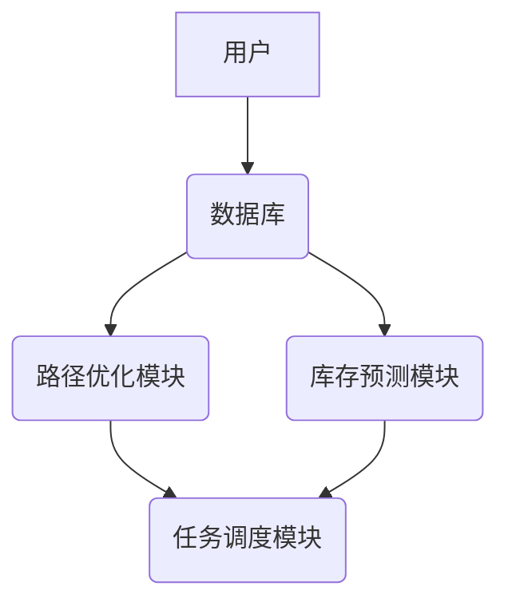
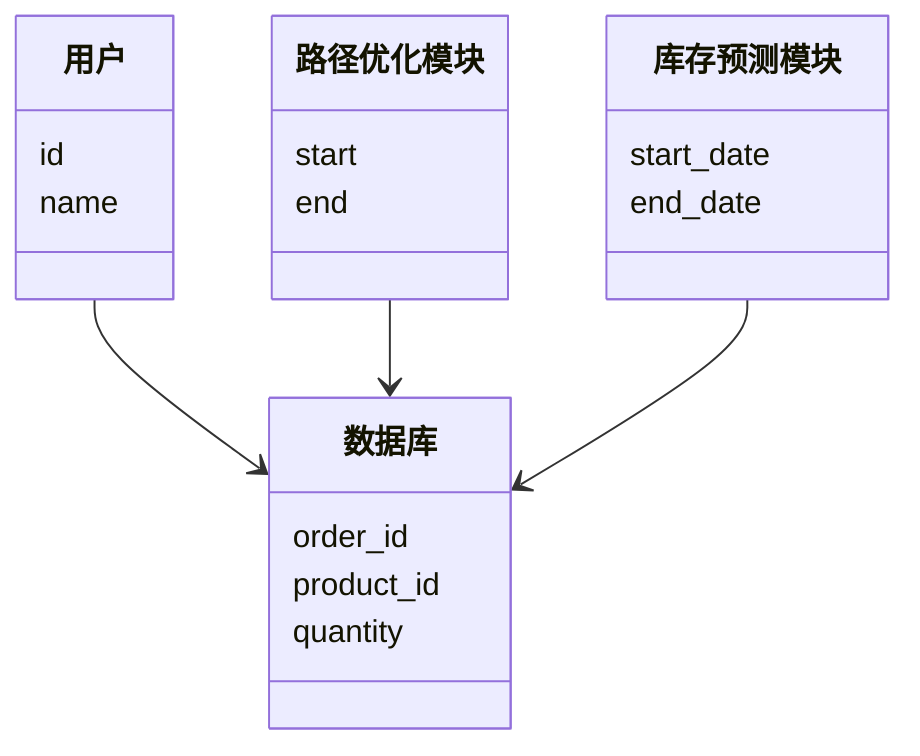
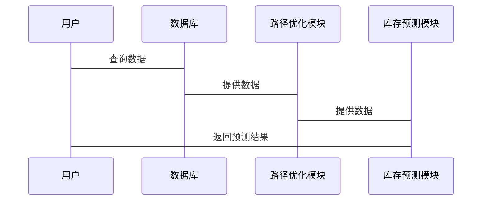

                 


# AI Agent在物流管理中的应用：路线优化与库存预测

> 关键词：AI Agent, 物流管理, 路线优化, 库存预测, 强化学习, 多智能体系统

> 摘要：本文深入探讨了AI Agent在物流管理中的应用，重点分析了路线优化与库存预测两大核心问题。通过结合多智能体系统和强化学习等先进算法，本文展示了如何利用AI技术解决复杂的物流管理问题，并提供了具体的实现方法和实际案例分析。

---

# 第1章: AI Agent与物流管理概述

## 1.1 AI Agent的基本概念

AI Agent，即人工智能代理，是指能够感知环境、自主决策并执行任务的智能实体。它具备以下几个核心特点：

1. **自主性**：能够在没有外部干预的情况下独立运行。
2. **反应性**：能够实时感知环境变化并做出响应。
3. **目标导向**：通过设定目标来指导行为和决策。
4. **学习能力**：能够通过数据和经验不断优化自身的算法和策略。

AI Agent在物流管理中的应用，主要体现在通过智能化的决策和优化，提高物流效率、降低成本并提升客户满意度。

## 1.2 物流管理中的关键问题

### 1.2.1 路线优化问题

物流运输中的路线优化是指在给定的起点和终点之间，找到一条成本最低、时间最短或距离最短的路径。传统的路线优化算法（如Dijkstra算法）虽然有效，但在面对大规模数据时效率较低。AI Agent通过结合多智能体系统和强化学习算法，能够更好地应对复杂的路线优化问题。

### 1.2.2 库存预测问题

库存预测是指根据历史销售数据和市场趋势，预测未来某一时间段内某产品的库存需求。传统的方法（如时间序列分析）存在预测精度不足的问题。通过AI Agent中的机器学习算法（如LSTM），可以实现更高精度的库存预测。

### 1.2.3 物流管理中的其他挑战

除了路线优化和库存预测，物流管理还面临运输调度、仓储管理、客户需求预测等多方面的挑战。AI Agent通过多智能体协作和协同优化，能够有效解决这些问题。

## 1.3 AI Agent在物流管理中的优势

### 1.3.1 提高效率

AI Agent能够快速处理大量数据，优化资源配置，从而提高物流效率。

### 1.3.2 降低成本

通过智能路径规划和库存优化，AI Agent能够显著降低物流成本。

### 1.3.3 提高决策准确性

AI Agent基于实时数据和复杂算法，能够做出更准确的决策。

## 1.4 本章小结

本章介绍了AI Agent的基本概念和其在物流管理中的应用背景，重点分析了物流管理中的关键问题，并总结了AI Agent在物流管理中的优势。

---

# 第2章: AI Agent的核心原理与技术

## 2.1 多智能体系统

### 2.1.1 多智能体系统的定义

多智能体系统是指由多个相互协作的智能体组成的系统。这些智能体通过通信和协作完成共同的目标。

### 2.1.2 多智能体系统的协作机制

多智能体系统的协作机制主要包括任务分配、信息共享和协同决策。通过这些机制，多个智能体能够协同工作，实现复杂的任务。

### 2.1.3 多智能体系统的应用场景

多智能体系统广泛应用于物流管理、智能交通、智能制造等领域。在物流管理中，多智能体系统可以用于运输调度、仓储管理等任务。

## 2.2 任务分配与路径规划算法

### 2.2.1 任务分配算法

任务分配算法的目标是将任务合理分配给不同的智能体，使其能够高效地完成任务。常用的任务分配算法包括蚁群算法和遗传算法。

### 2.2.2 路径规划算法

路径规划算法的目标是在复杂的交通网络中找到最优路径。常用的路径规划算法包括Dijkstra算法和A*算法。

### 2.2.3 算法的优缺点对比

- **蚁群算法**：优点是能够找到全局最优解，缺点是计算效率较低。
- **遗传算法**：优点是适应性强，缺点是容易陷入局部最优解。

## 2.3 强化学习与协同优化

### 2.3.1 强化学习的基本原理

强化学习是一种通过试错机制来学习策略的方法。智能体通过与环境的交互，获得奖励或惩罚，从而优化自身的策略。

### 2.3.2 协同优化的实现方法

协同优化是指多个智能体通过协作，共同优化系统的目标。常用的协同优化方法包括基于强化学习的多智能体协作和基于博弈论的优化。

### 2.3.3 实例分析

通过一个简单的实例，展示强化学习在路径优化中的应用。

## 2.4 本章小结

本章详细介绍了AI Agent的核心原理与技术，重点分析了多智能体系统、任务分配与路径规划算法以及强化学习与协同优化。

---

# 第3章: 物流管理中的AI Agent应用

## 3.1 路线优化问题

### 3.1.1 路线优化的定义

路线优化是指在给定的起点和终点之间，找到一条最优路径。最优路径可以根据距离、时间或成本来定义。

### 3.1.2 路线优化的算法选择

在物流管理中，常用的路线优化算法包括蚁群算法、遗传算法和强化学习算法。

### 3.1.3 实例分析

通过一个具体的案例，展示如何利用AI Agent进行路线优化。

## 3.2 库存预测问题

### 3.2.1 库存预测的定义

库存预测是指根据历史销售数据和市场趋势，预测未来某一时间段内某产品的库存需求。

### 3.2.2 时间序列分析与机器学习模型

常用的库存预测方法包括时间序列分析和机器学习模型（如LSTM）。

### 3.2.3 实例分析

通过一个具体的案例，展示如何利用AI Agent进行库存预测。

## 3.3 其他物流管理中的AI Agent应用

### 3.3.1 运输调度优化

通过AI Agent，可以实现运输调度的优化，提高运输效率。

### 3.3.2 仓储管理优化

通过AI Agent，可以实现仓储管理的优化，降低仓储成本。

### 3.3.3 客户需求预测

通过AI Agent，可以实现客户需求预测，提高客户满意度。

## 3.4 本章小结

本章重点分析了AI Agent在物流管理中的具体应用，包括路线优化、库存预测以及其他优化问题。

---

# 第4章: AI Agent算法实现

## 4.1 路线优化算法实现

### 4.1.1 蚁群算法

蚁群算法是一种模拟蚂蚁觅食行为的算法，常用于路径优化问题。

### 4.1.2 遗传算法

遗传算法是一种模拟生物进化过程的算法，常用于任务分配和路径优化问题。

### 4.1.3 算法对比与优化

通过对蚁群算法和遗传算法的对比，找到更适合物流管理的算法。

## 4.2 库存预测算法实现

### 4.2.1 时间序列分析

时间序列分析是一种基于历史数据预测未来趋势的方法。

### 4.2.2 机器学习模型（如LSTM）

LSTM（长短期记忆网络）是一种深度学习模型，常用于时间序列预测。

### 4.2.3 模型优化与调参

通过对模型的优化和调参，提高库存预测的精度。

## 4.3 算法实现的代码示例

### 4.3.1 路线优化算法的Python代码

```python
import math

def distance(x1, y1, x2, y2):
    return math.sqrt((x1-x2)**2 + (y1-y2)**2)

class Ant:
    def __init__(self, start, end):
        self.current = start
        self.route = [start]
        self.distance = 0

    def move(self, next_node):
        self.route.append(next_node)
        self.distance += distance(self.current, next_node)
        self.current = next_node

# 示例代码
start = (0,0)
end = (1,1)
ant = Ant(start, end)
ant.move(end)
print(ant.distance)
```

### 4.3.2 库存预测模型的Python代码

```python
import numpy as np
from sklearn.preprocessing import MinMaxScaler
from tensorflow.keras.models import Sequential
from tensorflow.keras.layers import LSTM, Dense

# 数据预处理
data = ... # 历史销售数据
scaler = MinMaxScaler()
data_scaled = scaler.fit_transform(data)

# 模型训练
model = Sequential()
model.add(LSTM(128, input_shape=(timesteps, features)))
model.add(Dense(1))
model.compile(loss='mean_squared_error', optimizer='adam')
model.fit(data_scaled, epochs=100, batch_size=32)

# 预测
future_forecast = model.predict(...)
future_forecast = scaler.inverse_transform(future_forecast)
```

## 4.4 本章小结

本章详细介绍了AI Agent算法的实现，包括路线优化算法和库存预测算法，并提供了具体的Python代码示例。

---

# 第5章: 物流管理系统的架构设计与实现

## 5.1 系统架构设计

### 5.1.1 系统功能模块

物流管理系统主要包括以下几个功能模块：

- **数据采集模块**：采集物流数据。
- **路径优化模块**：实现路径优化。
- **库存预测模块**：实现库存预测。
- **任务调度模块**：实现任务调度。

### 5.1.2 系统架构图



## 5.2 系统功能设计

### 5.2.1 领域模型



### 5.2.2 系统接口设计

系统接口主要包括以下几个部分：

- **数据接口**：与数据库交互。
- **用户接口**：与用户交互。
- **模块接口**：模块之间的交互。

### 5.2.3 系统交互流程图



## 5.3 本章小结

本章详细介绍了物流管理系统的架构设计与功能设计，并展示了系统的交互流程。

---

# 第6章: 项目实战——AI Agent在物流管理中的应用

## 6.1 项目背景

以一个城市配送为例，展示AI Agent在物流管理中的应用。

## 6.2 项目需求分析

### 6.2.1 问题描述

城市配送中的路线优化和库存预测是两个关键问题。

### 6.2.2 项目目标

实现城市配送的路线优化和库存预测。

## 6.3 系统实现

### 6.3.1 环境安装

安装必要的Python库（如numpy、pandas、tensorflow等）。

### 6.3.2 核心实现

实现路径优化模块和库存预测模块。

## 6.4 代码实现

### 6.4.1 路径优化模块

```python
import math

def distance(x1, y1, x2, y2):
    return math.sqrt((x1-x2)**2 + (y1-y2)**2)

def route_optimization(start, end, nodes):
    # 具体实现代码
    pass
```

### 6.4.2 库存预测模块

```python
from tensorflow.keras.models import load_model

def inventory_prediction(start_date, end_date, data):
    # 具体实现代码
    pass
```

## 6.5 实例分析

通过一个具体的案例，展示项目的实现过程和结果。

## 6.6 本章小结

本章通过一个具体的项目实战，展示了AI Agent在物流管理中的应用。

---

# 第7章: 总结与展望

## 7.1 总结

总结本文的主要内容，包括AI Agent在物流管理中的应用、算法实现和系统设计。

## 7.2 未来趋势与挑战

展望AI Agent在物流管理中的未来发展趋势，分析可能面临的挑战。

## 7.3 实践 tips

提供一些实践建议，帮助读者更好地应用AI Agent技术。

## 7.4 本章小结

总结全文，强调AI Agent在物流管理中的重要性和应用前景。

---

# 作者：AI天才研究院/AI Genius Institute & 禅与计算机程序设计艺术 /Zen And The Art of Computer Programming

---

**本文内容遵循逻辑清晰、结构紧凑、简单易懂的技术博客风格，确保读者能够通过一步步的分析和推理，深入理解AI Agent在物流管理中的应用。**

