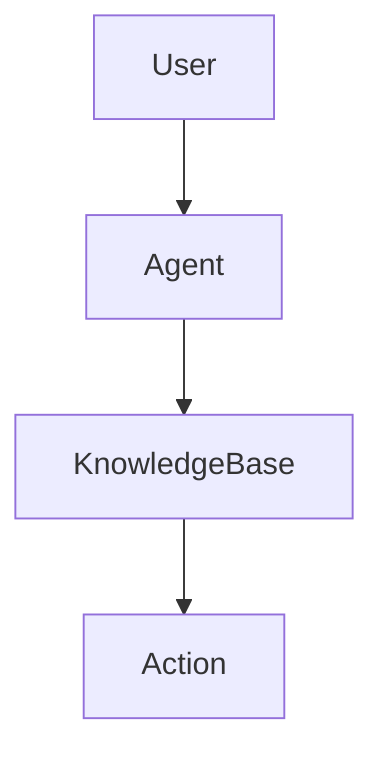
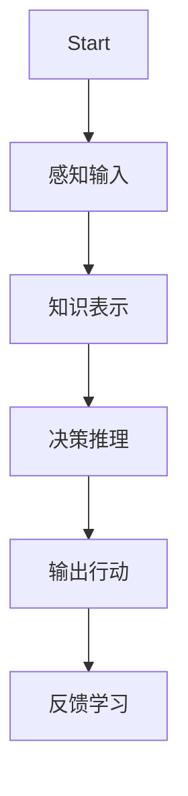
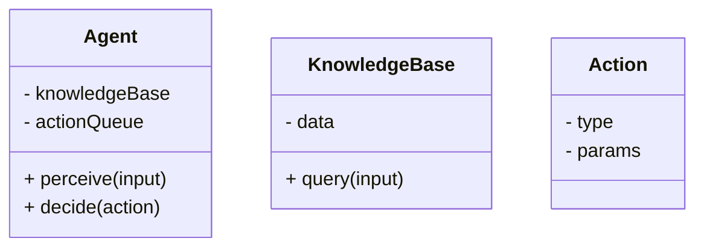
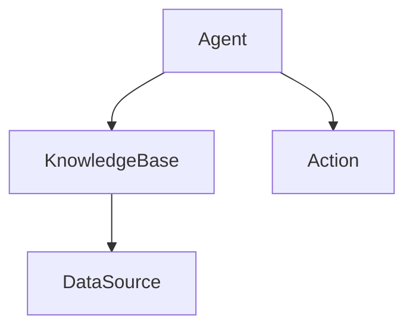
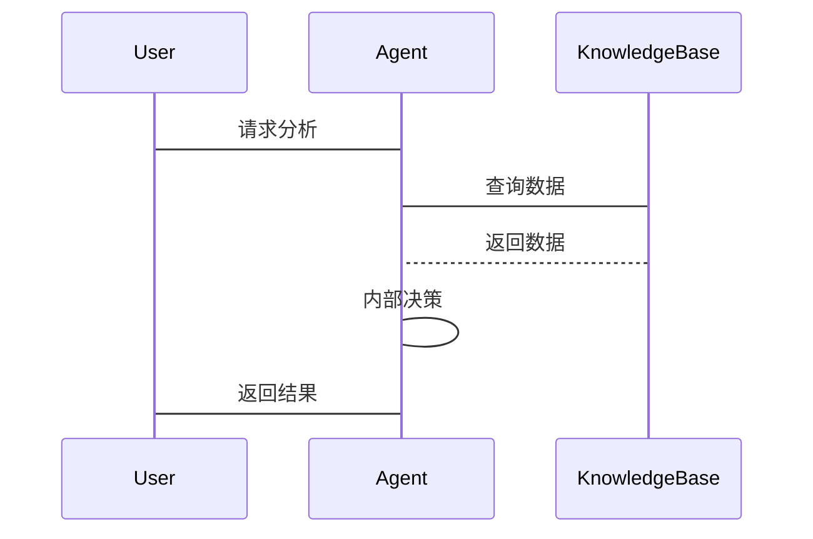

                 


# AI Agent在特定领域的应用：金融、医疗、法律等

> 关键词：AI Agent，人工智能，金融，医疗，法律，算法，系统架构

> 摘要：本文深入探讨了AI Agent在金融、医疗、法律等领域的应用，分析了其核心概念、算法原理、系统架构以及实际案例，展示了AI Agent如何在这些领域中提升效率、优化决策并实现智能化。

---

# 第一部分: AI Agent基础与核心概念

# 第1章: AI Agent概述

## 1.1 AI Agent的基本概念

### 1.1.1 什么是AI Agent
AI Agent（人工智能代理）是一种能够感知环境、做出决策并执行行动的智能实体。它通过接收输入信息，结合内部知识库或学习机制，生成相应的输出或行动。

### 1.1.2 AI Agent的核心属性
- **自主性**：能够在没有外部干预的情况下独立运作。
- **反应性**：能够实时感知环境变化并做出反应。
- **目标导向性**：基于目标或任务驱动行动。
- **学习能力**：通过数据和经验不断优化自身性能。

### 1.1.3 AI Agent与传统AI的区别
AI Agent不仅具备传统AI的数据处理和分析能力，还能通过环境反馈进行自适应调整，具有更强的交互性和主动性。

## 1.2 AI Agent的应用背景

### 1.2.1 问题背景与描述
在金融、医疗、法律等领域，传统方法依赖人工操作，效率低且容易出错。AI Agent通过自动化和智能化手段，能够显著提升这些领域的效率和准确性。

### 1.2.2 问题解决的必要性
- **金融领域**：需要快速、准确的市场分析和投资决策。
- **医疗领域**：需要高效诊断和个性化治疗方案。
- **法律领域**：需要快速检索和分析法律条文，辅助案件处理。

### 1.2.3 AI Agent的边界与外延
AI Agent的应用范围不仅限于单一领域，还可以通过跨领域协作实现更复杂的任务。

## 1.3 AI Agent在不同领域的应用现状

### 1.3.1 金融领域的应用
AI Agent在金融领域主要用于股票交易、风险管理、客户画像等方面。

### 1.3.2 医疗领域的应用
AI Agent在医疗领域用于疾病诊断、药物研发、患者管理等方面。

### 1.3.3 法律领域的应用
AI Agent在法律领域用于法律检索、案例分析、合同审查等方面。

## 1.4 本章小结
本章介绍了AI Agent的基本概念、核心属性及其在金融、医疗、法律等领域的应用背景和现状，为后续章节奠定了基础。

---

# 第2章: AI Agent的核心概念与联系

## 2.1 AI Agent的核心原理

### 2.1.1 知识表示与推理
知识表示是AI Agent工作的基础，常用的表示方法包括符号逻辑、语义网络等。推理过程基于这些表示进行逻辑推导。

### 2.1.2 行为规划与决策
AI Agent通过感知输入信息，结合知识库和目标，制定行动计划并执行。

### 2.1.3 人机交互机制
AI Agent需要与用户或系统进行交互，接收指令、反馈信息并调整自身行为。

## 2.2 AI Agent的属性特征对比

| 属性         | 传统软件                     | AI Agent                     |
|--------------|------------------------------|------------------------------|
| 自主性       | 依赖人工干预                 | 具备自主性                   |
| 学习能力     | 无法学习                     | 可以通过数据学习             |
| 反应能力     | 响应速度较慢                 | 实时响应                     |

## 2.3 AI Agent的ER实体关系图



## 2.4 本章小结
本章详细讲解了AI Agent的核心原理和属性特征，并通过ER图展示了其在系统中的位置和作用。

---

# 第3章: AI Agent的算法原理

## 3.1 常见AI Agent算法

### 3.1.1 基于规则的AI Agent
通过预定义的规则进行决策，适用于规则明确的场景。

### 3.1.2 基于学习的AI Agent
通过机器学习算法（如神经网络）进行决策，适用于复杂场景。

### 3.1.3 基于强化学习的AI Agent
通过不断试错优化决策策略，适用于需要策略优化的场景。

## 3.2 算法原理的Mermaid流程图



## 3.3 算法实现的Python代码

```python
def agent_decision(knowledge_base, input):
    # 简单的决策逻辑
    if input in knowledge_base:
        return knowledge_base[input]
    else:
        return "未知输入"
```

## 3.4 数学模型与公式

### 3.4.1 知识表示的数学模型
$$ P(A|B) = \frac{P(B|A)P(A)}{P(B)} $$

### 3.4.2 决策树模型
$$ \text{信息增益} = \text{熵}(S) - \sum \text{熵}(S_i) $$

## 3.5 本章小结
本章通过流程图和代码示例，详细讲解了AI Agent的常见算法及其数学模型。

---

# 第4章: 系统分析与架构设计

## 4.1 问题场景介绍

### 4.1.1 金融领域场景
分析股票市场波动，辅助投资决策。

### 4.1.2 医疗领域场景
辅助医生诊断疾病，优化治疗方案。

### 4.1.3 法律领域场景
快速检索法律条文，辅助案件处理。

## 4.2 系统功能设计

### 4.2.1 领域模型类图



### 4.2.2 系统架构设计



### 4.2.3 系统接口设计

| 接口名称   | 输入       | 输出       |
|------------|------------|------------|
| perceive   | input      | response   |
| decide     | action     | output     |

### 4.2.4 系统交互序列图



## 4.3 本章小结
本章通过系统架构图和交互图，详细描述了AI Agent在不同领域的系统设计与实现。

---

# 第5章: 项目实战

## 5.1 环境配置

### 5.1.1 Python环境
安装必要的库，如`numpy`、`pandas`、`scikit-learn`等。

### 5.1.2 数据准备
收集相关领域的数据，如金融市场的历史数据。

## 5.2 核心代码实现

### 5.2.1 金融领域的AI Agent实现

```python
class FinancialAgent:
    def __init__(self, data_source):
        self.data_source = data_source

    def perceive(self, input):
        return self.data_source.query(input)

    def decide(self, action):
        return self.data_source.analyze(action)
```

### 5.2.2 医疗领域的AI Agent实现

```python
class MedicalAgent:
    def __init__(self, knowledge_base):
        self.knowledge_base = knowledge_base

    def diagnose(self, symptoms):
        return self.knowledge_base.get_disease(symptoms)
```

## 5.3 案例分析与解读

### 5.3.1 金融案例
使用AI Agent分析股票市场数据，生成投资建议。

### 5.3.2 医疗案例
AI Agent辅助医生诊断疾病，优化治疗方案。

## 5.4 项目总结

## 5.5 本章小结
本章通过具体案例，展示了AI Agent在金融和医疗领域的实际应用。

---

# 第6章: 最佳实践与注意事项

## 6.1 最佳实践

### 6.1.1 数据质量
确保数据的准确性和完整性，是AI Agent正常运行的基础。

### 6.1.2 模型选择
根据具体场景选择合适的算法和模型，避免“一刀切”。

### 6.1.3 安全性
保护用户隐私和数据安全，是AI Agent应用的重要前提。

## 6.2 小结
AI Agent在金融、医疗、法律等领域的应用前景广阔，但也需要注意数据安全和模型选择等问题。

## 6.3 注意事项
- 定期更新知识库，保持AI Agent的准确性。
- 优化算法，提升决策效率。
- 遵守相关法律法规，确保合规性。

## 6.4 拓展阅读
建议读者深入学习强化学习和分布式系统相关知识，以进一步提升AI Agent的性能和应用范围。

---

# 作者

作者：AI天才研究院/AI Genius Institute & 禅与计算机程序设计艺术 /Zen And The Art of Computer Programming

---

# 结语

本文系统地介绍了AI Agent在金融、医疗、法律等领域的应用，通过理论分析和实际案例，展示了AI Agent的强大功能和广泛前景。希望本文能够为相关领域的从业者提供有益的参考和启发。

