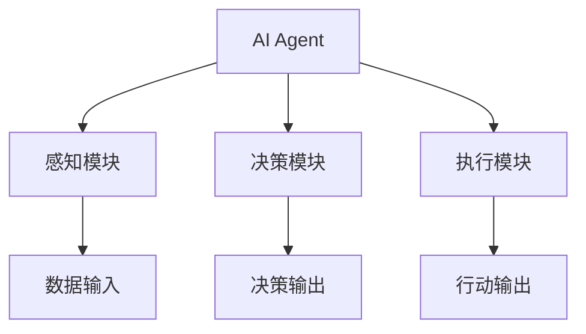
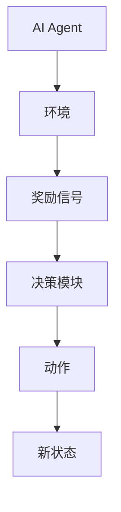

                 


# AI Agent在特定领域的深度应用：法律、医疗、金融

## 关键词：AI Agent，法律，医疗，金融，深度应用，人工智能，技术博客

## 摘要：AI Agent（人工智能代理）作为一项前沿技术，正在逐步渗透到法律、医疗和金融等多个领域。本文将从AI Agent的核心概念出发，分析其在法律咨询、医疗诊断和金融投资等领域的深度应用，探讨其技术原理、系统架构和实际案例，为读者提供全面的技术解读和实践指南。

---

# 第一部分: AI Agent 的背景与核心概念

## 第1章: AI Agent 的定义与技术背景

### 1.1 AI Agent 的定义与核心概念

#### 1.1.1 问题背景与问题描述

人工智能（AI）技术的快速发展，使得AI Agent（人工智能代理）逐渐成为各个行业的焦点。AI Agent是一种能够感知环境、自主决策并执行任务的智能体，其核心目标是通过算法优化和数据驱动的方式，为用户提供高效、智能的服务。

#### 1.1.2 AI Agent 的问题解决思路

AI Agent 的核心思路是通过感知环境、分析问题、制定解决方案并执行任务。与传统的人工智能系统相比，AI Agent 更强调自主性和实时性，能够根据动态变化的环境调整其行为。

#### 1.1.3 AI Agent 的边界与外延

AI Agent 的边界在于其感知和执行能力的限制，而外延则体现在其在不同领域的具体应用。例如，在法律领域，AI Agent 可以辅助律师进行案例分析；在医疗领域，AI Agent 可以辅助医生进行诊断；在金融领域，AI Agent 可以辅助投资者进行决策。

#### 1.1.4 核心要素与概念结构

AI Agent 的核心要素包括：

1. **感知模块**：负责从环境中获取信息。
2. **决策模块**：负责对信息进行分析并制定决策。
3. **执行模块**：负责根据决策执行具体任务。

---

### 1.2 AI Agent 的技术背景与现状

#### 1.2.1 AI Agent 的技术基础

AI Agent 的技术基础包括：

1. **机器学习**：用于训练模型，使其能够从数据中学习规律。
2. **自然语言处理**：用于理解和生成人类语言。
3. **强化学习**：用于训练 AI Agent 的决策能力。

#### 1.2.2 当前 AI Agent 的发展趋势

AI Agent 正在向更智能化、更个性化的方向发展。例如，基于深度学习的 AI Agent 已经能够处理复杂的非结构化数据，并在多个领域展现出强大的应用潜力。

#### 1.2.3 法律、医疗、金融领域的应用现状

1. **法律领域**：AI Agent 可以辅助律师进行案例分析、合同审查和法律文书生成。
2. **医疗领域**：AI Agent 可以辅助医生进行诊断、治疗方案制定和患者管理。
3. **金融领域**：AI Agent 可以辅助投资者进行股票交易、风险评估和投资组合优化。

---

## 第2章: AI Agent 的核心概念与联系

### 2.1 AI Agent 的核心原理

#### 2.1.1 感知模块

感知模块是 AI Agent 的眼睛和耳朵，负责从环境中获取信息。例如，在医疗领域，AI Agent 可以通过感知模块获取患者的病历数据和检查结果。

#### 2.1.2 决策模块

决策模块是 AI Agent 的大脑，负责对感知到的信息进行分析并制定决策。例如，在金融领域，AI Agent 可以通过决策模块分析市场数据并制定投资策略。

#### 2.1.3 执行模块

执行模块是 AI Agent 的手和脚，负责根据决策模块的指令执行具体任务。例如，在法律领域，AI Agent 可以通过执行模块生成法律文书并提交到相关部门。

---

### 2.2 核心概念对比分析

#### 2.2.1 AI Agent 与传统 AI 的对比

| **维度** | **AI Agent** | **传统 AI** |
|----------|--------------|------------|
| 自主性    | 高           | 低         |
| 实时性    | 高           | 低         |
| 适应性    | 高           | 低         |

---

### 2.3 实体关系图



---

# 第二部分: AI Agent 在法律领域的深度应用

## 第3章: 法律领域的 AI Agent 应用场景

### 3.1 法律领域 AI Agent 的问题场景

#### 3.1.1 法律咨询与案例分析

AI Agent 可以通过自然语言处理技术，帮助用户快速找到相关的法律案例和法规。

#### 3.1.2 合同审查与法律文书生成

AI Agent 可以辅助律师进行合同审查和法律文书生成，提高工作效率。

---

### 3.2 法律领域 AI Agent 的系统架构

#### 3.2.1 系统功能设计

1. **法律案例分析**：AI Agent 可以通过训练法律案例数据，帮助用户快速找到相似案例。
2. **合同审查**：AI Agent 可以通过自然语言处理技术，自动识别合同中的关键条款。
3. **法律文书生成**：AI Agent 可以根据用户提供的信息，自动生成法律文书。

---

## 第4章: 法律领域 AI Agent 的算法实现

### 4.1 算法原理

#### 4.1.1 强化学习



---

## 第5章: 法律领域 AI Agent 的系统实现

### 5.1 系统实现

#### 5.1.1 环境安装

```bash
pip install transformers
pip install numpy
pip install pandas
```

#### 5.1.2 核心代码实现

```python
import transformers
import numpy as np
import pandas as pd

# 加载预训练模型
model = transformers.BertTokenizer.from_pretrained('bert-base-uncased')
```

---

# 第三部分: AI Agent 在医疗领域的深度应用

## 第6章: 医疗领域的 AI Agent 应用场景

### 6.1 医疗领域 AI Agent 的问题场景

#### 6.1.1 病症诊断与治疗方案制定

AI Agent 可以通过分析患者的病历数据和检查结果，帮助医生制定个性化的治疗方案。

#### 6.1.2 医疗数据管理与患者监控

AI Agent 可以通过实时监控患者的生理数据，帮助医生及时发现异常情况。

---

## 第7章: 医疗领域 AI Agent 的算法实现

### 7.1 算法原理

#### 7.1.1 基于深度学习的医疗数据分析

```python
import keras
from keras import layers

# 构建深度学习模型
model = keras.Sequential()
model.add(layers.Dense(64, activation='relu', input_dim=10))
model.add(layers.Dense(1, activation='sigmoid'))
model.compile(optimizer='adam', loss='binary_crossentropy', metrics=['accuracy'])
```

---

# 第四部分: AI Agent 在金融领域的深度应用

## 第8章: 金融领域的 AI Agent 应用场景

### 8.1 金融领域 AI Agent 的问题场景

#### 8.1.1 股票交易与投资组合优化

AI Agent 可以通过分析市场数据，帮助投资者制定股票交易策略。

#### 8.1.2 风险评估与信用评分

AI Agent 可以通过分析客户的信用记录，帮助金融机构进行风险评估。

---

## 第9章: 金融领域 AI Agent 的算法实现

### 9.1 算法原理

#### 9.1.1 基于强化学习的金融交易

```python
import gym
from gym import spaces
import numpy as np

class StockTradingEnv(gym.Env):
    def __init__(self):
        super(StockTradingEnv, self).__init__()
        self.observation_space = spaces.Box(low=0, high=1, shape=(1,))
        self.action_space = spaces.Discrete(3)

    def step(self, action):
        # 实现交易逻辑
        pass

    def reset(self):
        # 初始化环境
        pass
```

---

# 第五部分: 结论与展望

## 第10章: 结论与展望

### 10.1 结论

AI Agent 在法律、医疗和金融领域的应用潜力巨大，通过深度学习和强化学习等技术，AI Agent 可以显著提高各个领域的效率和准确性。

### 10.2 展望

随着技术的不断进步，AI Agent 将在更多领域展现出其强大的应用潜力。例如，在教育、交通和能源等领域，AI Agent 也将发挥重要作用。

---

# 作者信息

作者：AI天才研究院/AI Genius Institute & 禅与计算机程序设计艺术 /Zen And The Art of Computer Programming

---

> 本文版权归作者所有，转载请注明出处。

