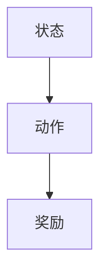
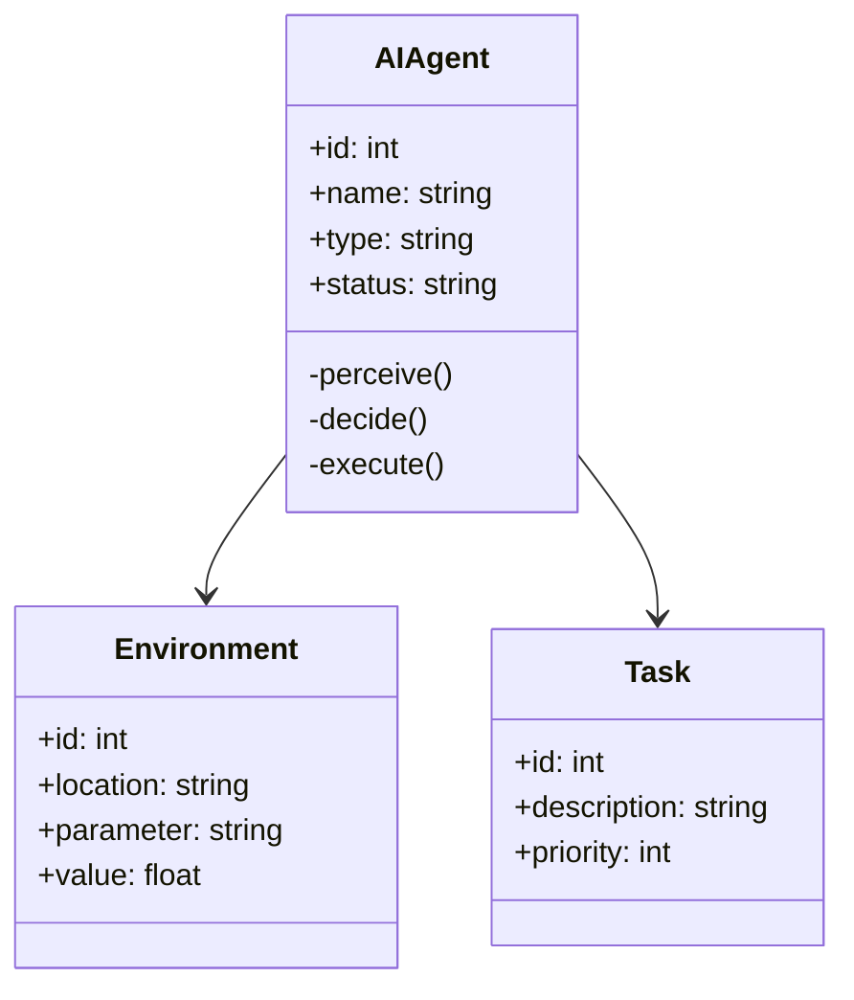
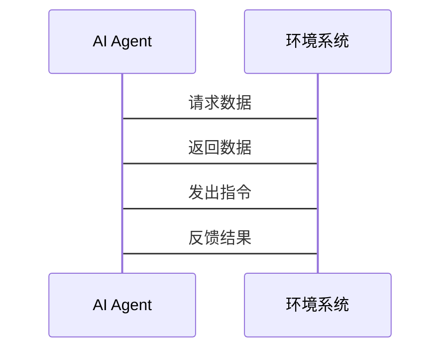

                 


# AI Agent在环境保护中的应用

## 关键词：AI Agent，环境保护，算法原理，系统架构，项目实战

## 摘要：AI Agent作为一种智能体，通过感知、决策和执行三阶段，有效解决环境保护中的复杂问题。本文详细阐述其在环保中的应用，涵盖算法原理、系统架构和实际案例，展示其在环境监测、污染治理等领域的潜力。

---

# 第1章: AI Agent与环境保护的背景介绍

## 1.1 AI Agent的基本概念
### 1.1.1 AI Agent的定义
AI Agent（智能体）是能够感知环境、自主决策并执行任务的实体，具备学习和适应能力。

### 1.1.2 AI Agent的核心特点
- **自主性**：无需外部干预。
- **反应性**：实时感知并响应。
- **目标导向**：为实现目标而行动。

### 1.1.3 AI Agent与传统环保技术的区别
传统技术依赖人工操作，AI Agent实现自动化和智能化。

## 1.2 环境保护的挑战与需求
### 1.2.1 环境保护的核心问题
- 环境监测困难。
- 污染治理复杂。
- 资源利用效率低。

### 1.2.2 环境保护的传统技术与局限性
- 人工监测耗时且不准确。
- 治理方法单一。

### 1.2.3 环境保护对AI Agent的需求
- 实时监测。
- 自动化决策。
- 智能优化。

## 1.3 AI Agent在环境保护中的应用前景
### 1.3.1 AI Agent在环保领域的潜在应用
- 空气质量监测。
- 水质检测。
- 垃圾处理优化。

### 1.3.2 AI Agent在环保中的优势
- 提高效率。
- 减少成本。
- 实现精准治理。

### 1.3.3 AI Agent应用的挑战与机遇
- 技术难题：数据处理。
- 机遇：智能化环保。

## 1.4 本章小结
AI Agent通过智能化手段，为环境保护提供新思路。

---

# 第2章: AI Agent的核心概念与联系

## 2.1 AI Agent的核心原理
### 2.1.1 感知层
- 数据采集。
- 特征提取。

### 2.1.2 决策层
- 基于规则。
- 机器学习。
- 强化学习。

### 2.1.3 执行层
- 行动规划。
- 执行反馈。

## 2.2 AI Agent与环境保护的关系
### 2.2.1 AI Agent在环保中的角色
- 数据分析。
- 决策支持。

### 2.2.2 AI Agent与环境数据的关系
- 数据依赖。
- 数据处理。

### 2.2.3 AI Agent与环保决策的关系
- 支持决策。
- 提供依据。

## 2.3 AI Agent的核心要素对比
| 要素 | 感知能力 | 决策能力 | 执行能力 |
|------|----------|----------|----------|
| 核心 | 数据采集 | 策略制定 | 任务执行 |

## 2.4 AI Agent的ER实体关系图
```mermaid
er
    entity(AI Agent) {
        id
        name
        type
        status
    }
    entity(Environment) {
        id
        location
        parameter
        value
    }
    entity(Task) {
        id
        description
        priority
    }
    AI Agent -[1..n] Task
    AI Agent -[1..n] Environment
```

## 2.5 本章小结
AI Agent通过感知、决策、执行，实现环保智能化。

---

# 第3章: AI Agent在环境保护中的算法原理

## 3.1 AI Agent的感知算法
### 3.1.1 数据采集与处理
- 传感器数据。
- 数据清洗。

### 3.1.2 数据特征提取
- 时间序列分析。
- 主成分分析。

### 3.1.3 数据分类与聚类
- 分类算法：支持向量机。
- 聚类算法：K-means。

## 3.2 AI Agent的决策算法
### 3.2.1 基于规则的决策
```python
def decide_rule(inputs):
    if inputs['pm2.5'] > 100:
        return '污染'
    else:
        return '正常'
```

### 3.2.2 基于机器学习的决策
- 随机森林分类器。

### 3.2.3 基于强化学习的决策


## 3.3 AI Agent的执行算法
### 3.3.1 行动规划
- A*算法路径规划。

### 3.3.2 动作执行
- 系统控制。

## 3.4 本章小结
AI Agent通过算法实现精准感知和决策。

---

# 第4章: AI Agent在环境保护中的系统架构设计

## 4.1 系统架构概述
- 分层架构：感知层、决策层、执行层。

## 4.2 系统功能设计


## 4.3 系统架构设计


## 4.4 系统接口设计
- 接口定义：REST API。

## 4.5 系统交互设计


## 4.6 本章小结
系统架构设计确保AI Agent高效运行。

---

# 第5章: AI Agent在环境保护中的项目实战

## 5.1 项目概述
- 空气质量监测系统。

## 5.2 项目环境安装
- 安装Python、TensorFlow、Scikit-learn。

## 5.3 系统核心实现
```python
class AI-Agent:
    def __init__(self):
        self.sensors = []
        self.classifier = SVC()

    def perceive(self):
        data = collect_data()
        return preprocess(data)

    def decide(self, data):
        prediction = self.classifier.predict(data)
        return prediction

    def execute(self, action):
        execute_action(action)
```

## 5.4 代码解读
- 感知模块：数据收集与预处理。
- 决策模块：分类器训练与预测。
- 执行模块：系统控制。

## 5.5 实际案例分析
- 数据分析结果：污染区域识别。
- 系统优化：减少能耗。

## 5.6 本章小结
项目实战展示了AI Agent的应用价值。

---

# 第6章: AI Agent在环境保护中的最佳实践

## 6.1 最佳实践
- 数据质量：确保准确性。
- 模型选择：适用性。
- 系统维护：定期更新。

## 6.2 小结
AI Agent的应用需要综合考虑多方面因素。

## 6.3 注意事项
- 数据隐私。
- 系统稳定性。

## 6.4 拓展阅读
- 推荐书籍：《AI与环境保护》。

---

# 第7章: 总结

## 7.1 全文总结
AI Agent在环保中潜力巨大。

## 7.2 未来展望
- 更智能化。
- 更广泛的应用。

---

# 参考文献

1. Russell, S. & Norvig, P. (2010). *Artificial Intelligence: A Modern Approach*.
2. Goodfellow, I. et al. (2016). *Deep Learning*.

---

作者：AI天才研究院

