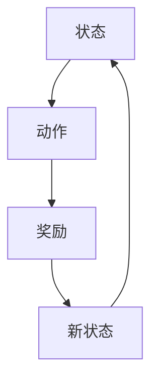
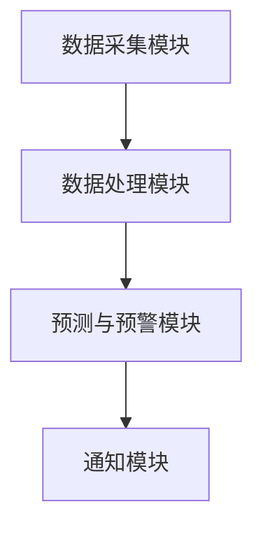

                 


# AI Agent在环境监测与预警中的实践

## 关键词：AI Agent, 环境监测, 预警系统, 强化学习, 时间序列分析

## 摘要：  
本文深入探讨了AI Agent在环境监测与预警中的实践应用。从AI Agent的基本概念到其在环境监测中的核心功能，再到具体的算法实现和系统架构设计，文章详细阐述了AI Agent如何提升环境监测的效率和准确性。通过实际案例分析和代码实现，本文展示了AI Agent在环境预警中的独特价值和广泛的应用前景。

---

# 第一部分: AI Agent与环境监测预警的背景与概念

## 第1章: AI Agent的基本概念与环境监测预警的背景

### 1.1 AI Agent的定义与核心特征

#### 1.1.1 AI Agent的基本定义
AI Agent（人工智能代理）是一种智能系统，能够感知环境、自主决策并执行任务。它具备以下核心特征：
- **自主性**：无需外部干预，自主完成任务。
- **反应性**：能够实时感知环境变化并做出反应。
- **目标导向**：基于目标驱动行为。
- **学习能力**：通过数据和经验不断优化自身性能。

#### 1.1.2 AI Agent的核心特征与优势
AI Agent的优势在于其智能性和适应性。与传统自动化系统相比，AI Agent能够：
- 处理非结构化数据。
- 自主学习和优化。
- 在复杂环境中做出决策。

#### 1.1.3 AI Agent与传统自动化系统的区别
| 特性         | 传统自动化系统             | AI Agent               |
|--------------|----------------------------|-------------------------|
| 数据处理     | 结构化数据为主             | 支持结构化与非结构化数据 |
| 决策能力     | 预设规则驱动               | 自主学习与决策         |
| 适应性       | 较低                      | 较高                    |

### 1.2 环境监测与预警的背景与需求

#### 1.2.1 环境监测的基本概念
环境监测是指通过技术手段对环境质量进行实时或定期监测的过程，旨在发现和预警环境问题。

#### 1.2.2 当前环境监测的主要挑战
- 数据来源多样且复杂。
- 数据量大，处理难度高。
- 对实时性和准确性要求高。

#### 1.2.3 环境预警的重要性与应用场景
环境预警是通过预测潜在的环境问题，提前发出警报，帮助采取措施减少损失。应用场景包括：
- 空气质量预警。
- 水质监测预警。
- 灾害性天气预警。

### 1.3 AI Agent在环境监测预警中的作用

#### 1.3.1 AI Agent如何提升环境监测效率
AI Agent能够实时处理大量数据，快速识别异常情况，显著提高监测效率。

#### 1.3.2 AI Agent在环境预警中的独特价值
AI Agent通过深度学习和强化学习，能够准确预测环境变化，提供精准的预警信息。

#### 1.3.3 AI Agent与其他技术的协同作用
AI Agent可以与物联网（IoT）、大数据分析等技术协同工作，形成完整的环境监测与预警系统。

## 第2章: AI Agent与环境监测预警的核心概念

### 2.1 环境监测系统的整体架构

#### 2.1.1 环境监测系统的组成要素
- 数据采集模块：负责采集环境数据。
- 数据处理模块：对数据进行清洗和转换。
- 分析与预警模块：利用AI算法进行分析和预测。
- 通知模块：向相关部门或公众发出预警。

#### 2.1.2 系统各模块之间的关系
数据流从采集模块进入，经过处理模块，再由分析模块生成预警信息，最后通过通知模块传递给用户。

#### 2.1.3 系统的输入输出与数据流
- 输入：传感器数据、历史数据。
- 输出：预警信息、分析报告。

### 2.2 AI Agent在环境监测中的核心功能

#### 2.2.1 数据采集与处理
AI Agent能够从多种传感器获取数据，并进行预处理，确保数据的准确性和一致性。

#### 2.2.2 智能分析与预测
通过机器学习和强化学习算法，AI Agent能够预测环境变化趋势。

#### 2.2.3 预警触发与响应
当预测结果达到预警阈值时，AI Agent会触发预警，并启动相应的响应措施。

### 2.3 环境监测预警的业务流程

#### 2.3.1 数据采集阶段
传感器实时采集环境数据，如空气质量指数（AQI）、温度、湿度等。

#### 2.3.2 数据分析与处理阶段
对采集到的数据进行清洗、转换和特征提取，为后续分析做准备。

#### 2.3.3 预警判断与通知阶段
基于分析结果，判断是否需要触发预警，并通过短信、邮件或APP通知相关人员。

---

# 第二部分: AI Agent的算法原理与数学模型

## 第3章: AI Agent的核心算法原理

### 3.1 强化学习算法在AI Agent中的应用

#### 3.1.1 强化学习的基本原理
强化学习是一种通过试错学习的方法，智能体通过与环境交互，逐步优化其策略。

#### 3.1.2 Q-learning算法的实现流程



Q-learning算法的伪代码如下：

```python
初始化Q表为全零矩阵
while True:
    状态s = 环境观测
    动作a = 从Q表中选择最大动作
    新状态s' = 执行动作a后的状态
    奖励r = 环境反馈
    Q[s][a] += α*(r + γ*max(Q[s'][:]) - Q[s][a])
```

#### 3.1.3 算法的数学模型与公式推导
Q-learning的更新公式为：
$$ Q(s,a) = Q(s,a) + \alpha \left[r + \gamma \max Q(s',a') - Q(s,a)\right] $$

### 3.2 机器学习模型在环境监测中的应用

#### 3.2.1 线性回归模型
线性回归模型用于预测环境参数的变化趋势。

#### 3.2.2 支持向量机（SVM）模型
SVM适用于分类问题，常用于空气质量类别预测。

#### 3.2.3 随机森林与XGBoost模型
随机森林和XGBoost是强大的特征学习模型，适用于复杂环境数据的分类与回归任务。

### 3.3 时间序列分析算法

#### 3.3.1 ARIMA模型的基本原理
ARIMA模型适用于时间序列数据的预测。

#### 3.3.2 LSTM网络在时间序列预测中的应用
LSTM（长短期记忆网络）能够有效捕捉时间序列中的长程依赖关系。

#### 3.3.3 算法的数学公式与实现流程
LSTM的遗忘门、输入门和输出门的公式为：
$$ f_t = \sigma(W_f \cdot [h_{t-1}, x_t] + b_f) $$
$$ i_t = \sigma(W_i \cdot [h_{t-1}, x_t] + b_i) $$
$$ o_t = \sigma(W_o \cdot [h_{t-1}, x_t] + b_o) $$
$$ c_t = f_t \cdot c_{t-1} + i_t \cdot tanh(W_c \cdot [h_{t-1}, x_t] + b_c) $$
$$ h_t = o_t \cdot tanh(c_t) $$

## 第4章: 环境监测预警的数学模型与公式

### 4.1 数据预处理与特征提取

#### 4.1.1 数据清洗与标准化
数据清洗包括去除异常值和填补缺失值。标准化公式为：
$$ x' = \frac{x - \mu}{\sigma} $$

#### 4.1.2 特征提取与选择
通过主成分分析（PCA）进行特征提取，公式为：
$$ Y = X \cdot W $$

### 4.2 环境预警模型的数学公式

#### 4.2.1 空气质量指数（AQI）计算公式
AQI的计算公式为：
$$ AQI = a \cdot PM_2.5 + b \cdot PM_10 + c \cdot SO_2 + d \cdot NO_2 + e \cdot CO + f \cdot O_3 $$

---

# 第三部分: 项目实战与系统架构设计

## 第5章: 项目实战

### 5.1 项目背景与目标

#### 5.1.1 项目背景
本文以空气质量监测系统为例，展示AI Agent在环境监测中的应用。

#### 5.1.2 项目目标
实现一个基于AI Agent的空气质量预警系统，能够实时监测并预警空气质量变化。

### 5.2 系统架构设计

#### 5.2.1 系统功能设计
- 数据采集模块：采集空气质量和气象数据。
- 数据处理模块：清洗和转换数据。
- 预测与预警模块：利用AI算法进行预测并触发预警。
- 通知模块：通过短信或邮件通知相关人员。

#### 5.2.2 系统架构图


### 5.3 代码实现与解读

#### 5.3.1 安装环境
需要安装以下Python库：
- `numpy`
- `pandas`
- `scikit-learn`
- `tensorflow`

#### 5.3.2 核心代码实现
空气质量预测模型的实现代码如下：

```python
import numpy as np
import pandas as pd
from sklearn.model_selection import train_test_split
from sklearn.preprocessing import StandardScaler
from sklearn.ensemble import RandomForestRegressor

# 数据加载与预处理
data = pd.read_csv('air_quality.csv')
data = data.dropna()
X = data.drop(columns=['AQI'])
y = data['AQI']

# 数据划分
X_train, X_test, y_train, y_test = train_test_split(X, y, test_size=0.2, random_state=42)

# 标准化
scaler = StandardScaler()
X_train_scaled = scaler.fit_transform(X_train)
X_test_scaled = scaler.transform(X_test)

# 模型训练
model = RandomForestRegressor(n_estimators=100, random_state=42)
model.fit(X_train_scaled, y_train)

# 模型预测
y_pred = model.predict(X_test_scaled)

# 评估指标
from sklearn.metrics import mean_squared_error
print(mean_squared_error(y_test, y_pred))
```

### 5.4 实际案例分析与解读
通过实际数据验证模型的预测能力，并分析预测结果与实际值的偏差。

---

# 第四部分: 总结与展望

## 第6章: 总结与展望

### 6.1 最佳实践 Tips
- 数据预处理是关键，确保数据质量。
- 选择合适的算法，结合业务需求。

### 6.2 小结
本文详细介绍了AI Agent在环境监测与预警中的实践应用，从理论到代码实现，展示了其强大的技术优势。

### 6.3 注意事项
- 数据隐私与安全问题需要重视。
- 系统的实时性和稳定性需要优化。

### 6.4 拓展阅读
推荐阅读《机器学习实战》和《深度学习》等相关书籍。

---

# 作者：AI天才研究院 & 禅与计算机程序设计艺术  
# 版权声明：本文版权归作者所有，转载请注明出处。

