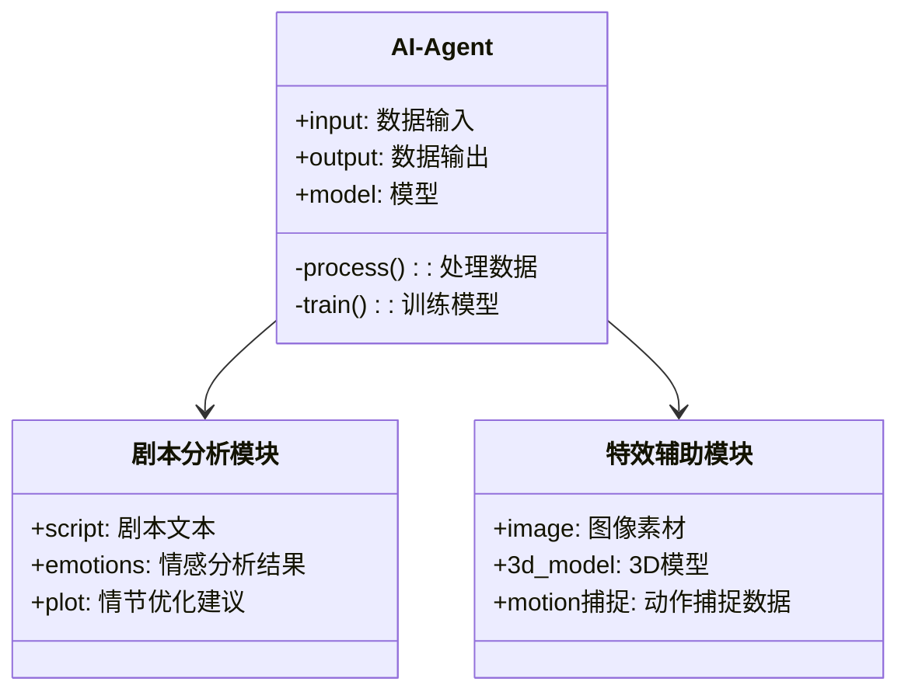
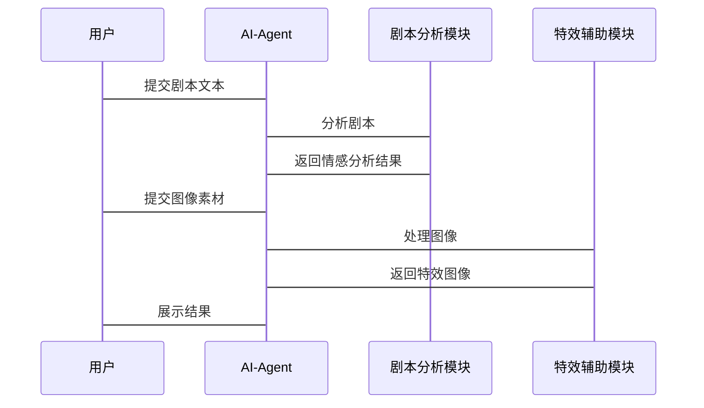

                 


# AI Agent在电影制作中的应用：剧本分析与特效辅助

## 关键词：AI Agent, 电影制作, 剧本分析, 特效辅助, 人工智能

## 摘要：AI Agent在电影制作中的应用涵盖了剧本分析与特效辅助两大领域。通过自然语言处理和计算机视觉技术，AI Agent能够辅助编剧优化剧本，指导特效团队进行高效的特效制作。本文将详细探讨AI Agent的核心概念、算法原理、系统架构，并通过项目实战展示其在电影制作中的具体应用，最后总结其对电影行业的影响及未来发展方向。

---

# 第1章: AI Agent与电影制作的背景介绍

## 1.1 AI Agent的基本概念
### 1.1.1 什么是AI Agent
AI Agent（人工智能代理）是指能够感知环境、执行任务以达到特定目标的智能实体。它通过传感器获取信息，并利用计算能力做出决策，执行动作以实现目标。

### 1.1.2 AI Agent的核心特征
AI Agent具有以下核心特征：
- **自主性**：能够在没有外部干预的情况下运行。
- **反应性**：能够根据环境变化做出实时响应。
- **目标导向性**：具有明确的目标，并通过行动实现目标。
- **学习能力**：能够通过数据和经验不断优化性能。

### 1.1.3 AI Agent与传统工具的区别
AI Agent与传统工具相比，具有更强的自主性和适应性，能够处理复杂任务并提供智能化解决方案。

## 1.2 电影制作的流程与挑战
### 1.2.1 电影制作的基本流程
电影制作通常包括前期准备、拍摄、后期制作三个阶段。每个阶段都需要大量的人力和时间投入。

### 1.2.2 传统电影制作中的痛点
- 剧本创作耗时耗力，需要反复修改。
- 特效制作成本高，技术复杂。
- 后期编辑需要大量人工筛选和调整。

### 1.2.3 AI技术在电影制作中的潜力
AI Agent可以通过自动化处理和智能优化，显著提高制作效率，降低成本。

---

# 第2章: AI Agent的核心概念与原理

## 2.1 AI Agent的定义与分类
### 2.1.1 AI Agent的定义
AI Agent是一种能够感知环境、执行任务并优化结果的智能实体。

### 2.1.2 AI Agent的分类
AI Agent可以分为以下几类：
- **基于规则的AI Agent**：通过预定义的规则进行决策。
- **基于机器学习的AI Agent**：通过数据训练模型进行决策。
- **基于知识图谱的AI Agent**：利用知识图谱进行推理和决策。

## 2.2 AI Agent的工作原理
### 2.2.1 数据输入与处理
AI Agent通过传感器或输入接口获取环境数据，并进行预处理。

### 2.2.2 模型训练与推理
基于训练数据，AI Agent训练模型，并根据输入数据进行推理，生成输出结果。

### 2.2.3 输出结果与反馈
AI Agent根据推理结果输出行动，并根据环境反馈进行优化。

## 2.3 AI Agent在剧本分析中的应用
### 2.3.1 剧本分析的基本流程
剧本分析包括文本理解、情感分析、情节优化等步骤。

### 2.3.2 AI Agent在剧本分析中的具体应用
- **文本理解**：利用自然语言处理技术理解剧本内容。
- **情感分析**：分析剧本中的情感倾向，帮助编剧优化情感表达。
- **情节优化**：通过算法推荐最佳情节安排，提升剧本吸引力。

### 2.3.3 AI Agent如何辅助编剧创作
AI Agent可以提供创意建议、自动校对和实时反馈，帮助编剧提高创作效率。

## 2.4 AI Agent在特效辅助中的应用
### 2.4.1 特效制作的基本流程
特效制作包括素材采集、后期处理、特效合成等步骤。

### 2.4.2 AI Agent在特效辅助中的具体应用
- **图像处理**：利用AI技术进行图像增强、修复和合成。
- **3D建模**：通过AI驱动的3D建模技术生成虚拟场景和角色。
- **动作捕捉**：AI Agent可以实时捕捉演员动作，辅助动画制作。

### 2.4.3 AI Agent如何优化特效制作
AI Agent可以通过自动化处理和智能优化，显著提高特效制作效率和质量。

---

# 第3章: AI Agent的算法原理与数学模型

## 3.1 剧本分析中的自然语言处理
### 3.1.1 基于词袋模型的剧本分析
词袋模型通过统计文本中的词语频率，进行剧本内容分析。

### 3.1.2 基于序列模型的剧本分析
序列模型（如LSTM）可以捕捉剧本中的序列信息，进行情感分析和情节预测。

### 3.1.3 基于图模型的剧本分析
图模型通过构建剧本中的角色关系图，进行情节优化和结构分析。

## 3.2 特效辅助中的计算机视觉
### 3.2.1 基于深度学习的图像处理
深度学习模型可以进行图像分割、目标检测，辅助特效制作。

### 3.2.2 基于三维重建的特效生成
通过三维重建技术，生成高质量的虚拟场景和角色。

### 3.2.3 基于光流估计的视频处理
光流估计技术可以实现视频的稳定和修复，辅助特效合成。

## 3.3 AI Agent的多模态融合
### 3.3.1 多模态数据的融合方法
多模态数据包括文本、图像、语音等，通过融合技术提升AI Agent的感知能力。

### 3.3.2 基于注意力机制的多模态融合
注意力机制可以聚焦于重要的信息，提升多模态数据的处理效果。

### 3.3.3 基于变换器的多模态融合
变换器模型通过自注意力机制，实现高效的多模态数据处理。

---

# 第4章: AI Agent的系统架构设计

## 4.1 问题场景介绍
电影制作中的剧本分析与特效辅助需要高效的系统架构支持。

## 4.2 项目介绍
本项目旨在开发一个基于AI Agent的电影制作辅助系统，涵盖剧本分析和特效辅助两大功能。

## 4.3 系统功能设计
### 4.3.1 领域模型（类图）


### 4.3.2 系统架构设计（架构图）
```mermaid
archiecture {
    AI-Agent [rectangle]
    剧本分析模块 [rectangle]
    特效辅助模块 [rectangle]
    AI-Agent --> 剧本分析模块
    AI-Agent --> 特效辅助模块
}
```

### 4.3.3 系统接口设计
- **剧本分析接口**：接收剧本文本，返回情感分析结果和情节优化建议。
- **特效辅助接口**：接收图像素材，返回处理后的特效图像。

### 4.3.4 系统交互（序列图）


---

# 第5章: AI Agent的项目实战

## 5.1 环境安装
- **Python**：安装Python 3.8及以上版本。
- **深度学习框架**：安装TensorFlow或PyTorch。
- **自然语言处理库**：安装spaCy或NLTK。
- **计算机视觉库**：安装OpenCV和深度估计库。

## 5.2 系统核心实现源代码
### 5.2.1 剧本分析模块代码
```python
import spacy

nlp = spacy.load("en_core_web_sm")

def analyze_script(script_text):
    doc = nlp(script_text)
    emotions = []
    for sentence in doc.sents:
        emotions.append(sentence.sentiment)
    return emotions

script_text = "This is a test script."
result = analyze_script(script_text)
print(result)
```

### 5.2.2 特效辅助模块代码
```python
import cv2

def process_image(image_path):
    img = cv2.imread(image_path)
    gray = cv2.cvtColor(img, cv2.COLOR_BGR2GRAY)
    cv2.imwrite("processed_image.jpg", gray)

process_image("input_image.jpg")
```

## 5.3 代码应用解读与分析
- **剧本分析模块**：使用spaCy进行情感分析，帮助编剧优化剧本。
- **特效辅助模块**：通过OpenCV进行图像处理，辅助特效制作。

## 5.4 实际案例分析
- **案例1**：使用AI Agent优化剧本情感分布，提升故事吸引力。
- **案例2**：利用AI Agent进行图像修复，提升特效质量。

## 5.5 项目小结
通过项目实战，展示了AI Agent在电影制作中的实际应用价值。

---

# 第6章: 总结与展望

## 6.1 总结
本文详细探讨了AI Agent在电影制作中的应用，包括剧本分析和特效辅助两大方面。通过算法原理和系统架构的设计，展示了AI技术在电影制作中的巨大潜力。

## 6.2 未来发展趋势与研究方向
- **多模态AI Agent**：进一步提升AI Agent的多模态感知能力。
- **实时协作**：探索AI Agent在实时协作中的应用。
- **智能化创作工具**：开发更加智能化的剧本创作和特效制作工具。

## 6.3 学习与实践建议
- **学习AI基础知识**：掌握机器学习、深度学习等技术。
- **实践项目**：参与电影制作相关的AI项目，积累实践经验。

---

# 作者：AI天才研究院/AI Genius Institute & 禅与计算机程序设计艺术 /Zen And The Art of Computer Programming

---

本文通过详细分析AI Agent在电影制作中的应用，展示了人工智能技术在现代电影制作中的重要性。希望本文能为电影制作行业带来新的思路和启发，推动电影制作技术的进一步发展。

