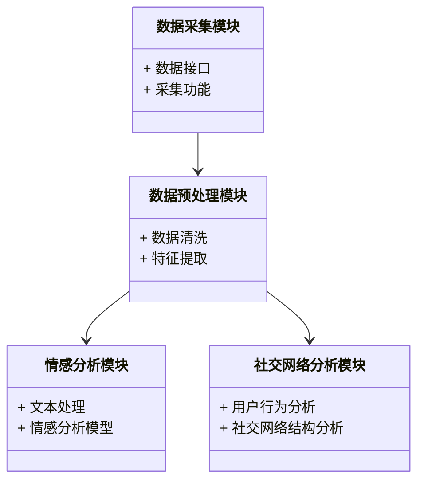
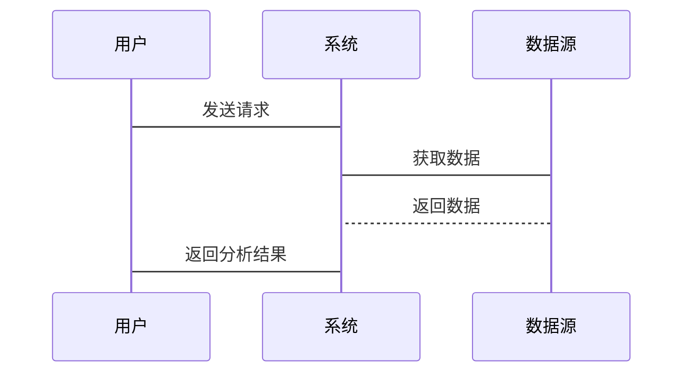

                 


# AI Agent在社交媒体分析中的应用

> 关键词：AI Agent, 社交媒体分析, 自然语言处理, 机器学习, 图神经网络, 社交网络分析

> 摘要：随着社交媒体的迅速发展，社交媒体分析成为企业和研究机构的重要课题。AI Agent在其中扮演着关键角色，通过自然语言处理、机器学习和图神经网络等技术，实现高效的数据分析和用户行为预测。本文将详细探讨AI Agent在社交媒体分析中的应用背景、核心算法、系统架构以及实际项目案例，帮助读者全面理解这一领域的技术细节和应用价值。

---

## 第一部分: AI Agent在社交媒体分析中的应用背景

### 第1章: 社交媒体分析的背景与挑战

#### 1.1 社交媒体分析的重要性

##### 1.1.1 社交媒体的定义与特点
社交媒体是指通过互联网平台进行信息分享、传播和互动的虚拟社区。其特点包括实时性、互动性、多样性以及用户生成内容的海量性。社交媒体平台包括微博、Twitter、Facebook等，每天产生海量的数据。

##### 1.1.2 社交媒体分析的核心目标
社交媒体分析的核心目标包括：
1. **情感分析**：分析用户对某个品牌或产品的看法。
2. **用户行为预测**：预测用户的下一步行为，如购买行为或内容偏好。
3. **社交网络分析**：分析用户之间的关系和影响力。

##### 1.1.3 社交媒体分析的挑战与机遇
社交媒体分析面临的主要挑战包括：
- 数据量大且多样化，处理复杂。
- 用户隐私保护问题。
- 网络噪声和虚假信息的干扰。

机遇则体现在：
- 提高企业的市场洞察力。
- 改善用户体验。
- 提升品牌影响力。

#### 1.2 AI Agent的基本概念

##### 1.2.1 AI Agent的定义与特点
AI Agent（智能代理）是指能够感知环境、自主决策并执行任务的智能实体。其特点包括：
1. **自主性**：能够在没有人工干预的情况下执行任务。
2. **反应性**：能够实时感知环境并做出反应。
3. **学习能力**：能够通过数据和经验进行自我优化。

##### 1.2.2 AI Agent的分类与应用场景
AI Agent可以根据功能分为以下几类：
1. **简单反射型**：基于规则进行简单决策。
2. **基于模型的反应型**：使用内部模型进行决策。
3. **目标驱动型**：根据目标驱动行为。
4. **实用驱动型**：基于效用函数进行决策。

应用场景包括：
- 自动化交易。
- 智能客服。
- 智能推荐系统。

#### 1.3 社交媒体分析的核心问题

##### 1.3.1 数据的多样性与复杂性
社交媒体数据包括文本、图片、视频等多种形式，且数据量巨大，处理起来具有挑战性。

##### 1.3.2 情感分析与用户行为预测
情感分析是判断用户对某个内容的情感倾向，通常分为正面、负面和中性。用户行为预测则是通过分析用户的互动历史，预测其未来的行为。

##### 1.3.3 社交网络结构分析
社交网络结构分析包括识别关键用户、发现社区结构以及分析用户之间的关系。

#### 1.4 AI Agent在社交媒体分析中的应用价值

##### 1.4.1 提高分析效率
AI Agent能够自动化处理大量数据，显著提高分析效率。

##### 1.4.2 增强结果准确性
通过机器学习和深度学习技术，AI Agent能够提高分析结果的准确性。

##### 1.4.3 实时监控与动态调整
AI Agent能够实时监控社交媒体数据，并根据变化动态调整分析策略。

---

## 第二部分: AI Agent与社交媒体分析的结合

### 第2章: AI Agent在社交媒体分析中的核心算法

#### 2.1 AI Agent在社交媒体分析中的角色

##### 2.1.1 数据采集与预处理
AI Agent能够自动化采集社交媒体数据，并进行清洗和预处理，为后续分析提供高质量的数据。

##### 2.1.2 情感分析与主题建模
AI Agent可以利用自然语言处理技术进行情感分析，并通过主题建模发现数据中的潜在主题。

##### 2.1.3 用户行为预测与社交网络分析
AI Agent可以通过分析用户的历史行为和社交网络结构，预测用户的未来行为。

#### 2.2 社交媒体分析的核心技术

##### 2.2.1 自然语言处理（NLP）
NLP技术用于处理和理解文本数据，包括分词、句法分析、情感分析等。

##### 2.2.2 机器学习与深度学习
机器学习和深度学习算法用于模式识别和数据挖掘，如支持向量机（SVM）、随机森林（Random Forest）、卷积神经网络（CNN）和循环神经网络（RNN）等。

##### 2.2.3 图神经网络与社交网络分析
图神经网络用于分析社交网络结构，发现社区和关键节点。

---

## 第三部分: AI Agent在社交媒体分析中的系统架构与设计

### 第3章: 系统架构设计

#### 3.1 问题场景介绍
假设我们开发一个社交媒体情感分析系统，AI Agent需要实时监控社交媒体数据，分析用户情感，并生成报告。

#### 3.2 系统功能设计

##### 3.2.1 领域模型设计
使用Mermaid类图描述系统功能模块：



#### 3.3 系统架构设计
使用Mermaid架构图描述系统架构：

```mermaid
architecturalDiagram
    component 前端 {
        Web界面
        用户交互
    }
    component 后端服务 {
        数据采集模块
        数据预处理模块
        情感分析模块
        社交网络分析模块
    }
    component 数据存储 {
        数据库
        文件存储
    }
    frontend --> 后端服务
    后端服务 --> 数据存储
```

#### 3.4 系统接口设计
系统接口包括：
- 数据采集接口：从社交媒体平台获取数据。
- 分析结果接口：返回情感分析和社交网络分析结果。
- 用户界面接口：展示分析结果。

#### 3.5 系统交互设计
使用Mermaid序列图描述系统交互：



---

## 第四部分: 项目实战

### 第4章: 项目实战

#### 4.1 环境搭建

##### 4.1.1 安装Python环境
使用Anaconda安装Python 3.8及以上版本。

##### 4.1.2 安装依赖库
安装必要的库：
```bash
pip install numpy pandas scikit-learn tensorflow
```

#### 4.2 系统核心实现

##### 4.2.1 数据采集模块
使用Twitter API采集实时数据：

```python
import tweepy

auth = tweepy.OAuthHandler(consumer_key, consumer_secret)
auth.set_access_token(access_token, access_token_secret)
api = tweepy.API(auth)

tweets = api.search(q=query, count=100)
```

##### 4.2.2 情感分析模块
使用预训练的情感分析模型进行分类：

```python
from tensorflow.keras.models import load_model
from tensorflow.keras.preprocessing.sequence import pad_sequences

model = load_model('sentiment_model.h5')
sequences = pad_sequences(tokenizer.texts_to_sequences(texts), maxlen=100)
predictions = model.predict(sequences)
```

##### 4.2.3 社交网络分析模块
使用图神经网络分析社交网络结构：

```python
import networkx as nx

G = nx.DiGraph()
G.add_edges_from(edges)
nx.draw(G, with_labels=True, node_color='red', edge_color='blue')
plt.show()
```

#### 4.3 项目小结
通过实际案例分析，展示了AI Agent在社交媒体分析中的应用价值，包括数据采集、情感分析和社交网络分析等模块。

---

## 第五部分: 高级主题与扩展

### 第5章: 高级主题与扩展

#### 5.1 AI Agent的自我学习能力
通过强化学习和迁移学习，AI Agent能够不断优化自身的分析能力。

#### 5.2 多模态分析
结合文本、图像和视频等多种数据形式，进行多模态分析。

#### 5.3 实时分析与动态调整
通过流数据处理技术，实现社交媒体数据的实时分析和动态调整。

#### 5.4 模型的可解释性
提高模型的可解释性，增强用户对分析结果的信任。

---

## 第六部分: 总结与展望

### 第6章: 总结与展望

#### 6.1 总结
本文详细探讨了AI Agent在社交媒体分析中的应用，涵盖了背景、算法、系统架构和项目实战等多个方面。

#### 6.2 未来展望
未来的研究方向包括：
1. 提高AI Agent的自我学习能力。
2. 推动多模态分析技术的发展。
3. 实现社交媒体分析的实时性和动态性。

---

## 作者信息

作者：AI天才研究院（AI Genius Institute） & 禅与计算机程序设计艺术（Zen And The Art of Computer Programming）

---

通过以上结构化的内容，您可以逐步撰写出一篇详尽且专业的技术博客文章，涵盖AI Agent在社交媒体分析中的各个方面，帮助读者深入理解这一领域的技术细节和应用价值。

