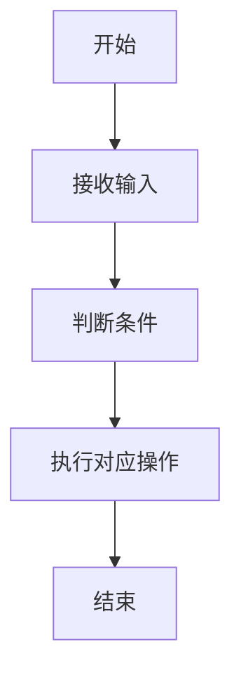
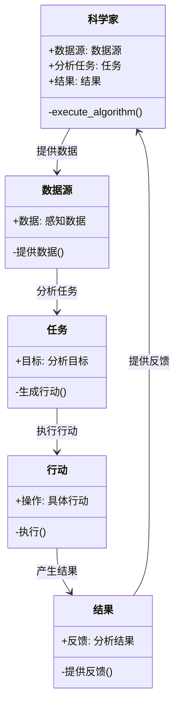

                 


# AI Agent在科学研究中的数据分析应用

> 关键词：AI Agent, 科学研究, 数据分析, 机器学习, 自动化决策

> 摘要：本文详细探讨了AI Agent在科学研究中的数据分析应用，从背景、核心概念、算法原理、系统架构到项目实战，全面解析其在科学数据分析中的重要性与实际应用。

---

## 第1章: AI Agent与科学研究数据分析的背景介绍

### 1.1 AI Agent的定义与核心概念

#### 1.1.1 AI Agent的基本定义
AI Agent（人工智能代理）是指能够感知环境、自主决策并执行任务的智能实体。它通过传感器获取信息，利用算法处理数据，做出决策，并通过执行器与环境交互。

#### 1.1.2 AI Agent的核心要素与组成
AI Agent的核心要素包括：
- **感知模块**：负责数据的采集和处理。
- **决策模块**：基于感知的数据进行分析和决策。
- **执行模块**：将决策结果转化为实际操作。

#### 1.1.3 AI Agent在科学研究中的定位与作用
在科学研究中，AI Agent能够帮助科学家处理海量数据、发现隐藏模式、优化实验设计，从而加速科研进程。

---

### 1.2 科学研究中的数据分析挑战

#### 1.2.1 数据分析在科学研究中的重要性
科学研究依赖于数据驱动的结论，数据分析是科研的核心环节。

#### 1.2.2 传统数据分析方法的局限性
传统数据分析方法依赖人工干预，效率低、覆盖面窄。

#### 1.2.3 AI Agent如何解决科学研究中的数据分析问题
AI Agent通过自动化处理、智能决策和实时反馈，显著提升了数据分析的效率和准确性。

---

## 第2章: AI Agent的核心概念与原理

### 2.1 AI Agent的感知、决策与执行机制

#### 2.1.1 感知模块
感知模块通过传感器或数据接口获取环境信息，例如实验数据、文献资料等。

#### 2.1.2 决策模块
决策模块基于感知数据，利用机器学习算法（如决策树、随机森林）进行分析和预测。

#### 2.1.3 执行模块
执行模块根据决策结果采取行动，例如调整实验参数、生成报告等。

### 2.2 AI Agent的实体关系架构

```mermaid
er
    actor: 科学家
    data_source: 数据源
    task: 分析任务
    action: 行动
    result: 结果
    actor --> data_source: 提供数据
    data_source --> task: 分析任务
    task --> action: 执行行动
    action --> result: 产生结果
    result --> actor: 提供反馈
```

---

## 第3章: AI Agent的算法原理与实现

### 3.1 基于规则的AI Agent算法

#### 3.1.1 算法流程


#### 3.1.2 算法实现代码
```python
def agent_algorithm(input_data):
    if input_data['condition']:
        return '执行操作1'
    else:
        return '执行操作2'
```

---

## 第4章: AI Agent的系统分析与架构设计

### 4.1 问题场景介绍
以环境数据监测为例，AI Agent需要实时分析传感器数据，预测环境变化并采取应对措施。

### 4.2 系统功能设计



---

## 第5章: AI Agent的项目实战

### 5.1 环境数据监测案例

#### 5.1.1 环境安装
安装必要的库，如Python的`numpy`, `pandas`, `scikit-learn`等。

#### 5.1.2 核心代码实现
```python
import numpy as np
import pandas as pd
from sklearn.tree import DecisionTreeClassifier

def main():
    # 模拟数据
    data = pd.DataFrame({
        '温度': np.random.normal(25, 2, 100),
        '湿度': np.random.normal(50, 10, 100),
        '标签': np.random.randint(0, 2, 100)
    })
    
    # 训练模型
    model = DecisionTreeClassifier()
    model.fit(data[['温度', '湿度']], data['标签'])
    
    # 预测
    prediction = model.predict([[25, 50]])
    print(f'预测结果: {prediction}')

if __name__ == "__main__":
    main()
```

#### 5.1.3 案例分析与结果解读
通过训练模型，AI Agent能够预测环境变化，帮助科学家制定应对策略。

---

## 第6章: 总结与展望

### 6.1 全文总结
AI Agent通过自动化和智能化的方式，显著提升了科学研究中的数据分析效率和准确性。

### 6.2 未来展望
AI Agent将在更多科学领域中发挥作用，例如药物研发、气候建模等。

### 6.3 最佳实践 Tips
- 确保数据质量，避免偏差。
- 定期更新模型，适应新数据。
- 结合领域知识，优化算法性能。

---

## 作者信息

作者：AI天才研究院/AI Genius Institute & 禅与计算机程序设计艺术 /Zen And The Art of Computer Programming

