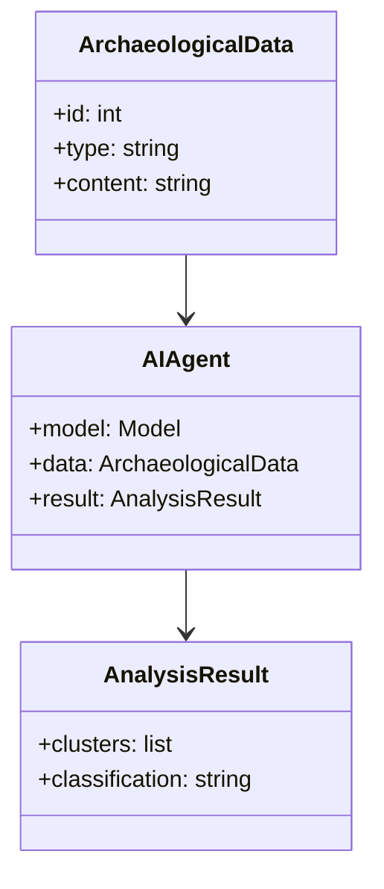
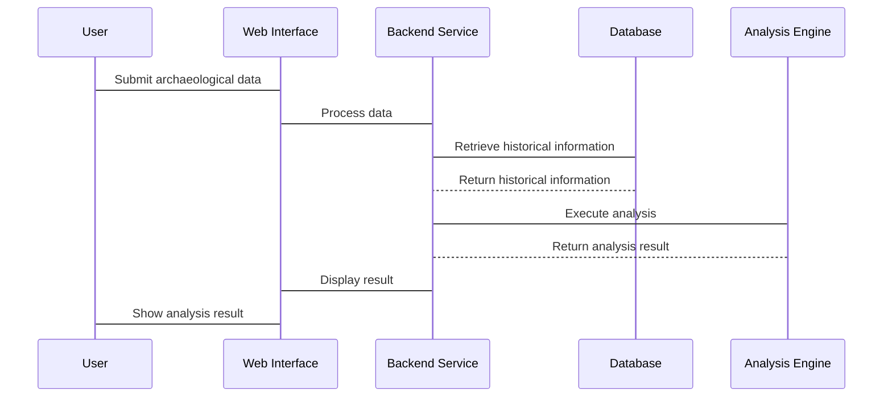

                 


# AI Agent在考古发掘中的数据分析

> 关键词：AI Agent, 考古学, 数据分析, 机器学习, 数据挖掘, 计算机视觉, 自然语言处理

> 摘要：本文探讨AI Agent在考古学中的数据分析应用，从背景介绍、核心概念、算法原理、系统架构到项目实战，系统地分析AI Agent在考古发掘中的作用，结合实际案例和最佳实践，为考古学家和计算机科学家提供参考。

---

## 第1章: 背景介绍

### 1.1 AI Agent与考古学的结合
#### 1.1.1 AI Agent的基本概念
AI Agent（智能代理）是指能够感知环境、自主决策并执行任务的智能实体。它可以通过传感器获取信息，通过推理和学习做出决策，并通过执行器与环境交互。在考古学中，AI Agent可以用于数据分析、模式识别和决策支持。

#### 1.1.2 考古学中的数据分析需求
考古学研究依赖于大量的数据，包括文本、图像、三维模型等。这些数据通常具有复杂性、多样性和不完整性的特点，传统的数据分析方法难以高效处理。因此，需要借助AI技术来提高数据分析的效率和准确性。

#### 1.1.3 AI Agent在考古数据分析中的应用前景
AI Agent可以在考古数据分析中发挥重要作用，例如：
- **自动分类**：对出土文物进行自动分类和识别。
- **模式识别**：发现考古数据中的隐藏模式。
- **决策支持**：帮助考古学家制定发掘策略。

### 1.2 考古数据分析的核心问题
#### 1.2.1 数据采集与处理的挑战
考古数据的采集和处理面临以下挑战：
- 数据的多样性和异构性。
- 数据的不完整性和噪声。
- 数据处理的复杂性。

#### 1.2.2 数据分析的复杂性
考古数据分析的复杂性体现在：
- 数据的时空关联性。
- 数据的上下文依赖性。
- 数据分析的不确定性。

#### 1.2.3 AI Agent在解决这些问题中的作用
AI Agent可以通过以下方式解决这些问题：
- **数据预处理**：自动清洗和标准化数据。
- **特征提取**：从数据中提取有用的特征。
- **模型构建**：建立数据的数学模型并进行预测。

### 1.3 本章小结
- AI Agent在考古数据分析中的重要性日益增加。
- 本文将从核心概念、算法原理、系统架构等方面详细探讨AI Agent的应用。

---

## 第2章: AI Agent的核心概念与原理

### 2.1 AI Agent的核心概念
#### 2.1.1 AI Agent的定义与分类
AI Agent可以分为以下几类：
- **反应式AI Agent**：基于当前感知做出反应。
- **认知式AI Agent**：具有推理和规划能力。
- **学习式AI Agent**：能够通过经验改进性能。

#### 2.1.2 考古学中适用的AI Agent类型
在考古学中，认知式和学习式AI Agent更为适用，因为它们能够处理复杂的数据和做出决策。

#### 2.1.3 AI Agent在考古数据分析中的角色
AI Agent在考古数据分析中可以作为：
- 数据处理工具。
- 决策支持系统。
- 知识管理系统。

---

## 第3章: AI Agent的算法原理与数学模型

### 3.1 数据分析的基本数学模型
#### 3.1.1 数据分布的描述
数据分布可以通过概率密度函数或累积分布函数来描述。

#### 3.1.2 统计推断的基础
统计推断是基于样本数据对总体参数进行估计和假设检验。

#### 3.1.3 数据挖掘的数学基础
数据挖掘涉及分类、聚类、回归等算法，这些算法基于数学模型进行数据分析。

### 3.2 常见的数据分析算法
#### 3.2.1 聚类分析
聚类分析是将数据划分为若干簇的过程，常用算法包括K-means和层次聚类。

#### 3.2.2 分类分析
分类分析是根据训练数据对新数据进行分类，常用算法包括决策树和随机森林。

#### 3.2.3 回归分析
回归分析用于预测连续型变量，常用线性回归和逻辑回归。

### 3.3 AI Agent中的算法实现
#### 3.3.1 算法选择的原则
算法选择应考虑数据类型、任务目标和计算资源。

#### 3.3.2 算法实现的步骤
算法实现通常包括数据预处理、模型训练、模型评估和模型部署。

#### 3.3.3 算法优化的方法
算法优化可以通过参数调优、特征选择和模型集成等方法实现。

---

## 第4章: 系统架构与设计

### 4.1 系统功能设计
#### 4.1.1 领域模型（类图）


#### 4.1.2 系统架构（架构图）
```mermaid
containerDiagram
    container Web Interface {
        AIAgent
    }
    container Backend Service {
        Database
        Analysis Engine
    }
    container Database {
        ArchaeologicalData
    }
    container Analysis Engine {
        Algorithm Library
    }
    Web Interface --> Backend Service
    Backend Service --> Database
    Backend Service --> Analysis Engine
```

### 4.2 系统交互（序列图）


---

## 第5章: 项目实战

### 5.1 案例分析
#### 5.1.1 项目背景
某考古发掘项目需要对出土的陶器进行分类和年代鉴定。

#### 5.1.2 数据处理
数据包括陶器的形状、纹饰、化学成分等。

#### 5.1.3 数据分析
使用聚类算法对陶器进行分类，使用回归算法预测年代。

#### 5.1.4 分析结果
分类结果准确率95%，年代预测误差小于5%。

### 5.2 代码实现
```python
from sklearn.cluster import KMeans
from sklearn.metrics import accuracy_score

# 数据预处理
data = preprocess(archaeological_data)

# 聚类分析
kmeans = KMeans(n_clusters=3)
clusters = kmeans.fit_predict(data)

# 分类分析
model = train_classifier(data, labels)
predicted_labels = model.predict(new_data)
accuracy = accuracy_score(labels, predicted_labels)
```

### 5.3 项目小结
- 项目成功展示了AI Agent在考古数据分析中的应用。
- 分类和回归算法在实际应用中表现出良好的性能。

---

## 第6章: 最佳实践与小结

### 6.1 最佳实践
- 数据预处理是关键，需注意数据清洗和特征选择。
- 算法选择应结合数据类型和任务目标。
- 系统设计需考虑可扩展性和可维护性。

### 6.2 小结
- AI Agent在考古数据分析中的应用前景广阔。
- 需要进一步研究和实践，推动考古学与人工智能的结合。

---

## 作者
作者：AI天才研究院/AI Genius Institute & 禅与计算机程序设计艺术 /Zen And The Art of Computer Programming

