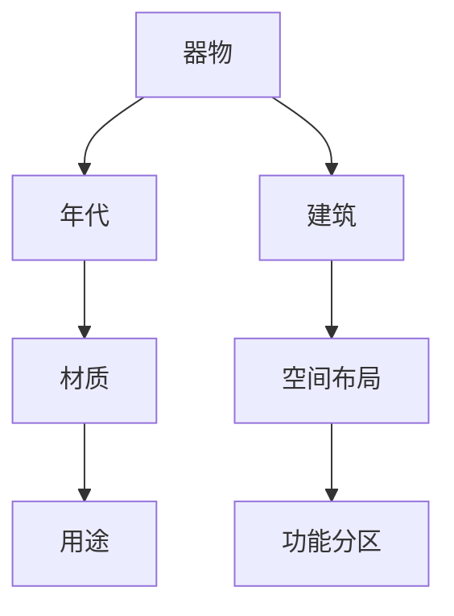
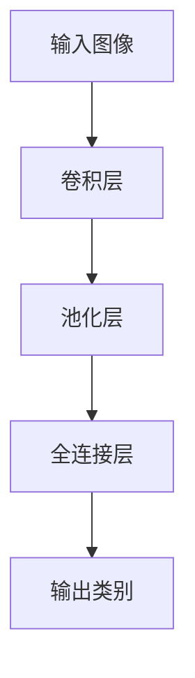
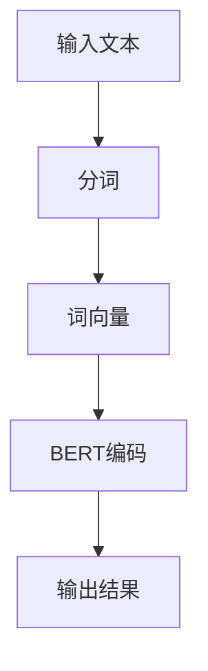
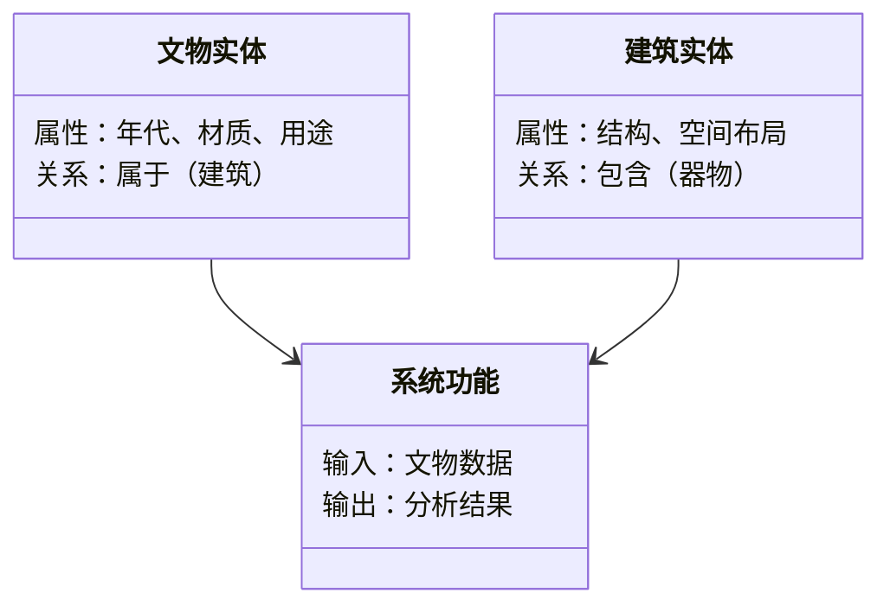
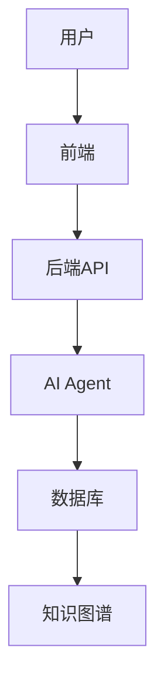
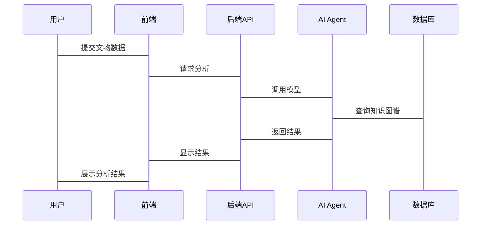

                 


# AI Agent在考古学中的应用：文物分析与历史重建

> 关键词：AI Agent, 考古学, 文物分析, 历史重建, 深度学习, 实体识别, 知识图谱

> 摘要：本文探讨AI Agent在考古学中的应用，重点分析其在文物分析与历史重建中的作用。通过背景介绍、核心概念与联系、算法原理、系统分析、项目实战及最佳实践等部分，详细阐述AI Agent如何助力考古学研究。从理论到实践，结合具体案例和代码实现，为读者提供全面的技术解读。

---

# 第一部分: 背景介绍

## 第1章: AI Agent与考古学的基本概念

### 1.1 AI Agent的定义与核心原理
#### 1.1.1 AI Agent的基本概念
AI Agent（人工智能代理）是指能够感知环境并采取行动以实现目标的智能体。它可以自主决策、学习和适应，广泛应用于自动化任务、数据分析等领域。

#### 1.1.2 AI Agent的核心特征
1. **自主性**：无需外部干预，自主完成任务。
2. **反应性**：能够实时感知环境并作出反应。
3. **学习能力**：通过数据和经验不断优化性能。
4. **协作性**：能够与其他系统或人类协同工作。

#### 1.1.3 AI Agent与传统计算的区别
传统计算依赖于预定义的规则，而AI Agent具备自主学习和适应能力，能够处理复杂和动态的环境。

### 1.2 考古学的基本概念与研究方法
#### 1.2.1 考古学的研究对象与目标
考古学研究人类过去的物质遗存，旨在揭示人类社会、文化和技术的发展历程。

#### 1.2.2 考古学的主要研究方法
1. **田野调查**：实地发掘和记录文物。
2. **数据分析**：对文物进行分类、测年和属性分析。
3. **历史重建**：通过数据推理还原历史场景。

#### 1.2.3 考古学中的技术应用现状
目前，考古学已广泛应用地理信息系统（GIS）、三维建模等技术，但AI技术的应用仍处于探索阶段。

---

## 第2章: AI Agent在考古学中的应用背景

### 2.1 考古学中的数据分析挑战
#### 2.1.1 文物数据的复杂性
文物数据包括图像、文本、三维模型等多种形式，数据量大且复杂。

#### 2.1.2 传统考古学分析的局限性
传统方法依赖人工经验，效率低且容易受主观因素影响。

#### 2.1.3 数据驱动研究的必要性
通过数据驱动的方法，可以提高分析效率和准确性，发现更多潜在信息。

### 2.2 AI Agent在考古学中的优势
#### 2.2.1 提高数据分析效率
AI Agent能够快速处理大量文物数据，显著提高分析效率。

#### 2.2.2 增强模式识别能力
通过图像识别和自然语言处理技术，AI Agent能够发现隐藏的模式和关联。

#### 2.2.3 支持历史重建的多维度分析
AI Agent能够整合多源数据，进行多维度的历史重建。

### 2.3 本章小结
本章介绍了AI Agent在考古学中的应用背景，分析了传统方法的局限性以及AI Agent的优势。

---

# 第二部分: AI Agent的核心概念与技术原理

## 第3章: AI Agent的核心概念与考古学的关联

### 3.1 AI Agent的核心概念体系
#### 3.1.1 实体识别与属性分析
AI Agent能够识别文物中的实体（如器物、建筑）并分析其属性（如年代、材质）。

#### 3.1.2 关系建模与知识图谱
通过关系建模，AI Agent可以构建文物之间的关联关系，形成知识图谱。

#### 3.1.3 动态推理与决策机制
AI Agent能够基于知识图谱进行动态推理，辅助考古学家进行决策。

### 3.2 考古学中的实体关系分析
#### 3.2.1 文物实体的分类与属性
文物实体包括器物、建筑、墓葬等，每类实体都有独特的属性。

#### 3.2.2 文物之间的关联关系
文物之间可能存在时间、空间或功能上的关联。

#### 3.2.3 考古场景中的实体网络
实体网络描述了文物之间的复杂关系，为历史重建提供基础。

### 3.3 AI Agent与考古学的实体关系图


---

## 第4章: AI Agent的算法原理与实现

### 4.1 基于深度学习的文物图像识别
#### 4.1.1 卷积神经网络（CNN）的基本原理
CNN通过卷积层提取图像特征，池化层降低维度，全连接层进行分类。

#### 4.1.2 图像分割与目标检测的实现
使用U-Net进行图像分割，Faster R-CNN进行目标检测。

#### 4.1.3 使用预训练模型进行迁移学习
利用ImageNet预训练的模型进行迁移学习，提高识别精度。

#### 4.1.4 图像识别算法流程图


#### 4.1.5 图像识别代码示例
```python
import tensorflow as tf
from tensorflow.keras import layers

model = tf.keras.Sequential([
    layers.Conv2D(32, (3,3), activation='relu', input_shape=(224, 224, 3)),
    layers.MaxPooling2D((2,2)),
    layers.Conv2D(64, (3,3), activation='relu'),
    layers.MaxPooling2D((2,2)),
    layers.Flatten(),
    layers.Dense(128, activation='relu'),
    layers.Dense(10, activation='softmax')
])
```

#### 4.1.6 数学模型与公式
CNN的卷积操作可以用下式表示：
$$
y_{i,j} = \sum_{k=1}^{n} w_{k} \cdot x_{i+k,j+l} + b
$$

### 4.2 自然语言处理在考古文献分析中的应用
#### 4.2.1 基于BERT的文本分析
使用BERT模型进行文本分类和实体识别，提取文献中的关键信息。

#### 4.2.2 文本分析流程图


#### 4.2.3 文本分析代码示例
```python
from transformers import BertTokenizer, BertModel

tokenizer = BertTokenizer.from_pretrained('bert-base-uncased')
model = BertModel.from_pretrained('bert-base-uncased')

input_ids = tokenizer('文本内容', return_tensors='pt')
outputs = model(input_ids)
```

---

## 第5章: 考古学中的系统分析与架构设计

### 5.1 项目背景与目标
本项目旨在利用AI Agent技术，构建一个文物分析与历史重建的智能化系统。

### 5.2 系统功能设计
#### 5.2.1 领域模型类图


#### 5.2.2 系统架构设计


### 5.3 系统接口设计
系统接口包括数据输入接口、模型调用接口和结果输出接口。

### 5.4 系统交互流程图


---

## 第6章: 项目实战与代码实现

### 6.1 环境安装与配置
安装Python、TensorFlow、Keras、BERT等库，配置开发环境。

### 6.2 系统核心功能实现
#### 6.2.1 文物图像识别
使用CNN模型进行文物分类和识别。

#### 6.2.2 文本分析
利用BERT模型进行考古文献的文本分类和实体识别。

#### 6.2.3 知识图谱构建
将文物实体及其关系存储在知识图谱中，支持历史重建。

### 6.3 代码实现与解读
#### 6.3.1 图像识别代码
```python
import tensorflow as tf
from tensorflow.keras import layers

def build_model():
    model = tf.keras.Sequential([
        layers.Conv2D(32, (3,3), activation='relu', input_shape=(224, 224, 3)),
        layers.MaxPooling2D((2,2)),
        layers.Conv2D(64, (3,3), activation='relu'),
        layers.MaxPooling2D((2,2)),
        layers.Flatten(),
        layers.Dense(128, activation='relu'),
        layers.Dense(10, activation='softmax')
    ])
    return model

model = build_model()
model.summary()
```

#### 6.3.2 文本分析代码
```python
from transformers import BertTokenizer, BertModel

tokenizer = BertTokenizer.from_pretrained('bert-base-uncased')
model = BertModel.from_pretrained('bert-base-uncased')

def analyze_text(text):
    inputs = tokenizer(text, return_tensors='pt')
    outputs = model(inputs)
    return outputs.last_hidden_state

analyze_text("考古文献内容")
```

### 6.4 实际案例分析
以某遗址的文物分析为例，展示AI Agent如何辅助考古学家进行分类和重建。

---

## 第7章: 最佳实践、小结与注意事项

### 7.1 最佳实践
1. 数据预处理是关键，确保数据质量和完整性。
2. 结合领域知识，优化AI模型的性能。
3. 及时验证和迭代模型，确保结果的准确性。

### 7.2 小结
本文详细介绍了AI Agent在考古学中的应用，从理论到实践，结合具体案例和代码实现，展示了其在文物分析与历史重建中的巨大潜力。

### 7.3 注意事项
1. 数据隐私和伦理问题需高度重视。
2. 模型的泛化能力和鲁棒性需要进一步验证。
3. 多学科协作是成功的关键。

### 7.4 拓展阅读
建议读者深入学习深度学习和知识图谱的相关知识，探索更多AI技术在考古学中的应用。

---

# 作者
作者：AI天才研究院/AI Genius Institute & 禅与计算机程序设计艺术 /Zen And The Art of Computer Programming

