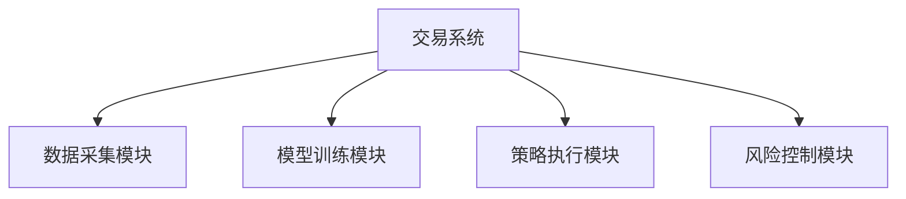
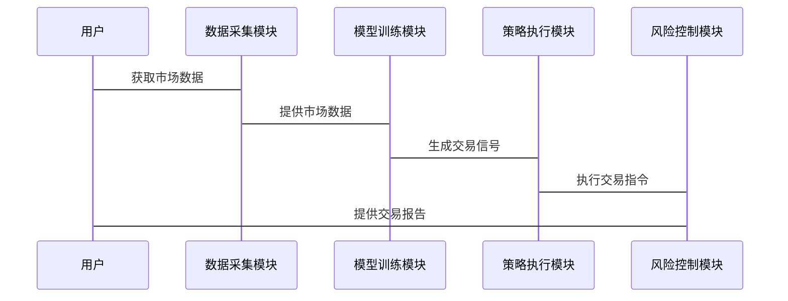

                 


# AI Agent在股票交易中的自动化策略

> **关键词**: AI Agent, 股票交易, 自动化策略, 机器学习, 强化学习, 交易系统

> **摘要**: 本文详细探讨了AI Agent在股票交易中的自动化策略，从基础概念到高级算法，结合系统设计与实战案例，深入剖析了AI Agent在股票交易中的应用原理、算法实现、系统架构及优化策略。通过本文，读者将全面了解如何利用AI技术构建高效的股票交易系统。

---

## 第一部分: AI Agent在股票交易中的基础知识

### 第1章: AI Agent的基本概念

#### 1.1 AI Agent的定义与特点

##### 1.1.1 什么是AI Agent
AI Agent（人工智能代理）是一种能够感知环境、自主决策并执行任务的智能实体。在股票交易中，AI Agent可以基于市场数据和历史信息，自动执行买入、卖出或其他交易操作。

**背景介绍**：AI Agent的核心概念包括感知、决策和执行。在股票交易中，AI Agent需要感知市场数据，如价格、成交量等，决策交易策略，并执行交易指令。

##### 1.1.2 AI Agent的核心特点
- **自主性**：AI Agent能够自主决策，无需人工干预。
- **反应性**：能够实时感知市场变化并快速做出反应。
- **学习能力**：通过机器学习不断优化交易策略。
- **适应性**：能够根据市场环境调整行为。

##### 1.1.3 AI Agent与传统算法的区别
传统的交易算法基于固定的规则，而AI Agent能够通过学习和适应市场变化，动态调整策略。例如，传统算法可能基于固定的技术指标进行买卖决策，而AI Agent可以通过强化学习不断优化买卖时机。

---

#### 1.2 AI Agent的类型

##### 1.2.1 基于规则的AI Agent
基于规则的AI Agent依赖于预定义的交易规则。例如，当股价突破某个技术指标时，触发买入信号。

##### 1.2.2 基于学习的AI Agent
基于学习的AI Agent通过机器学习模型（如神经网络）从历史数据中学习交易模式，生成交易信号。

##### 1.2.3 基于强化学习的AI Agent
基于强化学习的AI Agent通过与市场的交互，不断试错并优化交易策略，以最大化收益。

---

#### 1.3 AI Agent在金融领域的应用

##### 1.3.1 金融领域的AI Agent应用现状
目前，AI Agent在金融领域的应用主要集中在股票交易、风险管理、市场预测等方面。

##### 1.3.2 AI Agent在股票交易中的优势
- **高效性**：能够快速处理大量市场数据。
- **准确性**：通过机器学习模型，提高交易决策的准确性。
- **24/7运行**：能够全天候监控市场，捕捉交易机会。

##### 1.3.3 AI Agent的局限性与挑战
- **市场不可预测性**：AI Agent无法完全预测市场的突发事件。
- **数据质量**：依赖于高质量的历史数据，数据偏差可能影响模型性能。
- **监管合规性**：AI交易系统需要符合相关金融监管规定。

---

### 第2章: 股票交易的基础知识

#### 2.1 股票市场的基本运作

##### 2.1.1 股票市场的定义与结构
股票市场是投资者买卖公司股份的场所，主要参与者包括投资者、经纪商、交易所等。

##### 2.1.2 股票价格的波动机制
股票价格受多种因素影响，包括市场供需、公司业绩、宏观经济指标等。

##### 2.1.3 市场参与者的角色
- **投资者**：买入或卖出股票的个人或机构。
- **经纪商**：执行交易指令的中介。
- **交易所**：提供股票交易的平台。

#### 2.2 技术分析与基本面分析

##### 2.2.1 技术分析的基本概念
技术分析通过分析历史价格和成交量数据，预测未来价格走势。常用的技术指标包括K线图、MACD、RSI等。

##### 2.2.2 常用的技术指标
- **K线图**：显示一定时间段内的价格波动。
- **MACD**：移动平均收敛散度指标，用于判断趋势强度。
- **RSI**：相对强弱指数，用于判断超买或超卖状态。

##### 2.2.3 基本面分析的核心要素
基本面分析关注公司的财务状况、行业地位、盈利能力等，以评估股票的内在价值。

#### 2.3 交易策略的分类

##### 2.3.1 趋势跟踪策略
趋势跟踪策略基于价格趋势，买入上升趋势中的股票，卖出下降趋势中的股票。

##### 2.3.2 均值回归策略
均值回归策略假设价格会回归到历史平均水平，买入超跌股票，卖出超涨股票。

##### 2.3.3 组合策略与对冲策略
组合策略结合多种交易策略，降低单一策略的风险。对冲策略通过做多和做空相结合，降低市场风险。

---

## 第二部分: AI Agent在股票交易中的核心算法

### 第3章: AI Agent的核心算法原理

#### 3.1 机器学习算法在股票交易中的应用

##### 3.1.1 监督学习在股票预测中的应用
监督学习通过训练模型预测股票价格。例如，使用线性回归模型预测明天的价格：

$$ y = \beta_0 + \beta_1x + \epsilon $$

其中，$y$ 是预测价格，$x$ 是输入特征，$\beta_0$ 和 $\beta_1$ 是模型参数。

##### 3.1.2 非监督学习在异常检测中的应用
非监督学习用于检测市场异常情况，例如使用聚类算法识别市场波动的异常点。

##### 3.1.3 强化学习在交易策略优化中的应用
强化学习通过试错优化交易策略。例如，使用Q-learning算法：

$$ Q(s, a) = Q(s, a) + \alpha [r + \gamma \max Q(s', a') - Q(s, a)] $$

其中，$s$ 是状态，$a$ 是动作，$r$ 是奖励，$\gamma$ 是折扣因子。

---

#### 3.2 常用算法的数学模型与公式

##### 3.2.1 线性回归模型
线性回归模型用于预测股票价格：

$$ y = \beta_0 + \beta_1x_1 + \beta_2x_2 + \dots + \beta_nx_n + \epsilon $$

##### 3.2.2 支持向量机模型
支持向量机用于分类问题，例如预测股票上涨或下跌：

$$ \text{最大化} \quad \frac{1}{2}||\mathbf{w}||^2 $$
$$ \text{受限于} \quad y_i(\mathbf{w} \cdot \mathbf{x}_i + b) \geq 1 $$

##### 3.2.3 强化学习中的Q-learning算法
Q-learning算法用于优化交易策略：

$$ Q(s, a) = Q(s, a) + \alpha [r + \gamma \max Q(s', a') - Q(s, a)] $$

---

### 第4章: 系统设计与实现

#### 4.1 问题场景介绍
股票交易系统需要处理实时市场数据、执行交易指令，并监控市场风险。AI Agent需要实时感知市场变化，动态调整交易策略。

#### 4.2 项目介绍
本项目旨在构建一个基于AI Agent的股票交易系统，涵盖数据采集、模型训练、策略执行和风险控制等功能。

#### 4.3 系统功能设计
##### 4.3.1 数据采集模块
数据采集模块从多个数据源获取实时市场数据，包括股票价格、成交量、市场新闻等。

##### 4.3.2 模型训练模块
模型训练模块使用机器学习算法训练交易模型，生成交易信号。

##### 4.3.3 策略执行模块
策略执行模块根据交易信号执行买入或卖出指令。

##### 4.3.4 风险控制模块
风险控制模块监控交易风险，调整交易策略以降低风险。

#### 4.4 系统架构设计
##### 4.4.1 系统架构图


#### 4.5 系统接口设计
##### 4.5.1 数据接口
- 数据接口接收实时市场数据，格式为JSON或CSV。
- 数据接口提供历史数据查询功能。

##### 4.5.2 交易接口
- 交易接口接收交易指令，如买入或卖出。
- 交易接口提供订单状态查询功能。

#### 4.6 系统交互流程图


---

### 第5章: 项目实战

#### 5.1 环境安装
- 安装Python和相关库（如TensorFlow、Pandas、Matplotlib）。
- 安装交易接口API（如Interactive Brokers）。

#### 5.2 核心代码实现

##### 5.2.1 数据采集模块
```python
import pandas as pd
import requests

def get_market_data(symbol):
    url = f"https://api.example.com/stock/{symbol}"
    response = requests.get(url)
    data = response.json()
    return pd.DataFrame(data)
```

##### 5.2.2 模型训练模块
```python
import tensorflow as tf
from tensorflow.keras import layers

model = tf.keras.Sequential([
    layers.Dense(64, activation='relu'),
    layers.Dense(1, activation='sigmoid')
])
model.compile(optimizer='adam', loss='binary_crossentropy')
```

##### 5.2.3 策略执行模块
```python
import ibapi

def execute_trade(symbol, quantity, direction):
    ibapi.send_order(symbol=symbol, quantity=quantity, direction=direction)
```

#### 5.3 代码应用解读与分析
- 数据采集模块从API获取实时市场数据。
- 模型训练模块使用神经网络模型预测交易信号。
- 策略执行模块根据交易信号执行买入或卖出指令。

#### 5.4 实际案例分析
假设股票价格数据如下：

| 日期 | 收盘价 |
|------|--------|
| 2023-01-01 | 100 |
| 2023-01-02 | 105 |
| 2023-01-03 | 102 |

模型预测未来价格为108，触发买入信号。

---

## 第六部分: 高级主题与未来展望

### 第6章: 高级主题

#### 6.1 强化学习的前沿技术
强化学习在股票交易中的应用正在快速发展，例如多智能体强化学习和元学习。

#### 6.2 多智能体协作
多智能体协作可以提高交易策略的复杂性和效率，例如通过多个AI Agent协同工作，覆盖不同的市场领域。

#### 6.3 增量学习与在线学习
增量学习和在线学习允许AI Agent在不断变化的市场环境中持续优化策略。

---

### 第7章: 未来展望

#### 7.1 未来的技术趋势
随着AI技术的不断进步，AI Agent在股票交易中的应用将更加智能化和个性化。

#### 7.2 可解释性与透明度
未来的交易系统需要提高可解释性，帮助投资者理解AI决策的过程。

#### 7.3 伦理与监管
AI交易系统需要符合相关伦理规范，并接受监管机构的审查。

---

## 结语

通过本文的详细讲解，读者可以全面了解AI Agent在股票交易中的自动化策略，从基础概念到高级算法，再到系统设计与实战案例，逐步掌握如何利用AI技术构建高效的股票交易系统。

---

**作者：AI天才研究院/AI Genius Institute & 禅与计算机程序设计艺术 /Zen And The Art of Computer Programming**

