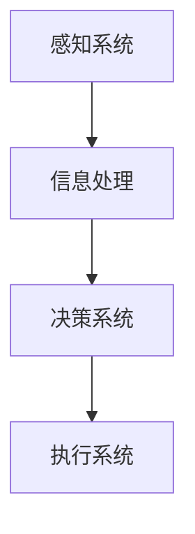

                 


# AI Agent在自动驾驶中的决策系统

> 关键词：AI Agent, 自动驾驶, 决策系统, 人工智能, 机器学习

> 摘要：本文详细探讨了AI Agent在自动驾驶中的决策系统，从基本概念到算法原理，再到系统架构和项目实战，全面解析了AI Agent在自动驾驶决策中的作用和实现方式。通过分析不同算法的优缺点，结合实际案例，本文为自动驾驶决策系统的开发和优化提供了有价值的见解。

---

## 第一章: AI Agent在自动驾驶中的应用概述

### 1.1 自动驾驶的背景与现状

自动驾驶技术近年来取得了显著进展，从辅助驾驶到完全自动驾驶，AI技术在其中扮演了至关重要的角色。AI Agent作为自动驾驶系统的核心组件，负责处理复杂的决策任务。

#### 1.1.1 自动驾驶的发展历程

- 20世纪80年代：自动驾驶概念的提出
- 20世纪90年代：初步实现自动驾驶技术
- 21世纪：AI技术推动自动驾驶快速发展

#### 1.1.2 当前自动驾驶技术的核心挑战

- 复杂环境的感知与理解
- 紧急情况下的快速决策
- 多目标优化的平衡

#### 1.1.3 AI Agent在自动驾驶中的作用

AI Agent通过感知、推理和执行，帮助自动驾驶系统做出最优决策，确保行车安全和效率。

### 1.2 AI Agent的基本概念与特点

#### 1.2.1 AI Agent的定义

AI Agent是一种智能体，能够感知环境、自主决策并执行动作，以实现特定目标。

#### 1.2.2 AI Agent的核心特点

| 特性 | 描述 |
|------|------|
| 智能性 | 能够理解和处理复杂信息 |
| 自主性 | 能够独立决策和行动 |
| 反应性 | 能够实时响应环境变化 |
| 学习性 | 能够通过经验优化决策 |

#### 1.2.3 AI Agent与传统控制系统的区别

- **传统控制系统**：基于预设规则，响应固定输入。
- **AI Agent**：具备学习和适应能力，能够处理复杂和不确定的环境。

### 1.3 自动驾驶决策系统的重要性

#### 1.3.1 决策系统在自动驾驶中的位置

决策系统是自动驾驶的核心模块，负责处理感知系统提供的信息，并输出控制指令。

#### 1.3.2 决策系统的功能与目标

- **功能**：处理多目标优化，确保行车安全和效率。
- **目标**：实现自动驾驶车辆的智能决策。

#### 1.3.3 决策系统的性能指标

| 指标 | 描述 |
|------|------|
| 响应时间 | 决策的延迟 |
| 安全性 | 决策的正确性 |
| 适应性 | 处理复杂场景的能力 |

---

## 第二章: AI Agent的核心概念与原理

### 2.1 AI Agent的类型与分类

#### 2.1.1 基于规则的AI Agent

- **定义**：基于预设规则进行决策。
- **优点**：简单、高效。
- **缺点**：难以处理复杂和动态环境。

#### 2.1.2 基于机器学习的AI Agent

- **定义**：通过学习数据模式进行决策。
- **优点**：适应性强，能够处理复杂场景。
- **缺点**：需要大量数据和计算资源。

#### 2.1.3 基于强化学习的AI Agent

- **定义**：通过与环境交互学习最优策略。
- **优点**：能够处理动态和不确定性环境。
- **缺点**：训练周期长，需要大量数据。

### 2.2 AI Agent的工作原理

#### 2.2.1 信息感知与处理

AI Agent通过传感器（如摄像头、激光雷达）获取环境信息，并进行处理和理解。

#### 2.2.2 行为决策

AI Agent基于处理后的信息，选择最优的行为策略。

#### 2.2.3 执行与反馈

AI Agent执行决策，并根据反馈调整后续行为。

### 2.3 AI Agent的决策过程分析

#### 2.3.1 问题建模

- **定义**：将决策问题转化为数学模型。
- **例子**：路径规划问题。

#### 2.3.2 状态空间与动作空间

- **状态空间**：所有可能的环境状态。
- **动作空间**：AI Agent可以执行的所有动作。

#### 2.3.3 决策策略的选择

- **策略函数**：$\pi(a|s)$，表示在状态$s$下选择动作$a$的概率。

---

## 第三章: AI Agent在自动驾驶中的算法原理

### 3.1 基于规则的决策算法

#### 3.1.1 规则的定义与实现

- **规则示例**：前方有障碍物，立即减速。

#### 3.1.2 基于规则的决策优缺点

| 优点 | 缺点 |
|------|------|
| 简单、高效 | 适应性差 |

### 3.2 基于机器学习的决策算法

#### 3.2.1 机器学习的基本原理

- **监督学习**：基于标记数据进行分类或回归。
- **无监督学习**：发现数据中的潜在结构。

#### 3.2.2 常见的机器学习算法在决策中的应用

- **支持向量机 (SVM)**：用于分类任务。
- **随机森林 (RF)**：用于回归和分类任务。

### 3.3 基于强化学习的决策算法

#### 3.3.1 强化学习的基本原理

- **奖励机制**：通过奖励函数指导学习方向。

#### 3.3.2 Q-learning算法在决策中的应用

- **数学模型**：
  - $Q(s, a) = Q(s, a) + \alpha (r + \gamma \max Q(s', a') - Q(s, a))$
  - 其中，$\alpha$是学习率，$\gamma$是折扣因子。

#### 3.3.3 实例分析

- **实例**：自动驾驶在交叉路口的决策。

---

## 第四章: 自动驾驶决策系统的架构与设计

### 4.1 系统功能设计

#### 4.1.1 信息处理模块

- **功能**：处理传感器数据，提取有用信息。

#### 4.1.2 决策模块

- **功能**：基于信息处理模块的输出，做出决策。

#### 4.1.3 执行模块

- **功能**：将决策指令转化为具体动作。

### 4.2 系统架构图



### 4.3 接口设计

#### 4.3.1 感知系统接口

- **输入**：传感器数据（如激光雷达、摄像头）。
- **输出**：处理后的环境信息。

#### 4.3.2 执行系统接口

- **输入**：决策指令（如转向、加速）。
- **输出**：车辆控制信号。

---

## 第五章: 项目实战

### 5.1 环境安装

- **工具**：Python、NumPy、TensorFlow、Mermaid。

### 5.2 系统核心实现源代码

```python
import numpy as np

def decision_agent(sensor_data):
    # 处理传感器数据
    processed_data = preprocess(sensor_data)
    # 调用决策算法
    action = q_learning_algorithm(processed_data)
    return action

def preprocess(sensor_data):
    # 数据预处理
    return processed_data

def q_learning_algorithm(state):
    # Q-learning算法实现
    action = np.argmax(q_table[state])
    return action
```

### 5.3 代码应用解读与分析

- **代码功能**：AI Agent接收传感器数据，进行预处理，然后通过Q-learning算法做出决策。

---

## 第六章: 总结

### 6.1 最佳实践 tips

- **数据质量**：高质量的数据是训练AI Agent的关键。
- **算法选择**：根据场景选择合适的算法。

### 6.2 小结

AI Agent在自动驾驶中的决策系统是一个复杂的系统，需要结合多种技术进行优化。

### 6.3 注意事项

- **安全性**：确保决策系统的安全性。
- **可解释性**：决策过程需要可解释。

### 6.4 拓展阅读

- 推荐阅读《强化学习导论》和《自动驾驶技术详解》。

---

**作者：AI天才研究院/AI Genius Institute & 禅与计算机程序设计艺术 /Zen And The Art of Computer Programming**

---

通过以上步骤，我们详细探讨了AI Agent在自动驾驶中的决策系统，从基本概念到算法实现，再到系统设计和项目实战，为自动驾驶技术的发展提供了有价值的参考。

