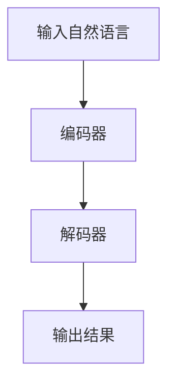
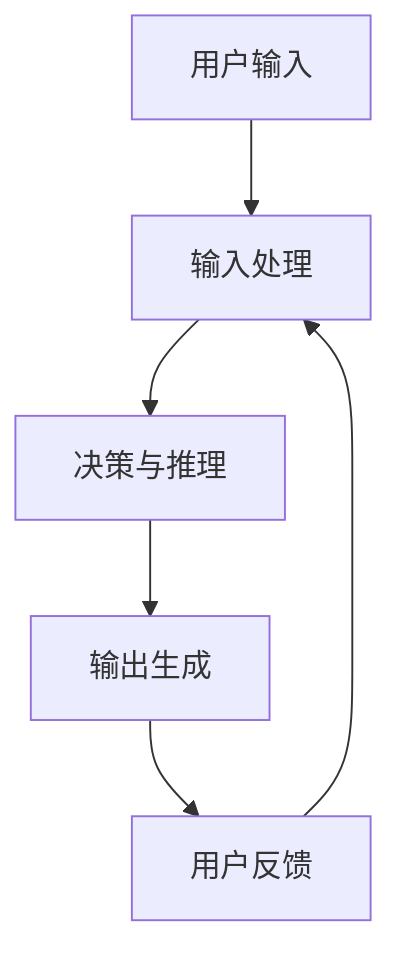

                 


# AI Agent在自然语言处理中的最新进展与应用

> 关键词：AI Agent, 自然语言处理, 大语言模型, 强化学习, 知识图谱, 多模态模型, 实时对话

> 摘要：本文将深入探讨AI Agent在自然语言处理中的最新进展与应用。通过分析AI Agent的核心概念、算法原理、系统架构设计以及实际案例，本文旨在帮助读者全面理解AI Agent与自然语言处理的结合方式，及其在当前技术环境下的应用潜力。我们还将探讨AI Agent在复杂场景中的应用，如多语言处理、实时对话和知识图谱构建等，并展望未来的发展趋势。

---

## 第一部分: AI Agent与自然语言处理的背景与基础

### 第1章: AI Agent与自然语言处理概述

#### 1.1 AI Agent的基本概念

- **AI Agent的定义与特点**
  - AI Agent是一种智能体，能够感知环境、执行任务并做出决策。
  - 其特点包括自主性、反应性、目标导向性和学习能力。

- **自然语言处理的定义与核心任务**
  - 自然语言处理（NLP）是研究计算机如何理解和生成人类语言的科学。
  - 核心任务包括分词、词性标注、句法分析、语义理解、文本生成等。

- **AI Agent与自然语言处理的结合**
  - AI Agent通过NLP技术实现与用户的自然语言交互。
  - NLP为AI Agent提供理解和生成语言的能力。

#### 1.2 AI Agent在自然语言处理中的作用

- **提供智能化的交互界面**
  - AI Agent通过NLP技术实现与用户的自然语言对话。
  - 例如，智能客服系统通过NLP理解用户需求并生成回复。

- **实现复杂任务的自动化**
  - AI Agent利用NLP技术自动化处理复杂任务。
  - 例如，自动摘要生成、信息抽取和文本分类。

- **优化自然语言处理的性能**
  - AI Agent通过反馈机制优化NLP模型的表现。
  - 例如，基于用户反馈调整生成模型的输出。

#### 1.3 本章小结

- 本章介绍了AI Agent和自然语言处理的基本概念及其结合方式。
- 强调了AI Agent在自然语言处理中的重要作用，包括提供智能化交互界面、实现复杂任务自动化以及优化NLP性能。

---

## 第二部分: AI Agent的算法原理与数学模型

### 第2章: 大语言模型与AI Agent的结合原理

#### 2.1 大语言模型的算法原理

- **Transformer模型的结构与特点**
  - Transformer由编码器和解码器组成，采用自注意力机制。
  - 与LSTM相比，Transformer在并行计算和长距离依赖捕捉方面更具优势。

- **注意力机制的数学公式**
  - 注意力机制通过计算输入序列中每个词的重要性来生成输出。
  - 公式：
    $$
    \text{Attention}(Q, K, V) = \text{softmax}(\frac{QK^T}{\sqrt{d_k}})V
    $$

- **模型训练的数学模型**
  - 模型训练采用交叉熵损失函数。
  - 公式：
    $$
    \mathcal{L} = -\sum_{i=1}^{n} \log p(y_i|x)
    $$

#### 2.2 AI Agent的决策机制

- **基于强化学习的决策过程**
  - AI Agent通过强化学习优化其决策策略。
  - 奖励函数定义为用户的满意度，通过策略梯度方法更新模型参数。

- **决策树与概率模型的结合**
  - AI Agent利用决策树进行快速分类，同时结合概率模型进行精确预测。
  - 例如，使用ID3算法构建决策树，并结合贝叶斯网络进行概率推理。

- **动态规划在AI Agent中的应用**
  - AI Agent通过动态规划解决多步决策问题。
  - 状态转移方程：
    $$
    V(s) = \max_{a} [r(s,a) + \gamma V(s')]
    $$

#### 2.3 算法原理的mermaid流程图



#### 2.4 本章小结

- 本章详细介绍了大语言模型与AI Agent的结合原理。
- 展示了注意力机制和强化学习在AI Agent中的应用。
- 通过mermaid流程图展示了模型的基本工作流程。

---

## 第三部分: 自然语言处理中的最新技术进展

### 第3章: 最新NLP技术与AI Agent的融合

#### 3.1 大语言模型的最新进展

- **GPT-4的创新与突破**
  - GPT-4具有更强的多模态能力和更高的生成质量。
  - 支持更复杂的对话和多语言处理。

- **多模态模型的发展**
  - 多模态模型结合文本、图像和语音等多种信息源。
  - 例如，视觉-语言模型（VLM）在图像描述生成和问答系统中的应用。

- **小样本学习的进展**
  - 小样本学习（Few-shot Learning）通过迁移学习和元学习技术减少对大量数据的依赖。
  - 例如，使用Prompt Engineering技术引导模型在小样本数据上进行高效学习。

#### 3.2 AI Agent在复杂场景中的应用

- **跨语言处理与多语言模型**
  - AI Agent支持多种语言的自然语言处理。
  - 使用多语言模型如Marian或_mBART进行跨语言对话。

- **实时对话与动态推理**
  - AI Agent通过实时推理生成对话回复。
  - 采用流式生成技术和动态注意力机制提高生成效率。

- **知识图谱的构建与应用**
  - AI Agent利用知识图谱进行上下文理解和推理。
  - 知识图谱构建方法包括本体工程、数据抽取和语义网络构建。

#### 3.3 本章小结

- 本章探讨了大语言模型和AI Agent的最新进展。
- 介绍了AI Agent在复杂场景中的应用，包括多模态处理、实时对话和知识图谱构建。

---

## 第四部分: AI Agent的系统架构与设计

### 第4章: AI Agent的系统架构设计

#### 4.1 系统功能模块划分

- **输入处理模块**
  - 负责接收用户输入并进行预处理。
  - 包括分词、词性标注和句法分析。

- **决策与推理模块**
  - 负责根据输入生成决策策略。
  - 采用强化学习和动态规划技术优化决策过程。

- **输出生成模块**
  - 负责生成最终的输出结果。
  - 使用大语言模型生成自然语言回复。

#### 4.2 系统架构的mermaid图



#### 4.3 本章小结

- 本章详细介绍了AI Agent的系统架构设计。
- 展示了系统功能模块的划分及其相互关系。

---

## 第五部分: 项目实战

### 第5章: 项目实战

#### 5.1 环境安装

- **安装Python和相关库**
  - 使用pip安装Python 3.9及以上版本。
  - 安装库：`transformers`, `torch`, `scikit-learn`, `networkx`

#### 5.2 核心实现

- **输入处理模块的实现**
  ```python
  def preprocess(text):
      # 分词
      tokens = text.split()
      return tokens
  ```

- **决策与推理模块的实现**
  ```python
  def decide(tokens):
      # 基于决策树的分类
      # 假设tokens表示用户需求
      return '生成报告'
  ```

- **输出生成模块的实现**
  ```python
  from transformers import AutoModelForCausalLM, AutoTokenizer

  def generate_output(tokens):
      model_name = 'gpt2'
      tokenizer = AutoTokenizer.from_pretrained(model_name)
      model = AutoModelForCausalLM.from_pretrained(model_name)
      inputs = tokenizer.encode(' '.join(tokens), return_tensors='pt')
      outputs = model.generate(inputs, max_length=100)
      return tokenizer.decode(outputs[0], skip_special_tokens=True)
  ```

#### 5.3 实际案例分析

- **案例：智能客服系统**
  - 用户输入：我需要一份季度报告。
  - 系统处理：
    1. 输入处理模块将输入分词为['我', '需要', '一份', '季度', '报告']。
    2. 决策与推理模块决定生成报告。
    3. 输出生成模块生成回复：“好的，我将为您生成一份季度报告，请提供相关数据。”

#### 5.4 本章小结

- 本章通过实际案例展示了AI Agent的系统实现。
- 提供了详细的代码实现和案例分析，帮助读者理解AI Agent的应用。

---

## 第六部分: 总结与展望

### 第6章: 总结与展望

#### 6.1 本章总结

- 本文全面探讨了AI Agent在自然语言处理中的最新进展与应用。
- 从算法原理到系统架构，再到实际案例，详细介绍了AI Agent的核心技术。

#### 6.2 未来展望

- **技术融合：AI Agent与多模态模型的进一步结合**
- **性能优化：更高效的大语言模型训练方法**
- **应用拓展：AI Agent在教育、医疗等领域的深度应用**

---

## 参考文献

（此处可以列出相关的参考文献和扩展阅读资料）

---

## 作者

作者：AI天才研究院/AI Genius Institute & 禅与计算机程序设计艺术 /Zen And The Art of Computer Programming

---

以上是《AI Agent在自然语言处理中的最新进展与应用》的完整目录和部分文章内容，具体内容可以根据实际需要进一步扩展和详细化。

