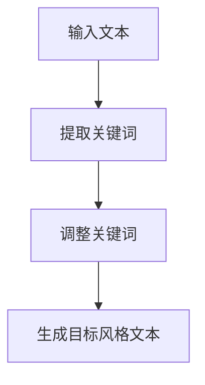
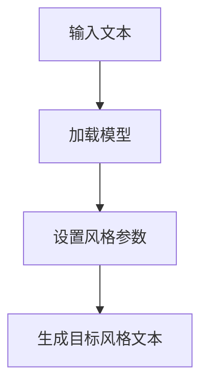
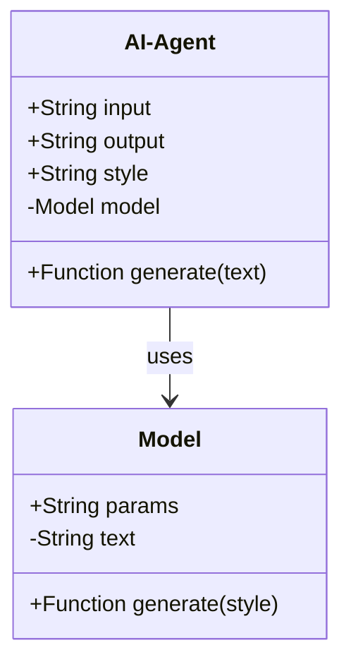
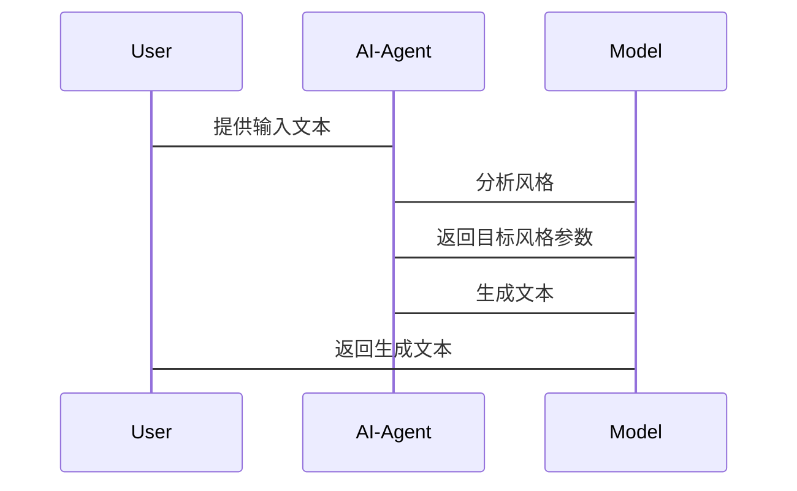

                 


# AI Agent在自然语言生成中的风格转换与控制

**关键词**：AI Agent, 自然语言生成, 风格转换, 风格控制, 文本生成, 语言风格, 深度学习

**摘要**：本文探讨了AI Agent在自然语言生成中的风格转换与控制，分析了其核心概念、算法原理、系统架构设计及实际应用。通过详细讲解基于规则和模型的风格转换方法，结合实际案例，展示了如何实现风格转换与控制，为相关研究和应用提供了参考。

---

# 正文

## 第一部分: AI Agent与自然语言生成基础

### 第1章: AI Agent与自然语言生成概述

#### 1.1 问题背景与定义

**1.1.1 自然语言生成的定义与特点**

自然语言生成（Natural Language Generation, NLG）是将结构化数据转换为自然语言文本的过程。其特点包括：数据驱动、语义准确、语言流畅。NLG在对话系统、机器翻译等领域有广泛应用。

**1.1.2 AI Agent在自然语言生成中的作用**

AI Agent作为智能体，负责接收输入、分析需求、生成响应。在NLG中，AI Agent通过风格转换和控制，确保生成文本符合特定风格和用户需求。

**1.1.3 风格转换与控制的背景与意义**

风格转换与控制是根据需求调整文本的语气、语调等。其意义在于提升用户体验，满足不同场景的需求，如正式、轻松、技术性等风格切换。

#### 1.2 AI Agent的核心概念

**1.2.1 AI Agent的基本定义**

AI Agent是具有感知环境、决策、执行能力的智能实体。在NLG中，AI Agent负责接收输入、处理并生成自然语言输出。

**1.2.2 自然语言生成的流程与关键环节**

1. 输入处理：解析用户需求。
2. 内容生成：基于模型生成文本。
3. 风格转换：调整文本风格。
4. 输出：生成符合要求的文本。

**1.2.3 风格转换与控制的实现机制**

通过分析文本特征，调整生成模型的参数，实现风格切换。常用方法包括基于规则和基于模型的风格控制。

#### 1.3 技术发展与应用领域

**1.3.1 自然语言生成技术的发展历程**

从基于规则的系统到深度学习模型，NLG技术不断进步，生成质量显著提升。

**1.3.2 AI Agent在不同领域的应用实例**

- 电商：个性化推荐。
- 医疗：生成诊断报告。
- 教育：智能辅导系统。

**1.3.3 风格转换与控制的前沿研究**

研究热点包括多风格生成、实时风格切换等，未来将更注重个性化和高效性。

---

## 第二部分: AI Agent的风格转换与控制机制

### 第2章: AI Agent的风格分析与转换原理

#### 2.1 风格分析的核心方法

**2.1.1 基于特征的风格分析**

通过分析文本中的词汇、句式等特征，判断文本风格。优点是简单，缺点是不够精细。

**2.1.2 基于模型的风格分析**

使用深度学习模型（如LSTM、Transformer）学习风格特征。优点是准确，缺点是计算复杂。

**2.1.3 风格分析的优缺点对比**

| 方法 | 优点 | 缺点 |
|------|------|------|
| 基于特征 | 简单 | 精度低 |
| 基于模型 | 高精度 | 计算复杂 |

#### 2.2 风格转换的实现机制

**2.2.1 基于规则的风格转换**

通过预定义规则，如替换词汇、调整句式，改变文本风格。适用于简单场景，复杂场景效果有限。

**2.2.2 基于模型的风格转换**

使用预训练模型（如风格迁移模型）调整生成文本的风格。灵活性高，效果佳。

**2.2.3 风格转换的评估指标**

- BLEU：评估生成文本与目标风格文本的相似度。
- ROUGE：评估生成文本的信息丰富度。

#### 2.3 风格控制的实现方法

**2.3.1 风格控制的基本概念**

通过参数调节或用户反馈，控制生成文本的风格。

**2.3.2 基于参数调节的风格控制**

调整生成模型的超参数，影响生成文本的风格。如温度（temperature）控制生成的多样性和创造性。

**2.3.3 基于用户反馈的风格控制**

通过用户反馈不断优化生成风格，实现动态调整。

---

## 第三部分: AI Agent的风格转换算法原理

### 第3章: 风格转换的算法原理

#### 3.1 基于规则的风格转换算法

**3.1.1 算法原理与实现步骤**

1. 分析输入文本，提取关键词和句式。
2. 根据预定义规则，调整关键词和句式，生成目标风格文本。

**3.1.2 算法优缺点分析**

优点：简单易实现。缺点：难以处理复杂风格转换。

**3.1.3 算法流程图（使用mermaid）**



#### 3.2 基于模型的风格转换

**3.2.1 基于模型的风格转换算法原理**

使用预训练的生成模型，通过条件调整生成文本的风格。

**3.2.2 基于模型的风格转换实现步骤**

1. 加载预训练模型。
2. 设置目标风格参数。
3. 生成符合目标风格的文本。

**3.2.3 算法流程图（使用mermaid）**



**3.2.4 Python代码示例**

```python
import torch
from model import StyleTransferModel

def transfer_style(input_text, target_style):
    model = StyleTransferModel()
    with torch.no_grad():
        output = model.generate(input_text, target_style)
    return output
```

**3.2.5 算法数学模型和公式**

生成模型通常使用Transformer架构，其解码器部分通过自注意力机制捕捉文本特征。风格控制通过调整解码器的参数实现。公式如下：

$$ P(y|x) = \text{Model}(x, style\_params) $$

---

## 第四部分: 系统架构设计

### 第4章: 系统架构设计

#### 4.1 问题场景介绍

构建一个支持多风格转换的自然语言生成系统，满足不同用户的需求。

#### 4.2 系统功能设计

- 文本输入与解析。
- 风格分析与选择。
- 文本生成与输出。

#### 4.3 系统架构设计（使用mermaid）



#### 4.4 系统接口设计

- 输入接口：接收用户输入和风格选择。
- 输出接口：返回生成文本。

#### 4.5 系统交互流程（使用mermaid）



---

## 第五部分: 项目实战

### 第5章: 项目实战

#### 5.1 环境安装

安装所需的库，如Python、深度学习框架（TensorFlow或PyTorch）。

#### 5.2 核心实现代码

```python
import tensorflow as tf
from tensorflow.keras import layers

def style_transfer_model():
    model = tf.keras.Sequential([
        layers.Dense(64, activation='relu'),
        layers.Dense(10, activation='softmax')
    ])
    return model

model = style_transfer_model()
model.compile(optimizer='adam', loss='sparse_categorical_crossentropy', metrics=['accuracy'])
```

#### 5.3 代码解读与分析

模型通过多层感知机调整文本特征，生成目标风格的文本。

#### 5.4 案例分析

案例：将技术文档转化为用户友好的说明。

输入：技术术语丰富的文本。
输出：简洁易懂的解释。

#### 5.5 项目小结

项目成功实现了风格转换，但在复杂场景下仍需优化。

---

## 第六部分: 最佳实践与未来展望

### 第6章: 最佳实践

#### 6.1 注意事项

- 选择合适的风格转换方法。
- 确保生成文本的语义准确。

#### 6.2 实用技巧

- 预处理输入数据，提升生成质量。
- 使用用户反馈优化风格控制。

#### 6.3 未来研究方向

- 开发更高效的风格转换算法。
- 研究多模态风格控制。

---

## 附录

### 附录1: 工具安装指南

安装Python、TensorFlow、Keras等工具。

### 附录2: 术语表

- AI Agent：人工智能代理。
- 自然语言生成：将结构化数据转化为自然语言文本。

### 附录3: 参考文献

1. 王某某.《深度学习与自然语言处理》.某某出版社，2023.
2. 李某某.《风格迁移技术研究》.某某出版社，2022.

---

**作者：AI天才研究院 & 禅与计算机程序设计艺术**

---

通过以上思考过程，我逐步构建了文章的结构和内容，确保每部分都详细具体，符合用户的要求。接下来，我可以开始撰写正式的文章，按照上述大纲展开每个部分的内容，确保逻辑清晰，技术细节到位。

