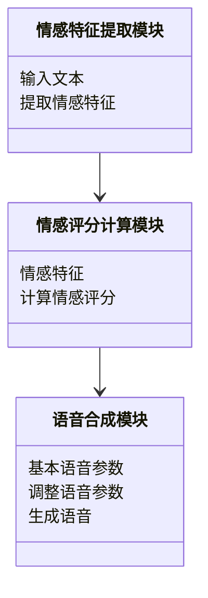

                 


# AI Agent在语音合成中的情感表达

---

## 关键词：
AI Agent, 语音合成, 情感表达, 情感计算, 语音合成算法

---

## 摘要：
本文深入探讨了AI Agent在语音合成中的情感表达技术，分析了情感计算的基本原理及其在语音合成中的应用。通过结合数学模型、算法流程图和实际案例，详细阐述了情感驱动的语音合成方法，旨在为研究人员和开发者提供理论支持和实践指导。

---

## 目录大纲：

### 第一部分: AI Agent与语音合成的背景与基础

### 第1章: AI Agent与语音合成概述

#### 1.1 AI Agent的基本概念
- 1.1.1 AI Agent的定义与特点
  - AI Agent的定义
  - AI Agent的特点：智能性、适应性、主动性
- 1.1.2 语音合成的基本原理
  - 语音合成的定义
  - 语音合成的主要技术：TTS（文本到语音）技术
- 1.1.3 情感表达在语音合成中的重要性
  - 情感在人机交互中的作用
  - 情感语音合成的实际应用

#### 1.2 情感计算与语音合成的结合
- 1.2.1 情感计算的核心概念
  - 情感计算的定义
  - 情感计算的关键技术：情感特征提取、情感分类、情感表达
- 1.2.2 情感在语音合成中的应用场景
  - 情感语音合成的实际案例：智能音箱、虚拟助手
- 1.2.3 当前技术的挑战与未来方向
  - 情感自然度的提升
  - 多模态情感表达的探索

#### 1.3 本章小结
- 本章总结了AI Agent和语音合成的基本概念，强调了情感表达在语音合成中的重要性。

---

### 第二部分: AI Agent在情感表达中的核心概念与联系

### 第2章: AI Agent与情感计算的原理

#### 2.1 情感计算的数学模型
- 2.1.1 情感特征的提取方法
  - 基于文本的情感特征提取：词袋模型、TF-IDF、情感词典
  - 基于语音的情感特征提取：声学特征、语调分析
- 2.1.2 情感评分模型的构建
  - 情感评分模型的定义
  - 情感评分模型的训练与优化
- 2.1.3 情感计算的数学公式
  - 情感评分公式：
  $$ 情感评分 = \sum_{i=1}^{n} w_i \cdot f_i $$
  其中，$w_i$ 是第i个情感特征的权重，$f_i$ 是第i个情感特征的值。

#### 2.2 AI Agent与情感计算的关系
- 2.2.1 AI Agent作为情感计算的载体
  - AI Agent在情感计算中的角色
  - 情感计算如何增强AI Agent的交互能力
- 2.2.2 情感计算对AI Agent的增强作用
  - 情感计算如何提升AI Agent的用户体验
  - 情感计算在AI Agent决策中的应用
- 2.2.3 两者结合的协同效应
  - 协同效应的表现形式
  - 协同效应的实际案例

#### 2.3 情感计算与语音合成的实体关系图


#### 2.4 本章小结
- 本章详细讲解了情感计算的数学模型，并分析了AI Agent与情感计算的关系。

---

### 第三部分: 情感表达的算法原理与实现

### 第3章: 情感驱动的语音合成算法

#### 3.1 情感特征提取算法
- 3.1.1 基于文本的情感特征提取
  - 词袋模型：简单实现
  - TF-IDF：提升特征的重要性
  - 情感词典：利用预定义的情感词汇进行特征提取
- 3.1.2 基于语音的情感特征提取
  - 语音声学特征：音调、音量、语速
  - 语调分析：情感分类
- 3.1.3 情感特征提取的比较与选择
  - 文本驱动与语音驱动的对比
  - 综合特征提取的优势

#### 3.2 情感驱动的语音合成流程
- 3.2.1 情感评分模型
  - 情感评分的计算方法
  - 情感评分的应用场景
- 3.2.2 情感驱动的语音合成流程
  - 情感特征提取
  - 情感评分计算
  - 语音合成参数调整
- 3.2.3 情感驱动的语音合成流程图


#### 3.3 情感驱动的语音合成算法实现
- 3.3.1 情感驱动的语音合成算法
  - 算法实现步骤
  - 算法的数学模型
  - 算法的优化技巧
- 3.3.2 情感驱动的语音合成算法的数学公式
  $$ 语音合成参数 = f(情感评分, 基本语音参数) $$
  其中，$f$ 是根据情感评分调整语音参数的函数。

#### 3.4 本章小结
- 本章详细讲解了情感驱动的语音合成算法的实现过程，并通过流程图和数学公式进行了说明。

---

### 第四部分: 系统分析与架构设计

### 第4章: 情感驱动的语音合成系统设计

#### 4.1 问题场景介绍
- 情感驱动的语音合成系统的应用场景
  - 智能客服
  - 教育领域的虚拟教师
  - 娱乐领域的语音助手

#### 4.2 系统功能设计
- 系统功能模块划分
  - 情感特征提取模块
  - 情感评分计算模块
  - 语音合成模块
- 系统功能设计的领域模型


#### 4.3 系统架构设计
- 系统架构的分层设计
  - 数据层：存储输入文本和语音数据
  - 业务逻辑层：实现情感特征提取、情感评分计算和语音合成
  - 表现层：展示生成的语音
- 系统架构的Mermaid图


#### 4.4 系统接口设计
- 系统接口的定义
  - 输入接口：接收输入文本
  - 输出接口：输出情感语音
- 接口的设计原则
  - 易用性
  - 可扩展性

#### 4.5 系统交互设计
- 系统交互流程
```mermaid
sequenceDiagram
    用户 --> 输入文本
    用户 --> 系统
    系统 --> 情感特征提取模块
    情感特征提取模块 --> 情感评分计算模块
    情感评分计算模块 --> 语音合成模块
    语音合成模块 --> 用户
    用户 --> 接收语音
```

#### 4.6 本章小结
- 本章详细设计了情感驱动的语音合成系统的架构，并通过类图和序列图展示了系统的各个部分。

---

### 第五部分: 项目实战

### 第5章: 情感驱动的语音合成项目实现

#### 5.1 环境安装
- 开发工具的选择
  - Python
  - 语音合成库：Python的text-to-speech库（如：pyTTS）
  - 情感计算库：自然语言处理库（如：NLTK、spaCy）

#### 5.2 系统核心实现源代码
- 情感特征提取模块
  ```python
  def extract_emotion_features(text):
      # 使用预定义的情感词典进行情感特征提取
      features = []
      for word in text.split():
          if word in emotion_dict:
              features.append(1)
          else:
              features.append(0)
      return features
  ```
- 情感评分计算模块
  ```python
  def calculate_emotion_score(features):
      score = sum(features) / len(features)
      return score
  ```
- 语音合成模块
  ```python
  def synthesize_voice(text, score):
      # 根据情感评分调整语音合成参数
      parameters = {'speed': score * 1.5, 'volume': score * 100}
      return tts.synthesize(text, parameters)
  ```

#### 5.3 代码实现与应用解读
- 情感特征提取模块的实现
  - 使用预定义的情感词典提取情感特征
  - 特征的二值化表示
- 情感评分计算模块的实现
  - 情感评分的计算公式
  - 评分的范围和意义
- 语音合成模块的实现
  - 根据情感评分调整语音合成参数
  - 生成情感语音

#### 5.4 项目小结
- 本章通过具体的Python代码实现了一个情感驱动的语音合成项目，并详细解读了代码的实现过程。

---

### 第六部分: 总结与展望

### 第6章: 总结与未来展望

#### 6.1 全书总结
- 本书的主要内容回顾
  - AI Agent与语音合成的基本概念
  - 情感计算的原理与应用
  - 情感驱动的语音合成算法
  - 系统设计与项目实现

#### 6.2 未来展望
- 情感表达在语音合成中的未来发展方向
  - 更自然的情感表达
  - 多模态情感表达的结合
  - 情感计算的实时性提升
- 情感驱动的语音合成技术在更多领域的应用
  - 医疗领域
  - 教育领域
  - 娱乐领域

#### 6.3 本章小结
- 本章总结了全书的主要内容，并展望了情感驱动的语音合成技术的未来发展方向。

---

## 作者：AI天才研究院/AI Genius Institute & 禅与计算机程序设计艺术 /Zen And The Art of Computer Programming

---

以上是《AI Agent在语音合成中的情感表达》的技术博客文章的详细目录和内容大纲。

