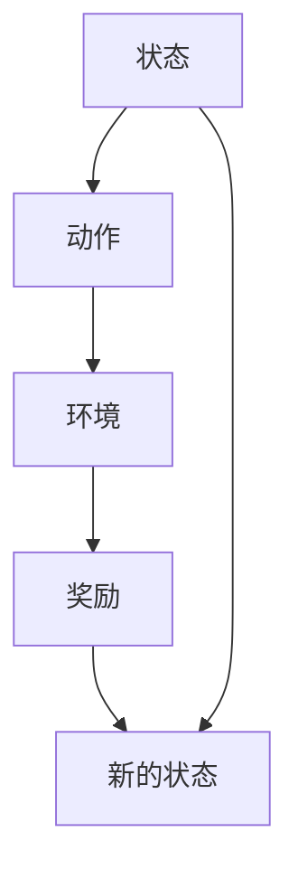

                 


# AI Agent在金融风险评估中的应用

## 关键词：
AI Agent, 金融风险评估, 机器学习, 强化学习, 系统架构设计, 项目实战

## 摘要：
本文深入探讨了AI Agent在金融风险评估中的应用，从理论基础到实际应用，详细分析了AI Agent的核心概念、算法原理、系统架构设计以及项目实战。通过结合机器学习和强化学习算法，本文展示了如何利用AI Agent提升金融风险评估的效率和准确性。同时，本文还提供了具体的实现案例和系统架构设计方案，为读者提供了一个全面的视角来理解和应用AI Agent技术。

---

# 第一部分: AI Agent与金融风险评估的背景与基础

## 第1章: AI Agent与金融风险评估的背景介绍

### 1.1 AI Agent的基本概念

#### 1.1.1 什么是AI Agent
AI Agent（人工智能代理）是一种能够感知环境、做出决策并采取行动以实现特定目标的智能实体。AI Agent可以是软件程序、机器人或其他智能系统，其核心在于具备自主决策和问题解决的能力。

#### 1.1.2 AI Agent的核心特征
- **自主性**：能够自主决策和行动，无需外部干预。
- **反应性**：能够实时感知环境变化并做出反应。
- **目标导向性**：以实现特定目标为导向，优化决策和行动。
- **学习能力**：通过数据和经验不断优化自身性能。

#### 1.1.3 AI Agent与传统算法的区别
AI Agent不仅仅是一个算法，而是一个具备感知和行动能力的智能体。与传统算法相比，AI Agent更注重动态环境下的自主决策和目标实现。

### 1.2 金融风险评估的基本概念

#### 1.2.1 金融风险的定义与分类
金融风险是指在金融活动中由于不确定因素而导致损失的可能性。常见的金融风险包括：
- **市场风险**：由于市场价格波动导致的损失。
- **信用风险**：由于债务人违约导致的损失。
- **流动性风险**：由于资产无法快速变现导致的损失。
- **操作风险**：由于内部操作失误导致的损失。

#### 1.2.2 金融风险评估的常见方法
- **VaR（Value at Risk）**：衡量在特定置信水平下的潜在损失。
- **信用评分模型**：通过模型评估客户的信用风险。
- **压力测试**：模拟极端市场条件下的风险敞口。

#### 1.2.3 金融风险评估的挑战与需求
- **数据复杂性**：金融数据具有高维性和非线性特征。
- **实时性要求**：金融市场的动态变化要求风险评估能够实时进行。
- **模型可解释性**：复杂的金融决策需要模型具备较高的可解释性。

### 1.3 AI Agent在金融风险评估中的应用背景

#### 1.3.1 传统金融风险评估的局限性
传统金融风险评估方法依赖于统计模型和专家经验，存在以下问题：
- **数据驱动不足**：难以处理海量非结构化数据。
- **实时性不足**：无法实时响应市场变化。
- **人工干预过多**：依赖专家经验，效率低下。

#### 1.3.2 AI技术在金融领域的潜力
AI技术在金融领域的潜力主要体现在以下几个方面：
- **数据处理能力**：能够处理海量的结构化和非结构化数据。
- **实时决策能力**：能够实时感知市场变化并做出决策。
- **自动化能力**：能够自动化完成风险评估和控制任务。

#### 1.3.3 AI Agent在金融风险评估中的优势
- **智能化**：能够自主学习和优化，适应市场变化。
- **实时性**：能够实时感知市场信息并做出反应。
- **高效性**：能够快速处理大量数据，提高评估效率。

### 1.4 本章小结
本章介绍了AI Agent的基本概念、金融风险评估的基本概念以及AI Agent在金融风险评估中的应用背景。通过对比传统方法和AI技术的优势，我们可以看出AI Agent在金融风险评估中的巨大潜力。

---

## 第2章: AI Agent的核心概念与原理

### 2.1 AI Agent的核心概念

#### 2.1.1 感知层：数据采集与特征提取
AI Agent通过感知层获取环境中的数据，并通过特征提取技术将数据转化为可计算的特征。

#### 2.1.2 计划层：目标设定与策略制定
AI Agent通过计划层设定目标，并根据感知到的信息制定策略。

#### 2.1.3 执行层：决策优化与行动执行
AI Agent通过执行层优化决策并采取行动，以实现目标。

### 2.2 AI Agent在金融风险评估中的角色

#### 2.2.1 数据驱动的金融风险建模
AI Agent可以通过机器学习算法对金融数据进行建模，捕捉数据中的非线性关系。

#### 2.2.2 基于AI的实时风险监控
AI Agent可以实时监控市场动态，及时发现潜在风险。

#### 2.2.3 自适应风险控制策略
AI Agent可以根据市场变化动态调整风险控制策略，提高风险控制的灵活性和有效性。

### 2.3 AI Agent的核心算法与技术

#### 2.3.1 机器学习算法
- **逻辑回归**：用于分类问题，例如信用评分。
- **随机森林**：用于特征重要性分析和风险评估。
- **深度学习**：用于处理复杂非结构化数据，例如自然语言处理。

#### 2.3.2 自然语言处理技术
- **文本挖掘**：从新闻、财报等文本数据中提取情感和关键词。
- **实体识别**：识别文本中的公司、人物等实体。

#### 2.3.3 强化学习与决策优化
- **Q-Learning**：用于制定最优决策策略。
- **Deep Q-Networks (DQN)**：用于复杂环境下的决策优化。

### 2.4 本章小结
本章详细介绍了AI Agent的核心概念和在金融风险评估中的角色，包括感知层、计划层和执行层的实现原理，以及机器学习、自然语言处理和强化学习等关键技术。

---

## 第3章: AI Agent在金融风险评估中的核心算法

### 3.1 机器学习算法在金融风险评估中的应用

#### 3.1.1 逻辑回归
逻辑回归是一种常用的分类算法，常用于信用评分和违约风险评估。

**数学模型**：
$$ P(y=1|x) = \frac{e^{w^T x + b}}{1 + e^{w^T x + b}} $$

#### 3.1.2 随机森林
随机森林是一种基于树的集成算法，适用于特征重要性分析和风险评估。

#### 3.1.3 深度学习
深度学习模型（如LSTM）可以捕捉时间序列数据中的复杂模式，适用于金融时间序列预测。

### 3.2 强化学习在AI Agent中的应用

#### 3.2.1 Q-Learning算法
Q-Learning是一种经典的强化学习算法，适用于离散动作空间的决策问题。

**算法流程图**：


#### 3.2.2 Deep Q-Networks（DQN）
DQN算法将Q-Learning与深度学习结合，适用于高维状态空间和连续动作空间的决策问题。

### 3.3 算法实现与优化

#### 3.3.1 算法实现的数学模型
以DQN算法为例，其数学模型包括：
- **动作值函数**：$$ Q(s, a) = \theta^T \phi(s, a) $$
- **目标网络**：$$ Q_{\text{target}}(s, a) = \theta^T \phi(s, a) $$

#### 3.3.2 算法优化的策略与技巧
- **经验回放**：通过存储历史经验，减少样本偏差。
- **目标网络更新**：定期更新目标网络参数，防止过拟合。

#### 3.3.3 算法的性能评估与对比
通过实验对比不同算法在金融风险评估中的表现，选择最优算法。

### 3.4 本章小结
本章详细介绍了机器学习和强化学习算法在金融风险评估中的应用，包括算法原理、数学模型和实现优化策略。

---

## 第4章: 金融风险评估的系统架构与设计

### 4.1 系统架构设计

#### 4.1.1 分层架构设计
分层架构包括数据层、计算层和应用层，每一层负责不同的功能。

#### 4.1.2 微服务架构设计
微服务架构将系统划分为多个独立的服务，便于扩展和维护。

#### 4.1.3 可扩展性与可维护性
通过模块化设计，提高系统的可扩展性和可维护性。

### 4.2 系统功能设计

#### 4.2.1 数据采集模块
数据采集模块负责从多种数据源获取金融数据。

#### 4.2.2 风险评估模块
风险评估模块基于机器学习模型对风险进行评估和预测。

#### 4.2.3 决策优化模块
决策优化模块基于强化学习算法优化风险控制策略。

### 4.3 系统接口设计

#### 4.3.1 API接口设计
API接口定义了系统与其他模块的交互方式。

#### 4.3.2 数据接口规范
数据接口规范定义了数据格式和传输协议。

#### 4.3.3 用户接口设计
用户接口设计注重用户体验，提供直观的风险评估结果展示。

### 4.4 本章小结
本章详细介绍了金融风险评估系统的架构设计、功能设计和接口设计，为后续的系统实现奠定了基础。

---

## 第5章: AI Agent在金融风险评估中的项目实战

### 5.1 项目环境与工具安装

#### 5.1.1 开发环境搭建
安装Python、Jupyter Notebook等开发工具。

#### 5.1.2 依赖库安装
安装机器学习库（如scikit-learn、TensorFlow）和数据处理库（如Pandas、NumPy）。

#### 5.1.3 数据集准备
获取金融数据集，例如股票价格、信用评分数据等。

### 5.2 项目核心代码实现

#### 5.2.1 信用评分模型实现
基于逻辑回归实现信用评分模型。

**代码示例**：
```python
import pandas as pd
from sklearn.linear_model import LogisticRegression
from sklearn.model_selection import train_test_split

# 数据加载
data = pd.read_csv('credit_data.csv')
X = data.drop('default', axis=1)
y = data['default']

# 数据划分
X_train, X_test, y_train, y_test = train_test_split(X, y, test_size=0.2)

# 模型训练
model = LogisticRegression()
model.fit(X_train, y_train)

# 模型预测
y_pred = model.predict(X_test)
print('Accuracy:', model.score(X_test, y_test))
```

#### 5.2.2 基于强化学习的风险控制策略
基于DQN算法实现风险控制策略。

**代码示例**：
```python
import gym
import numpy as np

class QLearningAgent:
    def __init__(self, state_space, action_space, lr=0.01, gamma=0.99):
        self.state_space = state_space
        self.action_space = action_space
        self.lr = lr
        self.gamma = gamma
        self.q_table = np.zeros((state_space, action_space))

    def act(self, state):
        return np.argmax(self.q_table[state])

    def learn(self, state, action, reward, next_state):
        target = reward + self.gamma * np.max(self.q_table[next_state])
        self.q_table[state][action] += self.lr * (target - self.q_table[state][action])

# 创建环境
env = gym.make('CustomRiskEnv-v0')
agent = QLearningAgent(env.observation_space, env.action_space)

# 训练过程
for episode in range(1000):
    state = env.reset()
    while True:
        action = agent.act(state)
        next_state, reward, done, _ = env.step(action)
        agent.learn(state, action, reward, next_state)
        if done:
            break
```

### 5.3 项目小结
通过项目实战，我们详细展示了如何利用AI Agent技术实现金融风险评估系统，从环境搭建到算法实现，再到系统部署，为读者提供了完整的实现流程。

---

## 第6章: 总结与展望

### 6.1 总结
本文详细探讨了AI Agent在金融风险评估中的应用，从理论基础到实际应用，全面分析了AI Agent的核心概念、算法原理、系统架构设计以及项目实战。

### 6.2 展望
随着AI技术的不断发展，AI Agent在金融风险评估中的应用将更加广泛和深入。未来的研究方向包括：
- 更高效的算法设计
- 更强的模型可解释性
- 更智能的决策优化策略

---

## 作者：AI天才研究院 & 禅与计算机程序设计艺术

---

**本文内容版权归作者所有，转载请注明出处！**

