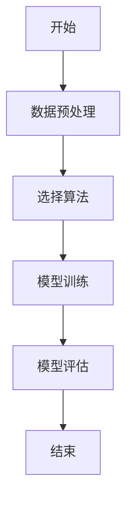
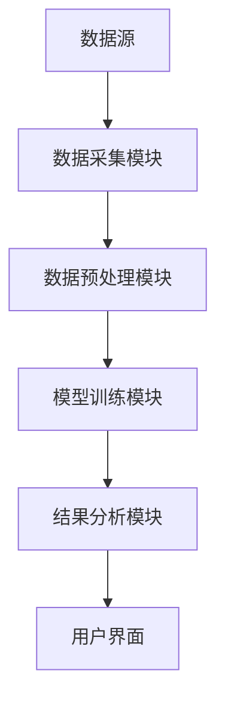
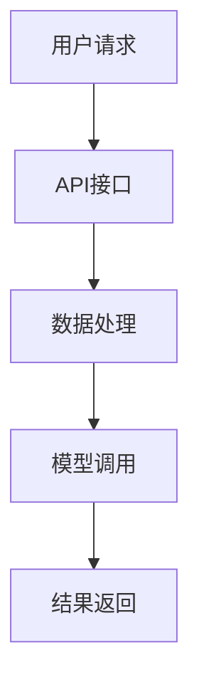

                 


# AI Agent在预测分析中的应用

> 关键词：AI Agent、预测分析、机器学习、数据分析、自然语言处理、人工智能系统、预测模型

> 摘要：本文探讨AI Agent在预测分析中的应用，分析其在不同场景下的工作原理、算法实现及系统架构。通过实际案例展示其在金融、医疗等领域的应用价值，总结最佳实践，为读者提供全面的技术指导。

---

## 目录

### 第一章: AI Agent与预测分析的背景介绍

1.1 AI Agent的基本概念  
1.1.1 AI Agent的定义  
1.1.2 AI Agent的特点  
1.1.3 AI Agent与传统预测分析的区别  

1.2 预测分析的背景与应用  
1.2.1 预测分析的定义  
1.2.2 预测分析在不同领域的应用  
1.2.3 AI Agent在预测分析中的优势  

1.3 本章小结  

---

### 第二章: AI Agent的核心概念与原理

2.1 AI Agent的核心概念  
2.1.1 AI Agent的工作原理  
2.1.2 感知、决策与执行的详细分析  

2.2 AI Agent与预测分析的关系  
2.2.1 预测分析对AI Agent的依赖  
2.2.2 AI Agent在预测分析中的角色  

2.3 核心概念对比表格  
2.3.1 AI Agent与传统预测模型的对比  
2.3.2 不同AI Agent算法的对比  

2.4 ER实体关系图  
2.4.1 数据流图  
2.4.2 实体关系图  

---

### 第三章: AI Agent的算法原理讲解

3.1 常见AI Agent算法及其流程  
3.1.1 决策树算法  
3.1.2 随机森林算法  
3.1.3 神经网络算法  

3.2 算法流程图（Mermaid）  


3.3 算法实现与数学模型  
3.3.1 决策树的ID3算法  
3.3.2 随机森林的实现细节  
3.3.3 神经网络的数学公式  

3.4 算法优化与调参技巧  

---

### 第四章: AI Agent的系统分析与架构设计方案

4.1 预测分析的场景与需求  
4.1.1 金融领域的预测需求  
4.1.2 医疗领域的预测需求  
4.1.3 其他领域的预测需求  

4.2 系统功能设计  
4.2.1 数据采集模块  
4.2.2 数据预处理模块  
4.2.3 模型训练模块  
4.2.4 结果分析模块  

4.3 系统架构设计（Mermaid）  


4.4 接口设计与交互流程图（Mermaid）  


---

### 第五章: AI Agent在预测分析中的项目实战

5.1 项目背景与目标  
5.1.1 项目选择：股票价格预测  

5.2 项目环境与工具配置  
5.2.1 Python版本要求  
5.2.2 依赖库的安装  

5.3 项目核心实现  
5.3.1 数据收集与清洗代码示例  
```python
import pandas as pd
data = pd.read_csv('stock_data.csv')
data_clean = data.dropna()
```

5.3.2 特征工程与模型训练  
```python
from sklearn.ensemble import RandomForestRegressor
model = RandomForestRegressor()
model.fit(X_train, y_train)
```

5.3.3 模型评估与优化  
```python
from sklearn.metrics import mean_squared_error
mse = mean_squared_error(y_test, model.predict(X_test))
print(f'MSE: {mse}')
```

5.4 实际案例分析与结果解读  
5.4.1 案例分析：股票价格预测的结果与解释  

5.5 项目小结  

---

### 第六章: AI Agent在预测分析中的最佳实践

6.1 小结与总结  
6.1.1 AI Agent在预测分析中的优势  
6.1.2 项目实施的关键点  

6.2 注意事项与常见问题  
6.2.1 数据质量的重要性  
6.2.2 模型选择的注意事项  
6.2.3 系统部署的挑战  

6.3 拓展阅读与学习资源  
6.3.1 推荐书籍与论文  
6.3.2 在线课程与技术博客  

---

### 附录: AI Agent相关工具与资源

附录A: 常用机器学习库  
- scikit-learn  
- TensorFlow  
- PyTorch  

附录B: 数据集资源  
- Kaggle  
- UCI Machine Learning Repository  

---

### 参考文献

---

作者：AI天才研究院/AI Genius Institute & 禅与计算机程序设计艺术 /Zen And The Art of Computer Programming

