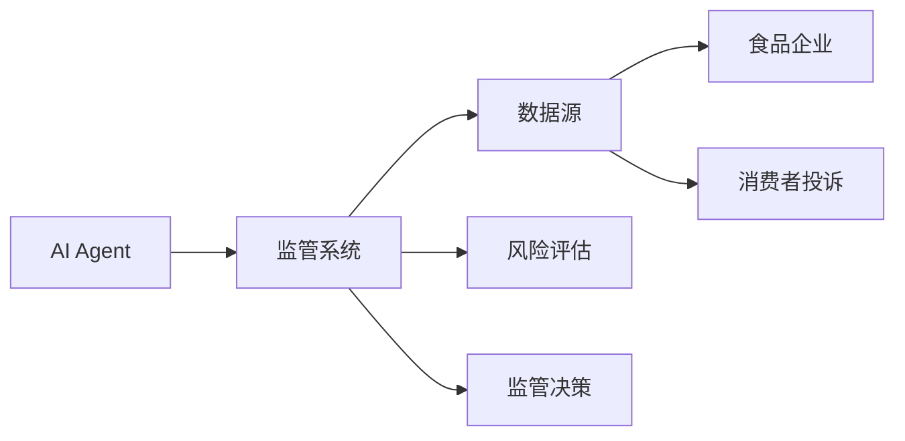
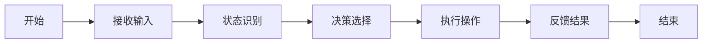
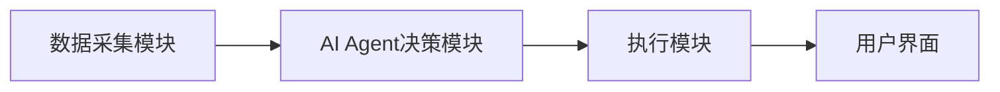

                 


# AI Agent在食品安全监管中的应用

> 关键词：AI Agent, 食品安全, 监管系统, 强化学习, 数学模型

> 摘要：本文探讨了AI Agent在食品安全监管中的应用，分析了其核心原理、算法模型、系统架构，并通过实际案例展示了其在风险评估、食品溯源等场景中的应用优势。

---

## 引言

近年来，食品安全问题频发，传统监管方式效率低下。AI Agent作为一种智能体，具备自主决策和行动能力，能够有效提升监管效率和准确性。

---

## 第1章 AI Agent的基本概念与食品安全监管背景

### 1.1 AI Agent的定义与特点
- **定义**：AI Agent是具备感知、决策和执行能力的智能体。
- **特点**：自主性、反应性、目标导向、社会能力。

### 1.2 食品安全监管的背景与挑战
- **现状**：监管范围广、数据复杂、效率低。
- **挑战**：数据碎片化、监管滞后、人为干扰。

### 1.3 AI Agent在食品安全监管中的应用前景
- 提高监管效率
- 实现精准监管
- 降低成本

---

## 第2章 AI Agent的核心原理与食品安全监管的结合

### 2.1 AI Agent的核心原理
- **感知模块**：收集环境数据。
- **决策模块**：分析数据，制定策略。
- **执行模块**：采取行动。

### 2.2 AI Agent在食品安全监管中的应用模型
- **模型**：AI Agent作为监管系统的核心，与数据源、食品企业、消费者投诉等交互。



---

## 第3章 AI Agent的算法原理

### 3.1 基于强化学习的AI Agent算法
- **强化学习原理**：通过奖励机制优化决策。
- **数学模型**：Q-learning公式：$$ Q(s, a) = Q(s, a) + \alpha [r + \max Q(s', a') - Q(s, a)] $$

### 3.2 算法流程图


---

## 第4章 食品安全监管系统的分析与架构设计

### 4.1 系统功能需求分析
- **风险评估**：识别潜在风险。
- **食品溯源**：追踪问题食品来源。
- **数据可视化**：直观展示监管数据。

### 4.2 系统架构设计
- **架构图**：展示各模块关系。



---

## 第5章 项目实战

### 5.1 项目环境安装
- 安装Python、TensorFlow、Mermaid等工具。

### 5.2 系统核心实现源代码
```python
# 示例代码：AI Agent决策模块
class AI_Agent:
    def __init__(self):
        self.model = self.build_model()
    
    def build_model(self):
        # 构建神经网络模型
        pass
    
    def decide(self, state):
        # 根据状态做出决策
        pass
```

### 5.3 代码应用解读
- **数据采集**：从传感器获取实时数据。
- **决策模块**：分析数据，触发警报。
- **执行模块**：调整设备参数。

### 5.4 实际案例分析
- 案例：某食品厂的温度监控系统，AI Agent实时监测并调整温湿度，确保食品安全。

---

## 第6章 总结与展望

### 6.1 总结
- AI Agent的优势：提高效率、降低成本。
- 限制：数据隐私、算法可解释性。

### 6.2 展望
- 进一步优化算法。
- 推广应用。

---

## 作者：AI天才研究院 & 禅与计算机程序设计艺术

---

这篇文章系统地探讨了AI Agent在食品安全监管中的应用，从基本概念到实际案例，详细阐述了其原理和优势。希望对读者有所帮助。

