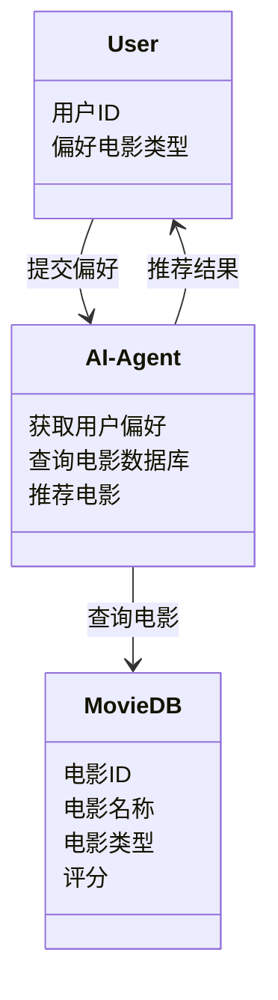
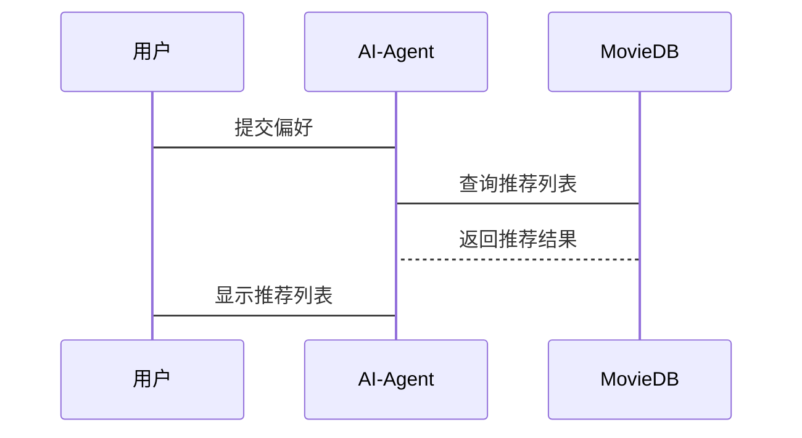

                 


# AI Agent基础概念：理解智能代理的核心

## 关键词：
- AI Agent
- 智能代理
- 人工智能
- 机器学习
- 自动化决策

## 摘要：
AI Agent（人工智能代理）是一种能够感知环境、自主决策并执行任务的智能系统。本文将从AI Agent的核心概念、设计原理、实现技术、高级主题以及实际应用等方面，全面解析AI Agent的内涵和外延，帮助读者深入理解其本质与应用价值。

---

# 第1章: AI Agent的定义与背景

## 1.1 AI Agent的基本概念

### 1.1.1 什么是AI Agent
AI Agent（人工智能代理）是指一种能够感知环境、自主决策并执行任务的智能系统。它通过传感器获取环境信息，利用算法进行分析和推理，最终做出决策并执行动作。AI Agent可以是软件程序、机器人或其他智能设备。

### 1.1.2 AI Agent的特点
- **自主性**：AI Agent能够在没有外部干预的情况下自主运行。
- **反应性**：能够实时感知环境并做出响应。
- **目标导向**：通过设定目标来指导行为和决策。
- **适应性**：能够根据环境变化调整策略和行为。

### 1.1.3 AI Agent的应用场景
AI Agent广泛应用于多个领域，包括自动驾驶、智能助手（如Siri、Alexa）、推荐系统、游戏AI、工业自动化等。

---

## 1.2 AI Agent的发展历程

### 1.2.1 AI Agent的起源
AI Agent的概念可以追溯到20世纪60年代，早期的智能体研究主要集中在逻辑推理和问题求解上。

### 1.2.2 AI Agent的发展阶段
- **规则驱动阶段**：基于固定的规则和逻辑进行决策。
- **机器学习阶段**：利用数据驱动的方法进行学习和优化。
- **强化学习阶段**：通过与环境互动进行奖励驱动的优化。

### 1.2.3 当前AI Agent的研究热点
当前，AI Agent的研究重点包括多智能体协作、人机交互、实时决策和边缘计算等。

---

# 第2章: AI Agent的核心概念与原理

## 2.1 感知与理解

### 2.1.1 传感器与数据采集
AI Agent通过传感器获取环境数据，例如摄像头、麦克风、温度传感器等。

### 2.1.2 数据处理与特征提取
数据预处理、特征提取和降维是关键步骤，例如使用CNN提取图像特征。

### 2.1.3 知识表示与语义理解
知识图谱和自然语言处理技术帮助AI Agent理解语义和上下文。

## 2.2 决策与推理

### 2.2.1 决策树与规则推理
通过决策树和规则库进行逻辑推理，例如在自动驾驶中判断转向或加速。

### 2.2.2 基于概率的推理方法
使用贝叶斯网络进行概率推理，评估不同决策的可能性。

### 2.2.3 增量式推理与在线学习
动态更新知识库，适应环境变化，例如在游戏AI中实时调整策略。

## 2.3 行为与执行

### 2.3.1 动作规划与路径规划
使用A*算法规划路径，确保行动的最优性。

### 2.3.2 动作执行与反馈机制
通过执行器（如电机、扬声器）执行动作，并根据反馈调整行为。

### 2.3.3 多目标优化与权衡
在多个目标之间进行优化，例如在自动驾驶中平衡安全性和效率。

---

# 第3章: AI Agent的设计原则与实现技术

## 3.1 设计原则

### 3.1.1 简单性与可扩展性
设计简洁的架构，确保易于扩展和维护。

### 3.1.2 健壮性与容错性
确保AI Agent在异常情况下仍能正常运行。

### 3.1.3 实时性与响应速度
优化算法以提高实时响应能力。

## 3.2 实现技术

### 3.2.1 基于模型的AI Agent设计
使用状态机模型进行设计，明确不同状态的转换逻辑。

### 3.2.2 基于Q-learning的AI Agent设计
通过强化学习优化决策策略，数学模型如下：

$$ Q(s, a) = Q(s, a) + \alpha (r + \max Q(s', a') - Q(s, a)) $$

### 3.2.3 基于规则的AI Agent设计
通过预定义规则库进行决策，例如在推荐系统中根据用户行为匹配规则。

---

# 第4章: AI Agent的高级主题

## 4.1 多智能体系统

### 4.1.1 多智能体协作
通过通信协议实现多个AI Agent之间的协作，例如在无人机编队中协调飞行路径。

### 4.1.2 多智能体竞争
在博弈论中，多个AI Agent进行竞争，例如在在线游戏中对抗对手。

## 4.2 人机协作

### 4.2.1 人机协作的定义
人类与AI Agent共同完成任务，例如医生与AI诊断系统合作进行病情分析。

### 4.2.2 人机协作的优势
提高效率、降低错误率，例如在客服系统中AI Agent辅助人类客服处理问题。

## 4.3 伦理与法律

### 4.3.1 AI Agent的伦理问题
隐私保护、责任归属和算法偏见等。

### 4.3.2 AI Agent的法律问题
明确AI Agent的法律地位和责任承担。

---

# 第5章: AI Agent的项目实战

## 5.1 项目背景
设计一个简单的AI Agent，用于自动推荐电影。

## 5.2 系统设计

### 5.2.1 领域模型
使用Mermaid类图表示系统组件及其关系。



### 5.2.2 系统架构
使用分层架构，包括数据层、逻辑层和表现层。

### 5.2.3 接口设计
定义RESTful API接口，例如：
- POST /api/users/preferences
- GET /api/recommendations

### 5.2.4 交互流程
使用Mermaid序列图表示用户与AI Agent的交互过程。



## 5.3 核心实现

### 5.3.1 环境安装
安装必要的库，例如Python的scikit-learn和Flask。

### 5.3.2 核心代码实现
实现基于协同过滤的推荐算法。

```python
from sklearn.metrics.pairwise import cosine_similarity

# 示例数据
users = ['Alice', 'Bob', 'Charlie']
movies = ['电影1', '电影2', '电影3']

# 计算相似性矩阵
similarity_matrix = cosine_similarity(X)

def recommend_movies(user_id, similarity_matrix):
    # 找出最相似的用户
    similar_users = similarity_matrix[user_id]
    # 返回推荐电影
    return movies[similar_users.argsort()[-3:]]

# 调用推荐函数
recommend_movies(0, similarity_matrix)
```

### 5.3.3 代码解读
- 使用协同过滤算法计算用户相似性。
- 根据相似性矩阵推荐电影。

## 5.4 实际案例分析
分析实际应用中的推荐系统，讨论其优缺点和优化方向。

---

# 第6章: 总结与展望

## 6.1 总结
本文从基础概念到实际应用，全面解析了AI Agent的核心内容，帮助读者理解其设计原理和实现技术。

## 6.2 未来展望
随着AI技术的进步，AI Agent将在更多领域得到应用，例如智能城市、医疗健康和智能制造等。

---

# 作者：AI天才研究院/AI Genius Institute & 禅与计算机程序设计艺术 /Zen And The Art of Computer Programming

