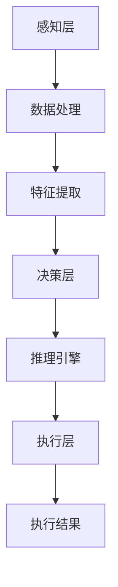
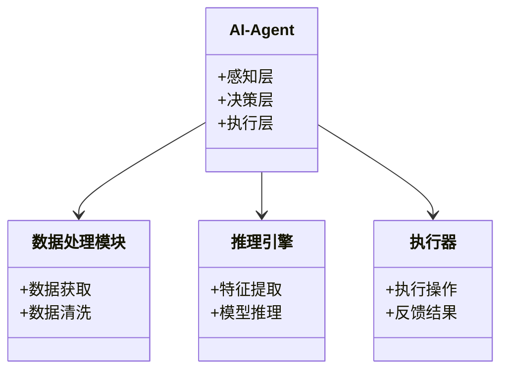
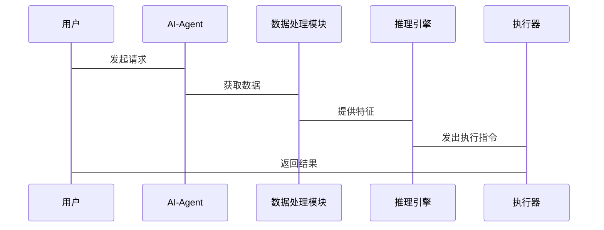

                 


# AI Agent开发中的常见挑战及对策

## 关键词：AI Agent, 开发挑战, 对策, 系统架构, 项目实战

## 摘要：
本文深入探讨AI Agent开发中的常见挑战，涵盖数据、模型训练、推理优化、系统架构和项目实战等方面，并提供切实可行的对策和解决方案。文章结合理论与实践，帮助开发者更好地理解和应对AI Agent开发中的复杂问题。

---

# 第一部分：AI Agent开发基础

## 第1章：AI Agent的概念与技术基础

### 1.1 AI Agent的定义
AI Agent是一种能够感知环境、自主决策并执行任务的智能实体。它通过传感器获取信息，利用算法处理数据，并通过执行器与环境交互。

### 1.2 AI Agent的核心特征
| 特征 | 描述 |
|------|------|
| 自主性 | 能够自主决策，无需外部干预 |
| 反应性 | 能够实时感知并响应环境变化 |
| 智能性 | 具备问题解决和学习能力 |

### 1.3 AI Agent与其他技术的对比
- **区别于传统软件**：AI Agent具备学习和适应能力，能够处理复杂任务。
- **区别于简单脚本**：AI Agent能够处理不确定性，具备复杂决策能力。

### 1.4 开发工具与框架
- **主流框架**：如TensorFlow、PyTorch，提供高效的模型训练支持。
- **开发工具**：如Visual Studio Code、Jupyter Notebook，提供便捷的开发环境。

## 第2章：AI Agent的技术基础

### 2.1 机器学习基础
- **监督学习**：通过标记数据训练模型，用于分类和回归任务。
- **无监督学习**：通过聚类分析发现数据中的潜在结构。
- **强化学习**：通过奖励机制优化决策策略。

### 2.2 自然语言处理基础
- **文本预处理**：包括分词、停用词处理和向量化。
- **模型训练**：使用词嵌入（如Word2Vec）和序列模型（如LSTM）进行文本处理。

### 2.3 知识图谱与推理
- **知识表示**：将知识以图结构表示，便于推理和关联分析。
- **推理算法**：如基于规则的推理和基于概率的推理。

## 第3章：AI Agent的核心概念

### 3.1 概念结构与核心要素
- **感知层**：负责数据的获取和处理。
- **决策层**：基于感知数据进行推理和决策。
- **执行层**：根据决策结果执行操作。

### 3.2 核心要素的实体关系图


---

# 第二部分：AI Agent开发中的常见挑战

## 第4章：数据挑战

### 4.1 数据获取与处理的难点
- **数据获取困难**：如何获取高质量的数据集。
- **数据清洗**：处理缺失值和异常值。
- **数据标注**：如何确保标注的准确性和一致性。

### 4.2 数据量与模型训练的平衡
- **数据增强技术**：如旋转、翻转和噪声添加，提升数据多样性。
- **数据集划分策略**：合理分配训练集、验证集和测试集。

### 4.3 数据隐私与安全问题
- **数据加密**：在存储和传输过程中保护数据。
- **隐私计算**：如联邦学习，确保数据隐私的同时进行模型训练。

## 第5章：模型训练与优化挑战

### 5.1 模型训练中的计算资源问题
- **分布式训练**：利用多台GPU并行训练，提升效率。
- **资源优化策略**：如动态分配资源和负载均衡。

### 5.2 模型过拟合与欠拟合问题
- **过拟合解决方法**：增加数据量、简化模型和使用正则化。
- **欠拟合解决方法**：增加模型复杂度和引入更多特征。

### 5.3 模型调参与优化
- **超参数优化**：使用网格搜索和随机搜索寻找最优参数。
- **模型选择**：基于准确率、召回率等指标选择最佳模型。

## 第6章：模型推理与交互优化

### 6.1 模型推理的效率问题
- **模型压缩**：减少模型参数，降低计算需求。
- **硬件加速**：利用GPU和TPU加速推理过程。

### 6.2 模型推理的准确性问题
- **错误分析**：识别模型在特定情况下的错误，针对性优化。
- **动态调整**：根据反馈实时调整推理策略。

---

# 第三部分：系统架构设计

## 第7章：系统架构设计方案

### 7.1 问题场景介绍
- **目标**：设计一个高效的AI Agent系统架构。
- **场景**：支持多任务处理和高并发请求。

### 7.2 系统功能设计


### 7.3 系统架构设计


### 7.4 系统接口设计
- **输入接口**：接收用户请求和环境数据。
- **输出接口**：返回处理结果和执行反馈。

### 7.5 系统交互设计


---

# 第四部分：项目实战

## 第8章：项目实战

### 8.1 环境安装
```bash
pip install numpy
pip install pandas
pip install scikit-learn
```

### 8.2 系统核心实现源代码
```python
import numpy as np
from sklearn.model_selection import train_test_split
from sklearn.ensemble import RandomForestClassifier

# 示例数据
X = np.array([[1, 2], [3, 4], [5, 6], [7, 8]])
y = np.array([0, 1, 0, 1])

# 数据划分
X_train, X_test, y_train, y_test = train_test_split(X, y, test_size=0.2)

# 模型训练
model = RandomForestClassifier()
model.fit(X_train, y_train)

# 模型预测
print(model.predict(X_test))  # 输出预测结果
```

### 8.3 代码实现与解读
- **数据预处理**：对输入数据进行标准化或归一化处理。
- **模型训练**：使用训练数据拟合模型参数。
- **模型预测**：利用训练好的模型对新数据进行预测。

### 8.4 案例分析
- **案例1**：一个简单的分类任务，使用随机森林模型实现分类。
- **案例2**：使用深度学习模型处理自然语言处理任务。

## 第9章：总结与建议

### 9.1 总结
- AI Agent开发涉及多个方面的挑战，包括数据、模型和系统架构等。
- 通过合理的策略和优化，可以有效应对这些挑战。

### 9.2 最佳实践
- **数据处理**：确保数据质量，合理使用数据增强技术。
- **模型优化**：结合超参数调优和模型压缩技术提升性能。
- **系统设计**：注重模块化设计，便于维护和扩展。

### 9.3 小结
AI Agent开发是一个复杂但充满潜力的领域，通过不断学习和实践，开发者能够逐步掌握应对各种挑战的技能。

---

# 作者：AI天才研究院 & 禅与计算机程序设计艺术

本文作者是AI天才研究院，专注于AI前沿技术研究。禅与计算机程序设计艺术则从哲学角度探讨技术的本质与应用。

