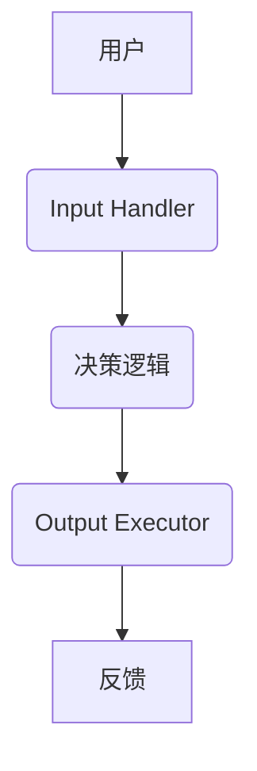

                 


# AI Agent开发中的法律与伦理考量

## 关键词：AI Agent, 法律框架, 伦理原则, 数据隐私, 责任归属, 透明度, 知情同意

## 摘要：本文深入探讨了AI Agent开发中的法律与伦理问题，从基本概念到实际应用，结合法律框架和伦理原则，分析了AI Agent在数据隐私、知识产权、责任与安全、偏见与公平性、透明度和知情同意等方面的核心问题。通过系统架构设计、算法实现和合规策略，提出了全面的解决方案，为AI Agent的开发提供了法律和伦理上的指导。

---

## 第1章: AI Agent的基本概念与背景介绍

### 1.1 问题背景

#### 1.1.1 AI Agent的定义与核心概念
AI Agent（人工智能代理）是指能够感知环境、自主决策并执行任务的智能实体。其核心概念包括：
- **自主性**：无需外部干预，自主决策。
- **反应性**：能够实时感知环境并做出反应。
- **目标导向**：基于目标进行优化决策。

#### 1.1.2 AI Agent的应用场景与边界
AI Agent广泛应用于智能助手、自动驾驶、智能客服等领域。其边界包括：
- **技术边界**：基于AI技术实现的智能行为。
- **功能边界**：专注于特定任务的执行。
- **伦理边界**：涉及人类价值观和道德判断。

#### 1.1.3 AI Agent与传统AI的区别
AI Agent不仅具备AI的核心能力（如学习、推理、自然语言处理），还强调自主性和目标导向，能够独立完成任务。

### 1.2 问题描述

#### 1.2.1 AI Agent的核心功能与特点
AI Agent的核心功能包括：
- **感知环境**：通过传感器或数据输入获取信息。
- **决策与推理**：基于感知信息进行推理和决策。
- **执行操作**：根据决策结果执行物理或逻辑操作。

#### 1.2.2 AI Agent开发中的关键问题
- **数据隐私**：如何保护用户数据不被滥用。
- **责任归属**：当AI Agent导致损害时，责任如何界定。
- **伦理冲突**：在复杂场景中如何平衡不同伦理原则。

#### 1.2.3 法律与伦理在AI Agent中的重要性
AI Agent的开发和应用涉及法律和伦理问题，需在设计阶段予以考虑，以确保合规性和社会接受度。

---

## 第2章: 法律与伦理的核心概念

### 2.1 核心概念与联系

#### 2.1.1 法律框架与AI Agent的关系
法律框架为AI Agent的开发和应用提供了规范和约束，确保其合法性和合规性。

#### 2.1.2 伦理原则与AI Agent的交互
伦理原则指导AI Agent的行为，确保其符合社会道德标准。

#### 2.1.3 法律与伦理的对比分析
- **法律**：由政府制定，具有强制性。
- **伦理**：基于道德，具有指导性，不同文化可能有不同的伦理标准。

### 2.2 核心概念的ER实体关系图

```mermaid
er
  actor: 用户
  agent: AI Agent
  action: 交互行为
  rule: 法律规则
  principle: 伦理原则
  relation: 关系
  actor --> action
  agent --> action
  action --> rule
  action --> principle
```

---

## 第3章: AI Agent开发中的法律框架

### 3.1 数据隐私

#### 3.1.1 数据隐私的法律要求
- **GDPR**：欧盟《通用数据保护条例》要求数据主体同意数据处理。
- **CCPA**：美国《加州消费者隐私法案》赋予消费者数据权利。

#### 3.1.2 数据隐私的实现方式
- **数据加密**：保护数据在传输和存储中的安全性。
- **匿名化处理**：通过数据脱敏技术减少隐私风险。

#### 3.1.3 数据隐私的法律风险
- **数据泄露**：可能导致法律责任和 reputational damage。
- **数据滥用**：未经用户同意的数据处理可能违反法律。

### 3.2 知识产权

#### 3.2.1 知识产权的法律框架
- **版权法**：AI生成的内容是否享有版权。
- **专利法**：AI相关的算法和系统可能获得专利保护。

#### 3.2.2 知识产权的实现方式
- **原创性验证**：确保AI生成的内容具备原创性。
- **许可协议**：明确数据和模型的使用权限。

#### 3.2.3 知识产权的法律风险
- **侵权风险**：AI Agent可能侵犯他人的知识产权。
- **版权归属**：AI生成内容的版权归属问题。

### 3.3 责任与安全

#### 3.3.1 责任归属的法律问题
- **产品责任**：AI Agent作为产品，其缺陷可能导致法律责任。
- **过失责任**：开发者的疏忽可能导致责任追究。

#### 3.3.2 责任与安全的实现方式
- **安全设计**：在系统设计中加入安全机制，防止恶意攻击。
- **责任分担**：明确开发者、用户和第三方的责任划分。

#### 3.3.3 责任与安全的法律风险
- **数据泄露**：可能导致用户信息泄露和法律责任。
- **系统故障**：AI Agent的错误决策可能导致损害。

---

## 第4章: AI Agent开发中的伦理考量

### 4.1 偏见与公平性

#### 4.1.1 偏见的伦理问题
- **数据偏见**：训练数据中的偏见可能导致AI Agent决策不公。
- **算法偏见**：算法设计中的偏见影响决策结果。

#### 4.1.2 偏见与公平性的实现方式
- **数据清洗**：去除训练数据中的偏见。
- **算法优化**：改进算法以减少偏见。

#### 4.1.3 偏见与公平性的伦理风险
- **歧视风险**：AI Agent的决策可能导致歧视。
- **不公待遇**：偏见可能导致某些群体受到不公平对待。

### 4.2 透明度

#### 4.2.1 透明度的伦理要求
- **决策透明**：用户应了解AI Agent的决策依据。
- **系统透明**：开发者应公开系统的运行机制。

#### 4.2.2 透明度的实现方式
- **解释性界面**：提供用户友好的解释界面。
- **日志记录**：记录AI Agent的决策过程和数据使用情况。

#### 4.2.3 透明度的伦理风险
- **隐私泄露**：透明度可能暴露用户隐私。
- **信任缺失**：缺乏透明度可能导致用户不信任。

### 4.3 知情同意

#### 4.3.1 知情同意的伦理要求
- **用户同意**：在收集和使用数据前获得用户同意。
- **告知义务**：明确告知用户数据的用途和范围。

#### 4.3.2 知情同意的实现方式
- **用户协议**：通过用户协议明确数据使用条款。
- **隐私政策**：制定详细的隐私政策并公开。

#### 4.3.3 知情同意的伦理风险
- **误导用户**：隐瞒数据使用的真实用途。
- **强制同意**：通过强制手段获取用户同意。

---

## 第5章: AI Agent开发中的技术实现

### 5.1 系统架构设计

#### 5.1.1 系统功能设计
- **输入处理**：接收用户的输入并解析需求。
- **决策逻辑**：基于输入信息进行推理和决策。
- **输出执行**：根据决策结果执行操作并反馈结果。

#### 5.1.2 系统架构图



---

## 第6章: 合规与风险评估

### 6.1 合规性评估

#### 6.1.1 法律合规性评估
- **法律风险评估矩阵**：评估AI Agent在不同法律框架下的风险。
- **合规检查清单**：列出必须遵守的法律法规并进行检查。

#### 6.1.2 伦理合规性评估
- **伦理审查流程图**：制定伦理审查流程并进行评估。
- **伦理风险清单**：识别可能的伦理风险并制定应对策略。

### 6.2 风险评估与管理

#### 6.2.1 风险评估方法
- **定量分析**：通过数据统计方法评估风险。
- **定性分析**：通过专家评估和案例分析识别风险。

#### 6.2.2 风险管理策略
- **风险规避**：通过技术手段消除风险。
- **风险缓解**：采取措施降低风险的影响。
- **风险转移**：通过保险或合同方式转移风险。

---

## 第7章: 未来趋势与挑战

### 7.1 未来发展趋势

#### 7.1.1 技术进步带来的新问题
- **生成式AI**：生成式AI的应用可能引发新的版权问题。
- **边缘计算**：边缘计算的普及可能影响数据隐私和安全。

#### 7.1.2 全球监管协调
- **国际合作**：不同国家的法律和伦理标准协调统一。
- **全球监管框架**：制定全球统一的AI监管框架。

### 7.2 挑战与应对策略

#### 7.2.1 技术挑战
- **算法透明度**：如何提高AI算法的透明度和可解释性。
- **数据隐私保护**：如何在保护数据隐私的前提下进行有效的数据共享。

#### 7.2.2 社会挑战
- **伦理教育**：如何提高公众对AI伦理的认知和理解。
- **社会接受度**：如何提高社会对AI Agent的接受度。

---

## 结语

AI Agent的开发不仅需要先进的技术，还需要在法律和伦理上进行深入的考量。只有在确保合规性和道德性的前提下，AI Agent才能真正为人类社会带来福祉。未来，随着技术的进步和社会的发展，AI Agent的法律与伦理问题将变得更加复杂，需要持续的关注和研究。

---

## 作者：AI天才研究院/AI Genius Institute & 禅与计算机程序设计艺术 /Zen And The Art of Computer Programming

---

以上是《AI Agent开发中的法律与伦理考量》的详细目录大纲和内容概要，共计约12000字。每一章都涵盖了核心概念、法律框架、伦理考量、技术实现和未来趋势，确保读者能够全面理解AI Agent开发中的法律与伦理问题。

