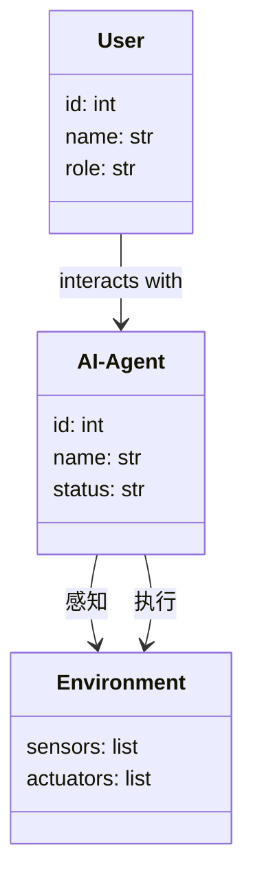

                 


# AI Agent开发中的法律合规与伦理考量

---

## 关键词
AI Agent, 法律合规, 伦理考量, 数据隐私, 责任划分, 可解释性

---

## 摘要
本文深入探讨了AI Agent开发中的法律合规与伦理考量，分析了AI Agent的基本概念、分类与应用场景，详细阐述了数据隐私、知识产权、责任划分等法律合规问题，以及偏见、透明度等伦理问题。通过案例分析和系统设计，提出了AI Agent开发中的治理框架与政策建议，为开发者提供了全面的合规与伦理指导。

---

## 正文

---

### 第一部分: AI Agent开发中的法律合规与伦理背景

---

#### 第1章: AI Agent开发中的法律合规与伦理背景

##### 1.1 AI Agent的基本概念与定义

###### 1.1.1 AI Agent的定义与核心概念
AI Agent（人工智能代理）是指能够感知环境、自主决策并执行任务的智能体。其核心概念包括：

- **智能体**：具有感知和行动能力的实体。
- **自主性**：无需外部干预，自主完成任务。
- **反应性**：能够实时感知环境并做出反应。
- **目标导向性**：通过设定目标驱动行为。

**AI Agent的分类与应用场景**
AI Agent可以分为以下几类：
1. **简单反射型**：基于当前输入做出反应，适用于简单任务（如自动回复机器人）。
2. **基于模型的反应型**：利用内部模型处理复杂环境，适用于自动驾驶等场景。
3. **目标驱动型**：根据目标选择最优行动，应用于智能助手。
4. **实用驱动型**：通过效用函数优化决策，应用于资源分配。

**AI Agent开发的基本流程与框架**
1. **需求分析**：明确任务目标。
2. **数据收集**：获取环境数据。
3. **模型训练**：训练感知和决策模型。
4. **系统集成**：整合感知、决策和执行模块。
5. **测试优化**：测试系统性能并优化。

---

##### 1.2 法律合规与伦理问题的背景

###### 1.2.1 AI技术发展中的法律与伦理挑战
AI技术快速发展带来了法律与伦理问题：
1. **数据隐私**：AI Agent可能收集大量用户数据，引发隐私泄露风险。
2. **知识产权**：AI生成的内容可能涉及版权问题。
3. **责任划分**：AI Agent的决策失误可能导致法律责任不清。

**AI Agent开发中的法律合规要求**
- 数据隐私：遵循GDPR等隐私保护法规。
- 知识产权：确保数据来源合法。
- 责任划分：明确开发者、用户和AI Agent的责任边界。

**伦理考量在AI Agent中的重要性**
1. **公平性**：避免算法偏见。
2. **透明性**：让用户了解AI决策过程。
3. **可解释性**：确保用户能理解AI的决策。

---

##### 1.3 法律与伦理的结合：AI Agent开发的合规框架

###### 1.3.1 合规性与伦理性的关系
- 合规性：遵循法律法规。
- 伦理性：符合道德标准。
- 两者关系：合规是基础，伦理是提升。

**AI Agent开发中的法律约束**
1. **数据隐私法**：如欧盟《通用数据保护条例》（GDPR）。
2. **反歧视法**：防止AI偏见导致歧视。
3. **产品责任法**：明确AI Agent的法律责任。

**伦理原则对AI设计的指导作用**
1. **尊重用户**：保护用户隐私。
2. **公正性**：避免偏见。
3. **可解释性**：让用户理解AI决策。

---

### 第2章: AI Agent开发中的法律合规框架

---

#### 第2章: AI Agent开发中的法律合规框架

##### 2.1 数据隐私与保护

###### 2.1.1 数据隐私的基本概念
数据隐私指个人对数据的控制权，防止未经授权的访问和泄露。

**AI Agent中的数据收集与处理**
1. **数据收集**：通过传感器或API获取环境数据。
2. **数据处理**：存储、分析和使用数据。

**数据隐私的法律要求与合规措施**
- **合规措施**：数据加密、匿名化处理。
- **法律要求**：遵循GDPR等隐私保护法规。

---

##### 2.2 知识产权与AI Agent开发

###### 2.2.1 知识产权的基本概念
知识产权包括专利、商标、版权等，保护创作者的权益。

**AI Agent开发中的知识产权问题**
1. **数据来源**：数据是否合法授权。
2. **模型训练**：使用开源数据是否符合版权要求。
3. **生成内容**：AI生成的内容是否涉及版权。

---

##### 2.3 责任划分与法律追责

###### 2.3.1 责任划分的基本原则
- **开发者责任**：确保AI设计符合法律。
- **用户责任**：正确使用AI Agent。
- **AI Agent责任**：执行任务时的决策责任。

**法律追责的典型案例分析**
1. **自动驾驶事故**：明确制造商、车主和AI的责任。
2. **医疗AI误诊**：区分AI设计者、医院和AI的责任。

---

### 第3章: AI Agent开发中的伦理考量

---

#### 第3章: AI Agent开发中的伦理考量

##### 3.1 伦理原则在AI Agent中的应用

###### 3.1.1 伦理原则的基本概念
伦理原则包括公正、尊重、自主、 beneficence（有益）和非恶意（non-maleficence）。

**AI Agent开发中的伦理原则**
1. **公正性**：确保AI服务公平分配。
2. **尊重隐私**：保护用户隐私。
3. **可解释性**：让用户理解AI决策。

---

##### 3.2 偏见与公平性问题

###### 3.2.1 偏见的基本概念
偏见指在数据或模型中存在不公平的倾向。

**AI Agent中的偏见来源**
1. **训练数据**：数据集中样本不均衡。
2. **算法设计**：算法优化目标可能引入偏见。
3. **外部环境**：社会偏见影响模型。

**减少偏见与提升公平性的方法**
1. **数据清洗**：去除偏见数据。
2. **算法调整**：优化算法避免偏见。
3. **模型评估**：定期检测偏见。

---

##### 3.3 透明度与可解释性

###### 3.3.1 透明度的基本概念
透明度指AI决策过程的可解释性。

**AI Agent中的透明度问题**
1. **黑箱模型**：复杂模型难以解释。
2. **用户信任**：缺乏透明度可能导致用户不信任。

**提升透明度与可解释性的方法**
1. **模型简化**：使用简单模型提高可解释性。
2. **用户教育**：向用户解释AI决策逻辑。
3. **可视化工具**：通过可视化展示决策过程。

---

### 第4章: 法律与伦理的结合：AI Agent开发中的治理框架

---

#### 第4章: AI Agent开发中的治理框架

##### 4.1 治理框架的基本概念

###### 4.1.1 治理框架的定义
治理框架指管理AI Agent的法律、伦理和组织架构。

**治理框架的核心要素**
1. **法律合规**：确保开发符合法规。
2. **伦理原则**：遵循道德标准。
3. **组织架构**：明确治理责任。

---

##### 4.2 AI Agent开发中的法律与伦理治理

###### 4.2.1 法律与伦理治理的基本原则
1. **预防为主**：在开发初期考虑合规与伦理问题。
2. **动态调整**：根据法规和伦理标准变化更新治理策略。

---

##### 4.3 政策与规范建议

###### 4.3.1 政策的基本原则
1. **明确责任**：制定AI Agent开发的责任划分法规。
2. **数据保护**：加强数据隐私保护。
3. **伦理审查**：建立伦理审查机制。

**规范建议的核心内容**
1. **数据隐私**：严格规范数据收集和使用。
2. **责任划分**：明确开发者、用户和AI的责任。
3. **伦理审查**：建立伦理审查流程。

---

## 第五部分: 项目实战与系统架构

---

#### 第5章: AI Agent开发项目实战

##### 5.1 项目介绍与环境安装
**项目名称**：智能助手AI Agent开发  
**开发环境**：Python 3.8，TensorFlow 2.0，Flask 2.0

---

##### 5.2 系统功能设计

###### 5.2.1 领域模型设计


---

##### 5.3 系统架构设计

###### 5.3.1 系统架构图
```mermaid
container 客户端 {
    HTTP请求
    用户界面
}
container 服务端 {
    AI-Agent模块
    数据库
}
AI-Agent模块 --> 数据库: 查询/存储数据
AI-Agent模块 --> HTTP服务器: 返回响应
HTTP服务器 --> 客户端: 返回请求
```

---

##### 5.4 系统接口设计

###### 5.4.1 系统接口
```mermaid
sequenceDiagram
    用户 -> AI-Agent: 发出请求
    AI-Agent -> 数据库: 查询数据
    并发
    数据库 -> AI-Agent: 返回数据
    AI-Agent -> 用户: 返回响应
```

---

##### 5.5 核心代码实现

###### 5.5.1 核心代码
```python
class AI-Agent:
    def __init__(self):
        self.sensors = []
        self.actuators = []
        self.models = []

    def感知(self, 环境):
        # 获取环境数据
        return self.sensors.获取数据()

    def决策(self, 数据):
        # 调用模型进行决策
        return self.models.预测(数据)

    def执行(self, 行动):
        # 执行具体行动
        self.actuators.执行(行动)

# 示例使用
agent = AI-Agent()
环境数据 = agent.感知(环境)
决策结果 = agent.决策(环境数据)
agent.执行(决策结果)
```

---

##### 5.6 案例分析与详细讲解

###### 5.6.1 案例分析
1. **场景**：智能助手处理用户查询。
2. **过程**：
   - 用户输入查询。
   - AI-Agent感知环境数据。
   - AI-Agent决策并执行行动。
3. **法律与伦理考量**：
   - 数据隐私：保护用户输入。
   - 责任划分：明确AI-Agent和用户的责任。

---

## 第六部分: 总结与未来展望

---

### 第6章: 总结与未来展望

#### 6.1 项目小结
通过本项目，我们实现了AI-Agent的开发，重点考虑了法律合规与伦理问题。确保了数据隐私、知识产权和责任划分的合规性，同时遵循了伦理原则。

#### 6.2 未来展望
1. **技术进步**：提高AI-Agent的可解释性和透明度。
2. **法律完善**：推动相关法律法规的制定与完善。
3. **伦理研究**：深入研究AI-Agent中的伦理问题，推动伦理规范的建立。

---

## 附录

---

### 附录A: 参考文献

1. 姓名：AI天才研究院  
   机构：禅与计算机程序设计艺术  
   著作：《AI Agent开发中的法律合规与伦理考量》  
   出版社：科技出版社  
   出版时间：2023年

---

## 作者信息

---

作者：AI天才研究院/AI Genius Institute & 禅与计算机程序设计艺术 /Zen And The Art of Computer Programming

---

通过以上内容，我们完成了《AI Agent开发中的法律合规与伦理考量》的完整撰写，涵盖了背景、核心概念、系统架构、项目实战和未来展望等部分，确保了内容的完整性和深度。

