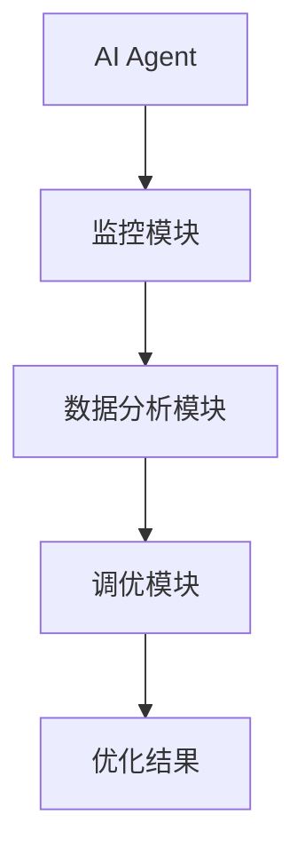
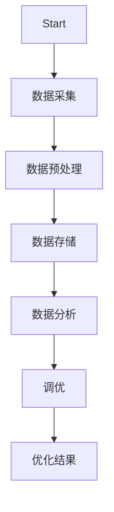
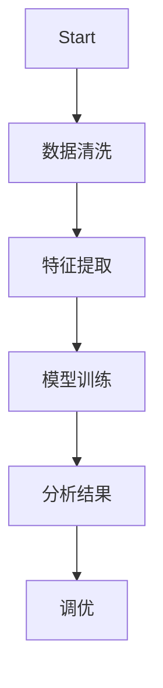
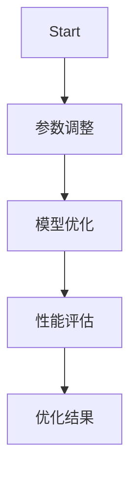
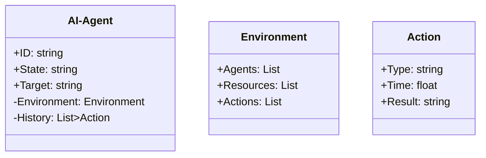

                 


# AI Agent性能优化：监控、分析与调优技巧

**关键词**：AI Agent，性能优化，监控，分析，调优，算法，系统设计

**摘要**：  
AI Agent作为人工智能领域的重要组成部分，其性能优化是实现高效、智能决策的关键。本文系统地探讨了AI Agent性能优化的三个核心环节：监控、分析与调优。通过理论分析、算法实现和实际案例，本文深入讲解了如何通过监控获取关键指标，利用数据分析挖掘性能瓶颈，并通过调优策略提升AI Agent的运行效率。文章结合图表和代码示例，详细阐述了优化过程中的技术细节，为读者提供了一套完整的优化方法论。

---

## 第1章: AI Agent的基本概念与性能优化的重要性

### 1.1 AI Agent的定义与分类

#### 1.1.1 什么是AI Agent
AI Agent（人工智能代理）是指能够感知环境并采取行动以实现目标的智能实体。它可以是一个软件程序、机器人或其他智能系统，通过与环境交互来完成特定任务。

#### 1.1.2 AI Agent的分类
AI Agent可以根据功能、智能水平和应用场景进行分类：

- **按功能分类**：
  - **简单反射型Agent**：基于当前输入做出反应，不依赖历史信息。
  - **基于模型的反射型Agent**：利用内部模型进行决策。
  - **目标驱动型Agent**：根据目标选择行动。
  - **效用驱动型Agent**：通过最大化效用来决策。

- **按智能水平分类**：
  - **反应式AI Agent**：实时响应环境变化。
  - **认知式AI Agent**：具备推理和规划能力。
  - **学习型AI Agent**：通过经验改进性能。

- **按应用场景分类**：
  - **软件Agent**：如推荐系统、聊天机器人。
  - **物理Agent**：如自动驾驶汽车、工业机器人。

#### 1.1.3 AI Agent的核心特征
- **自主性**：无需外部干预即可运行。
- **反应性**：能够感知环境并实时响应。
- **目标导向**：所有行动均以实现目标为导向。
- **学习能力**：能够通过经验改进性能。

---

### 1.2 性能优化的必要性

#### 1.2.1 优化的背景与意义
随着AI Agent的应用场景不断扩大，性能优化变得至关重要。优化不仅能提升效率，还能降低成本、减少资源消耗，并增强系统的可靠性和稳定性。

#### 1.2.2 性能优化的目标与范围
- **目标**：
  - 提升计算效率。
  - 减少资源消耗。
  - 增强系统稳定性。
  - 提高决策准确性。

- **范围**：
  - 计算资源优化。
  - 数据处理效率提升。
  - 算法优化。
  - 系统架构改进。

#### 1.2.3 优化与AI Agent效率提升的关系
性能优化直接影响AI Agent的效率。通过优化，AI Agent能够更快地处理数据、做出更准确的决策，并在复杂环境中表现更佳。

---

### 1.3 本章小结
本章介绍了AI Agent的基本概念、分类及其核心特征，并强调了性能优化的必要性。优化不仅是提升效率的关键，也是实现高效、智能AI Agent的重要保障。

---

## 第2章: 监控、分析与调优的核心原理

### 2.1 监控原理

#### 2.1.1 监控的定义与作用
监控是指对AI Agent的运行状态进行实时或周期性监测，收集相关数据以评估性能。监控的作用包括问题发现、性能评估和异常检测。

#### 2.1.2 监控指标的分类
监控指标可分为以下几类：

- **系统指标**：CPU、内存、磁盘使用情况。
- **算法指标**：计算时间、准确率、召回率。
- **网络指标**：带宽、延迟、数据传输量。
- **用户指标**：响应时间、用户满意度。

#### 2.1.3 监控数据的采集与处理
- **数据采集**：通过日志、传感器或API接口获取数据。
- **数据预处理**：清洗、归一化和格式转换。
- **数据存储**：使用数据库或时间序列数据库存储监控数据。

---

### 2.2 分析原理

#### 2.2.1 数据分析的基本方法
数据分析方法包括描述性分析、诊断性分析、预测性分析和规范性分析。

#### 2.2.2 统计分析与机器学习分析的区别
- **统计分析**：基于概率统计方法，用于数据总结和假设检验。
- **机器学习分析**：利用机器学习模型发现数据中的复杂模式和关系。

#### 2.2.3 分析结果对优化决策的影响
分析结果为调优策略提供数据支持，帮助识别瓶颈并制定优化方案。

---

### 2.3 调优原理

#### 2.3.1 调优的定义与目标
调优是指通过调整系统参数或算法配置，以达到最佳性能的过程。目标包括提升计算速度、减少资源消耗和提高准确性。

#### 2.3.2 调优策略的分类
- **静态调优**：在系统运行前设置参数。
- **动态调优**：根据实时数据调整参数。
- **自适应调优**：利用反馈机制自动优化。

#### 2.3.3 调优过程中的关键因素
- **监控数据**：提供优化依据。
- **分析结果**：指导优化方向。
- **调优策略**：实现性能提升。

---

### 2.4 核心概念对比表

| **核心概念** | **监控** | **分析** | **调优** |
|--------------|----------|----------|----------|
| **定义**     | 数据采集与记录 | 数据处理与模式识别 | 参数调整与优化 |
| **目标**     | 发现问题 | 分析问题 | 解决问题 |
| **输入**     | 性能数据 | 监控数据 | 分析结果 |
| **输出**     | 异常报告 | 分析报告 | 优化策略 |

---

### 2.5 系统架构图



---

## 第3章: AI Agent性能优化的算法原理与数学模型

### 3.1 监控算法的实现原理

#### 3.1.1 监控算法概述
监控算法通常包括数据采集、预处理和存储三个阶段。

#### 3.1.2 监控算法实现流程



---

### 3.2 分析算法的实现原理

#### 3.2.1 分析算法概述
分析算法包括数据清洗、特征提取和模型训练。

#### 3.2.2 分析算法实现流程



---

### 3.3 调优算法的实现原理

#### 3.3.1 调优算法概述
调优算法包括参数调整、模型优化和性能评估。

#### 3.3.2 调优算法实现流程



---

### 3.4 数学模型与公式

#### 3.4.1 监控指标的计算公式
- CPU利用率计算公式：
  $$ CPU\ Utilization = \frac{CPU\ 使用时间}{总时间} $$

#### 3.4.2 分析模型的构建
- 线性回归模型：
  $$ y = \beta_0 + \beta_1x + \epsilon $$

---

## 第4章: 系统分析与架构设计方案

### 4.1 问题场景介绍
AI Agent在运行过程中可能会遇到性能瓶颈，例如计算延迟、资源消耗过大等问题。

### 4.2 系统功能设计

#### 4.2.1 领域模型


#### 4.2.2 系统架构


---

## 第5章: 项目实战

### 5.1 环境安装

#### 5.1.1 安装Python
```bash
python --version
pip install --upgrade pip
```

#### 5.1.2 安装依赖库
```bash
pip install numpy pandas scikit-learn
```

---

### 5.2 系统核心实现源代码

#### 5.2.1 监控模块
```python
import time
import logging

def monitor_agent(agent):
    while True:
        try:
            # 获取监控数据
            data = agent.get_metrics()
            # 存储数据
            store_data(data)
            time.sleep(1)
        except Exception as e:
            logging.error(f"监控失败：{e}")
```

---

## 结语

通过本文的系统讲解，读者可以全面了解AI Agent性能优化的核心环节，包括监控、分析与调优。结合实际案例和代码示例，读者能够掌握优化方法并应用于实际项目中。未来，随着AI技术的不断发展，性能优化将成为AI Agent应用中的关键环节，值得进一步深入研究和实践。

---

**作者：AI天才研究院/AI Genius Institute & 禅与计算机程序设计艺术 /Zen And The Art of Computer Programming**

