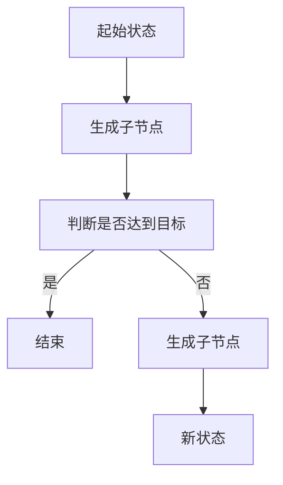
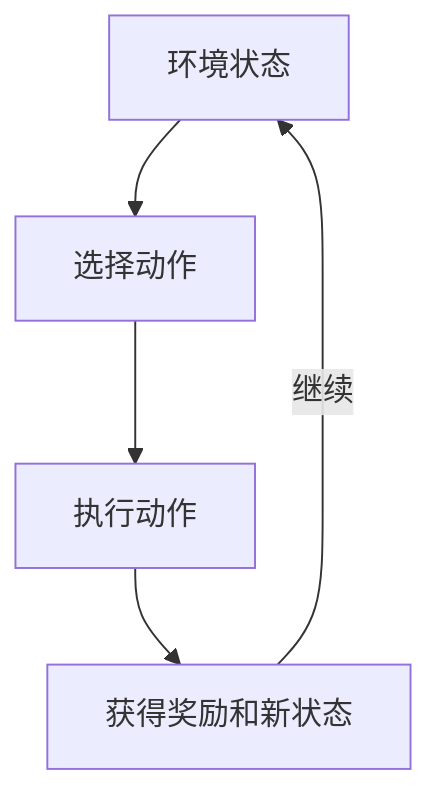
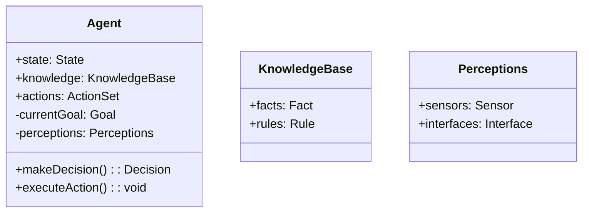
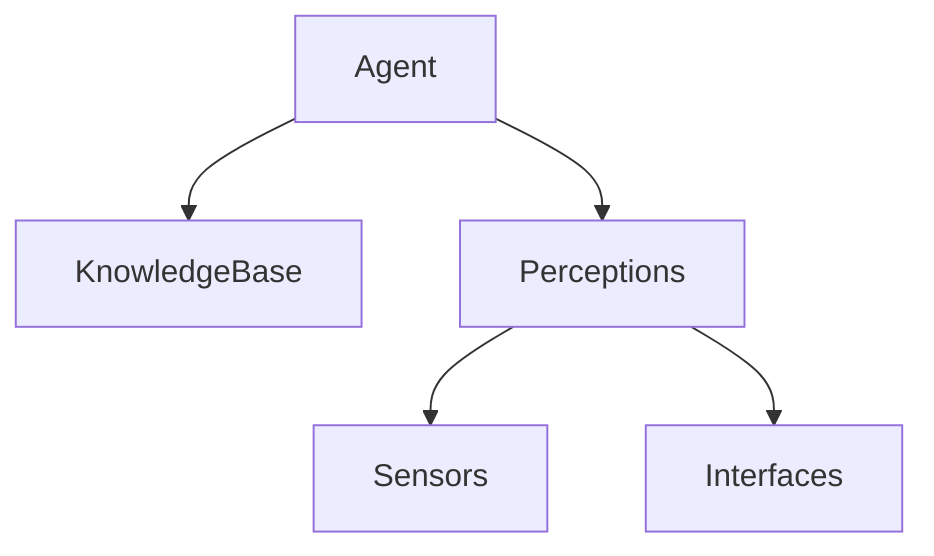

                 


# AI Agent架构设计：从概念到实现

> 关键词：AI Agent、多智能体系统、知识表示、行为规划、强化学习、系统架构

> 摘要：本文将深入探讨AI Agent的架构设计，从基本概念到实际应用，结合具体案例分析，详细介绍AI Agent的核心概念、算法原理、系统架构设计及实现过程。通过本文，读者将能够系统地理解AI Agent的原理和实现方法，并能够将其应用于实际场景中。

---

# 第一部分: AI Agent架构设计基础

## 第1章: AI Agent的基本概念与背景

### 1.1 AI Agent的定义与特点
AI Agent（人工智能代理）是指能够感知环境并采取行动以实现目标的实体。它能够根据输入的信息做出决策，并通过输出动作与环境进行交互。AI Agent的核心特点包括：
- **自主性**：能够在没有外部干预的情况下独立运行。
- **反应性**：能够实时感知环境并做出反应。
- **目标导向性**：所有行为都以实现特定目标为导向。
- **可扩展性**：能够适应不同的应用场景和复杂度。

### 1.2 AI Agent的技术背景
AI Agent的发展与人工智能技术的进步密不可分。从早期的专家系统到现代的强化学习和深度学习，AI Agent的实现方式经历了巨大的变革。当前，AI Agent广泛应用于自动驾驶、智能助手、机器人控制等领域。多智能体系统的概念进一步扩展了AI Agent的应用范围，使得多个AI Agent能够协同工作，共同完成复杂任务。

### 1.3 AI Agent的概念模型
AI Agent的概念模型包括以下几个核心要素：
- **状态（State）**：描述环境的当前情况。
- **动作（Action）**：AI Agent基于当前状态和目标选择的动作。
- **目标（Goal）**：AI Agent希望通过行为实现的目标。
- **感知（Perception）**：AI Agent从环境中获取的信息。
- **决策（Decision）**：基于感知和知识库做出的决策。

### 1.4 AI Agent的设计原则
设计AI Agent时需要遵循以下原则：
- **模块化设计**：将AI Agent的功能分解为独立的模块，便于维护和扩展。
- **可扩展性**：确保AI Agent能够适应不同的应用场景和复杂度。
- **可交互性**：支持与其他系统或用户的交互。

---

## 第2章: AI Agent的核心概念与联系

### 2.1 AI Agent的核心概念原理
AI Agent的核心概念包括知识表示、行为规划和感知交互：
- **知识表示**：将问题领域的知识以计算机可理解的形式表示。
- **行为规划**：基于当前状态和目标，制定行动计划。
- **感知交互**：通过传感器或接口感知环境并进行交互。

### 2.2 核心概念属性特征对比表格
以下是核心概念的属性特征对比：

| 概念       | 属性1          | 属性2          | 属性3          |
|------------|----------------|----------------|----------------|
| 知识表示    | 表达方式        | 可解释性        | 可扩展性        |
| 行为规划    | 策略选择        | 环境适应性      | 执行效率        |
| 感知机制    | 数据来源        | 信息处理        | 实时性          |

### 2.3 ER实体关系图架构（Mermaid）

```mermaid
erDiagram
    agent {
        id : integer
        name : string
        type : string
    }
    environment {
        id : integer
        name : string
        state : string
    }
    action {
        id : integer
        name : string
        result : string
    }
    agent --> environment : interact

    agent --> action : executes
    environment --> action : triggers
```

---

## 第3章: AI Agent的算法原理

### 3.1 状态空间搜索算法
状态空间搜索是一种常见的AI Agent行为规划算法。以下是其实现流程：



数学模型：
$$f(n) = g(n) + h(n)$$
其中，\(g(n)\)表示从起始状态到状态n的已知成本，\(h(n)\)表示从状态n到目标的估算成本。

### 3.2 强化学习算法
强化学习是一种通过试错机制来优化AI Agent行为的算法。以下是其实现流程：



数学模型：
$$Q(s, a) = r + \gamma \max Q(s', a')$$
其中，\(Q(s, a)\)表示状态s下动作a的值，\(\gamma\)表示折扣因子。

---

## 第4章: AI Agent的系统架构设计

### 4.1 问题场景介绍
假设我们需要设计一个智能助手，帮助用户完成日程管理、信息查询等任务。

### 4.2 系统功能设计
以下是系统的功能模块：



### 4.3 系统架构图
以下是系统的架构图：



---

## 第5章: AI Agent的项目实战

### 5.1 环境安装
安装Python和必要的库：
```bash
pip install numpy
pip install matplotlib
pip install scikit-learn
```

### 5.2 核心代码实现
以下是智能助手的核心代码：

```python
class Agent:
    def __init__(self, knowledge_base):
        self.knowledge_base = knowledge_base
        self.current_goal = None
        self.perceptions = []

    def make_decision(self):
        # 基于知识库和当前目标，制定决策
        pass

    def execute_action(self, action):
        # 执行动作
        pass
```

### 5.3 应用解读与分析
通过上述代码，我们可以看到AI Agent的基本结构。知识库作为AI Agent的核心，存储了所有必要的信息和规则。感知模块负责从环境中获取信息，并传递给AI Agent进行处理。

---

## 第6章: 总结与展望

### 6.1 总结
本文详细介绍了AI Agent的架构设计，从基本概念到算法实现，再到系统架构设计，最后通过项目实战展示了AI Agent的实际应用。

### 6.2 注意事项
在设计AI Agent时，需要注意系统的可扩展性和可维护性，同时确保系统的安全性和鲁棒性。

### 6.3 拓展阅读
建议读者进一步阅读《强化学习入门》和《多智能体系统》等书籍，以深入理解AI Agent的相关技术。

---

**作者：AI天才研究院/AI Genius Institute & 禅与计算机程序设计艺术 /Zen And The Art of Computer Programming**

