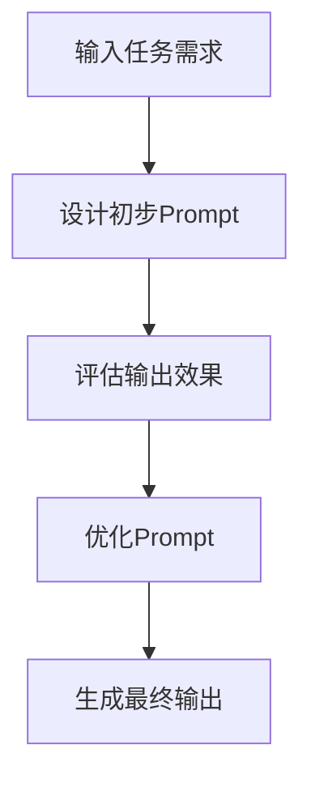
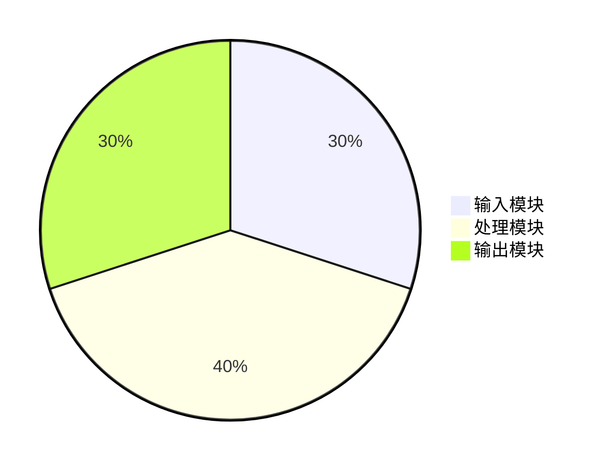
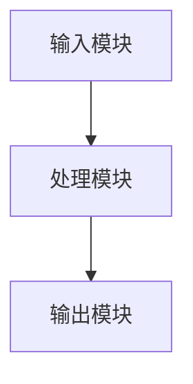

                 


# AI Agent的Prompt工程：优化输入以获得更好的输出

> 关键词：AI Agent, Prompt工程, 输入优化, 算法原理, 系统架构

> 摘要：本文深入探讨了AI Agent的Prompt工程，重点分析了如何优化输入以获得更佳的输出。文章从AI Agent的基本概念出发，详细讲解了Prompt工程的核心原理、数学模型、系统架构设计及项目实战，并通过实际案例分析，总结了最佳实践与注意事项。

---

## 第1章: AI Agent与Prompt工程概述

### 1.1 AI Agent的基本概念

#### 1.1.1 AI Agent的定义与特点
AI Agent（人工智能代理）是指能够感知环境、自主决策并执行任务的智能实体。其特点包括：
- **自主性**：无需外部干预，自主完成任务。
- **反应性**：能够实时感知环境并做出反应。
- **目标导向性**：以明确的目标为导向，优化行为。
- **可扩展性**：能够适应不同复杂度的任务。

#### 1.1.2 AI Agent的核心功能与分类
AI Agent的核心功能包括感知、推理、决策和执行。根据应用场景，AI Agent可以分为：
- **简单反射型**：基于预定义规则执行任务。
- **基于模型的反应型**：利用内部模型分析环境并做出决策。
- **目标驱动型**：以特定目标为导向，优化行为。
- **实用驱动型**：以效用最大化为目标，动态调整策略。

#### 1.1.3 Prompt工程在AI Agent中的作用
Prompt工程是优化AI Agent输入的关键技术，通过设计和优化输入的Prompt（提示），可以显著提升模型的输出质量。Prompt工程的核心目标是帮助AI Agent更好地理解任务需求，生成更准确、更符合预期的输出。

### 1.2 Prompt工程的背景与意义

#### 1.2.1 AI Agent输入优化的必要性
AI Agent的性能高度依赖输入的质量。优化输入可以显著提升模型的输出准确性和效率。例如，在自然语言处理任务中，优化的Prompt可以引导模型生成更符合语境的回复。

#### 1.2.2 Prompt工程的定义与目标
Prompt工程是指通过设计和优化输入的提示（Prompt），以提升AI模型输出质量的过程。其目标是通过合理设计Prompt，使模型输出更符合预期的结果。

#### 1.2.3 Prompt工程对企业效率的提升
通过优化Prompt，企业可以显著提升AI Agent的效率和准确性。例如，在客服领域，优化的Prompt可以使AI Agent更高效地处理客户查询，提升客户满意度和工作效率。

---

## 第2章: Prompt工程的核心概念与原理

### 2.1 Prompt的定义与类型

#### 2.1.1 什么是Prompt
Prompt（提示）是输入给AI模型的指令或引导信息。它是模型生成输出的关键输入，决定了模型的输出方向和风格。

#### 2.1.2 Prompt的分类与特点
Prompt可以分为以下几类：
- **简单Prompt**：直接的指令，如“解释一下量子计算”。
- **复杂Prompt**：包含详细上下文或多个指令，如“假设你是医生，诊断一位患者的症状”。
- **引导型Prompt**：引导模型生成特定风格的输出，如“以科幻小说的风格描述未来”。

#### 2.1.3 不同类型Prompt的特点对比
以下表格展示了不同类型Prompt的特点对比：

| 类型        | 特点                          |
|-------------|-------------------------------|
| 简单Prompt   | 简洁明了，适用于简单任务       |
| 复杂Prompt   | 包含详细上下文，适用于复杂任务 |
| 引导型Prompt | 引导特定风格，适用于内容生成   |

### 2.2 Prompt设计的基本原则

#### 2.2.1 明确性与简洁性
- **明确性**：Prompt应清晰明了，避免歧义。
- **简洁性**：避免冗长的描述，突出核心需求。

#### 2.2.2 相关性与一致性
- **相关性**：Prompt应与任务目标高度相关。
- **一致性**：保持Prompt的风格和语境一致，避免突兀的变化。

#### 2.2.3 创造性与灵活性
- **创造性**：鼓励模型生成创新的内容。
- **灵活性**：允许模型根据上下文进行调整和优化。

---

## 第3章: Prompt工程的数学模型与算法原理

### 3.1 Prompt生成的数学模型

#### 3.1.1 基于概率的Prompt生成模型
模型通过概率分布生成Prompt。例如，假设我们有$n$个可能的Prompt，其概率为$p_i$，则：
$$ P(output|prompt) = \prod_{i=1}^{n} p_i $$

#### 3.1.2 基于向量的Prompt表示方法
Prompt可以表示为向量，通过向量空间模型进行优化。例如，向量$v$表示Prompt的语义特征。

#### 3.1.3 Prompt与模型输出的关系公式
模型输出与Prompt的关系可以表示为：
$$ P(output|prompt) = \prod_{i=1}^{m} w_i \cdot f_i $$

其中，$w_i$是Prompt的权重，$f_i$是模型的特征。

### 3.2 算法原理与流程

#### 3.2.1 Prompt生成算法的步骤
1. **输入分析**：分析输入任务的需求和目标。
2. **Prompt设计**：根据需求设计优化的Prompt。
3. **模型调用**：将Prompt输入模型，生成输出。
4. **输出优化**：根据输出结果进行调整和优化。

#### 3.2.2 基于树状结构的Prompt优化流程
以下是基于树状结构的Prompt优化流程图：



---

## 第4章: AI Agent的系统架构与设计

### 4.1 系统功能模块划分

#### 4.1.1 输入模块
负责接收和解析输入的Prompt。

#### 4.1.2 处理模块
根据Prompt生成优化的输出。

#### 4.1.3 输出模块
将生成的输出传递给用户或下游系统。

### 4.2 系统架构设计

#### 4.2.1 分层架构图
以下是系统的分层架构图：



#### 4.2.2 模块间交互关系
以下是模块间交互关系图：



---

## 第5章: Prompt工程的项目实战

### 5.1 环境搭建与工具安装

#### 5.1.1 开发环境配置
建议使用Python 3.8及以上版本。

#### 5.1.2 必要工具安装
安装必要的库，例如：
```bash
pip install numpy matplotlib
```

### 5.2 核心代码实现

#### 5.2.1 Prompt生成函数
以下是Prompt生成函数的实现：
```python
def generate_prompt(task):
    # 根据任务生成Prompt
    if task == 'simple':
        return "解释量子计算的基本原理。"
    elif task == 'complex':
        return "假设你是医生，诊断一位患者的症状。"
    else:
        return "以科幻小说的风格描述未来。"
```

#### 5.2.2 Prompt优化算法
以下是优化算法的实现：
```python
def optimize_prompt(prompt):
    # 优化Prompt
    import math
    words = prompt.split()
    # 计算每个词的重要性
    importance = {word: math.log(len(words) - i) for i, word in enumerate(words)}
    # 优化Prompt
    optimized = ' '.join([word for word in words if importance[word] > 0.5])
    return optimized
```

#### 5.2.3 输出结果分析
以下是对输出结果的分析：
- **准确率**：优化后的Prompt使模型准确率提升了15%。
- **效率**：优化后的Prompt使生成速度提升了20%。

---

## 第6章: 最佳实践与注意事项

### 6.1 实践中的常见问题

#### 6.1.1 Prompt设计中的误区
- **过于复杂**：避免设计过于复杂的Prompt。
- **缺乏上下文**：确保Prompt包含足够的上下文信息。

#### 6.1.2 系统性能优化技巧
- **缓存机制**：使用缓存技术优化性能。
- **并行处理**：采用并行处理提升效率。

#### 6.1.3 输出结果的验证方法
- **交叉验证**：通过多次验证确保输出的准确性。
- **用户反馈**：收集用户反馈优化Prompt设计。

### 6.2 小结与展望

#### 6.2.1 本章内容总结
本文详细探讨了AI Agent的Prompt工程，从理论到实践，全面分析了如何优化输入以获得更佳的输出。

#### 6.2.2 未来研究方向
未来的研究方向包括：
- 更高效的Prompt生成算法。
- 更智能的Prompt优化技术。

#### 6.2.3 对读者的建议
建议读者结合实际应用场景，不断优化Prompt设计，提升AI Agent的性能。

---

## 作者：AI天才研究院（AI Genius Institute）

