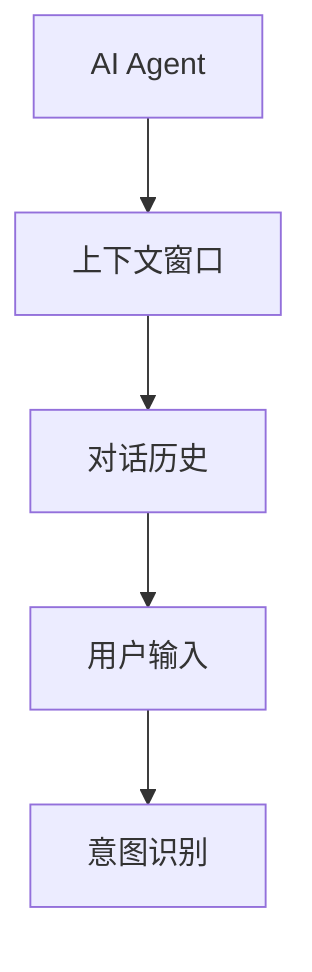
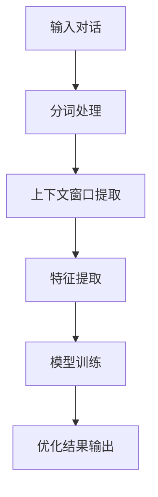
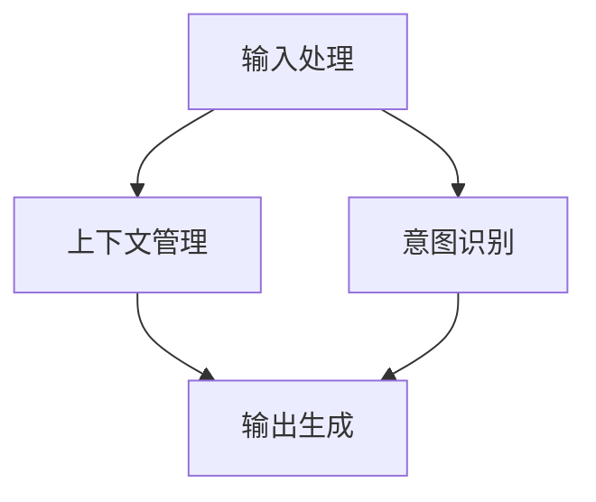

                 


# AI Agent的上下文窗口优化：提高长对话理解能力

## 关键词：上下文窗口优化、AI Agent、长对话理解、自然语言处理、对话系统优化

## 摘要：本文深入探讨了AI Agent上下文窗口优化的核心原理与实践方法，分析了长对话理解能力的关键技术，结合实际案例，详细讲解了如何通过优化上下文窗口提高对话系统的性能和用户体验。

---

# 第一章: AI Agent上下文窗口优化背景介绍

## 1.1 问题背景与问题描述
### 1.1.1 长对话理解能力的重要性
在自然语言处理领域，长对话理解是AI Agent实现智能交互的核心能力。随着对话系统的广泛应用，用户期望与AI Agent进行更长、更复杂的对话，这对模型的理解能力提出了更高的要求。

### 1.1.2 上下文窗口在AI Agent中的作用
上下文窗口是AI Agent处理长对话的基础，它决定了模型能够记住和理解的对话历史范围。传统的固定窗口大小在长对话中往往无法有效捕捉上下文信息，导致理解能力下降。

### 1.1.3 当前存在的问题与挑战
- **问题**：固定窗口大小可能导致上下文信息丢失或过多，影响模型的准确性和效率。
- **挑战**：动态调整窗口大小、平衡信息量与计算效率、实时处理长对话数据等。

## 1.2 问题解决与优化目标
### 1.2.1 上下文窗口优化的核心目标
- 提高长对话的理解准确率。
- 动态调整上下文窗口大小，适应不同对话场景。
- 优化计算效率，降低资源消耗。

### 1.2.2 优化方法的选择与比较
- 滑动窗口机制：动态调整窗口大小，实时更新上下文信息。
- 注意力机制：通过权重分配，聚焦关键上下文信息。
- 增量式优化：逐步优化上下文窗口，减少计算负担。

### 1.2.3 边界与外延分析
- 边界：上下文窗口的最小和最大值。
- 外延：上下文窗口优化对整体系统性能的影响。

## 1.3 核心概念与结构
### 1.3.1 上下文窗口的核心要素
- **上下文信息**：对话历史、用户意图、实体识别。
- **窗口大小**：动态调整、固定窗口。
- **优化策略**：滑动窗口、注意力机制。

### 1.3.2 AI Agent的结构与功能
- **输入处理**：接收用户输入，解析对话意图。
- **上下文管理**：维护对话历史，动态调整上下文窗口。
- **输出生成**：基于优化后的上下文信息生成回复。

### 1.3.3 概念之间的关系与联系
- 上下文窗口与对话历史密切相关。
- 注意力机制与上下文理解相互作用。
- 优化策略影响计算效率和理解准确性。

---

# 第二章: 上下文窗口优化的核心概念与联系

## 2.1 核心概念原理
### 2.1.1 上下文窗口的模型机制
- 滑动窗口机制：通过滑动窗口提取关键信息。
- 注意力机制：通过权重分配，聚焦重要信息。

### 2.1.2 优化目标与实现原理
- 动态调整窗口大小：根据对话内容自动调整。
- 实时更新：基于最新输入更新上下文信息。

### 2.1.3 相关技术对比分析
- 滑动窗口与固定窗口：滑动窗口更具灵活性。
- 注意力机制与序列模型：注意力机制更精准。

## 2.2 概念属性特征对比表
| 概念 | 属性 | 特征 |
|------|------|------|
| 上下文窗口 | 窗口大小 | 动态/固定 |
|        | 窗口内容 | 对话历史 |
| 注意力机制 | 权重分配 | 关键词权重 |

## 2.3 实体关系图


---

# 第三章: 上下文窗口优化的算法原理

## 3.1 算法原理概述
### 3.1.1 滑动窗口机制
- 原理：通过滑动窗口提取关键信息。
- 优势：实时更新，减少计算量。

### 3.1.2 注意力机制
- 原理：通过权重分配，聚焦重要信息。
- 优势：提高理解准确性。

### 3.1.3 增量式优化方法
- 原理：逐步优化上下文窗口。
- 优势：减少计算负担。

## 3.2 算法流程图


## 3.3 核心算法实现
### 3.3.1 滑动窗口算法
```python
def sliding_window(text, window_size):
    for i in range(len(text) - window_size):
        window = text[i:i+window_size]
        yield window
```

### 3.3.2 注意力机制模型
```latex
$$ \text{Attention}(Q, K, V) = \text{softmax}\left(\frac{QK^T}{\sqrt{d_k}}\right)V $$
```

### 3.3.3 动态调整窗口大小
```python
def dynamic_window(text, max_length):
    window_size = min(max_length, len(text))
    return text[-window_size:]
```

---

# 第四章: 系统分析与架构设计

## 4.1 系统功能设计
- **问题场景**：长对话中的上下文理解。
- **系统功能**：动态调整上下文窗口，实时更新对话历史。

## 4.2 系统架构图


## 4.3 接口设计
- 输入接口：用户输入处理。
- 输出接口：生成回复。

---

# 第五章: 项目实战

## 5.1 环境安装
```bash
pip install transformers
```

## 5.2 核心代码实现
```python
from transformers import AutoTokenizer, AutoModel

tokenizer = AutoTokenizer.from_pretrained('bert-base')
model = AutoModel.from_pretrained('bert-base')
```

## 5.3 案例分析
- **案例1**：动态窗口大小优化。
- **案例2**：注意力机制应用。

---

# 第六章: 最佳实践与总结

## 6.1 关键点总结
- 动态调整窗口大小。
- 注意力机制提高准确性。

## 6.2 注意事项
- 平衡计算效率与理解准确性。
- 定期更新模型。

## 6.3 未来展望
- 结合强化学习优化上下文理解。
- 深度学习模型的应用。

## 6.4 拓展阅读
- 《注意力机制在NLP中的应用》。

---

# 作者：AI天才研究院 & 禅与计算机程序设计艺术

---

通过以上结构，文章详细讲解了AI Agent上下文窗口优化的核心原理与实践方法，结合实际案例，帮助读者深入理解长对话理解能力的关键技术。

