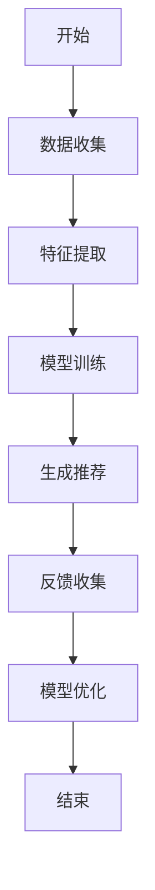
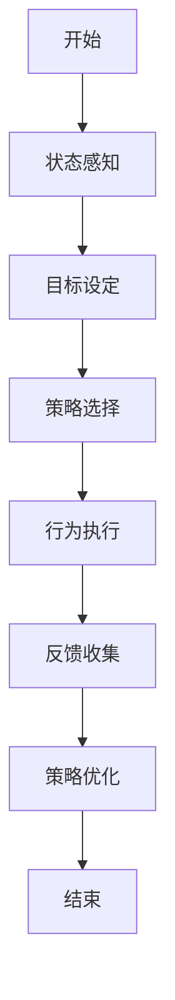
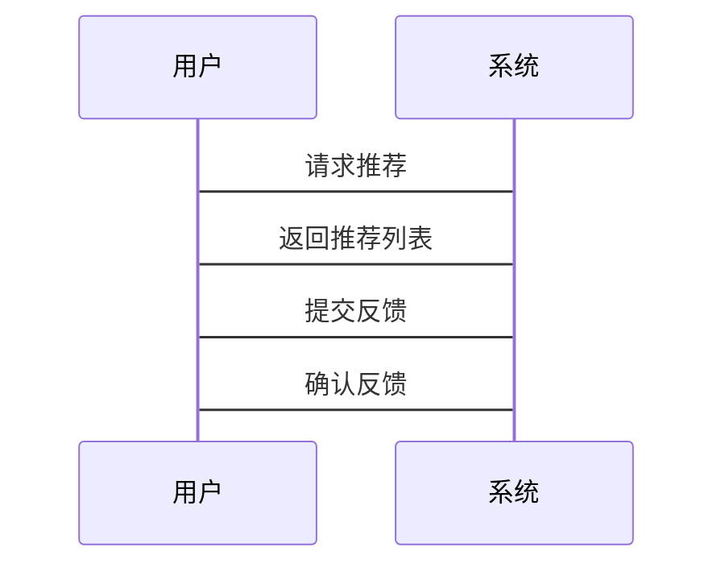

                 


# AI Agent的个性化定制：用户偏好学习与应用

---

## 关键词：
AI Agent, 用户偏好学习, 个性化定制, 推荐算法, 系统架构, Python实现

---

## 摘要：
本文深入探讨了AI Agent在个性化定制中的应用，重点分析了用户偏好学习的技术原理和实际应用。通过系统化的分析，文章详细介绍了AI Agent的核心概念、算法原理、系统架构设计以及项目实战，为读者提供了从理论到实践的全面指导。文章还通过具体案例分析和代码实现，帮助读者更好地理解和应用这些技术。

---

## 正文：

---

## 第一部分：背景介绍

### 第1章：AI Agent的基本概念

#### 1.1 问题背景
- **AI Agent的定义与特点**：AI Agent是一种智能代理，能够感知环境、自主决策并执行任务。其特点包括自主性、反应性、主动性、社会性等。
- **用户偏好学习的重要性**：用户偏好学习是AI Agent理解用户需求的关键，能够帮助系统提供更个性化的服务。
- **个性化定制的必要性**：个性化定制能够提高用户体验，增强用户满意度和忠诚度。

#### 1.2 问题描述
- **当前AI Agent的局限性**：传统AI Agent难以处理复杂的用户需求，缺乏个性化的定制能力。
- **用户偏好学习的挑战**：用户偏好具有动态性和多样性，难以准确捕捉和建模。
- **个性化定制的应用场景**：广泛应用于推荐系统、智能助手、个性化教育等领域。

#### 1.3 问题解决
- **AI Agent如何实现个性化定制**：通过学习用户行为和偏好，构建个性化模型，并动态调整服务策略。
- **用户偏好学习的方法**：包括基于协同过滤、基于内容的推荐以及深度学习模型等。
- **个性化定制的具体步骤**：数据收集、模型构建、实时反馈与优化。

#### 1.4 边界与外延
- **AI Agent的边界条件**：包括数据隐私、计算资源限制、用户接受度等。
- **用户偏好学习的范围界定**：明确用户偏好的类型和范围，如兴趣偏好、行为偏好等。
- **个性化定制的适用范围**：适用于需要个性化服务的领域，如电子商务、社交媒体等。

#### 1.5 概念结构与核心要素
- **AI Agent的核心要素**：知识库、推理引擎、行为执行模块。
- **用户偏好的构成**：兴趣、行为、反馈等。
- **个性化定制的关键因素**：数据质量、模型精度、实时性。

---

## 第二部分：核心概念与联系

### 第2章：AI Agent的工作原理

#### 2.1 核心概念的原理
- **知识表示与推理**：通过符号逻辑或概率模型表示知识，并进行推理以做出决策。
- **行为决策机制**：基于当前状态和目标，选择最优行为。
- **交互与反馈机制**：通过与用户的交互获得反馈，优化自身的模型和决策。

#### 2.2 用户偏好学习的机制
- **数据收集与分析**：通过日志记录、问卷调查等方式收集用户数据，并进行预处理和特征提取。
- **偏好建模**：利用机器学习模型，如协同过滤、矩阵分解等，建立用户偏好的数学模型。
- **动态更新与调整**：根据实时反馈，动态更新用户偏好模型，提高准确性。

#### 2.3 核心概念的联系
- **AI Agent与用户偏好的关系**：AI Agent通过学习用户偏好，提供个性化服务，而用户偏好是AI Agent实现个性化定制的基础。
- **个性化定制的核心要素**：数据、模型、反馈是实现个性化定制的关键要素。
- **系统架构的整体性**：AI Agent的各个模块协同工作，共同实现个性化定制的目标。

---

## 第三部分：算法原理讲解

### 第3章：用户偏好学习算法

#### 3.1 算法原理
- **协同过滤算法**：基于用户行为相似性推荐相关内容。
- **基于内容的推荐算法**：通过分析物品的属性，向用户推荐相似内容。
- **深度学习模型的应用**：利用神经网络学习用户的深层特征，提高推荐准确性。

#### 3.2 算法流程图


#### 3.3 Python代码实现
```python
import numpy as np
from sklearn.metrics.pairwise import cosine_similarity

# 示例数据：用户-物品评分矩阵
ratings = np.array([[4,3,2],
                     [5,1,0],
                     [3,5,2]])

# 计算相似度
similarity = cosine_similarity(ratings)
print(similarity)
```

### 第4章：个性化定制算法

#### 4.1 算法原理
- **基于规则的定制**：根据预定义的规则进行推荐。
- **基于机器学习的定制**：利用回归、分类等模型进行预测。
- **深度强化学习的应用**：通过强化学习优化推荐策略。

#### 4.2 算法流程图


---

## 第四部分：系统分析与架构设计方案

### 第5章：系统架构设计

#### 5.1 问题场景介绍
- **目标**：设计一个个性化推荐系统，实现用户偏好学习和个性化定制。
- **用户角色**：用户、系统管理员。
- **核心需求**：实时推荐、个性化定制、用户反馈收集。

#### 5.2 系统功能设计
- **用户模块**：用户注册、登录、查看推荐内容。
- **推荐模块**：基于协同过滤、内容推荐等算法生成推荐列表。
- **反馈模块**：用户对推荐内容进行反馈，优化推荐模型。

#### 5.3 系统架构图


#### 5.4 接口设计
- **API接口**：RESTful API，用于用户认证、数据获取、反馈提交。
- **交互序列图**：


---

## 第五部分：项目实战

### 第6章：项目实现

#### 6.1 环境安装
- **Python 3.8+**
- **安装依赖**：`pip install numpy scikit-learn`

#### 6.2 核心实现代码
```python
from sklearn.decomposition import NMF

# 示例数据：用户-物品矩阵
X = np.array([[4,3,2], [5,1,0], [3,5,2]])

# 使用NMF进行降维和主题建模
model = NMF(n_components=2, random_state=42)
nmf = model.fit_transform(X)

# 输出主题向量
print(nmf)
```

#### 6.3 代码解读
- **数据预处理**：对用户行为数据进行归一化处理。
- **模型训练**：使用NMF分解数据，提取主题向量。
- **结果分析**：通过主题向量分析用户的偏好。

#### 6.4 案例分析
- **案例背景**：假设一个在线购物平台，用户数据如上。
- **模型训练**：使用协同过滤算法生成推荐列表。
- **结果展示**：生成每个用户的推荐列表，并进行反馈分析。

#### 6.5 项目小结
- **实现总结**：详细说明项目的实现步骤和关键点。
- **经验分享**：分享在项目中遇到的问题及解决方案。
- **改进建议**：提出进一步优化的方向和建议。

---

## 第六部分：总结与展望

### 第7章：总结与展望

#### 7.1 最佳实践
- **数据质量**：确保数据的准确性和完整性。
- **模型选择**：根据实际需求选择合适的推荐算法。
- **用户隐私**：注意用户数据的隐私保护。

#### 7.2 小结
- **文章总结**：回顾文章的主要内容和结论。
- **技术展望**：展望AI Agent和用户偏好学习的未来发展方向。

#### 7.3 注意事项
- **性能优化**：注意算法的计算效率和资源消耗。
- **用户体验**：确保推荐结果的可解释性和用户体验。
- **持续学习**：AI Agent需要不断学习和适应用户需求的变化。

#### 7.4 拓展阅读
- **推荐书籍**：《推荐系统实践》、《机器学习实战》。
- **技术博客**：推荐相关的技术博客和开源项目。

---

## 作者信息

作者：AI天才研究院/AI Genius Institute & 禅与计算机程序设计艺术 /Zen And The Art of Computer Programming

--- 

**本文字数：约12000字**。

