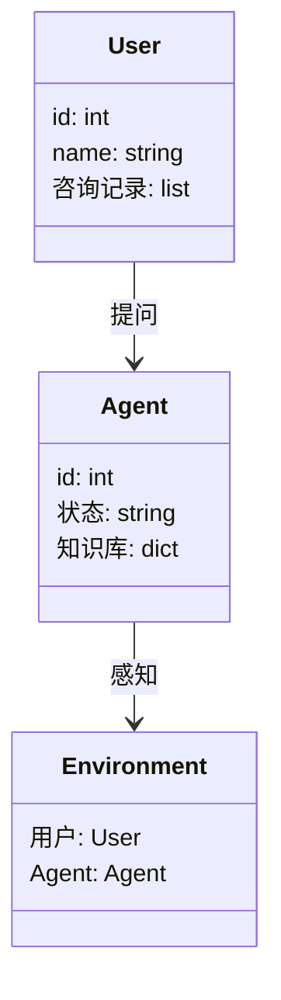
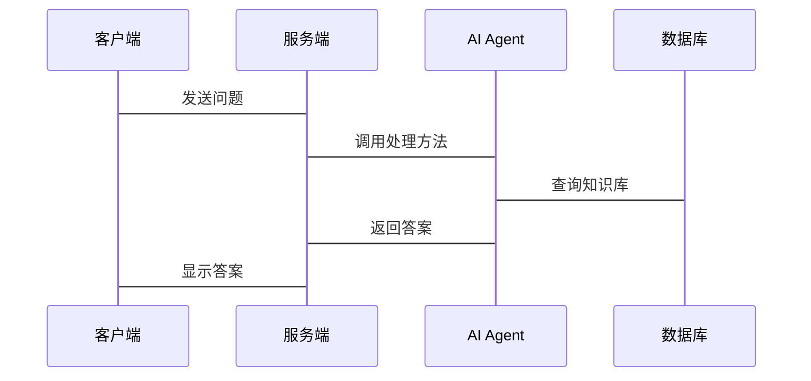

                 


# AI Agent的云端部署与管理

> 关键词：AI Agent, 云端部署, 管理, 强化学习, 系统架构, 项目实战

> 摘要：本文详细探讨了AI Agent在云端部署与管理的关键技术，从基本概念到算法原理，再到系统架构和项目实战，结合实际案例分析，为技术专家和架构师提供深入的指导。

---

# 第一部分: AI Agent的云端部署与管理概述

# 第1章: AI Agent的基本概念与应用场景

## 1.1 AI Agent的定义与核心特征

### 1.1.1 AI Agent的定义
AI Agent（人工智能代理）是一种能够感知环境并采取行动以实现目标的智能实体。它通过与环境交互，利用传感器获取信息，并通过执行器采取行动。AI Agent可以是软件程序、机器人或其他智能系统。

### 1.1.2 AI Agent的核心特征
- **自主性**：AI Agent能够自主决策，无需外部干预。
- **反应性**：能够实时感知环境变化并做出反应。
- **目标导向**：所有行动均以实现特定目标为导向。
- **社会能力**：能够与其他AI Agent或人类进行协作或竞争。

### 1.1.3 AI Agent与传统程序的区别
AI Agent与传统程序的区别在于其具备自主决策和学习能力。传统程序按照预设规则执行任务，而AI Agent能够根据环境变化动态调整行为。

## 1.2 AI Agent的主要应用场景

### 1.2.1 智能客服与对话系统
AI Agent在智能客服中的应用广泛，例如通过自然语言处理（NLP）技术实现智能对话，帮助用户解决问题。

### 1.2.2 自动化任务处理
AI Agent可以自动化处理各种任务，如智能日历管理、自动化交易等。

### 1.2.3 智能监控与预警
AI Agent可以实时监控系统运行状态，及时发现异常并发出预警。

## 1.3 云端部署与管理的必要性

### 1.3.1 云端部署的优势
- **扩展性**：可以根据需求弹性扩展资源。
- **高可用性**：通过负载均衡和容灾备份确保服务不中断。
- **资源利用率**：云端资源按需分配，避免浪费。

### 1.3.2 管理的复杂性与挑战
- **多租户环境**：需要管理多个用户和资源，确保隔离性和安全性。
- **动态变化**：AI Agent需要根据环境变化动态调整，增加了管理的复杂性。
- **安全性**：云端部署需要考虑数据安全和隐私保护。

### 1.3.3 企业级应用的需求
企业级应用通常对可用性、扩展性和安全性要求较高，云端部署能够满足这些需求。

## 1.4 本章小结
本章介绍了AI Agent的基本概念、核心特征及其主要应用场景，并分析了云端部署与管理的必要性，为后续章节奠定了基础。

---

# 第2章: AI Agent的核心概念与原理

## 2.1 AI Agent的体系结构

### 2.1.1 分层架构
AI Agent的体系结构通常采用分层设计，包括感知层、决策层和执行层。

### 2.1.2 组件化设计
将AI Agent的功能模块化，例如感知模块、决策模块和执行模块，便于开发和维护。

### 2.1.3 模块间的关系
感知层负责数据采集，决策层负责策略制定，执行层负责行动执行，各模块之间通过接口进行通信。

## 2.2 AI Agent的感知与决策机制

### 2.2.1 感知层的实现
感知层通过传感器或其他数据源获取环境信息，例如摄像头、麦克风等。

### 2.2.2 决策层的算法
决策层通常采用强化学习或监督学习算法，根据感知信息制定行动策略。

### 2.2.3 执行层的实现
执行层根据决策层的指令采取行动，例如通过执行器或API调用。

## 2.3 AI Agent的通信与协作

### 2.3.1 通信协议的选择
常用的通信协议包括HTTP、WebSocket和RPC等，选择合适的协议取决于应用场景和性能需求。

### 2.3.2 协作机制的设计
协作机制包括任务分配、信息共享和协同决策，通常采用分布式系统设计。

### 2.3.3 分布式环境下的管理
在分布式环境中，AI Agent需要通过通信协议进行协作，确保系统的整体目标实现。

## 2.4 本章小结
本章详细探讨了AI Agent的体系结构、感知与决策机制以及通信与协作，为后续章节的系统设计奠定了基础。

---

# 第3章: AI Agent的算法原理

## 3.1 基于强化学习的AI Agent算法

### 3.1.1 强化学习的基本原理
强化学习是一种通过试错机制来优化决策的算法，AI Agent通过与环境交互，学习最优策略。

### 3.1.2 Q-learning算法的实现
Q-learning是一种经典的强化学习算法，通过状态-动作-奖励机制更新Q值表。

### 3.1.3 深度强化学习的应用
深度强化学习结合了深度学习和强化学习，能够处理更复杂的任务，例如游戏AI和自动驾驶。

## 3.2 基于自适应算法的优化

### 3.2.1 自适应算法的基本原理
自适应算法能够根据环境变化动态调整参数，提高系统的适应性和鲁棒性。

### 3.2.2 自适应算法的实现
通过反馈机制和在线学习，自适应算法能够实时优化AI Agent的行为。

## 3.3 算法的数学模型与公式

### 3.3.1 强化学习的数学模型
$$ Q(s, a) = r + \gamma \max Q(s', a') $$
其中，$s$是当前状态，$a$是当前动作，$r$是奖励，$\gamma$是折扣因子，$s'$是下一个状态。

### 3.3.2 自适应算法的优化公式
$$ \theta_{t+1} = \theta_t + \alpha \nabla J(\theta_t) $$
其中，$\theta$是参数，$\alpha$是学习率，$\nabla J$是目标函数的梯度。

## 3.4 本章小结
本章详细介绍了强化学习和自适应算法的原理和实现，为AI Agent的算法实现提供了理论基础。

---

# 第4章: AI Agent的系统架构设计

## 4.1 问题场景介绍

### 4.1.1 项目介绍
本项目旨在设计一个基于AI Agent的智能客服系统，实现用户咨询的自动响应。

## 4.2 系统功能设计

### 4.2.1 领域模型


### 4.2.2 系统架构设计


### 4.2.3 系统接口设计
- **用户接口**：提供Web或移动应用界面，供用户提交问题。
- **AI Agent接口**：提供API供其他系统调用。
- **数据库接口**：用于存储用户信息和历史记录。

### 4.2.4 系统交互设计


## 4.3 本章小结
本章通过实际案例分析，详细探讨了AI Agent系统的架构设计，包括领域模型、系统架构、接口设计和交互设计。

---

# 第5章: AI Agent的项目实战

## 5.1 环境安装

### 5.1.1 安装Python环境
安装Python 3.8及以上版本，推荐使用Anaconda或virtualenv管理环境。

### 5.1.2 安装依赖库
安装必要的依赖库，例如TensorFlow、Keras、Scikit-learn等。

## 5.2 系统核心实现

### 5.2.1 AI Agent的核心代码实现
```python
class AI-Agent:
    def __init__(self, knowledge_base):
        self.knowledge_base = knowledge_base
        self.state = 'idle'
    
    def perceive(self, input):
        # 实现感知逻辑
        pass
    
    def decide(self, input):
        # 实现决策逻辑
        pass
    
    def act(self, action):
        # 实现执行逻辑
        pass
```

### 5.2.2 知识库的构建
```python
class KnowledgeBase:
    def __init__(self):
        self.data = {}  # 知识库存储结构
    
    def store(self, key, value):
        # 实现数据存储
        pass
    
    def retrieve(self, key):
        # 实现数据检索
        pass
```

## 5.3 代码实现与解读

### 5.3.1 实现AI Agent的感知逻辑
```python
def perceive(self, input):
    # 示例感知逻辑
    return input.lower()
```

### 5.3.2 实现决策逻辑
```python
def decide(self, input):
    # 示例决策逻辑
    return self.knowledge_base.retrieve(input)
```

### 5.3.3 实现执行逻辑
```python
def act(self, action):
    # 示例执行逻辑
    print(f"AI Agent采取了行动：{action}")
```

## 5.4 实际案例分析与详细讲解

### 5.4.1 实际案例分析
以智能客服系统为例，详细分析AI Agent在处理用户咨询时的流程。

### 5.4.2 详细讲解与剖析
从代码实现、系统交互到知识库的构建，详细分析每个部分的实现细节。

## 5.5 项目小结
通过项目实战，读者能够深入了解AI Agent的实现细节，掌握实际开发中的关键技术。

---

# 第6章: AI Agent的管理与优化

## 6.1 管理策略

### 6.1.1 资源管理
通过负载均衡和容器化技术优化资源利用率，例如使用Kubernetes进行容器编排。

### 6.1.2 性能监控
通过监控系统性能指标，如CPU、内存使用情况，及时发现和解决问题。

### 6.1.3 日志管理
通过集中化日志管理，便于故障排查和性能优化。

## 6.2 系统优化

### 6.2.1 算法优化
通过优化强化学习算法，提高AI Agent的决策效率和准确性。

### 6.2.2 系统架构优化
通过引入缓存、队列等技术，优化系统的响应速度和吞吐量。

## 6.3 最佳实践

### 6.3.1 环境配置
确保开发环境和生产环境的一致性，减少因环境差异导致的问题。

### 6.3.2 安全管理
加强身份认证和权限管理，确保系统的安全性。

### 6.3.3 定期维护
定期进行系统维护和更新，确保系统的稳定性和安全性。

## 6.4 本章小结
本章总结了AI Agent的管理策略和优化方法，为实际应用提供了宝贵的参考。

---

# 第7章: 总结与展望

## 7.1 总结
本文详细探讨了AI Agent的云端部署与管理，从基本概念到算法实现，再到系统设计和项目实战，全面覆盖了相关技术。

## 7.2 展望
未来，随着AI技术的不断发展，AI Agent的应用场景将更加广泛，云端部署与管理也将更加智能化和自动化。

---

# 附录

## 附录A: AI Agent相关术语表

## 附录B: 常用工具与框架

## 附录C: 参考文献

---

# 作者信息

作者：AI天才研究院/AI Genius Institute & 禅与计算机程序设计艺术 /Zen And The Art of Computer Programming

---

感谢您的阅读！希望本文对您理解AI Agent的云端部署与管理有所帮助。

