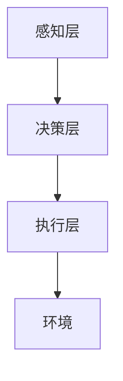

                 


# AI Agent的价值对齐：在LLM中植入人类价值观

> 关键词：AI Agent, 价值对齐, 大语言模型, 人类价值观, 强化学习, 伦理设计, 系统架构

> 摘要：本文探讨了AI Agent与人类价值观对齐的重要性，分析了在大语言模型中植入人类价值观的实现方法，包括算法原理、系统架构设计以及项目实战案例。通过深入的技术分析和实际案例，本文为AI技术的伦理设计提供了新的思路。

---

## 第1章: AI Agent 与价值对齐概述

### 1.1 AI Agent 的基本概念

#### 1.1.1 什么是 AI Agent
AI Agent（人工智能代理）是一种能够感知环境并采取行动以实现目标的智能实体。它可以是一个软件程序、机器人或其他形式的智能系统，具备自主决策和执行任务的能力。AI Agent的核心目标是通过感知和行动来优化其设定的目标函数。

**关键概念对比表：**

| 概念         | 描述                                         |
|--------------|--------------------------------------------|
| AI Agent     | 具备感知和行动能力的智能实体               |
| 目标函数     | AI Agent追求优化的函数                     |
| 环境         | AI Agent所处的外部世界                     |
| 行动         | AI Agent采取的具体动作                     |

#### 1.1.2 AI Agent 的核心特征
1. **自主性**：AI Agent能够在没有外部干预的情况下自主决策。
2. **反应性**：能够根据环境的变化实时调整行为。
3. **目标导向**：所有行动都围绕着实现特定目标展开。
4. **学习能力**：通过与环境的交互不断优化自身的策略。

#### 1.1.3 价值对齐的定义与内涵
价值对齐指的是AI Agent的目标函数与人类的价值观和目标保持一致。通过这种对齐，AI Agent能够更好地服务于人类的需求，避免出现与人类价值观相悖的行为。

---

### 1.2 价值对齐的重要性

#### 1.2.1 AI Agent 的目标设定问题
AI Agent的目标设定直接决定了其行为的结果。如果目标设定不当，可能会导致与人类期望相冲突的结果。

#### 1.2.2 价值对齐在 AI 安全中的作用
价值对齐是确保AI Agent行为安全的关键。通过将人类价值观融入AI Agent的目标函数中，可以有效减少潜在的安全风险。

#### 1.2.3 价值对齐对人类社会的影响
价值对齐能够确保AI技术的发展符合人类的整体利益，避免技术滥用带来的负面影响。

---

### 1.3 价值对齐的背景与挑战

#### 1.3.1 当前 AI 技术的发展现状
AI技术的发展日新月异，大语言模型（LLM）的出现使得AI Agent具备了更强的自然语言处理能力。

#### 1.3.2 价值对齐问题的提出背景
随着AI Agent在各个领域的广泛应用，如何确保其行为符合人类价值观成为亟待解决的问题。

#### 1.3.3 价值对齐面临的伦理与技术挑战
价值对齐不仅涉及技术实现，还需要解决复杂的伦理问题。如何在技术实现中平衡不同的价值观是一个巨大的挑战。

---

## 第2章: 大语言模型（LLM）的基本原理

### 2.1 大语言模型的定义与特点

#### 2.1.1 什么是大语言模型
大语言模型是一种基于深度学习的自然语言处理模型，具有强大的文本生成和理解能力。

#### 2.1.2 大语言模型的核心特点
1. **大规模数据训练**：使用海量数据进行预训练。
2. **深度神经网络**：采用多层神经网络结构。
3. **上下文理解**：能够理解文本的上下文关系。

#### 2.1.3 大语言模型与传统语言模型的区别
传统语言模型主要关注文本生成，而大语言模型具备更强的理解和生成能力。

---

### 2.2 大语言模型的训练与推理

#### 2.2.1 大语言模型的训练过程
1. **数据收集**：收集多样化的文本数据。
2. **模型初始化**：设置初始的网络参数。
3. **训练优化**：通过反向传播算法优化模型参数。

#### 2.2.2 大语言模型的推理机制
1. **输入处理**：将输入文本转化为模型可处理的形式。
2. **生成输出**：基于模型的内部表示生成输出文本。

#### 2.2.3 大语言模型的输出特点
1. **连贯性**：生成的文本具有良好的连贯性。
2. **多样性**：能够生成多种不同的表达方式。

---

### 2.3 大语言模型的应用场景

#### 2.3.1 自然语言处理的典型应用
1. **文本生成**：用于新闻报道、文学创作等。
2. **机器翻译**：实现不同语言之间的互译。
3. **问答系统**：提供智能问答服务。

#### 2.3.2 大语言模型在 AI Agent 中的作用
1. **自然语言理解**：帮助AI Agent理解用户的需求。
2. **生成式对话**：实现自然流畅的对话交互。
3. **任务执行**：通过语言指令执行具体任务。

#### 2.3.3 大语言模型的潜力与局限性
1. **潜力**：具备广泛的应用前景。
2. **局限性**：存在生成错误信息的风险，对齐人类价值观的挑战。

---

## 第3章: 价值对齐的核心概念与理论基础

### 3.1 价值对齐的理论框架

#### 3.1.1 价值对齐的定义与目标
价值对齐的目标是确保AI Agent的行为与人类的价值观保持一致。

#### 3.1.2 价值对齐的实现路径
1. **目标函数设计**：将人类价值观转化为数学形式。
2. **激励机制设计**：通过奖励函数引导AI Agent的行为。
3. **约束条件设定**：限制AI Agent的行为范围。

#### 3.1.3 价值对齐的评价标准
1. **一致性**：AI Agent的行为与人类价值观一致。
2. **可解释性**：AI Agent的行为可以被人类理解和解释。
3. ** robustness：AI Agent在各种情况下都能保持对齐。

---

### 3.2 人类价值观的复杂性

#### 3.2.1 人类价值观的多样性
人类价值观因文化、宗教、个人差异而有所不同。

#### 3.2.2 人类价值观的动态变化
随着时间推移，人类的价值观也在不断变化和调整。

#### 3.2.3 人类价值观的可表达性
人类价值观可以通过语言、行为等方式进行表达。

---

### 3.3 价值对齐的伦理与哲学思考

#### 3.3.1 价值对齐的伦理问题
1. **自主性**：如何在对齐过程中保持AI Agent的自主性。
2. **公平性**：如何确保对齐过程中的公平性。
3. **透明性**：如何确保对齐过程的透明性。

#### 3.3.2 价值对齐的哲学基础
1. **伦理学**：研究人类行为的道德规范。
2. **存在主义**：探讨存在与意义的关系。

#### 3.3.3 价值对齐的社会影响
1. **社会稳定**：价值对齐有助于社会的稳定。
2. **文化多样性**：需要尊重不同文化背景的价值观。

---

## 第4章: 价值对齐的技术实现

### 4.1 价值对齐的技术实现

#### 4.1.1 价值对齐的实现方法
1. **目标函数设计**：将人类价值观转化为数学函数。
2. **激励机制设计**：通过奖励函数引导AI Agent的行为。
3. **约束条件设定**：限制AI Agent的行为范围。

#### 4.1.2 价值对齐的算法选择
1. **监督学习**：通过标注数据进行训练。
2. **强化学习**：通过与环境的交互进行学习。
3. **对抗训练**：通过对抗的方式优化模型。

#### 4.1.3 价值对齐的实现步骤
1. **需求分析**：明确对齐的目标和范围。
2. **模型设计**：设计合适的模型结构。
3. **训练与优化**：通过数据训练优化模型。
4. **测试与验证**：验证模型的对齐效果。

---

### 4.2 价值对齐的算法原理与数学模型

#### 4.2.1 价值对齐的数学模型
$$ V(a) = \sum_{i=1}^{n} w_i v_i $$
其中，\( V(a) \) 表示行动 \( a \) 的价值，\( w_i \) 表示权重，\( v_i \) 表示价值特征。

#### 4.2.2 基于强化学习的对齐算法
1. **状态空间**：定义可能的状态。
2. **动作空间**：定义可能的行动。
3. **奖励函数**：定义奖励机制。

---

## 第5章: 价值对齐的系统架构设计

### 5.1 系统功能设计

#### 5.1.1 领域模型设计
1. **用户需求分析**：分析用户的实际需求。
2. **系统功能模块**：设计系统功能模块。

#### 5.1.2 系统架构设计
1. **分层架构**：将系统分为感知层、决策层和执行层。
2. **模块化设计**：将系统划分为多个功能模块。

#### 5.1.3 系统接口设计
1. **输入接口**：定义输入的数据格式。
2. **输出接口**：定义输出的数据格式。

---

### 5.2 系统架构图



---

## 第6章: 价值对齐的项目实战

### 6.1 项目背景

#### 6.1.1 项目介绍
1. **项目名称**：电商推荐系统。
2. **项目目标**：实现AI Agent在电商推荐中的价值对齐。

#### 6.1.2 项目需求
1. **用户需求**：提供个性化的商品推荐。
2. **业务需求**：提高用户购买转化率。

---

### 6.2 系统实现

#### 6.2.1 核心代码实现
```python
class AI-Agent:
    def __init__(self, values):
        self.values = values
    
    def decide(self, state):
        # 根据当前状态和人类价值观进行决策
        pass
```

#### 6.2.2 代码应用解读
通过上述代码，AI Agent可以根据当前状态和人类价值观进行决策，确保推荐的商品符合用户的期望。

---

### 6.3 案例分析与详细讲解

#### 6.3.1 案例分析
1. **用户行为分析**：分析用户的点击、购买等行为。
2. **商品推荐**：根据用户的行为推荐相关商品。

#### 6.3.2 详细讲解
通过分析用户的行为数据，AI Agent能够理解用户的偏好，并推荐符合人类价值观的商品。

---

## 第7章: 总结与展望

### 7.1 总结

#### 7.1.1 价值对齐的重要性
价值对齐是确保AI Agent行为符合人类期望的关键。

#### 7.1.2 技术实现的关键点
1. **目标函数设计**：将人类价值观转化为数学函数。
2. **算法选择**：选择合适的算法进行训练。
3. **系统架构设计**：设计合理的系统架构。

---

### 7.2 展望

#### 7.2.1 未来的研究方向
1. **多模态对齐**：研究如何在多模态数据中实现价值对齐。
2. **动态对齐**：研究如何实现动态变化的对齐。

#### 7.2.2 价值对齐的潜力
1. **广泛的应用场景**：价值对齐可以在多个领域中得到应用。
2. **推动技术进步**：价值对齐的研究将推动AI技术的进步。

---

## 结论

价值对齐是实现AI Agent与人类价值观一致的关键，通过本文的分析和实践，我们可以看到价值对齐在技术实现和系统设计中的重要性。未来，随着技术的进步，价值对齐将变得更加重要，我们需要进一步研究和探索，以实现更加完善的对齐。

---

## 作者

作者：AI天才研究院/AI Genius Institute & 禅与计算机程序设计艺术 /Zen And The Art of Computer Programming

