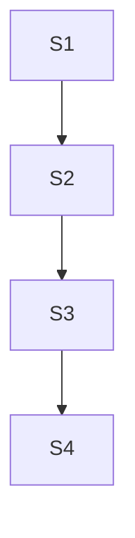
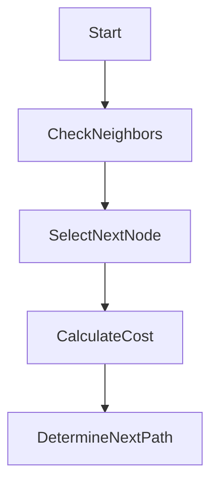
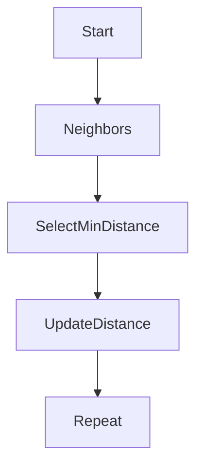
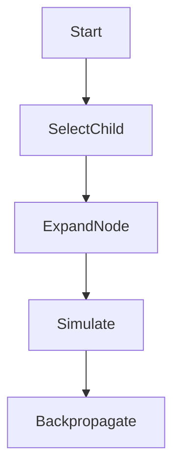
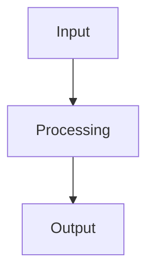
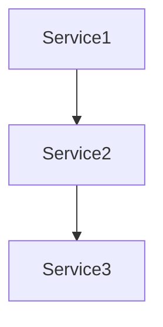

                 


# AI Agent的任务规划与执行模块开发

> 关键词：AI Agent，任务规划，执行模块，算法原理，系统架构

> 摘要：AI Agent的任务规划与执行模块是实现智能体自主决策的核心部分，本文详细探讨任务规划的数学模型、算法原理、系统架构设计以及项目实战。通过具体案例分析和代码实现，帮助读者掌握AI Agent任务规划的核心技术。

---

# 第一部分: AI Agent的任务规划与执行模块开发背景

## 第1章: AI Agent的基本概念与任务规划概述

### 1.1 AI Agent的基本概念

#### 1.1.1 AI Agent的定义与特点

AI Agent（人工智能代理）是指能够感知环境、自主决策并执行任务的智能实体。AI Agent的特点包括自主性、反应性、目标导向性和社交能力。

- **自主性**：AI Agent能够独立运作，无需外部干预。
- **反应性**：能够实时感知环境并做出反应。
- **目标导向性**：基于目标进行决策和规划。
- **社交能力**：能够与其他AI Agent或人类进行交互。

#### 1.1.2 AI Agent的类型与应用场景

AI Agent可以分为以下几种类型：

1. **简单反射型Agent**：基于当前感知做出反应，适用于简单的环境。
2. **基于模型的反射型Agent**：利用内部模型进行决策，适用于复杂环境。
3. **目标驱动型Agent**：以特定目标为导向进行决策和规划。
4. **效用驱动型Agent**：基于效用函数进行优化决策。
5. **学习型Agent**：通过学习提升决策能力。

**应用场景**：
- 智能助手（如Siri、Alexa）
- 自动驾驶汽车
- 智能机器人
- 游戏AI

#### 1.1.3 任务规划的基本概念与流程

任务规划是指AI Agent根据目标生成一系列动作以实现目标的过程。基本流程包括：

1. **目标分解**：将复杂任务分解为简单子任务。
2. **环境建模**：构建环境模型以便决策。
3. **动作选择**：根据当前状态选择最优动作。
4. **执行与反馈**：执行动作并根据反馈调整计划。

---

## 第2章: 任务规划的核心问题与挑战

### 2.1 任务规划的核心问题

任务规划的核心问题包括：

1. **状态表示**：如何有效表示环境和AI Agent的状态。
2. **动作选择**：如何选择最优或近似最优的动作。
3. **路径规划**：如何在复杂环境中找到最优路径。
4. **动态环境适应**：如何在动态环境中实时调整计划。

### 2.2 任务规划的挑战

1. **计算复杂度**：复杂任务的规划需要大量的计算资源。
2. **动态环境**：环境的动态变化增加了规划的难度。
3. **不确定性**：环境中的不确定性影响规划的准确性。
4. **资源限制**：计算资源的限制影响规划的效率。

### 2.3 任务规划的边界与外延

任务规划的边界在于其目标和约束条件，外延则涉及多智能体协作、人机交互等领域。

---

# 第二部分: 任务规划的数学模型与算法原理

## 第3章: 任务规划的数学模型

### 3.1 状态空间与动作空间的定义

#### 3.1.1 状态空间的表示方法

状态空间可以表示为一个图，其中每个节点代表一个状态，边代表动作。



#### 3.1.2 动作空间的表示方法

动作空间可以表示为一个集合，每个动作对应一个可能的转移。

### 3.2 状态转移模型与概率论基础

#### 3.2.1 状态转移矩阵的定义

状态转移矩阵描述了从一个状态转移到另一个状态的概率。

$$ P = [p_{ij}] $$
其中，$p_{ij}$表示从状态i转移到状态j的概率。

#### 3.2.2 概率论在任务规划中的应用

在不确定环境中，概率论用于评估不同动作的期望效用。

$$ EU(a) = \sum_{s} P(s) \times U(a, s) $$

### 3.3 任务规划的优化目标与约束条件

#### 3.3.1 最优化目标函数的定义

$$ \text{目标函数} = \sum_{i=1}^{n} w_i x_i $$
其中，$w_i$是权重，$x_i$是变量。

#### 3.3.2 约束条件的表示与处理

约束条件可以用线性不等式表示：

$$ \sum_{i=1}^{n} a_i x_i \leq b $$

---

## 第4章: 任务规划的核心算法原理

### 4.1 A*算法的原理与实现

#### 4.1.1 A*算法的基本原理

A*算法结合了启发式搜索和最佳优先搜索，用于寻找最短路径。



#### 4.1.2 A*算法的实现步骤

1. 初始化开放列表和关闭列表。
2. 将起点加入开放列表。
3. 选择开放列表中具有最低评估函数的节点。
4. 将选择的节点加入关闭列表。
5. 检查是否到达终点，否则继续扩展节点。
6. 重复步骤3-5，直到找到路径。

### 4.2 Dijkstra算法的原理与实现

#### 4.2.1 Dijkstra算法的基本原理

Dijkstra算法用于在加权图中寻找最短路径。



#### 4.2.2 Dijkstra算法的实现步骤

1. 初始化所有节点的距离为无穷大。
2. 将起点的距离设为0，并加入优先队列。
3. 反复从优先队列中取出距离最小的节点。
4. 更新与该节点相邻节点的距离。
5. 直到队列为空或找到目标节点。

### 4.3 蒙特卡洛树搜索（MCTS）的原理与实现

#### 4.3.1 MCTS的基本原理

MCTS结合了随机采样和树搜索，适用于复杂环境。



#### 4.3.2 MCTS的实现步骤

1. 在当前节点中选择一个未访问的子节点。
2. 展开选择的节点。
3. 进行模拟实验。
4. 将实验结果回溯到父节点。
5. 重复上述步骤，直到找到最优路径。

---

# 第三部分: 任务规划的系统架构与实现

## 第5章: 任务规划系统的整体架构设计

### 5.1 系统功能模块划分

#### 5.1.1 输入处理模块

输入处理模块负责接收用户输入并解析任务目标。

### 5.1.2 状态表示模块

状态表示模块将环境状态表示为数据结构。

### 5.1.3 算法执行模块

算法执行模块调用任务规划算法进行路径规划。

### 5.1.4 输出结果模块

输出结果模块将规划结果输出给用户或调用方。

### 5.2 系统架构设计

#### 5.2.1 分层架构设计

系统采用分层架构，包括输入层、处理层和输出层。



#### 5.2.2 面向服务的架构设计

系统采用SOA架构，各服务模块独立且互操作性强。



---

## 第6章: 任务规划系统的实现与优化

### 6.1 任务规划系统的实现

#### 6.1.1 环境建模

环境建模是任务规划的基础，需要准确描述环境的状态和动态。

#### 6.1.2 算法实现

根据选择的算法（如A*、Dijkstra等）实现任务规划模块。

### 6.2 系统优化

#### 6.2.1 并行计算优化

通过并行计算减少任务规划时间。

#### 6.2.2 动态环境适应

通过动态规划算法适应环境变化。

---

# 第四部分: 项目实战

## 第7章: 任务规划的项目实战

### 7.1 项目环境安装

安装必要的开发工具和依赖库，如Python、NumPy、Matplotlib等。

### 7.2 项目核心代码实现

#### 7.2.1 A*算法实现

```python
import heapq

def a_star_search(graph, start, goal):
    open_list = []
    heapq.heappush(open_list, (0, start))
    g_score = {start: 0}
    f_score = {start: 0}
    
    while open_list:
        current = heapq.heappop(open_list)
        if current[1] == goal:
            return current
        for neighbor in graph[current[1]]:
            tentative_g = g_score[current[1]] + graph[current[1]][neighbor]
            if neighbor not in g_score or tentative_g < g_score[neighbor]:
                g_score[neighbor] = tentative_g
                f_score[neighbor] = tentative_g + graph[neighbor][goal]
                heapq.heappush(open_list, (f_score[neighbor], neighbor))
    return None
```

#### 7.2.2 Dijkstra算法实现

```python
import heapq

def dijkstra_algorithm(graph, start, goal):
    distances = {node: float('infinity') for node in graph}
    distances[start] = 0
    heap = [(0, start)]
    
    while heap:
        current_dist, current_node = heapq.heappop(heap)
        if current_node == goal:
            return current_dist
        if current_dist > distances[current_node]:
            continue
        for neighbor, weight in graph[current_node].items():
            if distances[neighbor] > current_dist + weight:
                distances[neighbor] = current_dist + weight
                heapq.heappush(heap, (distances[neighbor], neighbor))
    return distances[goal]
```

### 7.3 项目小结

通过项目实战，读者可以掌握任务规划算法的实现方法，并理解如何将其应用于实际场景中。

---

# 第五部分: 最佳实践与总结

## 第8章: 最佳实践与总结

### 8.1 开发中的注意事项

- **算法选择**：根据任务需求选择合适的算法。
- **环境建模**：确保环境模型的准确性和完整性。
- **性能优化**：通过并行计算和动态规划优化系统性能。

### 8.2 未来展望

随着AI技术的发展，任务规划将在更多领域得到应用，算法也将更加智能化和高效化。

---

作者：AI天才研究院/AI Genius Institute & 禅与计算机程序设计艺术 /Zen And The Art of Computer Programming

---

以上是《AI Agent的任务规划与执行模块开发》的技术博客文章的大纲和部分具体内容。文章系统地介绍了AI Agent任务规划的核心概念、算法原理、系统架构设计以及项目实战，结合丰富的代码示例和图表，帮助读者深入理解并掌握相关技术。

