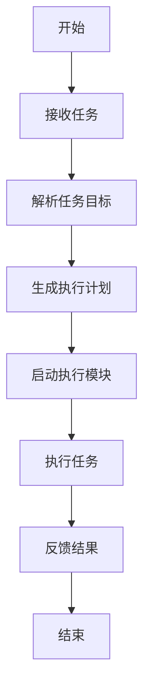
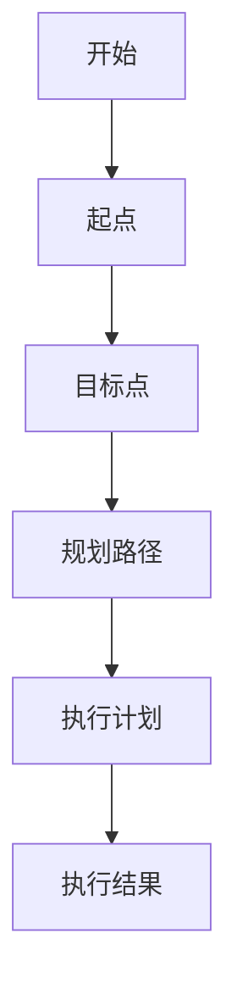

                 


# AI Agent的任务规划与执行模块设计

> 关键词：AI Agent，任务规划，执行模块，算法原理，系统架构，项目实战

> 摘要：本文详细探讨了AI Agent的任务规划与执行模块设计，从背景介绍、核心概念、算法原理、系统架构到项目实战，全面解析了任务规划与执行模块的设计思路和实现方法。

---

## 第1章: AI Agent的任务规划与执行模块概述

### 1.1 问题背景与描述

AI Agent（智能体）是一种能够感知环境并采取行动以实现目标的实体。在复杂的环境中，AI Agent需要具备任务规划与执行的能力，以便高效地完成目标。任务规划是AI Agent的核心功能之一，它决定了AI Agent如何将目标分解为具体的行动步骤，并指导执行模块完成这些步骤。

#### 1.1.1 任务规划与执行模块的定义

任务规划与执行模块是AI Agent的重要组成部分，负责将目标分解为具体的行动步骤，并指导执行模块完成这些步骤。任务规划模块负责生成执行计划，而执行模块则负责实际执行这些计划。

#### 1.1.2 问题背景分析

在复杂的环境中，AI Agent需要面对的任务通常是动态的、不确定的，并且可能受到资源限制。例如，在自动驾驶汽车中，AI Agent需要规划路径并实时调整以应对交通状况的变化。任务规划与执行模块的设计需要考虑这些复杂性。

#### 1.1.3 任务规划与执行的核心问题描述

任务规划的核心问题是如何将目标分解为具体的行动步骤，并确保这些步骤能够高效地被执行。执行模块的核心问题是如何按照规划的步骤完成任务，并在遇到意外情况时能够灵活调整。

### 1.2 问题解决与边界

#### 1.2.1 任务规划与执行的解决思路

任务规划与执行的解决思路包括以下几个步骤：
1. **目标分解**：将目标分解为具体的子任务。
2. **规划生成**：生成一个可行的执行计划。
3. **计划执行**：按照规划执行任务。
4. **动态调整**：在执行过程中根据反馈动态调整计划。

#### 1.2.2 边界与外延

任务规划与执行模块的边界包括：
- **输入**：任务目标、环境信息、资源限制。
- **输出**：执行计划、执行结果。

任务规划与执行模块的外延包括：
- **学习能力**：通过学习优化任务规划与执行的效率。
- **自适应能力**：根据环境变化动态调整任务规划。

#### 1.2.3 核心要素与组成结构

任务规划与执行模块的核心要素包括：
- **任务目标**：任务的最终目标。
- **环境模型**：环境的状态和约束条件。
- **规划算法**：用于生成执行计划的算法。
- **执行模块**：负责执行具体任务的模块。
- **反馈机制**：用于调整任务规划的反馈机制。

---

## 第2章: 核心概念与实体关系

### 2.1 核心概念原理

#### 2.1.1 任务规划的核心原理

任务规划的核心原理是通过搜索算法在状态空间中找到一条从初始状态到目标状态的路径。常见的搜索算法包括广度优先搜索（BFS）、深度优先搜索（DFS）和A*算法。

#### 2.1.2 执行模块的核心机制

执行模块的核心机制是根据规划的步骤执行具体任务。执行模块需要具备实时性、可靠性和可扩展性。

#### 2.1.3 任务规划与执行的关联性

任务规划与执行的关联性体现在以下几个方面：
- **规划驱动执行**：任务规划生成的执行计划指导执行模块。
- **执行反馈规划**：执行模块的反馈用于动态调整任务规划。
- **协同优化**：任务规划与执行的协同优化可以提高整体效率。

### 2.2 实体关系图

以下是任务规划与执行模块的核心实体关系图：

```mermaid
er
actor(Agent, "任务规划模块", "执行模块", "环境")
```

### 2.3 任务规划与执行的流程图

以下是任务规划与执行的流程图：



---

## 第3章: 任务规划算法原理

### 3.1 任务规划算法概述

#### 3.1.1 常见任务规划算法

常见的任务规划算法包括：
- **A*算法**：一种基于优先搜索的最短路径算法。
- **Dijkstra算法**：一种用于单源最短路径的算法。
- **遗传算法**：一种基于生物进化原理的优化算法。

#### 3.1.2 算法选择与优化

算法选择与优化需要考虑以下几个因素：
- **任务复杂度**：任务的复杂程度。
- **计算资源**：计算资源的限制。
- **实时性要求**：任务的实时性要求。

### 3.2 基于A*算法的任务规划

#### 3.2.1 A*算法原理

A*算法是一种基于优先搜索的最短路径算法，其核心思想是在搜索过程中优先扩展具有最小评估函数值的节点。评估函数的定义如下：

$$f(n) = g(n) + h(n)$$

其中，\(g(n)\)表示从起点到节点n的已知成本，\(h(n)\)表示从节点n到目标的估算成本。

#### 3.2.2 A*算法的数学模型

以下是A*算法的数学模型：

$$f(n) = g(n) + h(n)$$

其中，\(g(n)\)表示从起点到节点n的已知成本，\(h(n)\)表示从节点n到目标的估算成本。

#### 3.2.3 A*算法实现流程图

以下是A*算法的实现流程图：

```mermaid
graph TD
    A[起点] --> B[生成候选节点]
    B --> C[评估f(n)]
    C --> D[选择最低f(n)的节点]
    D --> E[扩展节点]
    E --> F[直到找到目标节点]
```

---

## 第4章: 系统分析与架构设计

### 4.1 项目场景介绍

#### 4.1.1 项目目标

本项目的目的是设计一个高效的任务规划与执行模块，使其能够应用于各种AI Agent场景中。

#### 4.1.2 项目范围

本项目包括任务规划模块和执行模块的设计与实现。

---

## 第5章: 项目实战

### 5.1 环境安装

#### 5.1.1 环境要求

- 操作系统：Windows 10 或更高版本，或macOS 10.15 或更高版本。
- 开发工具：Python 3.8 或更高版本，PyCharm 或 VS Code。

#### 5.1.2 安装依赖

```bash
pip install numpy
pip install matplotlib
```

### 5.2 核心代码实现

#### 5.2.1 任务规划模块实现

以下是A*算法的Python实现：

```python
import heapq

def a_star_search(start, goal, grid):
    open_set = set([start])
    came_from = {}
    g_score = {start: 0}
    f_score = {start: heuristic(start, goal)}
    
    while open_set:
        current = heapq.heappop(open_set)
        if current == goal:
            break
        neighbors = get_neighbors(current, grid)
        for neighbor in neighbors:
            tentative_g_score = g_score[current] + cost(current, neighbor)
            if neighbor not in g_score or tentative_g_score < g_score[neighbor]:
                came_from[neighbor] = current
                g_score[neighbor] = tentative_g_score
                f_score[neighbor] = g_score[neighbor] + heuristic(neighbor, goal)
                heapq.heappush(open_set, neighbor)
    return came_from, g_score

def heuristic(a, b):
    return abs(a.x - b.x) + abs(a.y - b.y)

def get_neighbors(node, grid):
    neighbors = []
    for dx, dy in [(-1,0),(1,0),(0,-1),(0,1)]:
        x = node.x + dx
        y = node.y + dy
        if 0 <= x < len(grid) and 0 <= y < len(grid[0]):
            neighbors.append(grid[x][y])
    return neighbors
```

#### 5.2.2 执行模块实现

以下是执行模块的Python实现：

```python
def execute_plan(plan, environment):
    for action in plan:
        environment.execute_action(action)
```

### 5.3 案例分析

#### 5.3.1 案例背景

假设我们有一个迷宫环境，起点为(0,0)，目标为(4,4)。

#### 5.3.2 案例实现

```python
start = Node(0, 0)
goal = Node(4, 4)
grid = create_grid(5,5)
came_from, g_score = a_star_search(start, goal, grid)
plan = reconstruct_path(came_from, start, goal)
execute_plan(plan, grid)
```

#### 5.3.3 实现结果

以下是规划路径和执行结果的示意图：



### 5.4 本章小结

---

## 第6章: 最佳实践与总结

### 6.1 最佳实践

- **算法选择**：根据任务需求选择合适的算法。
- **性能优化**：通过优化算法和代码提高效率。
- **测试验证**：通过测试验证算法的正确性和效率。

### 6.2 小结

任务规划与执行模块是AI Agent的核心部分，其设计与实现需要综合考虑任务目标、环境约束和资源限制。通过合理选择算法和优化系统架构，可以提高任务规划与执行的效率和可靠性。

### 6.3 注意事项

- **算法选择**：选择合适的算法可以提高任务规划的效率。
- **代码实现**：代码实现需要考虑可扩展性和可维护性。
- **测试验证**：测试验证是确保系统正确性和稳定性的关键步骤。

### 6.4 拓展阅读

- **推荐书籍**：《AI: A Modern Approach》
- **推荐博客**：https://www.sicxu.com

---

## 作者

作者：AI天才研究院/AI Genius Institute & 禅与计算机程序设计艺术 /Zen And The Art of Computer Programming

