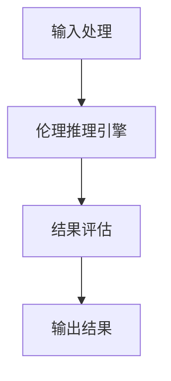

                 


# AI Agent的伦理决策：在LLM中实现道德推理

## 关键词：AI Agent，伦理决策，LLM，道德推理，伦理算法

## 摘要：本文探讨了在大语言模型（LLM）中实现AI代理伦理决策的方法。首先介绍了AI Agent的基本概念和伦理决策的重要性，然后详细讲解了伦理决策的理论基础和算法实现。通过系统架构设计和项目实战，展示了如何在实际应用中实现道德推理，最后总结了当前的研究成果并展望了未来的发展方向。

---

## 第1章：AI Agent的基本概念与伦理决策的重要性

### 1.1 AI Agent的定义与特点

AI Agent（人工智能代理）是指能够感知环境并采取行动以实现目标的智能实体。AI Agent的特点包括自主性、反应性、目标导向性和社会性。AI Agent广泛应用于自动驾驶、智能助手、机器人等领域。

### 1.2 伦理决策的定义与重要性

伦理决策是指AI Agent在决策过程中考虑伦理因素，确保行为符合伦理规范。伦理决策的重要性体现在提高系统的可信度、减少负面影响和提升用户体验等方面。

---

## 第2章：伦理学基础与道德推理

### 2.1 伦理学的基本原则

伦理学包括功利主义、义务论和美德伦理等基本原则。功利主义强调最大幸福原则，义务论注重行为的义务性，美德伦理关注个体的美德。

### 2.2 道德推理的理论框架

道德推理涉及理性推理、情感推理和综合理解。理性推理基于逻辑规则，情感推理考虑情感因素，综合理解则是两者的结合。

---

## 第3章：LLM与伦理推理的结合

### 3.1 LLM的基本工作原理

大语言模型通过大量数据训练，生成与上下文相关的文本输出。LLM的应用包括文本生成、问答系统和情感分析。

### 3.2 伦理推理在LLM中的实现方法

伦理推理方法包括基于规则的伦理推理、基于案例的伦理推理和基于情感的伦理推理。每种方法都有其优缺点和适用场景。

---

## 第4章：伦理推理的算法实现

### 4.1 基于规则的伦理推理算法

基于规则的算法通过预定义的伦理规则进行推理。规则权重计算公式为：
$$ W = \sum_{i=1}^{n} w_i \cdot r_i $$

### 4.2 基于案例的伦理推理算法

基于案例的算法通过相似案例进行推理。案例匹配公式为：
$$ S = \sum_{i=1}^{m} s_i \cdot c_i $$

### 4.3 基于情感的伦理推理算法

基于情感的算法考虑情感因素。情感强度计算公式为：
$$ E = \sum_{j=1}^{k} e_j \cdot f_j $$

---

## 第5章：系统架构与项目实战

### 5.1 系统架构设计

系统架构包括输入处理模块、伦理推理引擎和结果评估模块。系统架构图如下：



### 5.2 项目实战

项目实战包括环境安装、核心代码实现和案例分析。代码示例如下：

```python
def ethical_reasoning(rules, cases, emotions):
    # 基于规则的推理
    rule_score = sum(w * r for w, r in rules.items())
    # 基于案例的推理
    case_score = sum(s * c for s, c in cases.items())
    # 基于情感的推理
    emotion_score = sum(e * f for e, f in emotions.items())
    # 综合得分
    total_score = (rule_score + case_score + emotion_score) / 3
    return total_score
```

---

## 第6章：结论与展望

### 6.1 研究总结

本文探讨了AI Agent在LLM中的伦理决策实现，涵盖了理论基础、算法实现和系统设计。

### 6.2 未来展望

未来研究方向包括更复杂的情境处理、多模态决策和伦理学习的深度结合。

---

## 作者：AI天才研究院 & 禅与计算机程序设计艺术

---

以上是《AI Agent的伦理决策：在LLM中实现道德推理》的技术博客文章的大纲和内容概要。

